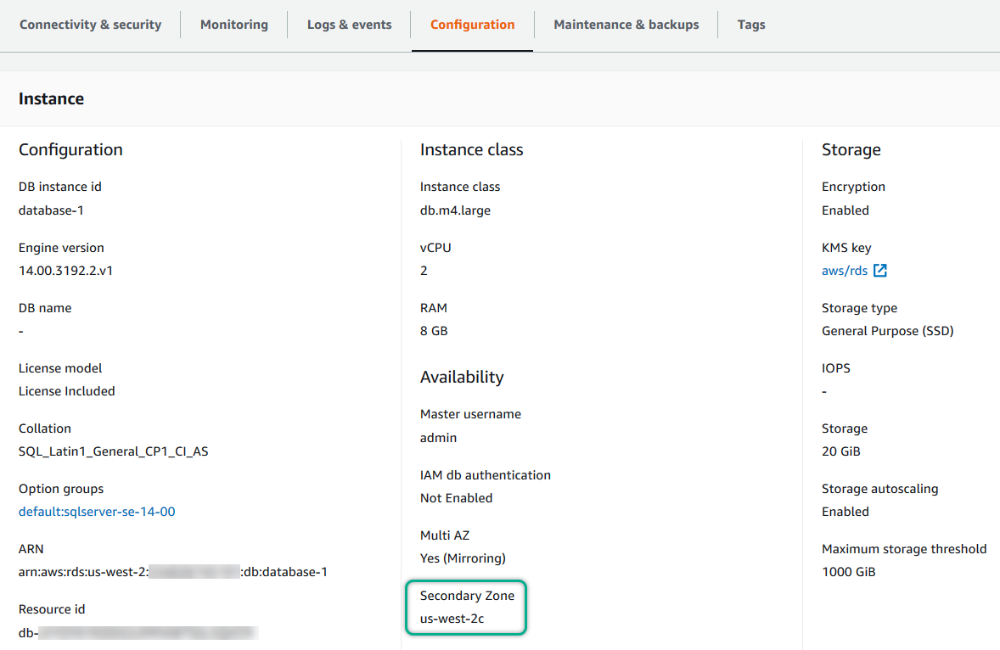

# Determining the location of the

secondary

You can determine the location of the secondary replica by using the AWS Management Console. You
need to know the location of the secondary if you are setting up your primary DB
instance in a VPC.

You can also view the Availability Zone of the secondary using the AWS CLI command
`describe-db-instances` or RDS API operation `DescribeDBInstances`.
The output shows the secondary AZ where the standby mirror is located.
