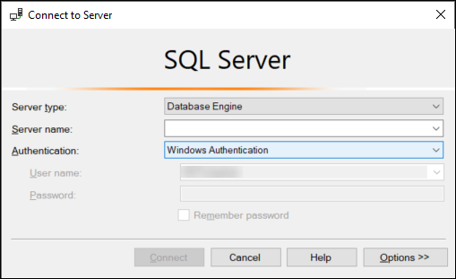

# Connecting to SQL Server with Windows

authentication

To connect to SQL Server with Windows Authentication, you must be logged into a domain-joined computer as a domain user. After
launching SQL Server Management Studio, choose **Windows Authentication** as the authentication
type, as shown following.

