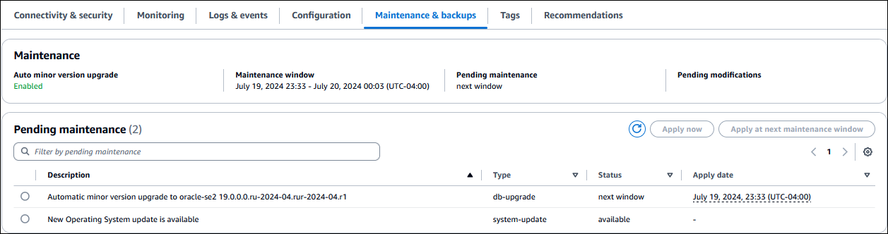
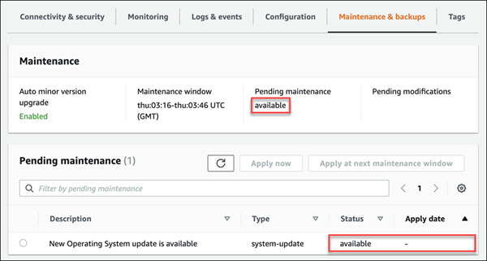
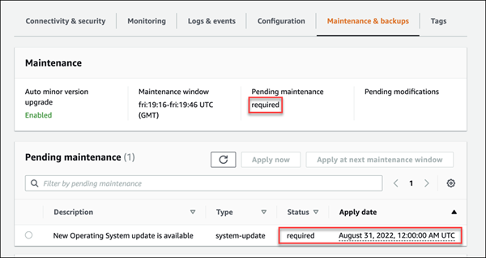

# Maintaining a DB instance

Periodically, Amazon RDS performs maintenance on Amazon RDS resources. The following topics describe these maintenance actions and how to apply them.

## Overview of DB instance

maintenance updates

Maintenance most often involves updates to the following resources in your DB instance:

- Underlying hardware
- Underlying operating system (OS)
- Database engine version

Updates to the operating system most often occur for security issues. We recommend that
you do them as soon as possible. For more information about operating system updates, see
[Applying updates to a DB instance](#USER_UpgradeDBInstance.OSUpgrades "#USER_UpgradeDBInstance.OSUpgrades").

###### Topics

- [Offline resources
  during maintenance updates](#USER_UpgradeDBInstance.Maintenance.Overview.offline "#USER_UpgradeDBInstance.Maintenance.Overview.offline")
- [Deferred
  DB instance modifications](#USER_UpgradeDBInstance.Maintenance.Overview.Deferred "#USER_UpgradeDBInstance.Maintenance.Overview.Deferred")
- [Eventual consistency for the DescribePendingMaintenanceActions API](#USER_UpgradeDBInstance.Maintenance.Overview.eventual-consistency "#USER_UpgradeDBInstance.Maintenance.Overview.eventual-consistency")

### Offline resources

during maintenance updates

Some maintenance items require that Amazon RDS take your DB instance offline for a short time.
Maintenance items that require a resource to be offline include required operating
system or database patching. Required patching is automatically scheduled only for
patches that are related to security and instance reliability. Such patching occurs
infrequently, typically once every few months. It seldom requires more than a fraction
of your maintenance window.

### Deferred

DB instance modifications

Deferred DB instance modifications that you have chosen not to apply
immediately are applied during the maintenance window. For example, you might choose to
change the DB instance class or parameter group during the maintenance window. Such
modifications that you specify using the **pending reboot** setting
don't show up in the **Pending maintenance** list. For information
about modifying a DB instance, see [Modifying an Amazon RDS DB instance](Overview.DBInstance.md "Overview.DBInstance.md").

To see the modifications that are pending for the next
maintenance window, use the [describe-db-instances](https://awscli.amazonaws.com/v2/documentation/api/latest/reference/rds/describe-db-instances.html "https://awscli.amazonaws.com/v2/documentation/api/latest/reference/rds/describe-db-instances.html") AWS CLI command and check the
`PendingModifiedValues` field.

### Eventual consistency for the DescribePendingMaintenanceActions API

The Amazon RDS `DescribePendingMaintenanceActions` API follows an eventual
consistency model. This means that the result of the
`DescribePendingMaintenanceActions` command might not be immediately
visible to all subsequent RDS commands. Keep this in mind when you use
`DescribePendingMaintenanceActions` immediately after using a previous
API command.

Eventual consistency can affect the way you managed your maintenance updates. For
example, if you run the `ApplyPendingMaintenanceActions` command to update
the database engine version for a DB instance, it will eventually be visible to
`DescribePendingMaintenanceActions`. In this scenario,
`DescribePendingMaintenanceActions` might show that the maintenance
action wasn't applied even though it was.

To manage eventual consistency, you can do the following:

- Confirm the state of your DB instance before you run a command to modify it. Run
  the appropriate `DescribePendingMaintenanceActions` command using an
  exponential backoff algorithm to ensure that you allow enough time for the
  previous command to propagate through the system. To do this, run the
  `DescribePendingMaintenanceActions` command repeatedly, starting
  with a couple of seconds of wait time, and increasing gradually up to five
  minutes of wait time.
- Add wait time between subsequent commands, even if a
  `DescribePendingMaintenanceActions` command returns an accurate
  response. Apply an exponential backoff algorithm starting with a couple of
  seconds of wait time, and increase gradually up to about five minutes of wait
  time.

## Viewing pending maintenance

updates

View whether a maintenance update is available for your DB instance by using the RDS
console, the AWS CLI, or the RDS API. If an update is available, it is indicated in the
**Maintenance** column for the DB instance on the Amazon RDS console,
as shown in this figure.


If no maintenance update is available for a DB
instance,
the column value is **none** for it.

If a maintenance update is available for a DB
instance,
the following column values are possible:

- **required** – The maintenance action will be applied to the resource
  and can't be deferred indefinitely.
- **available** – The maintenance action is available, but
  it will not be applied to the resource automatically. You can apply it manually.
- **next window** – The maintenance action will be applied to the resource
  during the next maintenance window.
- **In progress** – The maintenance action is being applied
  to the resource.

If an update is available, you can do one of the following:

- If the maintenance value is **next window**, defer the
  maintenance actions by choosing **Defer upgrade** from
  **Actions**. You can't defer a maintenance action that
  has already started.
- Apply the maintenance actions immediately.
- Apply the maintenance actions during your next maintenance window.
- Take no action.

###### To take an action by using the AWS Management Console

1. Choose the DB instance to show
   its details.
2. Choose **Maintenance & backups**. The pending maintenance
   actions appear.
3. Choose the action to take, then choose when to apply it.



The maintenance window determines when pending operations start, but doesn't limit
the total run time of these operations. Maintenance operations aren't guaranteed to
finish before the maintenance window ends, and can continue beyond the specified end
time. For more information, see [Amazon RDS maintenance window](#Concepts.DBMaintenance "#Concepts.DBMaintenance").

You can also view whether a maintenance update is available for your DB
instance by running the
[describe-pending-maintenance-actions](../../../cli/latest/reference/rds/describe-pending-maintenance-actions.md "../../../cli/latest/reference/rds/describe-pending-maintenance-actions.md") AWS CLI command.

For information about applying maintenance updates, see
[Applying updates to a DB instance](#USER_UpgradeDBInstance.OSUpgrades "#USER_UpgradeDBInstance.OSUpgrades").

### Maintenance actions for Amazon RDS

The following maintenance actions apply to RDS DB instances:

- `server-certificate-rotation` – Rotate the Amazon RDS server certificate for the DB instance.

###### Note

Engines that support rotation without restart don't receive this notification.

- `db-upgrade` – Upgrade the DB engine version for the DB instance.
- `hardware-maintenance` – Perform maintenance on the underlying hardware for the DB instance.
- `system-update` – Update the operating system for the DB instance.

## Maintenance for Multi-AZ deployments

Running a DB instance as a Multi-AZ deployment can further reduce the impact of a maintenance event. This result is because Amazon RDS applies operating system updates
by following these steps:

1. Perform maintenance on the standby.
2. Promote the standby to primary.
3. Perform maintenance on the old primary, which becomes the new standby.

If you upgrade the database engine for your DB instance in a Multi-AZ deployment, Amazon RDS modifies both primary and secondary DB instances at the same time. In this case,
both the primary and secondary DB instances in the Multi-AZ deployment are unavailable during the upgrade. This operation causes downtime until the upgrade is
complete. The duration of the downtime varies based on the size of your DB instance.

If there are underlying operating system patches that need to be applied, a short Multi-AZ failover is required to apply the patches to the
primary DB instance. This failover typically lasts less than a minute.

If your DB instance runs RDS for MySQL, RDS for PostgreSQL, or RDS for MariaDB, you can minimize the downtime required for an upgrade by using a blue/green
deployment. For more information, see [Using Amazon RDS Blue/Green Deployments
for database updates](blue-green-deployments.md "blue-green-deployments.md"). If you upgrade an RDS for SQL Server or
RDS Custom for SQL Server DB instance in a Multi-AZ deployment, then Amazon RDS performs rolling upgrades, so you have an outage only for the duration of a failover. For more
information, see [Multi-AZ considerations](USER_UpgradeDBInstance.SQLServer.md#USER_UpgradeDBInstance.SQLServer.MAZ "USER_UpgradeDBInstance.SQLServer.md#USER_UpgradeDBInstance.SQLServer.MAZ").

For more information about Multi-AZ deployments, see [Configuring and managing a Multi-AZ deployment for Amazon RDS](Concepts.md "Concepts.md").

## Amazon RDS maintenance window

The _maintenance window_ is a weekly time interval during which
any system changes are applied. Every DB instance has a weekly
maintenance window. The maintenance window is an opportunity to control when
modifications and software patching occur. For more information about adjusting the
maintenance window, see [Adjusting the preferred DB instance
maintenance window](#AdjustingTheMaintenanceWindow "#AdjustingTheMaintenanceWindow").

RDS consumes some of the resources on your DB instance
while maintenance is being applied. You
might observe a minimal effect on performance. For a DB instance, on rare occasions, a
Multi-AZ failover might be required for a maintenance update to complete.

If a maintenance event is scheduled for a given week, it's initiated during the
30-minute maintenance window you identify. Most maintenance events also complete during
the 30-minute maintenance window, although larger maintenance events may take more than
30 minutes to complete. The maintenance window is paused when the DB instance
is stopped.

The 30-minute maintenance window is selected at random from an 8-hour block of time
per region. If you don't specify a maintenance window when you create the DB instance,
RDS assigns a 30-minute maintenance window on a randomly selected day of the
week.

The following table shows the time blocks for each AWS Region from which default
maintenance windows are assigned.

| Region Name                | Region         | Time Block      |
| -------------------------- | -------------- | --------------- |
| US East (N. Virginia)      | us-east-1      | 03:00–11:00 UTC |
| US East (Ohio)             | us-east-2      | 03:00–11:00 UTC |
| US West (N. California)    | us-west-1      | 06:00–14:00 UTC |
| US West (Oregon)           | us-west-2      | 06:00–14:00 UTC |
| Africa (Cape Town)         | af-south-1     | 03:00–11:00 UTC |
| Asia Pacific (Hong Kong)   | ap-east-1      | 06:00–14:00 UTC |
| Asia Pacific (Hyderabad)   | ap-south-2     | 06:30–14:30 UTC |
| Asia Pacific (Jakarta)     | ap-southeast-3 | 08:00–16:00 UTC |
| Asia Pacific (Malaysia)    | ap-southeast-5 | 09:00–17:00 UTC |
| Asia Pacific (Melbourne)   | ap-southeast-4 | 11:00–19:00 UTC |
| Asia Pacific (Mumbai)      | ap-south-1     | 06:00–14:00 UTC |
| Asia Pacific (New Zealand) | ap-southeast-6 | 13:00–21:00 UTC |
| Asia Pacific (Osaka)       | ap-northeast-3 | 22:00–23:59 UTC |
| Asia Pacific (Seoul)       | ap-northeast-2 | 13:00–21:00 UTC |
| Asia Pacific (Singapore)   | ap-southeast-1 | 14:00–22:00 UTC |
| Asia Pacific (Sydney)      | ap-southeast-2 | 12:00–20:00 UTC |
| Asia Pacific (Taipei)      | ap-east-2      | 9:00–17:00 UTC  |
| Asia Pacific (Thailand)    | ap-southeast-7 | 8:00–16:00 UTC  |
| Asia Pacific (Tokyo)       | ap-northeast-1 | 13:00–21:00 UTC |
| Canada (Central)           | ca-central-1   | 03:00–11:00 UTC |
| Canada West (Calgary)      | ca-west-1      | 18:00–02:00 UTC |
| China (Beijing)            | cn-north-1     | 06:00–14:00 UTC |
| China (Ningxia)            | cn-northwest-1 | 06:00–14:00 UTC |
| Europe (Frankfurt)         | eu-central-1   | 21:00–05:00 UTC |
| Europe (Ireland)           | eu-west-1      | 22:00–06:00 UTC |
| Europe (London)            | eu-west-2      | 22:00–06:00 UTC |
| Europe (Milan)             | eu-south-1     | 02:00–10:00 UTC |
| Europe (Paris)             | eu-west-3      | 23:59–07:29 UTC |
| Europe (Spain)             | eu-south-2     | 02:00–10:00 UTC |
| Europe (Stockholm)         | eu-north-1     | 23:00–07:00 UTC |
| Europe (Zurich)            | eu-central-2   | 02:00–10:00 UTC |
| Israel (Tel Aviv)          | il-central-1   | 03:00–11:00 UTC |
| Mexico (Central)           | mx-central-1   | 19:00–3:00 UTC  |
| Middle East (Bahrain)      | me-south-1     | 06:00–14:00 UTC |
| Middle East (UAE)          | me-central-1   | 05:00–13:00 UTC |
| South America (São Paulo)  | sa-east-1      | 00:00–08:00 UTC |
| AWS GovCloud (US-East)     | us-gov-east-1  | 17:00–01:00 UTC |
| AWS GovCloud (US-West)     | us-gov-west-1  | 06:00–14:00 UTC |

###### Topics

- [Adjusting the preferred DB instance
  maintenance window](#AdjustingTheMaintenanceWindow "#AdjustingTheMaintenanceWindow")

### Adjusting the preferred DB instance

maintenance window

The maintenance window should fall at the time of lowest usage and thus might need
modification from time to time. Your DB instance is unavailable during this time only if
the system changes, such as a change in DB instance class, are being applied and require
an outage. Your DB instance is unavailable only for the minimum amount of time required to
make the necessary changes.

In the following example, you adjust the preferred maintenance window for a DB
instance.

For this example, we assume that a DB instance named _mydbinstance_
exists and has a preferred maintenance window of "Sun:05:00-Sun:06:00" UTC.

###### To adjust the preferred maintenance window

1. Sign in to the AWS Management Console and open the Amazon RDS console at
   [https://console.aws.amazon.com/rds/](https://console.aws.amazon.com/rds/ "https://console.aws.amazon.com/rds/").
2. In the navigation pane, choose **Databases**, and
   then select the DB instance that you want to modify.
3. Choose **Modify**. The **Modify
   DB instance** page appears.
4. In the **Maintenance** section, update the
   maintenance window.

###### Note

The maintenance window and the backup window for the DB instance
cannot overlap. If you enter a value for the maintenance window
that overlaps the backup window, an error message
appears. 5. Choose **Continue**.

On the confirmation page, review your changes. 6. To apply the changes to the maintenance window immediately, select
**Apply immediately**. 7. Choose **Modify DB instance** to save your
changes.

Alternatively, choose **Back** to edit your
changes, or choose **Cancel** to cancel your
changes.
To adjust the preferred maintenance window, use the AWS CLI [`modify-db-instance`](../../../cli/latest/reference/rds/modify-db-instance.md "../../../cli/latest/reference/rds/modify-db-instance.md") command with the following
parameters:

- `--db-instance-identifier`
- `--preferred-maintenance-window`
  The following code example sets the maintenance window to Tuesdays
  from 4:00-4:30AM UTC.

For Linux, macOS, or Unix:

```
aws rds modify-db-instance \
--db-instance-identifier `mydbinstance` \
--preferred-maintenance-window `Tue:04:00-Tue:04:30`
```

For Windows:

```
aws rds modify-db-instance ^
--db-instance-identifier `mydbinstance` ^
--preferred-maintenance-window `Tue:04:00-Tue:04:30`
```

To adjust the preferred maintenance window, use the Amazon RDS API [`ModifyDBInstance`](../APIReference/API_ModifyDBInstance.md "../APIReference/API_ModifyDBInstance.md") operation with the following
parameters:

- `DBInstanceIdentifier`
- `PreferredMaintenanceWindow`

## Applying updates to a DB instance

With Amazon RDS, you can choose when to apply maintenance operations. You can decide when Amazon RDS applies updates by using the AWS Management Console, AWS CLI, or RDS
API.

###### To manage an update for a DB instance

1.  Sign in to the AWS Management Console and open the Amazon RDS console at
    [https://console.aws.amazon.com/rds/](https://console.aws.amazon.com/rds/ "https://console.aws.amazon.com/rds/").
2.  In the navigation pane, choose **Databases**.
3.  Choose the DB instance that has a required update.
4.  For **Actions**, choose one of the following:

        * **Patch now**
        * **Patch at next window**


        ###### Note

        If you choose **Patch at next window** and later want to delay the update, you can choose **Defer
         upgrade**. You can't defer a maintenance action if it has already started.

        To cancel a maintenance action, modify the DB instance and disable **Auto minor version upgrade**.

    To apply a pending update to a DB instance, use the [apply-pending-maintenance-action](../../../cli/latest/reference/rds/apply-pending-maintenance-action.md "../../../cli/latest/reference/rds/apply-pending-maintenance-action.md") AWS CLI command.

###### Example

For Linux, macOS, or Unix:

```
aws rds apply-pending-maintenance-action \
    --resource-identifier `arn:aws:rds:us-west-2:001234567890:db:mysql-db` \
    --apply-action `system-update` \
    --opt-in-type `immediate`
```

For Windows:

```
aws rds apply-pending-maintenance-action ^
    --resource-identifier `arn:aws:rds:us-west-2:001234567890:db:mysql-db` ^
    --apply-action `system-update` ^
    --opt-in-type `immediate`
```

###### Note

To defer a maintenance action, specify `undo-opt-in` for `--opt-in-type`. You can't specify
`undo-opt-in` for `--opt-in-type` if the maintenance action has already started.

To cancel a maintenance action, run the [modify-db-instance](../../../cli/latest/reference/rds/modify-db-instance.md "../../../cli/latest/reference/rds/modify-db-instance.md") AWS CLI command and
specify `--no-auto-minor-version-upgrade`.

To return a list of resources that have at least one pending update, use the [describe-pending-maintenance-actions](../../../cli/latest/reference/rds/describe-pending-maintenance-actions.md "../../../cli/latest/reference/rds/describe-pending-maintenance-actions.md") AWS CLI command.

###### Example

For Linux, macOS, or Unix:

```
aws rds describe-pending-maintenance-actions \
    --resource-identifier `arn:aws:rds:us-west-2:001234567890:db:mysql-db`
```

For Windows:

```
aws rds describe-pending-maintenance-actions ^
    --resource-identifier `arn:aws:rds:us-west-2:001234567890:db:mysql-db`
```

You can also return a list of resources for a DB instance by
specifying the `--filters` parameter of the `describe-pending-maintenance-actions` AWS CLI command. The format for the
`--filters` command is
`Name=`filter-name`,Value=`resource-id`,...`.

The following are the accepted values for the `Name` parameter of a filter:

- `db-instance-id` – Accepts a list of DB instance identifiers or Amazon Resource Names (ARNs). The returned list only
  includes pending maintenance actions for the DB instances identified by these identifiers or ARNs.
- `db-cluster-id` – Accepts a list of DB cluster identifiers or ARNs for Amazon Aurora. The returned list only includes
  pending maintenance actions for the DB clusters identified by these identifiers or ARNs.
  For example, the following example returns the pending maintenance actions for the `sample-instance1` and
  `sample-instance2` DB instances.

###### Example

For Linux, macOS, or Unix:

```
aws rds describe-pending-maintenance-actions \
	--filters Name=db-instance-id,Values=sample-instance1,sample-instance2
```

For Windows:

```
aws rds describe-pending-maintenance-actions ^
	--filters Name=db-instance-id,Values=sample-instance1,sample-instance2
```

To apply an update to a DB instance, call the Amazon RDS API
[`ApplyPendingMaintenanceAction`](../APIReference/API_ApplyPendingMaintenanceAction.md "../APIReference/API_ApplyPendingMaintenanceAction.md") operation.

To return a list of resources that have at least one pending update, call the Amazon RDS API [`DescribePendingMaintenanceActions`](../APIReference/API_DescribePendingMaintenanceActions.md "../APIReference/API_DescribePendingMaintenanceActions.md") operation.

## Operating system updates for RDS DB instances

RDS for Db2, RDS for MariaDB, RDS for MySQL, RDS for PostgreSQL, RDS for SQL Server, and RDS for Oracle DB instances occasionally
require operating system updates. Amazon RDS upgrades the operating system to a newer version
to improve database performance and customers’ overall security posture. Typically, the
updates take about 10 minutes. Operating system updates don't change the DB engine version
or DB instance class of a DB instance.

Operating system updates can be either optional or mandatory:

- An **optional update** can be applied at any
  time. While these updates are optional, we recommend that you apply them
  periodically to keep your RDS fleet up to date. RDS _does
  not_ apply these updates automatically.

To be notified when a new, optional operating system patch becomes available,
you can subscribe to [RDS-EVENT-0230](USER_Events.md#RDS-EVENT-0230 "USER_Events.md#RDS-EVENT-0230") in the
security patching event category. For information about subscribing to RDS
events, see [Subscribing to Amazon RDS event notification](USER_Events.md "USER_Events.md").

###### Note

`RDS-EVENT-0230` doesn't apply to operating system distribution
upgrades.

- A **mandatory update** is required and has an
  apply date. Plan to schedule your update before this apply date. After the
  specified apply date, Amazon RDS automatically upgrades the operating system for your
  DB instance to the latest version during one of your assigned maintenance
  windows.

###### Note

Staying current on all optional and mandatory updates might be required to meet
various compliance obligations. We recommend that you apply all updates made
available by RDS routinely during your maintenance windows.

You can use the AWS Management Console or the AWS CLI to get information about the type of operating
system upgrade.

###### To get update information using the AWS Management Console

1. Sign in to the AWS Management Console and open the Amazon RDS console at
   [https://console.aws.amazon.com/rds/](https://console.aws.amazon.com/rds/ "https://console.aws.amazon.com/rds/").
2. In the navigation pane, choose **Databases**, and
   then select the DB instance.
3. Choose **Maintenance & backups**.
4. In the **Pending maintenance** section, find the
   operating system update, and check the **Status**
   value.
   In the AWS Management Console, an optional update has its maintenance
   **Status** set to **available** and
   doesn't have an **Apply date**, as shown in the following
   image.


A mandatory update has its maintenance **Status** set to
**required** and has an **Apply date**, as
shown in the following image.


To get update information from the AWS CLI, use the [describe-pending-maintenance-actions](../../../cli/latest/reference/rds/describe-pending-maintenance-actions.md "../../../cli/latest/reference/rds/describe-pending-maintenance-actions.md") command.

```
aws rds describe-pending-maintenance-actions
```

A mandatory operating system update includes an
`AutoAppliedAfterDate` value and a `CurrentApplyDate`
value. An optional operating system update doesn't include these values.

The following output shows a mandatory operating system update.

```
{
  "ResourceIdentifier": "arn:aws:rds:us-east-1:123456789012:db:mydb1",
  "PendingMaintenanceActionDetails": [
    {
      "Action": "system-update",
      "AutoAppliedAfterDate": "2022-08-31T00:00:00+00:00",
      "CurrentApplyDate": "2022-08-31T00:00:00+00:00",
      "Description": "New Operating System update is available"
    }
  ]
}
```

The following output shows an optional operating system update.

```
{
  "ResourceIdentifier": "arn:aws:rds:us-east-1:123456789012:db:mydb2",
  "PendingMaintenanceActionDetails": [
    {
      "Action": "system-update",
      "Description": "New Operating System update is available"
    }
  ]
}
```

### Availability of operating system

updates

Operating system updates are specific to DB engine version and DB instance class. Therefore,
DB instances receive or require updates at different times. When an operating system
update is available for your DB instance based on its engine version and instance class,
the update appears in the console. It can also be viewed by running the [describe-pending-maintenance-actions](../../../cli/latest/reference/rds/describe-pending-maintenance-actions.md "../../../cli/latest/reference/rds/describe-pending-maintenance-actions.md") AWS CLI command or by calling the
[DescribePendingMaintenanceActions](../APIReference/API_DescribePendingMaintenanceActions.md "../APIReference/API_DescribePendingMaintenanceActions.md") RDS API operation. If an update is
available for your instance, you can update your operating system by following the
instructions in [Applying updates to a DB instance](#USER_UpgradeDBInstance.OSUpgrades "#USER_UpgradeDBInstance.OSUpgrades").
