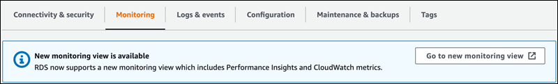
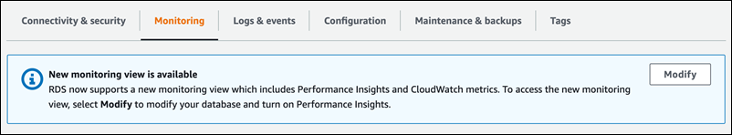

# Choosing the new monitoring view from the Monitoring tab

###### Important

AWS has announced the end-of-life date for Performance Insights: July 31, 2026. After this date, Amazon RDS will no longer support the Performance Insights console experience.
The Performance Insights console will redirect to CloudWatch Database Insights. Flexible retention periods (1–24 months) and their associated pricing are preserved
in Standard mode of Database Insights at the same cost as Performance Insights today. The Performance Insights API will continue to exist with no changes. Costs for the
Performance Insights API will appear in your AWS bill with the cost of CloudWatch Database Insights.

We recommend that you review your DB instances
using Performance Insights and choose the Database Insights mode that best fits your needs before July 31, 2026.
For core monitoring with flexible retention, Standard mode of Database Insights preserves your existing experience and pricing.
For advanced capabilities including fleet-level monitoring, lock diagnostics, and execution plan capture, see
[Turning on the Advanced mode of Database Insights for Amazon RDS](USER_DatabaseInsights.TurningOnAdvanced.md "USER_DatabaseInsights.TurningOnAdvanced.md").

If you take no action, DB instances using Performance Insights
will default to using the Standard mode of Database Insights with your existing retention period configured.
Your CloudFormation templates, Terraform configurations, and deployment scripts will continue to work exactly as they do today – all
Performance Insights API parameters, including retention period settings, are fully preserved.
After July 31, 2026, only the Advanced mode of Database Insights will support execution plans and on-demand analysis.

With CloudWatch Database Insights, you can monitor database load for your fleet of databases and analyze and troubleshoot performance at scale.
For more information about Database Insights, see [Monitoring Amazon RDS databases with CloudWatch Database Insights](USER_DatabaseInsights.md "USER_DatabaseInsights.md") or
[Register for upcoming workshops](https://aws-experience.com/amer/smb/events/series/Cloud-Operations-Enablement "https://aws-experience.com/amer/smb/events/series/Cloud-Operations-Enablement") to learn more.
For current pricing information, see [Amazon CloudWatch Pricing](https://aws.amazon.com/cloudwatch/pricing/ "https://aws.amazon.com/cloudwatch/pricing/").

From the Amazon RDS console, you can choose the new monitoring view to view Performance Insights and CloudWatch metrics for your DB instance.

###### To choose the new monitoring view in the Monitoring tab

1. Sign in to the AWS Management Console and open the Amazon RDS console at
   [https://console.aws.amazon.com/rds/](https://console.aws.amazon.com/rds/ "https://console.aws.amazon.com/rds/").
2. In the left navigation pane, choose **Databases**.
3. Choose the DB instance that you want to monitor.
4. Scroll down and choose the **Monitoring** tab.

A banner appears with the option to choose the new monitoring view. The following
example shows the banner to choose the new monitoring view.

 5. Choose **Go to new monitoring view** to open the Performance Insights dashboard
with Performance Insights and CloudWatch metrics for your DB instance. 6. (Optional) If Performance Insights is turned off for your DB instance, a banner appears with the option
to modify your DB cluster and turn on Performance Insights.

The following example shows the banner to modify the DB cluster in the
**Monitoring** tab .

Choose **Modify** to modify your DB cluster and turn on Performance Insights.
For more information about turning on Performance Insights, see [Turning Performance Insights on and off for Amazon RDS](USER_PerfInsights.Enabling.md "USER_PerfInsights.Enabling.md")
