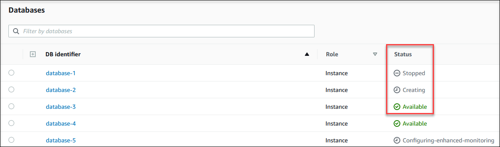

# Viewing instance status

Using the Amazon RDS console, you can quickly access the status of your DB instance.

###### Topics

- [Viewing Amazon RDSDB instance status](#Overview.DBInstance.Status "#Overview.DBInstance.Status")

## Viewing Amazon RDSDB instance status

The status of a DB instance indicates its current operational state. You can use the following procedures to view the DB instance status in the
Amazon RDS console, the AWS CLI command, or the API operation.

###### Note

Amazon RDS also uses another status called _maintenance status_, which is
shown in the **Maintenance** column of the Amazon RDS console. This value
indicates the status of any maintenance patches that need to be applied to a DB
instance. Maintenance status is independent of DB instance status. For more information
about maintenance status, see [Applying updates to a DB instance](USER_UpgradeDBInstance.md#USER_UpgradeDBInstance.OSUpgrades "USER_UpgradeDBInstance.md#USER_UpgradeDBInstance.OSUpgrades") .

Find the possible status values for DB instances in the following table. This table also
shows whether you will be billed for the DB instance and storage, billed only for storage,
or not billed. For all DB instance statuses, you are always billed for backup usage.

| DB instance status                                  | Billed                                      | Description                                                                                                                                                                                                                                                                                                                                                                                               |
| --------------------------------------------------- | ------------------------------------------- | --------------------------------------------------------------------------------------------------------------------------------------------------------------------------------------------------------------------------------------------------------------------------------------------------------------------------------------------------------------------------------------------------------- |
| **available**                                       | Billed                                      | The DB instance is available for modifications.                                                                                                                                                                                                                                                                                                                                                           |
| **backing-up**                                      | Billed                                      | The DB instance is currently being backed up.                                                                                                                                                                                                                                                                                                                                                             |
| **configuring-enhanced-monitoring**                 | Billed                                      | Enhanced Monitoring is being enabled or disabled for this<br>DB instance.                                                                                                                                                                                                                                                                                                                                 |
| **configuring-iam-database-auth**                   | Billed                                      | AWS Identity and Access Management (IAM) database authentication is being enabled or disabled<br>for this DB instance.                                                                                                                                                                                                                                                                                    |
| **configuring-log-exports**                         | Billed                                      | Publishing log files to Amazon CloudWatch Logs is being enabled or disabled for<br>this DB instance.                                                                                                                                                                                                                                                                                                      |
| **converting-to-vpc**                               | Billed                                      | The DB instance is being converted from a DB instance that is not in an Amazon Virtual Private Cloud<br>(Amazon VPC) to a DB instance that is in an Amazon VPC.                                                                                                                                                                                                                                           |
| **creating**                                        | Not billed (non-PITR)<br>Billed (PITR only) | The DB instance is being created. The DB instance is inaccessible while it is<br>being created.<br>If you restore a database during point-in-time recovery (PITR), you're<br>billed while the database is in the **creating\*<br>• state.<br>This is the only scenario in which the **creating\*\*<br>state incurs charges.                                                                               |
| **delete-precheck**                                 | Not billed                                  | Amazon RDS is validating that read replicas are safe to<br>delete.                                                                                                                                                                                                                                                                                                                                        |
| **deleting**                                        | Not billed                                  | The DB instance is being deleted.                                                                                                                                                                                                                                                                                                                                                                         |
| **failed**                                          | Not billed                                  | The DB instance has failed and Amazon RDS can't recover it. Perform a<br>point-in-time restore to the latest restorable time of the DB instance to<br>recover the data.                                                                                                                                                                                                                                   |
| **inaccessible-encryption-credentials**             | Not billed                                  | The AWS KMS key used to encrypt or decrypt the DB instance can't be<br>accessed or recovered.                                                                                                                                                                                                                                                                                                             |
| **inaccessible-encryption-credentials-recoverable** | Billed for storage                          | The KMS key used to encrypt or decrypt the DB instance can't be<br>accessed. However, if the KMS key is active, restarting the DB<br>instance can recover it.<br>For more information, see [Encrypting a DB instance](Overview.md#Overview.Encryption.Enabling "Overview.md#Overview.Encryption.Enabling").                                                                                               |
| **incompatible-create**                             | Not billed                                  | Amazon RDS is attempting to create a DB instance but can't do so because<br>resources are incompatible with your DB instance. This status can occur if,<br>for example, the instance profile for your DB instance doesn't have the<br>correct permissions.                                                                                                                                                |
| **incompatible-network**                            | Not billed                                  | Amazon RDS is attempting to perform a recovery action on a DB instance but<br>can't do so because the VPC is in a state that prevents the action<br>from being completed. This status can occur if, for example, all<br>available IP addresses in a subnet are in use and Amazon RDS can't get<br>an IP address for the DB instance.                                                                      |
| **incompatible-option-group**                       | Billed                                      | Amazon RDS attempted to apply an option group change but can't do so, and<br>Amazon RDS can't roll back to the previous option group state. For more<br>information, check the \*_Recent Events_<br>• list for the<br>DB instance. This status can occur if, for example, the option group contains<br>an option such as TDE and the DB instance doesn't contain encrypted<br>information.                |
| **incompatible-parameters**                         | Billed                                      | Amazon RDS can't start the DB instance because the parameters specified in<br>the DB instance's DB parameter group aren't compatible with the DB instance.<br>Revert the parameter changes or make them compatible with the DB instance to<br>regain access to your DB instance. For more information about the incompatible<br>parameters, check the \*_Recent Events_<br>• list for the<br>DB instance. |
| **incompatible-restore**                            | Not billed                                  | Amazon RDS can't do a point-in-time restore. Common causes for this<br>status include using temp tables,<br>using MyISAM tables with<br>MySQL, or using Aria tables with<br>MariaDB.                                                                                                                                                                                                                      |
| **insufficient-capacity**                           | Not billed                                  | Amazon RDS can't create your instance because sufficient capacity isn't<br>currently available. To create your DB instance in the same AZ with the same<br>instance type, delete your DB instance, wait a few hours, and try to create<br>again. Alternatively, create a new instance using a different instance<br>class or AZ.                                                                          |
| **maintenance**                                     | Billed                                      | Amazon RDS is applying a maintenance update to the DB instance. This status is<br>used for instance-level maintenance that RDS schedules well in advance.                                                                                                                                                                                                                                                 |
| **modifying**                                       | Billed                                      | The DB instance is being modified because of a customer request to modify<br>the DB instance.                                                                                                                                                                                                                                                                                                             |
| **moving-to-vpc**                                   | Billed                                      | The DB instance is being moved to a new Amazon Virtual Private Cloud (Amazon VPC).                                                                                                                                                                                                                                                                                                                        |
| **rebooting**                                       | Billed                                      | The DB instance is being rebooted because of a customer request or an Amazon RDS<br>process that requires the rebooting of the DB instance.                                                                                                                                                                                                                                                               |
| **resetting-master-credentials**                    | Billed                                      | The master credentials for the DB instance are being reset because of a<br>customer request to reset them.                                                                                                                                                                                                                                                                                                |
| **renaming**                                        | Billed                                      | The DB instance is being renamed because of a customer request to rename it.                                                                                                                                                                                                                                                                                                                              |
| **restore-error**                                   | Billed                                      | The DB instance encountered an error attempting to restore to a<br>point-in-time or from a snapshot.                                                                                                                                                                                                                                                                                                      |
| **starting**                                        | Billed for storage                          | The DB instance is starting.                                                                                                                                                                                                                                                                                                                                                                              |
| **stopped**                                         | Billed for storage                          | The DB instance is stopped.                                                                                                                                                                                                                                                                                                                                                                               |
| **stopping**                                        | Billed for storage                          | The DB instance is being stopped.                                                                                                                                                                                                                                                                                                                                                                         |
| **storage-config-upgrade**                          | Billed                                      | The storage file system configuration of the DB instance is being upgraded.<br>This status only applies to green databases within a blue/green<br>deployment, or to DB instance read replicas.                                                                                                                                                                                                            |
| **storage-full**                                    | Billed                                      | The DB instance has reached its storage capacity allocation. This is a<br>critical status, and we recommend that you fix this issue immediately.<br>To do so, scale up your storage by modifying the DB instance. To avoid this<br>situation, set Amazon CloudWatch alarms to warn you when storage space is getting<br>low.                                                                              |
| **storage-initialization**                          | Billed                                      | The DB instance is loading data blocks from Amazon S3 to optimize volume<br>performance after being restored from a snapshot. It remains available<br>for operations, but performance mights not be at its fullest until<br>initialization completes.                                                                                                                                                     |
| **storage-optimization**                            | Billed                                      | Amazon RDS is optimizing the storage of your DB instance. The storage<br>optimization process is usually short, but can sometimes take up to and<br>even beyond 24 hours.<br>During storage optimization, the DB instance remains available. Storage<br>optimization is a background process that doesn't affect the instance's<br>availability.                                                          |
| **upgrading**                                       | Billed                                      | The database engine or operating system version is being<br>upgraded.                                                                                                                                                                                                                                                                                                                                     |
| **upgrade_failed**                                  | Not billed                                  | The DB instance has failed to upgrade to a supported version. Aurora creates a final snapshot with the prefix `rds-final`.                                                                                                                                                                                                                                                                                |

###### To view the status of a DB instance

1. Sign in to the AWS Management Console and open the Amazon RDS console at
   [https://console.aws.amazon.com/rds/](https://console.aws.amazon.com/rds/ "https://console.aws.amazon.com/rds/").
2. In the navigation pane, choose **Databases**.

The **Databases page** appears with the list of DB instances. For each DB instance
, the status value is displayed.


To view DB instance and its status information by using the AWS CLI, use the [describe-db-instances](../../../cli/latest/reference/rds/describe-db-instances.md "../../../cli/latest/reference/rds/describe-db-instances.md") command. For example, the
following AWS CLI command lists all the DB instances information .

```
aws rds describe-db-instances
```

To view a specific DB instance and its status, call the [describe-db-instances](../../../cli/latest/reference/rds/describe-db-instances.md "../../../cli/latest/reference/rds/describe-db-instances.md") command with the following option:

- `DBInstanceIdentifier` –
  The name of the DB instance.

```
aws rds describe-db-instances --db-instance-identifier `mydbinstance`
```

To view just the status of all the DB instances, use the following query in AWS CLI.

```
aws rds describe-db-instances --query 'DBInstances[*].[DBInstanceIdentifier,DBInstanceStatus]' --output table
```

To view the status of the DB instance using the Amazon RDS API, call the [DescribeDBInstances](../APIReference/API_DescribeDBInstances.md "../APIReference/API_DescribeDBInstances.md") operation.
