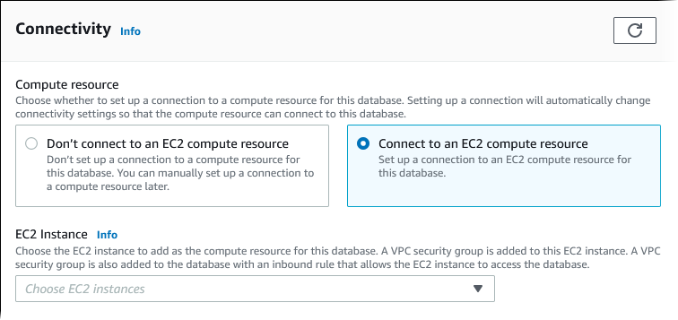
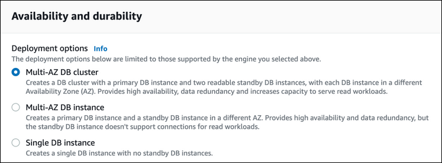

# Creating a Multi-AZ DB cluster for Amazon RDS

A Multi-AZ DB cluster has a writer DB instance and two reader DB instances in three
separate Availability Zones. Multi-AZ DB clusters provide high availability, increased capacity
for read workloads, and lower latency when compared to Multi-AZ deployments. For more
information about Multi-AZ DB clusters, see [Multi-AZ DB cluster deployments for Amazon RDS](multi-az-db-clusters-concepts.md "multi-az-db-clusters-concepts.md").

###### Note

Multi-AZ DB clusters are supported only for the MySQL and PostgreSQL DB engines.

## DB cluster prerequisites

###### Important

Before you can create a Multi-AZ DB cluster, you must complete the tasks in [Setting up your Amazon RDS environment](CHAP_SettingUp.md "CHAP_SettingUp.md").

The following are prerequisites to complete before creating a Multi-AZ DB cluster.

###### Topics

- [Configure the network for the DB cluster](#create-multi-az-db-cluster-prerequisites-VPC "#create-multi-az-db-cluster-prerequisites-VPC")
- [Additional prerequisites](#create-multi-az-db-cluster-prerequisites-additional "#create-multi-az-db-cluster-prerequisites-additional")

### Configure the network for the DB cluster

You can create a Multi-AZ DB cluster only in a virtual private cloud (VPC) based on the
Amazon VPC service. It must be in an AWS Region that has at least three Availability
Zones. The DB subnet group that you choose for the DB cluster must cover at least
three Availability Zones. This configuration ensures that each DB instance in the DB
cluster is in a different Availability Zone.

To set up connectivity between your new DB cluster and an Amazon EC2 instance in the same VPC,
do so when you create the DB cluster. To connect to your DB cluster from resources
other than EC2 instances in the same VPC, configure the network connections
manually.

###### Topics

- [Configure automatic network connectivity with an EC2 instance](#create-multi-az-db-cluster-prerequisites-VPC-automatic "#create-multi-az-db-cluster-prerequisites-VPC-automatic")
- [Configure the network manually](#create-multi-az-db-cluster-prerequisites-VPC-manual "#create-multi-az-db-cluster-prerequisites-VPC-manual")

#### Configure automatic network connectivity with an EC2 instance

When you create a Multi-AZ DB cluster, you can use the AWS Management Console to set up connectivity
between an EC2 instance and the new DB cluster. When you do so, RDS configures
your VPC and network settings automatically. The DB cluster is created in the
same VPC as the EC2 instance so that the EC2 instance can access the DB
cluster.

The following are requirements for connecting an EC2 instance with the DB cluster:

- The EC2 instance must exist in the AWS Region before you create the DB cluster.

If no EC2 instances exist in the AWS Region, the console provides a link to create one.

- The user who is creating the DB cluster must have permissions to perform the following operations:
  - `ec2:AssociateRouteTable`
  - `ec2:AuthorizeSecurityGroupEgress`
  - `ec2:AuthorizeSecurityGroupIngress`
  - `ec2:CreateRouteTable`
  - `ec2:CreateSubnet`
  - `ec2:CreateSecurityGroup`
  - `ec2:DescribeInstances`
  - `ec2:DescribeNetworkInterfaces`
  - `ec2:DescribeRouteTables`
  - `ec2:DescribeSecurityGroups`
  - `ec2:DescribeSubnets`
  - `ec2:ModifyNetworkInterfaceAttribute`
  - `ec2:RevokeSecurityGroupEgress`

Using this option creates a private DB cluster. The DB cluster uses a DB subnet group with only
private subnets to restrict access to resources within the VPC.

To connect an EC2 instance to the DB cluster, choose **Connect to an EC2 compute resource**
in the **Connectivity** section on the **Create database** page.



When you choose **Connect to an EC2 compute resource**, RDS sets the following options automatically.
You can't change these settings unless you choose not to set up connectivity with an EC2 instance by choosing **Don't connect
to an EC2 compute resource**.

| Console option                    | Automatic setting                                                                                                                                                                                                                                                                                                                                                                                                                                                                                                                                                                                                                                                                                                                                                                                                                                                                                                                                                                                                                                                                                                                                                                                                          |
| --------------------------------- | -------------------------------------------------------------------------------------------------------------------------------------------------------------------------------------------------------------------------------------------------------------------------------------------------------------------------------------------------------------------------------------------------------------------------------------------------------------------------------------------------------------------------------------------------------------------------------------------------------------------------------------------------------------------------------------------------------------------------------------------------------------------------------------------------------------------------------------------------------------------------------------------------------------------------------------------------------------------------------------------------------------------------------------------------------------------------------------------------------------------------------------------------------------------------------------------------------------------------- |
| **Virtual Private Cloud (VPC)**   | RDS sets the VPC to the one associated with the EC2 instance.                                                                                                                                                                                                                                                                                                                                                                                                                                                                                                                                                                                                                                                                                                                                                                                                                                                                                                                                                                                                                                                                                                                                                              |
| **DB subnet group**               | RDS requires a DB subnet group with a private subnet in the same Availability Zone as<br>the EC2 instance. If a DB subnet group that meets this<br>requirement exists, then RDS uses the existing DB subnet group.<br>By default, this option is set to **Automatic<br>setup**. When you choose **Automatic<br>setup\*<br>• and there is no DB subnet group that<br>meets this requirement, the following action happens. RDS<br>uses three available private subnets in three Availability<br>Zones where one of the Availability Zones is the same as the<br>EC2 instance. If a private subnet isn’t available in an<br>Availability Zone, RDS creates a private subnet in the<br>Availability Zone. Then RDS creates the DB subnet<br>group.When a private subnet is available, RDS<br>uses the route table associated with the subnet and adds any<br>subnets it creates to this route table. When no private<br>subnet is available, RDS creates a route table without<br>internet gateway access and adds the subnets it creates to<br>the route table.RDS also allows you to use<br>existing DB subnet groups. Select **Choose<br>existing\*<br>• if you want to use an existing DB<br>subnet group of your choice. |
| **Public access**                 | RDS chooses \*_No_<br>• so that the DB cluster isn't publicly accessible.<br>For security, it is a best practice to keep the database private and make sure it isn't<br>accessible from the internet.                                                                                                                                                                                                                                                                                                                                                                                                                                                                                                                                                                                                                                                                                                                                                                                                                                                                                                                                                                                                                      |
| **VPC security group (firewall)** | RDS creates a new security group that is associated with the DB cluster. The security group is named<br>`rds-ec2-`n`, where `n``<br>is a number. This security group includes an inbound rule with the EC2 VPC security group (firewall)<br>as the source. This security group that is associated with the DB cluster allows the EC2 instance to<br>access the DB cluster.<br>RDS also creates a new security group that is associated with the EC2 instance. The security group is named<br>`ec2-rds-`n``, where `n` is a number.<br>This security group includes an outbound rule with the VPC security group of the DB cluster as the source.<br>This security group allows the EC2 instance to send traffic to the DB cluster.<br>You can add another new security group by choosing **Create new\*<br>• and<br>typing the name of the new security group.<br>You can add existing security groups by choosing **Choose existing\*<br>• and<br>selecting security groups to add.                                                                                                                                                                                                                                       |
| **Availability Zone**             | RDS chooses the Availability Zone of the EC2 instance for one DB instance in the Multi-AZ<br>DB cluster deployment. RDS randomly chooses a different Availability Zone for both of the other<br>DB instances. The writer DB instance is created in the same Availability Zone as the EC2 instance.<br>There is the possibility of cross Availability Zone costs if a failover occurs and the writer DB<br>instance is in a different Availability Zone.                                                                                                                                                                                                                                                                                                                                                                                                                                                                                                                                                                                                                                                                                                                                                                    |

For more information about these settings, see [Settings for creating Multi-AZ DB clusters](#create-multi-az-db-cluster-settings "#create-multi-az-db-cluster-settings").

If you change these settings after the DB cluster is created, the changes might affect the
connection between the EC2 instance and the DB cluster.

#### Configure the network manually

To connect to your DB cluster from resources other than EC2 instances in the same VPC,
configure the network connections manually. If you use the AWS Management Console to create
your Multi-AZ DB cluster, you can have Amazon RDS automatically create a VPC for you.
Or you can use an existing VPC or create a new VPC for your Multi-AZ DB cluster.
Your VPC must have at least one subnet in each of at least three Availability
Zones for you to use it with a Multi-AZ DB cluster. For information on VPCs, see
[Amazon VPC and Amazon RDS](USER_VPC.md "USER_VPC.md").

If you don't have a default VPC or you haven't created a VPC, and you
don't plan to use the console, do the following:

- Create a VPC with at least one subnet in each of at least three of the
  Availability Zones in the AWS Region where you want to deploy your DB
  cluster. For more information, see [Working with a DB instance in a VPC](USER_VPC.md#Overview.RDSVPC.Create "USER_VPC.md#Overview.RDSVPC.Create").
- Specify a VPC security group that authorizes connections to your DB
  cluster. For more information, see [Provide access to your DB instance in your VPC by creating a security group](CHAP_SettingUp.md#CHAP_SettingUp.SecurityGroup "CHAP_SettingUp.md#CHAP_SettingUp.SecurityGroup") and
  [Controlling access with security groups](Overview.md "Overview.md").
- Specify an RDS DB subnet group that defines at least three subnets in the
  VPC that can be used by the Multi-AZ DB cluster. For more information, see
  [Working with DB subnet groups](USER_VPC.md#USER_VPC.Subnets "USER_VPC.md#USER_VPC.Subnets").

For information about limitations that apply to Multi-AZ DB clusters, see [Limitations of Multi-AZ DB clusters for Amazon RDS](multi-az-db-clusters-concepts.md "multi-az-db-clusters-concepts.md").

If you want to connect to a resource that isn't in the same VPC as the Multi-AZ DB cluster, see the appropriate
scenarios in [Scenarios for accessing a DB instance in a VPC](USER_VPC.md "USER_VPC.md").

### Additional prerequisites

Before you create your Multi-AZ DB cluster, consider the following additional prerequisites:

- To tailor the configuration parameters for your DB cluster, specify a DB cluster
  parameter group with the required parameter settings. For information about
  creating or modifying a DB cluster parameter group, see [Parameter groups for Multi-AZ DB clusters](multi-az-db-clusters-concepts.md#multi-az-db-clusters-concepts-parameter-groups "multi-az-db-clusters-concepts.md#multi-az-db-clusters-concepts-parameter-groups").
- Determine the TCP/IP port number to specify for your DB cluster. The
  firewalls at some companies block connections to the default ports. If your company
  firewall blocks the default port, choose another port for your DB cluster. All DB
  instances in a DB cluster use the same port.
- If the major engine version for your database reached the RDS end of
  standard support date, you must use the Extended Support CLI option or the RDS API
  parameter. For more information, see RDS Extended Support in [Settings for creating Multi-AZ DB clusters](#create-multi-az-db-cluster-settings "#create-multi-az-db-cluster-settings").

## Creating a DB cluster

You can create a Multi-AZ DB cluster using the AWS Management Console, the AWS CLI, or the RDS API.

You can create a Multi-AZ DB cluster by choosing **Multi-AZ DB cluster** in
the **Availability and durability** section.

###### To create a Multi-AZ DB cluster using the console

1. Sign in to the AWS Management Console and open the Amazon RDS console at
   [https://console.aws.amazon.com/rds/](https://console.aws.amazon.com/rds/ "https://console.aws.amazon.com/rds/").
2. In the upper-right corner of the AWS Management Console, choose the AWS Region in which you
   want to create the DB cluster.

For information about the AWS Regions that support Multi-AZ DB clusters, see
[Limitations of Multi-AZ DB clusters for Amazon RDS](multi-az-db-clusters-concepts.md "multi-az-db-clusters-concepts.md"). 3. In the navigation pane, choose **Databases**. 4. Choose **Create database**.

To create a Multi-AZ DB cluster, make sure that **Standard
Create** is selected and **Easy Create**
isn't. 5. In **Engine type**, choose **MySQL** or **PostgreSQL**. 6. For **Version**, choose the DB engine version.

For information about the DB engine versions that support Multi-AZ DB clusters, see
[Limitations of Multi-AZ DB clusters for Amazon RDS](multi-az-db-clusters-concepts.md "multi-az-db-clusters-concepts.md"). 7. In **Templates**, choose the appropriate template for your deployment. 8. In **Availability and durability**, choose **Multi-AZ DB cluster**.

 9. In **DB cluster identifier**, enter the identifier for your DB cluster. 10. In **Master username**, enter your master user name, or keep
the default setting. 11. Enter your master password:

    1. In the **Settings** section, open **Credential
     Settings**.
    2. If you want to specify a password, clear the **Auto generate a password** box if it is selected.
    3. (Optional) Change the **Master username** value.
    4. Enter the same password in **Master password** and **Confirm
     password**.

12. For **DB instance class**, choose a DB instance class. For a
    list of supported DB instance classes, see [Instance class availability for Multi-AZ DB clusters](multi-az-db-clusters-concepts.md#multi-az-db-clusters-concepts.InstanceAvailability "multi-az-db-clusters-concepts.md#multi-az-db-clusters-concepts.InstanceAvailability").
13. (Optional) Set up a connection to a compute resource for this DB cluster.

You can configure connectivity between an Amazon EC2 instance and the new DB cluster during
DB cluster creation. For more information, see [Configure automatic network connectivity with an EC2 instance](#create-multi-az-db-cluster-prerequisites-VPC-automatic "#create-multi-az-db-cluster-prerequisites-VPC-automatic"). 14. In the **Connectivity** section under **VPC security group (firewall)**, if you select **Create new**,
a VPC security group is created with an inbound rule that allows your local computer's IP address to access the database. 15. For the remaining sections, specify your DB cluster settings. For information about each setting, see
[Settings for creating Multi-AZ DB clusters](#create-multi-az-db-cluster-settings "#create-multi-az-db-cluster-settings"). 16. Choose **Create database**.

If you chose to use an automatically generated password, the **View credential details** button appears
on the **Databases** page.

To view the master user name and password for the DB cluster, choose **View credential details**.

To connect to the DB cluster as the master user, use the user name and password that appear.

###### Important

You can't view the master user password again. 17. For **Databases**, choose the name of the new DB cluster.
On the RDS console, the details for the new DB cluster appear. The DB cluster has a
status of **Creating** until the DB cluster is created and
ready for use. When the state changes to **Available**, you can
connect to the DB cluster. Depending on the DB cluster class and storage
allocated, it can take several minutes for the new DB cluster to be available.

Before you create a Multi-AZ DB cluster using the AWS CLI, make sure to fulfill the
required prerequisites. These include creating a VPC and an RDS DB subnet group.
For more information, see [DB cluster prerequisites](#create-multi-az-db-cluster-prerequisites "#create-multi-az-db-cluster-prerequisites").

To create a Multi-AZ DB cluster by using the AWS CLI, call the [create-db-cluster](../../../cli/latest/reference/rds/create-db-cluster.md "../../../cli/latest/reference/rds/create-db-cluster.md")
command. Specify the `--db-cluster-identifier`. For the `--engine` option,
specify either `mysql` or `postgres`.

For information about each option, see [Settings for creating Multi-AZ DB clusters](#create-multi-az-db-cluster-settings "#create-multi-az-db-cluster-settings").

For information about the AWS Regions, DB engines, and DB engine versions that support
Multi-AZ DB clusters, see [Limitations of Multi-AZ DB clusters for Amazon RDS](multi-az-db-clusters-concepts.md "multi-az-db-clusters-concepts.md").

The `create-db-cluster` command creates the writer DB instance for your DB
cluster, and two reader DB instances. Each DB instance is in a different Availability Zone.

For example, the following command creates a MySQL 8.0 Multi-AZ DB cluster named
`mysql-multi-az-db-cluster`.

###### Example

For Linux, macOS, or Unix:

```
aws rds create-db-cluster \
   --db-cluster-identifier `mysql-multi-az-db-cluster` \
   --engine mysql \
   --engine-version `8.0.32`  \
   --master-username `admin` \
   --manage-master-user-password  \
   --port `3306` \
   --backup-retention-period `1`  \
   --db-subnet-group-name `default` \
   --allocated-storage `4000` \
   --storage-type io1 \
   --iops `10000` \
   --db-cluster-instance-class `db.m5d.xlarge`
```

For Windows:

```
aws rds create-db-cluster ^
   --db-cluster-identifier `mysql-multi-az-db-cluster` ^
   --engine mysql ^
   --engine-version `8.0.32` ^
   --manage-master-user-password ^
   --master-username `admin` ^
   --port `3306` ^
   --backup-retention-period `1` ^
   --db-subnet-group-name `default` ^
   --allocated-storage `4000` ^
   --storage-type io1 ^
   --iops `10000` ^
   --db-cluster-instance-class `db.m5d.xlarge`
```

The following command creates a PostgreSQL 13.4 Multi-AZ DB cluster named
`postgresql-multi-az-db-cluster`.

###### Example

For Linux, macOS, or Unix:

```
aws rds create-db-cluster \
   --db-cluster-identifier `postgresql-multi-az-db-cluster` \
   --engine postgres \
   --engine-version `13.4` \
   --manage-master-user-password \
   --master-username `postgres` \
   --port `5432` \
   --backup-retention-period `1`  \
   --db-subnet-group-name `default` \
   --allocated-storage `4000` \
   --storage-type io1 \
   --iops `10000` \
   --db-cluster-instance-class `db.m5d.xlarge`
```

For Windows:

```
aws rds create-db-cluster ^
   --db-cluster-identifier `postgresql-multi-az-db-cluster` ^
   --engine postgres ^
   --engine-version `13.4` ^
   --manage-master-user-password ^
   --master-username `postgres` ^
   --port `5432` ^
   --backup-retention-period `1` ^
   --db-subnet-group-name `default` ^
   --allocated-storage `4000` ^
   --storage-type io1 ^
   --iops `10000` ^
   --db-cluster-instance-class `db.m5d.xlarge`
```

Before you can create a Multi-AZ DB cluster using the RDS API, make sure to
fulfill the required prerequisites, such as creating a VPC and an RDS DB subnet
group. For more information, see [DB cluster prerequisites](#create-multi-az-db-cluster-prerequisites "#create-multi-az-db-cluster-prerequisites").

To create a Multi-AZ DB cluster by using the RDS API, call the [CreateDBCluster](../APIReference/API_CreateDBCluster.md "../APIReference/API_CreateDBCluster.md") operation. Specify the `DBClusterIdentifier`. For the `Engine` parameter,
specify either `mysql` or `postgresql`.

For information about each option, see [Settings for creating Multi-AZ DB clusters](#create-multi-az-db-cluster-settings "#create-multi-az-db-cluster-settings").

The `CreateDBCluster` operation creates the writer DB instance for your DB
cluster, and two reader DB instances. Each DB instance is in a different
Availability Zone.

## Settings for creating Multi-AZ DB clusters

For details about settings that you choose when you create a Multi-AZ DB cluster, see
the following table. For more information about the AWS CLI options, see [create-db-cluster](../../../cli/latest/reference/rds/create-db-cluster.md "../../../cli/latest/reference/rds/create-db-cluster.md"). For more information
about the RDS API parameters, see [CreateDBCluster](../APIReference/API_CreateDBCluster.md "../APIReference/API_CreateDBCluster.md").

| Console setting                                      | Setting description                                                                                                                                                                                                                                                                                                                                                                                                                                                                                                                                                                                                                                                                                                                                                                                                                                                                                                                                                                                                                                                                                                                                                                                     | CLI option and RDS API parameter                                                                                                                                                                                                                                                                                 |
| ---------------------------------------------------- | ------------------------------------------------------------------------------------------------------------------------------------------------------------------------------------------------------------------------------------------------------------------------------------------------------------------------------------------------------------------------------------------------------------------------------------------------------------------------------------------------------------------------------------------------------------------------------------------------------------------------------------------------------------------------------------------------------------------------------------------------------------------------------------------------------------------------------------------------------------------------------------------------------------------------------------------------------------------------------------------------------------------------------------------------------------------------------------------------------------------------------------------------------------------------------------------------------- | ---------------------------------------------------------------------------------------------------------------------------------------------------------------------------------------------------------------------------------------------------------------------------------------------------------------- | ------------------------------------------------------------------------------------------------------------------------------------------------------------ |
| **Allocated storage**                                | The amount of storage to allocate for each DB instance in your DB cluster (in gibibyte). For<br>more information, see [Amazon RDS DB instance storage](CHAP_Storage.md "CHAP_Storage.md").                                                                                                                                                                                                                                                                                                                                                                                                                                                                                                                                                                                                                                                                                                                                                                                                                                                                                                                                                                                                              | **CLI option:**<br>`--allocated-storage`<br>**API parameter:**<br>`AllocatedStorage`                                                                                                                                                                                                                             |
| **Auto minor version upgrade**                       | \*_Enable auto minor version upgrade_<br>• to have your DB cluster receive<br>preferred minor DB engine version upgrades automatically when they<br>become available. Amazon RDS performs automatic minor version upgrades in<br>the maintenance window.                                                                                                                                                                                                                                                                                                                                                                                                                                                                                                                                                                                                                                                                                                                                                                                                                                                                                                                                                | **CLI option:**<br>`--auto-minor-version-upgrade`<br>`--no-auto-minor-version-upgrade`<br>**API parameter:**<br>`AutoMinorVersionUpgrade`                                                                                                                                                                        |
| **Backup retention period**                          | The number of days that you want automatic backups of your DB cluster to be retained. For a Multi-AZ DB cluster, this<br>value must be set to `1` or greater.<br>For more information, see [Introduction to backups](USER_WorkingWithAutomatedBackups.md "USER_WorkingWithAutomatedBackups.md").                                                                                                                                                                                                                                                                                                                                                                                                                                                                                                                                                                                                                                                                                                                                                                                                                                                                                                        | **CLI option:**<br>`--backup-retention-period`<br>**API parameter:**<br>`BackupRetentionPeriod`                                                                                                                                                                                                                  |
| **Backup window**                                    | The time period during which Amazon RDS automatically takes a backup of your DB cluster.<br>Unless you have a specific time that you want to have your database<br>backed up, use the default of **No<br>preference**.<br>For more information, see [Introduction to backups](USER_WorkingWithAutomatedBackups.md "USER_WorkingWithAutomatedBackups.md").                                                                                                                                                                                                                                                                                                                                                                                                                                                                                                                                                                                                                                                                                                                                                                                                                                               | **CLI option:**<br>`--preferred-backup-window`<br>**API parameter:**<br>`PreferredBackupWindow`                                                                                                                                                                                                                  |
| **Certificate authority**                            | The certificate authority (CA) for the server certificate used by the DB cluster.<br>For more information, see [Using SSL/TLS to encrypt a connection to a DB instance or cluster](UsingWithRDS.md "UsingWithRDS.md") .                                                                                                                                                                                                                                                                                                                                                                                                                                                                                                                                                                                                                                                                                                                                                                                                                                                                                                                                                                                 | **CLI option:**<br>`--ca-certificate-identifier`<br>**RDS API parameter:**<br>`CACertificateIdentifier`                                                                                                                                                                                                          |
| **Copy tags to snapshots**                           | This option copies any DB cluster tags to a DB snapshot when you create a snapshot.<br>For more information, see [Tagging Amazon RDS resources](USER_Tagging.md "USER_Tagging.md").                                                                                                                                                                                                                                                                                                                                                                                                                                                                                                                                                                                                                                                                                                                                                                                                                                                                                                                                                                                                                     | **CLI option:**<br>`-copy-tags-to-snapshot`<br>`-no-copy-tags-to-snapshot`<br>**RDS API parameter:**<br>`CopyTagsToSnapshot`                                                                                                                                                                                     |
| **Database authentication**                          | The database authentication option that you want to use.<br>Choose **Password authentication\*<br>• to<br>authenticate database users with database passwords only.<br>Choose **Password and IAM DB authentication\*<br>• to authenticate database<br>users with database passwords and user credentials through users and<br>roles. For more information, see [IAM database authenticationfor MariaDB, MySQL, and PostgreSQL](UsingWithRDS.md "UsingWithRDS.md").                                                                                                                                                                                                                                                                                                                                                                                                                                                                                                                                                                                                                                                                                                                                      | **CLI option:**<br>`--enable-iam-database-authentication`<br>`--no-enable-iam-database-authentication`<br>**RDS API parameter:**<br>`EnableIAMDatabaseAuthentication`                                                                                                                                            |
| **Database port**                                    | The port that you want to access the DB cluster through. The default port is shown.<br>The port can't be changed after the DB cluster is created.<br>The firewalls at some companies block connections to the default<br>ports. If your company firewall blocks the default port, enter<br>another port for your DB cluster.                                                                                                                                                                                                                                                                                                                                                                                                                                                                                                                                                                                                                                                                                                                                                                                                                                                                            | **CLI option:**<br>`--port`<br>**RDS API parameter:**<br>`Port`                                                                                                                                                                                                                                                  |
| **DB cluster identifier**                            | The name for your DB cluster. Name your DB clusters in the same way that you name your on-premises servers. Your DB cluster<br>identifier can contain up to 63 alphanumeric characters, and must be unique for your account in the AWS Region you chose.                                                                                                                                                                                                                                                                                                                                                                                                                                                                                                                                                                                                                                                                                                                                                                                                                                                                                                                                                | **CLI option:**<br>`--db-cluster-identifier`<br>**RDS API parameter:**<br>`DBClusterIdentifier`                                                                                                                                                                                                                  |
| **DB instance class**                                | The compute and memory capacity of each DB instance in the Multi-AZ DB cluster, for example<br>`db.m5d.xlarge`.<br>If possible, choose a DB instance class large enough that a typical query working set can be held in memory. When<br>working sets are held in memory the system can avoid writing to disk, which improves<br>performance.<br>For a list of supported DB instance classes, see [Instance class availability for Multi-AZ DB clusters](multi-az-db-clusters-concepts.md#multi-az-db-clusters-concepts.InstanceAvailability "multi-az-db-clusters-concepts.md#multi-az-db-clusters-concepts.InstanceAvailability").                                                                                                                                                                                                                                                                                                                                                                                                                                                                                                                                                                     | **CLI option:**<br>`--db-cluster-instance-class`<br>**RDS API parameter:**<br>`DBClusterInstanceClass`                                                                                                                                                                                                           |
| **DB cluster parameter group**                       | The DB cluster parameter group that you want<br>associated with the DB cluster.<br>For more information, see<br>[Parameter groups for Multi-AZ DB clusters](multi-az-db-clusters-concepts.md#multi-az-db-clusters-concepts-parameter-groups "multi-az-db-clusters-concepts.md#multi-az-db-clusters-concepts-parameter-groups").                                                                                                                                                                                                                                                                                                                                                                                                                                                                                                                                                                                                                                                                                                                                                                                                                                                                         | **CLI option:**<br>`--db-cluster-parameter-group-name`<br>**RDS API parameter:**<br>`DBClusterParameterGroupName`                                                                                                                                                                                                |
| **DB engine version**                                | The version of database engine that you want to use.                                                                                                                                                                                                                                                                                                                                                                                                                                                                                                                                                                                                                                                                                                                                                                                                                                                                                                                                                                                                                                                                                                                                                    | **CLI option:**<br>`--engine-version`<br>**RDS API parameter:**<br>`EngineVersion`                                                                                                                                                                                                                               |
| **DB cluster parameter group**                       | The DB instance parameter group to associate with the DB cluster.<br>For more information, see [Parameter groups for Multi-AZ DB clusters](multi-az-db-clusters-concepts.md#multi-az-db-clusters-concepts-parameter-groups "multi-az-db-clusters-concepts.md#multi-az-db-clusters-concepts-parameter-groups").                                                                                                                                                                                                                                                                                                                                                                                                                                                                                                                                                                                                                                                                                                                                                                                                                                                                                          | **CLI option:**<br>`--db-cluster-parameter-group-name`<br>**RDS API parameter:**<br>`**DBClusterParameterGroupName**`                                                                                                                                                                                            |
| **DB subnet group**                                  | The DB subnet group you want to use for the DB cluster. Select **Choose existing\*<br>• to use an existing DB subnet<br>group. Then choose the required subnet group from the **Existing DB subnet groups\*<br>• dropdown<br>list.Choose **Automatic setup**<br>to let RDS select a compatible DB subnet group. If none exist, RDS<br>creates a new subnet group for your cluster.For more<br>information, see [Working with DB subnet groups](USER_VPC.md#USER_VPC.Subnets "USER_VPC.md#USER_VPC.Subnets").                                                                                                                                                                                                                                                                                                                                                                                                                                                                                                                                                                                                                                                                                            | **CLI option:**<br>`--db-subnet-group-name`<br>**RDS API parameter:**<br>`DBSubnetGroupName`                                                                                                                                                                                                                     |
| **Deletion protection**                              | \*_Enable deletion protection_<br>• to prevent your DB cluster from being<br>deleted. If you create a production DB cluster with the console,<br>deletion protection is turned on by default.<br>For more information, see [Deleting a DB instance](USER_DeleteInstance.md "USER_DeleteInstance.md").                                                                                                                                                                                                                                                                                                                                                                                                                                                                                                                                                                                                                                                                                                                                                                                                                                                                                                   | **CLI option:**<br>`--deletion-protection`<br>`--no-deletion-protection`<br>**RDS API parameter:**<br>`DeletionProtection`                                                                                                                                                                                       |
| **Encryption**                                       | \*_Enable Encryption_<br>• to turn on encryption at rest for this DB<br>cluster.<br>Encryption is turned on by default for Multi-AZ DB clusters.<br>For more information, see [Encrypting Amazon RDS resources](Overview.md "Overview.md").                                                                                                                                                                                                                                                                                                                                                                                                                                                                                                                                                                                                                                                                                                                                                                                                                                                                                                                                                             | **CLI options:**<br>`--kms-key-id`<br>`--storage-encrypted`<br>`--no-storage-encrypted`<br>**RDS API parameters:**<br>`KmsKeyId`<br>`StorageEncrypted`                                                                                                                                                           |
| **Enhanced Monitoring**                              | \*_Enable enhanced monitoring_<br>• to turn on metrics gathering in real<br>time for the operating system that your DB cluster runs on.<br>For more information, see [Monitoring OS metrics with Enhanced Monitoring](USER_Monitoring.md "USER_Monitoring.md").                                                                                                                                                                                                                                                                                                                                                                                                                                                                                                                                                                                                                                                                                                                                                                                                                                                                                                                                         | **CLI options:**<br>`--monitoring-interval`<br>`--monitoring-role-arn`<br>**RDS API parameters:**<br>`MonitoringInterval`<br>`MonitoringRoleArn`                                                                                                                                                                 |
| **Initial database name**                            | The name for the database on your DB cluster. If you don't provide a name, Amazon RDS<br>doesn't create a database on the DB cluster for MySQL. However,<br>it does create a database on the DB cluster for PostgreSQL. The name<br>can't be a word reserved by the database engine. It has other<br>constraints depending on the DB engine.<br>MySQL:<br>• It must contain 1–64 alphanumeric characters.<br>PostgreSQL:<br>• It must contain 1–63 alphanumeric characters.<br>• It must begin with a letter or an underscore. Subsequent characters can be letters, underscores, or digits (0-9).<br>• The initial database name is `postgres`.                                                                                                                                                                                                                                                                                                                                                                                                                                                                                                                                                        | **CLI option:**<br>`--database-name`<br>**RDS API parameter:**<br>`DatabaseName`                                                                                                                                                                                                                                 |
| **Log exports**                                      | The types of database log files to publish to Amazon CloudWatch Logs.<br>For more information, see [Publishing database logs to Amazon CloudWatch Logs](USER_LogAccess.Procedural.md "USER_LogAccess.Procedural.md").                                                                                                                                                                                                                                                                                                                                                                                                                                                                                                                                                                                                                                                                                                                                                                                                                                                                                                                                                                                   | **CLI option:**<br>`-enable-cloudwatch-logs-exports`<br>**RDS API parameter:**<br>`EnableCloudwatchLogsExports`                                                                                                                                                                                                  |
| **Maintenance window**                               | The 30-minute window in which pending modifications to your DB cluster are applied. If the time period doesn't matter, choose<br>**No preference**.<br>For more information, see [Amazon RDS maintenance window](USER_UpgradeDBInstance.md#Concepts.DBMaintenance "USER_UpgradeDBInstance.md#Concepts.DBMaintenance").                                                                                                                                                                                                                                                                                                                                                                                                                                                                                                                                                                                                                                                                                                                                                                                                                                                                                  | **CLI option:**<br>`--preferred-maintenance-window`<br>**RDS API parameter:**<br>`PreferredMaintenanceWindow`                                                                                                                                                                                                    |
| **Manage master credentials in AWS Secrets Manager** | Select \*_Manage master credentials in AWS Secrets Manager_<br>• to manage the master user<br>password in a secret in Secrets Manager.<br>Optionally, choose a KMS key to use to protect the secret. Choose from the KMS keys<br>in your account, or enter the key from a different account.<br>For more information, see [Password management with Amazon RDS and AWS Secrets Manager](rds-secrets-manager.md "rds-secrets-manager.md").                                                                                                                                                                                                                                                                                                                                                                                                                                                                                                                                                                                                                                                                                                                                                               | **CLI option:**<br>`--manage-master-user-password                                                                                                                                                                                                                                                                | --no-manage-master-user-password`<br>`--master-user-secret-kms-key-id`<br>**RDS API parameter:**<br>`ManageMasterUserPassword`<br>`MasterUserSecretKmsKeyId` |
| **Master password**                                  | The password for your master user account.                                                                                                                                                                                                                                                                                                                                                                                                                                                                                                                                                                                                                                                                                                                                                                                                                                                                                                                                                                                                                                                                                                                                                              | **CLI option:**<br>`--master-user-password`<br>**RDS API parameter:**<br>`MasterUserPassword`                                                                                                                                                                                                                    |
| **Master username**                                  | The name that you use as the master user name to log on to your DB cluster with all database privileges.<br>• It can contain 1–16 alphanumeric characters and underscores.<br>• Its first character must be a letter.<br>• It can't be a word reserved by the database engine.<br>You can't change the master user name after the Multi-AZ DB cluster is created.<br>For more information on privileges granted to the master user, see [Master user account privileges](UsingWithRDS.md "UsingWithRDS.md").                                                                                                                                                                                                                                                                                                                                                                                                                                                                                                                                                                                                                                                                                            | **CLI option:**<br>`--master-username`<br>**RDS API parameter:**<br>`MasterUsername`                                                                                                                                                                                                                             |
| **Performance Insights**                             | **Enable Performance Insights\*<br>• to monitor your DB cluster load so that you can analyze and troubleshoot your<br>database performance.<br>Choose a retention period to determine how much Performance Insights data<br>history to keep. The retention setting is **Default (7 days)\*\*. To retain your performance<br>data for longer, specify 1–24 months. For more information about retention periods, see<br>[Pricing and data retention for Performance Insights](USER_PerfInsights.Overview.md "USER_PerfInsights.Overview.md").<br>Choose a KMS key to use to protect the key used to encrypt this database volume. Choose from the KMS keys in your account, or<br>enter the key from a different account.<br>For more information, see [Monitoring DB load with Performance Insights on Amazon RDS](USER_PerfInsights.md "USER_PerfInsights.md").                                                                                                                                                                                                                                                                                                                                        | **CLI options:**<br>`--enable-performance-insights`<br>`--no-enable-performance-insights`<br>`--performance-insights-retention-period`<br>`--performance-insights-kms-key-id`<br>**RDS API parameters:**<br>`EnablePerformanceInsights`<br>`PerformanceInsightsRetentionPeriod`<br>`PerformanceInsightsKMSKeyId` |
| **Provisioned IOPS**                                 | The amount of Provisioned IOPS (input/output operations per second) to be initially<br>allocated for the DB cluster.                                                                                                                                                                                                                                                                                                                                                                                                                                                                                                                                                                                                                                                                                                                                                                                                                                                                                                                                                                                                                                                                                    | **CLI option:**<br>`--iops`<br>**RDS API parameter:**<br>`Iops`                                                                                                                                                                                                                                                  |
| **Public access**                                    | **Publicly accessible\*<br>• to give the DB cluster a public IP address, meaning that it's accessible outside the VPC. To be<br>publicly accessible, the DB cluster also has to be in a public subnet in the VPC.<br>**Not publicly accessible\*<br>• to make the DB cluster accessible only from inside the VPC.<br>For more information, see [Hiding a DB instance in a VPC from the internet](USER_VPC.md#USER_VPC.Hiding "USER_VPC.md#USER_VPC.Hiding").<br>To connect to a DB cluster from outside of its VPC, the DB cluster must be publicly<br>accessible. Also, access must be granted using the inbound rules of<br>the DB cluster's security group, and other requirements must be<br>met. For more information, see [Can't connect to Amazon RDS DB instance](CHAP_Troubleshooting.md#CHAP_Troubleshooting.Connecting "CHAP_Troubleshooting.md#CHAP_Troubleshooting.Connecting").<br>If your DB cluster isn't publicly accessible, you can use an AWS Site-to-Site VPN connection or<br>an Direct Connect connection to access it from a private network. For more information, see<br>[Internetwork traffic privacy](inter-network-traffic-privacy.md "inter-network-traffic-privacy.md"). | **CLI option:**<br>`--publicly-accessible`<br>`--no-publicly-accessible`<br>**RDS API parameter:**<br>`PubliclyAccessible`                                                                                                                                                                                       |
| **RDS Extended Support**                             | Select \*_Enable RDS Extended Support_<br>• to allow<br>supported major engine versions to continue running past the RDS end of<br>standard support date.<br>When you create a DB cluster, Amazon RDS<br>defaults to RDS Extended Support. To prevent the creation of a new DB cluster<br>after the RDS end of standard support date and to avoid charges for<br>RDS Extended Support, disable this setting. Your existing DB clusters won't<br>incur charges until the RDS Extended Support pricing start date.<br>For<br>more information, see [Amazon RDS Extended Support with Amazon RDS](extended-support.md "extended-support.md").                                                                                                                                                                                                                                                                                                                                                                                                                                                                                                                                                              | **CLI option:**<br>`--engine-lifecycle-support`<br>**RDS API parameter:**<br>`EngineLifecycleSupport`                                                                                                                                                                                                            |
| **Storage throughput**                               | The storage throughput value for the DB cluster. This setting is visible only if you choose<br>General Purpose SSD (gp3) for the storage type.<br>This setting is not configurable and is automatically set based on<br>the IOPS that you specify.<br>For more information, see [gp3 storage (recommended)](CHAP_Storage.md#gp3-storage "CHAP_Storage.md#gp3-storage").                                                                                                                                                                                                                                                                                                                                                                                                                                                                                                                                                                                                                                                                                                                                                                                                                                 | This value is automatically calculated and doesn't have a CLI<br>option.                                                                                                                                                                                                                                         |
| **RDS Proxy**                                        | Choose \*_Create an RDS Proxy_<br>• to<br>create a proxy for your DB cluster. Amazon RDS automatically creates an IAM<br>role and a Secrets Manager secret for the proxy.                                                                                                                                                                                                                                                                                                                                                                                                                                                                                                                                                                                                                                                                                                                                                                                                                                                                                                                                                                                                                               | Not available when creating a DB cluster.                                                                                                                                                                                                                                                                        |
| **Storage type**                                     | The storage type for your DB cluster.<br>Only General Purpose SSD (gp3), Provisioned IOPS (io1), and Provisioned IOPS SSD (io2)<br>storage are supported.<br>For more information, see [Amazon RDS storage types](CHAP_Storage.md#Concepts.Storage "CHAP_Storage.md#Concepts.Storage").                                                                                                                                                                                                                                                                                                                                                                                                                                                                                                                                                                                                                                                                                                                                                                                                                                                                                                                 | **CLI option:**<br>`--storage-type`<br>**RDS API parameter:**<br>`StorageType`                                                                                                                                                                                                                                   |
| **Virtual Private Cloud (VPC)**                      | A VPC based on the Amazon VPC service to associate with this DB cluster.<br>For more information, see [Amazon VPC and Amazon RDS](USER_VPC.md "USER_VPC.md").                                                                                                                                                                                                                                                                                                                                                                                                                                                                                                                                                                                                                                                                                                                                                                                                                                                                                                                                                                                                                                           | For the CLI and API, you specify the VPC security group IDs.                                                                                                                                                                                                                                                     |
| **VPC security group (firewall)**                    | The security groups to associate with the DB cluster.<br>For more information, see [Overview of VPC security groups](Overview.md#Overview.RDSSecurityGroups.VPCSec "Overview.md#Overview.RDSSecurityGroups.VPCSec").                                                                                                                                                                                                                                                                                                                                                                                                                                                                                                                                                                                                                                                                                                                                                                                                                                                                                                                                                                                    | **CLI option:**<br>`--vpc-security-group-ids`<br>**RDS API parameter:**<br>`VpcSecurityGroupIds`                                                                                                                                                                                                                 |

## Settings that don't apply when creating Multi-AZ DB clusters

The following settings in the AWS CLI command [`create-db-cluster`](../../../cli/latest/reference/rds/create-db-cluster.md "../../../cli/latest/reference/rds/create-db-cluster.md") and the RDS API operation [`CreateDBCluster`](../APIReference/API_CreateDBCluster.md "../APIReference/API_CreateDBCluster.md") don't apply to Multi-AZ DB clusters.

You also can't specify these settings for Multi-AZ DB clusters in the console.

| AWS CLI setting                   | RDS API setting                      |
| --------------------------------- | ------------------------------------ | ----------------------------- |
| `--availability-zones`            | `AvailabilityZones`                  |
| `--backtrack-window`              | `BacktrackWindow`                    |
| `--character-set-name`            | `CharacterSetName`                   |
| `--domain`                        | `Domain`                             |
| `--domain-iam-role-name`          | `DomainIAMRoleName`                  |
| `--enable-global-write-forwarding | --no-enable-global-write-forwarding` | `EnableGlobalWriteForwarding` |
| `--enable-http-endpoint           | --no-enable-http-endpoint`           | `EnableHttpEndpoint`          |
| `--global-cluster-identifier`     | `GlobalClusterIdentifier`            |
| `--option-group-name`             | `OptionGroupName`                    |
| `--pre-signed-url`                | `PreSignedUrl`                       |
| `--replication-source-identifier` | `ReplicationSourceIdentifier`        |
| `--scaling-configuration`         | `ScalingConfiguration`               |
