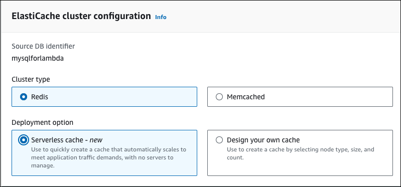

# Creating an Amazon ElastiCache cache using

Amazon RDS DB instance settings

ElastiCache is a fully managed, in-memory caching service that provides microsecond read and
write latencies that support flexible, real-time use cases. ElastiCache can help you accelerate
application and database performance. You can use ElastiCache as a primary data store for use
cases that don't require data durability, such as gaming leaderboards, streaming, and data
analytics. ElastiCache helps remove the complexity associated with deploying and managing a
distributed computing environment. For more information, see [Common ElastiCache Use
Cases and How ElastiCache Can Help](../../../AmazonElastiCache/latest/mem-ug/elasticache-use-cases.md "../../../AmazonElastiCache/latest/mem-ug/elasticache-use-cases.md") for Memcached and [Common ElastiCache Use
Cases and How ElastiCache Can Help](../../../AmazonElastiCache/latest/red-ug/elasticache-use-cases.md "../../../AmazonElastiCache/latest/red-ug/elasticache-use-cases.md") for Redis OSS. You can use the Amazon RDS console for
creating ElastiCache cache.

You can operate Amazon ElastiCache in two formats. You can get started with a serverless
cache or choose to design your own cache cluster. If you choose to design your own cache
cluster, ElastiCache works with both the Redis OSS and Memcached engines. If you're unsure which
engine you want to use, see [Comparing Memcached and
Redis OSS](../../../AmazonElastiCache/latest/red-ug/SelectEngine.md "../../../AmazonElastiCache/latest/red-ug/SelectEngine.md"). For more information about Amazon ElastiCache, see the [Amazon ElastiCache User Guide](../../../AmazonElastiCache/latest/UserGuide.md "../../../AmazonElastiCache/latest/UserGuide.md").

###### Topics

- [Overview of
  ElastiCache cache creation with RDS DB instance
  settings](#creating-elasticache-cluster-with-RDS-settings-overview "#creating-elasticache-cluster-with-RDS-settings-overview")
- [Creating an
  ElastiCache cache with settings from an RDS DB instance](#creating-elasticache-cluster-with-RDS-settings-new-DB "#creating-elasticache-cluster-with-RDS-settings-new-DB")

## Overview of

ElastiCache cache creation with RDS DB instance
settings

You can create an ElastiCache cache from Amazon RDS using the same configuration settings as a
newly created or existing RDS DB instance.

Some use cases to associate an ElastiCache cache with your DB instance:

- You can save costs and improve your performance by using ElastiCache with RDS
  versus running on RDS alone.

For example, you can save up to 55% in cost and gain up to 80x faster
read performance by using ElastiCache with RDS for MySQL versus RDS for MySQL alone.

- You can use the ElastiCache cache as a primary data store for applications that
  don't require data durability. Your applications that use Redis OSS or
  Memcached can use ElastiCache with almost no modification.

When you create an ElastiCache cache from RDS, the ElastiCache cache inherits the following
settings from the associated RDS DB instance:

- ElastiCache connectivity settings
- ElastiCache security settings

You can also set the cache configuration settings according to your
requirements.

###

Setting up ElastiCache in your applications

Your applications must be set up to utilize ElastiCache cache. You can also optimize and
improve cache performance by setting up your applications to use caching strategies
depending on your requirements.

- To access your ElastiCache cache and get started, see [Getting
  started with ElastiCache (Redis OSS)](../../../AmazonElastiCache/latest/red-ug/GettingStarted.md "../../../AmazonElastiCache/latest/red-ug/GettingStarted.md") and [Getting
  started with ElastiCache (Memcached)](../../../AmazonElastiCache/latest/mem-ug/GettingStarted.md "../../../AmazonElastiCache/latest/mem-ug/GettingStarted.md").
- For more information about caching strategies, see [Caching strategies
  and best practices](../../../AmazonElastiCache/latest/mem-ug/BestPractices.md "../../../AmazonElastiCache/latest/mem-ug/BestPractices.md") for Memcached and [Caching strategies
  and best practices](../../../AmazonElastiCache/latest/red-ug/BestPractices.md "../../../AmazonElastiCache/latest/red-ug/BestPractices.md") for Redis OSS.
- For more information about high availability in ElastiCache (Redis OSS) clusters,
  see [High availability using replication groups](../../../AmazonElastiCache/latest/red-ug/BestPractices.md "../../../AmazonElastiCache/latest/red-ug/BestPractices.md").
- You might incur costs associated with backup storage, data transfer within or across regions, or use of AWS Outposts.
  For pricing details, see [Amazon ElastiCache pricing](https://aws.amazon.com/elasticache/pricing/ "https://aws.amazon.com/elasticache/pricing/").

## Creating an

ElastiCache cache with settings from an RDS DB instance

You can create an ElastiCache cache for your RDS DB instances with
settings for inherited from the DB instance.

###### Create an ElastiCache cache with settings from a DB instance

1. To create a DB instance, follow the instructions in
   [Creating an Amazon RDS DB instance](USER_CreateDBInstance.md "USER_CreateDBInstance.md").
2. After creating an RDS DB instance, the console displays the
   **Suggested add-ons** window. Select **Create an
   ElastiCache cluster from RDS using your DB settings**.

For an existing database, in the **Databases** page, select
the required DB instance. In the **Actions**
dropdown menu, choose **Create ElastiCache cluster** to create an
ElastiCache cache in RDS that has the same settings as your existing RDS DB instance.

In the **ElastiCache configuration section**, the **Source
DB identifier** displays which DB instance the ElastiCache
cache inherits settings from. 3. Choose whether you want to create a Redis OSS or Memcached cluster. For more
information, see [Comparing Memcached
and Redis OSS](../../../AmazonElastiCache/latest/red-ug/SelectEngine.md "../../../AmazonElastiCache/latest/red-ug/SelectEngine.md").

 4. After this, choose whether you want to create a **Serverless
cache** or **Design your own cache**. For more
information, see [Choosing
between deployment options](../../../AmazonElastiCache/latest/red-ug/WhatIs.md "../../../AmazonElastiCache/latest/red-ug/WhatIs.md").

If you choose **Serverless cache**:

    1. In **Cache settings**, enter values for
     **Name** and **Description**.
    2. Under **View default settings**, leave the default
     settings to establish the connection between your cache and DB instance.
    3. You can also edit the default settings by choosing **Customize
     default settings**. Select the **ElastiCache connectivity
     settings**, **ElastiCache security settings**,
     and **Maximum usage limits**.

5. If you choose **Design your own cache**:
   1. If you chose **Redis OSS cluster**, choose whether you
      want to keep the cluster mode **Enabled** or
      **Disabled**. For more information, see [Replication: Redis OSS (Cluster Mode Disabled) vs. Redis OSS (Cluster Mode
      Enabled)](../../../AmazonElastiCache/latest/red-ug/Replication.md "../../../AmazonElastiCache/latest/red-ug/Replication.md").
   2. Enter values for **Name**,
      **Description**, and **Engine
      version**.

   For **Engine version**, the recommended default value
   is the latest engine version. You can also choose an **Engine
   version** for the ElastiCache cache that best meets your
   requirements. 3. Choose the node type in the **Node type** option. For
   more information, see [Managing
   nodes](../../../AmazonElastiCache/latest/red-ug/CacheNodes.md "../../../AmazonElastiCache/latest/red-ug/CacheNodes.md").

   If you choose to create a Redis OSS cluster with the **Cluster
   mode** set to **Enabled**, then enter the
   number of shards (partitions/node groups) in the **Number of
   shards** option.

   Enter the number of replicas of each shard in **Number of
   replicas**.

   ###### Note

   The selected node type, the number of shards, and the number of
   replicas all affect your cache performance and resource costs. Be
   sure these settings match your database needs. For pricing
   information, see [Amazon ElastiCache pricing](https://aws.amazon.com/elasticache/pricing/ "https://aws.amazon.com/elasticache/pricing/"). 4. Select the **ElastiCache connectivity settings** and
   **ElastiCache security settings**. You can keep the
   default settings or customize these settings per your requirements.

6. Verify the default and inherited settings of your ElastiCache cache. Some settings
   can't be changed after creation.

###### Note

RDS might adjust the backup window of your ElastiCache cache to meet the minimum
window requirement of 60 minutes. The backup window of your source database
remains the same. 7. When you're ready, choose **Create ElastiCache cache**.

The console displays a confirmation banner for the ElastiCache cache creation. Follow the
link in the banner to the ElastiCache console to view the cache details. The ElastiCache console
displays the newly created ElastiCache cache.
