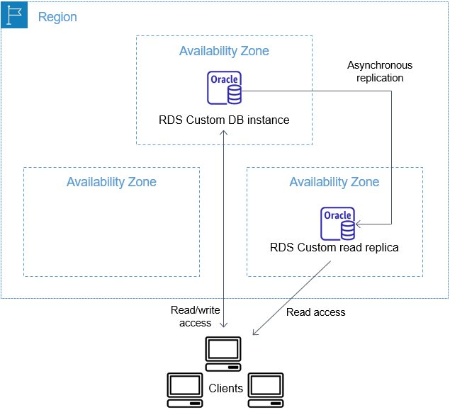

# Working with Oracle replicas for RDS Custom for Oracle

You can create Oracle replicas for RDS Custom for Oracle DB instances that run Oracle Enterprise Edition.
Both container databases (CDBs) and non-CDBs are supported. Standard Edition 2 doesn't
support Oracle Data Guard.

Creating an RDS Custom for Oracle replica is similar to creating an RDS for Oracle replica, but with
important differences. For general information about creating and managing Oracle replicas,
see [Working with DB instance read replicas](USER_ReadRepl.md "USER_ReadRepl.md") and [Working with read replicas for Amazon RDS for Oracle](oracle-read-replicas.md "oracle-read-replicas.md").

###### Topics

- [Overview of RDS Custom for Oracle replication](#custom-rr.overview "#custom-rr.overview")
- [Guidelines and limitations for RDS Custom for Oracle
  replication](custom-rr.md "custom-rr.md")
- [Promoting an RDS Custom for Oracle replica to a standalone DB instance](custom-rr.md "custom-rr.md")
- [Configuring a VPN tunnel between RDS Custom for Oracle
  primary and replica instances](cfo-standby-vpn-tunnel.md "cfo-standby-vpn-tunnel.md")

## Overview of RDS Custom for Oracle replication

The architecture of RDS Custom for Oracle replication is analogous to RDS for Oracle replication. A primary DB instance replicates asynchronously to one
or more Oracle replicas.

### Maximum number of replicas

As with RDS for Oracle, you can create up to five managed Oracle replicas of your
RDS Custom for Oracle primary DB instance. You can also create your own manually configured (external)
Oracle replicas. External replicas don't count toward your DB instance limit. They
also lie outside the RDS Custom support perimeter. For more information about the
support perimeter, see [RDS Custom support
perimeter](custom-concept.md#custom-troubleshooting.support-perimeter "custom-concept.md#custom-troubleshooting.support-perimeter").

### Replica naming convention

Oracle replica names are based on the database unique name. The format is
``DB_UNIQUE_NAME`_`X``,
with letters appended sequentially. For example, if your database unique name is
`ORCL`, the first two replicas are named `ORCL_A` and
`ORCL_B`. The first six letters, A–F, are reserved for RDS Custom.
RDS Custom copies database parameters from your primary DB instance to the replicas. For more
information, see [DB_UNIQUE_NAME](https://docs.oracle.com/database/121/REFRN/GUID-3547C937-5DDA-49FF-A9F9-14FF306545D8.htm#REFRN10242 "https://docs.oracle.com/database/121/REFRN/GUID-3547C937-5DDA-49FF-A9F9-14FF306545D8.htm#REFRN10242") in the Oracle documentation.

### Replica backup retention

By default, RDS Custom Oracle replicas use the same backup retention period as your
primary DB instance. You can modify the backup retention period to 1–35 days.
RDS Custom supports backing up, restoring, and point-in-time recovery (PITR). For more
information about backing up and restoring RDS Custom DB instances, see [Backing up and restoring an Amazon RDS Custom for Oracle DB instance](custom-backup.md "custom-backup.md").

###### Note

While creating a Oracle replica, RDS Custom temporarily pauses the cleanup of redo
log files. In this way, RDS Custom ensures that it can apply these logs to the new
Oracle replica after it becomes available.

### Replica promotion

You can promote managed Oracle replicas in RDS Custom for Oracle using the console,
`promote-read-replica` AWS CLI command, or
`PromoteReadReplica` API. If you delete your primary DB instance, and all
replicas are healthy, RDS Custom for Oracle promotes your managed replicas to standalone
instances automatically. If a replica has paused automation or is outside the
support perimeter, you must fix the replica before RDS Custom can promote it
automatically. You can only promote external Oracle replicas manually.
