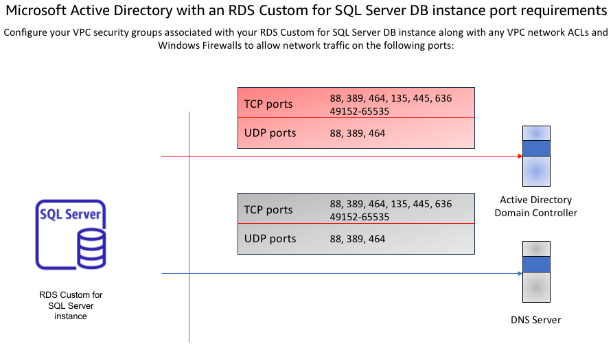

# Network configuration port rules

Make sure that you have met the following network configurations:

- Connectivity configured between the Amazon VPC where you want to create the RDS Custom for SQL Server DB instance to either your self-managed Active Directory or AWS Managed Microsoft AD.
  For self-managed Active Directory, set up
  connectivity using AWS Direct Connect, AWS VPN, VPC peering, or AWS Transit Gateway. For AWS Managed Microsoft AD, set up
  connectivity using VPC peering.
- Make sure that the security group and the VPC network ACLs for the subnet(s) where you're creating your
  RDS Custom for SQL Server DB instance allow traffic on the ports and in the directions shown in the following diagram.

The following table identifies the role of each port.

| Protocol | Ports            | Role                                                               |
| -------- | ---------------- | ------------------------------------------------------------------ |
| TCP/UDP  | 53               | Domain Name System (DNS)                                           |
| TCP/UDP  | 88               | Kerberos authentication                                            |
| TCP/UDP  | 464              | Change/Set password                                                |
| TCP/UDP  | 389              | Lightweight Directory Access Protocol (LDAP)                       |
| TCP      | 135              | Distributed Computing Environment / End Point Mapper (DCE / EPMAP) |
| TCP      | 445              | Directory Services SMB file sharing                                |
| TCP      | 636              | Lightweight Directory Access Protocol over TLS/SSL (LDAPS)         |
| TCP      | 49152 • 65535 | Ephemeral ports for RPC                                            |

- Generally, the domain DNS servers are located in the AD domain controllers.
  You do not need to configure the VPC DHCP option set to use this feature.
  For more information, see [DHCP option sets](../../../vpc/latest/userguide/VPC_DHCP_Options.md "../../../vpc/latest/userguide/VPC_DHCP_Options.md")
  in the _Amazon VPC User Guide_.

###### Important

If you're using VPC network ACLs, you must also allow outbound traffic on dynamic ports (49152-65535)
from your RDS Custom for SQL Server DB instance. Ensure that these traffic rules are also mirrored on the firewalls that apply to each
of the AD domain controllers, DNS servers, and RDS Custom for SQL Server DB instances.

While VPC security groups require ports to be opened only in the direction that network traffic is initiated,
most Windows firewalls and VPC network ACLs require ports to be open in both directions.
