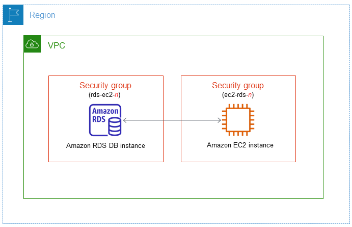
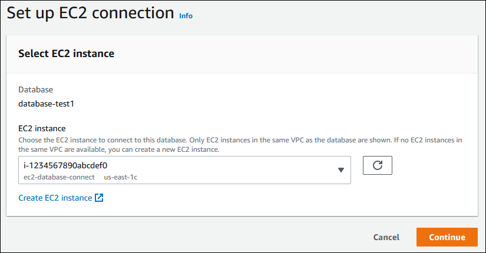
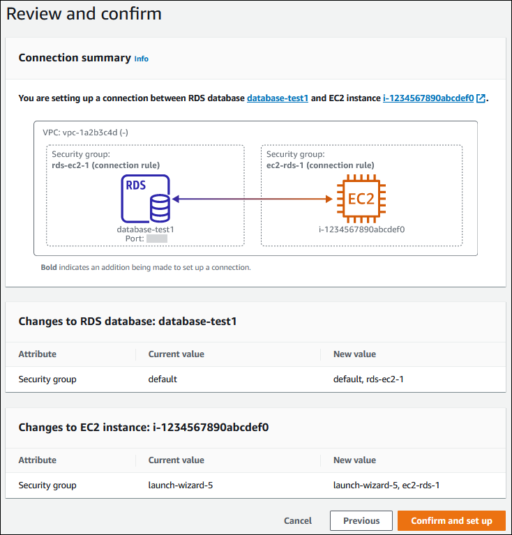
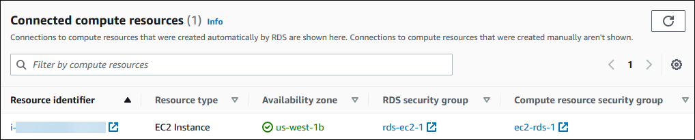

# Automatically connecting an EC2 instance and a

DB instance

You can use the Amazon RDS console to simplify setting up a connection between an Amazon Elastic Compute Cloud (Amazon EC2) instance and
a DB instance. Often, your
DB instance
is in a private subnet and your EC2 instance is in a public subnet
within a VPC. You can use a SQL client on your EC2 instance to connect to your DB instance. The EC2 instance can also run web servers or applications that access
your private DB instance. For instructions on setting up a
connection between an EC2 instance and a Multi-AZ DB cluster, see [Automatically connecting an EC2 instance and a Multi-AZ DB cluster](multiaz-ec2-rds-connect.md "multiaz-ec2-rds-connect.md").

If you want to connect to an EC2 instance that isn't in the same VPC as the DB instance, see the scenarios in [Scenarios for accessing a DB instance in a VPC](USER_VPC.md "USER_VPC.md").

###### Topics

- [Overview of automatic connectivity with an EC2 instance](#ec2-rds-connect-overview "#ec2-rds-connect-overview")
- [Automatically connecting
  an EC2 instance and an RDS database](#ec2-rds-connect-connecting "#ec2-rds-connect-connecting")
- [Viewing connected compute resources](#ec2-rds-connect-viewing "#ec2-rds-connect-viewing")
- [Connecting to a DB instance that is running a specific DB engine](#ec2-rds-Connect-DBEngine "#ec2-rds-Connect-DBEngine")

## Overview of automatic connectivity with an EC2 instance

When you set up a connection between an EC2 instance and an RDS
database, Amazon RDSautomatically configures the
VPC security group for your EC2 instance and for your RDS database.

The following are requirements for connecting an EC2 instance with an RDS
database:

- The EC2 instance must exist in the same VPC as the RDS
  database.

If no EC2 instances exist in the same VPC,
then the console provides
a link to create one.

- The user who sets up connectivity must have permissions to perform the following Amazon EC2 operations:
  - `ec2:AuthorizeSecurityGroupEgress`
  - `ec2:AuthorizeSecurityGroupIngress`
  - `ec2:CreateSecurityGroup`
  - `ec2:DescribeInstances`
  - `ec2:DescribeNetworkInterfaces`
  - `ec2:DescribeSecurityGroups`
  - `ec2:ModifyNetworkInterfaceAttribute`
  - `ec2:RevokeSecurityGroupEgress`

If the DB instance and EC2 instance are in different Availability Zones, your
account may incur cross-Availability Zone costs.

When you set up a connection to an EC2 instance, Amazon RDS acts
according to the current configuration of the security groups associated with the RDS database and EC2 instance, as
described in the following table.

| Current RDS security group configuration                                                                                                                                                                                                                                                                                                                                                                                                                                                                                                                                                                                                                                                                                            | Current EC2 security group configuration                                                                                                                                                                                                                                                                                                                                                                                                                                                                                                                                                                                             | RDS action                                                                                                                                                                                                                                         |
| ----------------------------------------------------------------------------------------------------------------------------------------------------------------------------------------------------------------------------------------------------------------------------------------------------------------------------------------------------------------------------------------------------------------------------------------------------------------------------------------------------------------------------------------------------------------------------------------------------------------------------------------------------------------------------------------------------------------------------------- | ------------------------------------------------------------------------------------------------------------------------------------------------------------------------------------------------------------------------------------------------------------------------------------------------------------------------------------------------------------------------------------------------------------------------------------------------------------------------------------------------------------------------------------------------------------------------------------------------------------------------------------ | -------------------------------------------------------------------------------------------------------------------------------------------------------------------------------------------------------------------------------------------------- |
| There are one or more security groups associated with the RDS database with a name that matches the pattern `rds-ec2-`n`(where`n`` is a number). A security group that matches the pattern hasn't been modified. This security group has only one inbound rule with the VPC security group of the EC2 instance as the source.                                                                                                                                                                                                                                                                                                                                                                                           | There are one or more security groups associated with the EC2 instance with a name that matches the pattern `ec2-rds-`n` (where `n`` is a number). A security group that matches the pattern hasn't been modified. This security group has only one outbound rule with the VPC security group of the RDS database as the source.                                                                                                                                                                                                                                                                                   | RDS takes no action. A connection was already configured automatically between the EC2 instance and RDS database. Because a connection already exists between the EC2 instance and the RDS database, the security groups aren't modified. |
| Either of the following conditions apply: • There is no security group associated with the RDS database with a name that matches the pattern `rds-ec2-`n``. • There are one or more security groups associated with the RDS database with a name that matches the pattern `rds-ec2-`n``. However, Amazon RDS can't use any of these security groups for the connection with the EC2 instance. Amazon RDS can't use a security group that doesn't have one inbound rule with the VPC security group of the EC2 instance as the source. Amazon RDS also can't use a security group that has been modified. Examples of modifications include adding a rule or changing the port of an existing rule. | Either of the following conditions apply: • There is no security group associated with the EC2 instance with a name that matches the pattern `ec2-rds-`n``. • There are one or more security groups associated with the EC2 instance with a name that matches the pattern `ec2-rds-`n``. However, Amazon RDS can't use any of these security groups for the connection with the RDS database. Amazon RDS can't use a security group that doesn't have one outbound rule with the VPC security group of the RDS database as the source. Amazon RDS also can't use a security group that has been modified. | [RDS action: create new security groups](#rds-action-create-new-security-groups "#rds-action-create-new-security-groups")                                                                                                                          |
| There are one or more security groups associated with the RDS database with a name that matches the pattern `rds-ec2-`n``. A security group that matches the pattern hasn't been modified. This security group has only one inbound rule with the VPC security group of the EC2 instance as the source.                                                                                                                                                                                                                                                                                                                                                                                                                 | There are one or more security groups associated with the EC2 instance with a name that matches the pattern `ec2-rds-`n``. However, Amazon RDS can't use any of these security groups for the connection with the RDS database. Amazon RDS can't use a security group that doesn't have one outbound rule with the VPC security group of the RDS database as the source. Amazon RDS also can't use a security group that has been modified.                                                                                                                                                                        | [RDS action: create new security groups](#rds-action-create-new-security-groups "#rds-action-create-new-security-groups")                                                                                                                          |
| There are one or more security groups associated with the RDS database with a name that matches the pattern `rds-ec2-`n``. A security group that matches the pattern hasn't been modified. This security group has only one inbound rule with the VPC security group of the EC2 instance as the source.                                                                                                                                                                                                                                                                                                                                                                                                                 | A valid EC2 security group for the connection exists, but it is not associated with the EC2 instance. This security group has a name that matches the pattern `ec2-rds-`n``. It hasn't been modified. It has only one outbound rule with the VPC security group of the RDS database as the source.                                                                                                                                                                                                                                                                                                                          | [RDS action: associate EC2 security group](#rds-action-associate-ec2-security-group "#rds-action-associate-ec2-security-group")                                                                                                                    |
| Either of the following conditions apply: • There is no security group associated with the RDS database with a name that matches the pattern `rds-ec2-`n``. • There are one or more security groups associated with the RDS database with a name that matches the pattern `rds-ec2-`n``. However, Amazon RDS can't use any of these security groups for the connection with the EC2 instance. Amazon RDS can't use a security group that doesn't have one inbound rule with the VPC security group of the EC2 instance as the source. Amazon RDS also can't use security group that has been modified.                                                                                             | There are one or more security groups associated with the EC2 instance with a name that matches the pattern `ec2-rds-`n``. A security group that matches the pattern hasn't been modified. This security group has only one outbound rule with the VPC security group of the RDS database as the source.                                                                                                                                                                                                                                                                                                              | [RDS action: create new security groups](#rds-action-create-new-security-groups "#rds-action-create-new-security-groups")                                                                                                                          |

###### RDS

action: create new security groups

Amazon RDS takes the following actions:

- Creates a new security group that matches the pattern `rds-ec2-`n``.
  This security group has an inbound rule with the VPC security group of the EC2 instance as the source. This
  security group is associated with the RDS database and allows the EC2 instance to access the RDS database.
- Creates a new security group that matches the pattern
  `ec2-rds-`n``. This security group has an outbound
  rule with the VPC security group of the RDS
  database as the target. This
  security group is associated with the EC2 instance and allows the EC2 instance to send
  traffic to the RDS database.

######

RDS action: associate EC2 security group

Amazon RDS
associates the valid, existing EC2 security group with the EC2 instance. This security group allows the EC2
instance to send traffic to the RDS database.

## Automatically connecting

an EC2 instance and an RDS database

Before setting up a connection between an EC2 instance and an RDS
database, make sure you meet the
requirements described in [Overview of automatic connectivity with an EC2 instance](#ec2-rds-connect-overview "#ec2-rds-connect-overview").

If you make changes to security groups after you configure connectivity, the changes might affect
the connection between the EC2 instance and the RDS
database.

###### Note

You can only set up a connection between an EC2 instance and an RDS
database automatically by using the
AWS Management Console. You can't set up a connection automatically with the AWS CLI or RDS API.

###### To connect an EC2 instance and an RDS

database automatically

1. Sign in to the AWS Management Console and open the Amazon RDS console at
   [https://console.aws.amazon.com/rds/](https://console.aws.amazon.com/rds/ "https://console.aws.amazon.com/rds/").
2. In the navigation pane, choose **Databases**, and then choose the
   RDS database.
3. From **Actions**, choose **Set up EC2
   connection**.

The **Set up EC2 connection** page appears. 4. On the **Set up EC2 connection** page, choose the EC2 instance.

If no EC2 instances exist in the same VPC, choose **Create EC2 instance**
to create one. In this case, make sure the new EC2 instance is in the same VPC as the
RDS database. 5. Choose **Continue**.

The **Review and confirm** page appears.

 6. On the **Review and confirm** page, review the changes that RDS will make to
set up connectivity with the EC2 instance.

If the changes are correct, choose **Confirm and set up**.

If the changes aren't correct, choose **Previous** or **Cancel**.

## Viewing connected compute resources

You can use the AWS Management Console to view the compute resources that are connected to an
RDS database. The resources shown include compute resource connections that were set
up automatically. You can set up connectivity with compute resources automatically in the
following ways:

- You can select the compute resource when you create the database.

For more information, see [Creating an Amazon RDS DB instance](USER_CreateDBInstance.md "USER_CreateDBInstance.md") and [Creating a Multi-AZ DB cluster for Amazon RDS](create-multi-az-db-cluster.md "create-multi-az-db-cluster.md").

- You can set up connectivity between an existing database and a compute resource.

For more information, see [Automatically connecting
an EC2 instance and an RDS database](#ec2-rds-connect-connecting "#ec2-rds-connect-connecting").

The listed compute resources don't include ones that were connected to the database manually. For example,
you can allow a compute resource to access a database manually by adding a rule to the VPC security group
associated with the database.

For a compute resource to be listed, the following conditions must apply:

- The name of the security group associated with the compute resource matches the pattern
  `ec2-rds-`n`(where`n`` is a number).
- The security group associated with the compute resource has an outbound rule
  with the port range set to the port that the RDS
  database uses.
- The security group associated with the compute resource has an outbound rule with the source
  set to a security group associated with the
  RDS database.
- The name of the security group associated with the RDS
  database matches the
  pattern `rds-ec2-`n`(where`n`` is a number).
- The security group associated with the RDS
  database has an inbound
  rule with the port range set to the port that the RDS
  database uses.
- The security group associated with the
  RDS database
  has an inbound rule with the source set to a security group associated with the compute resource.

###### To view compute resources connected to an RDS

database

1. Sign in to the AWS Management Console and open the Amazon RDS console at
   [https://console.aws.amazon.com/rds/](https://console.aws.amazon.com/rds/ "https://console.aws.amazon.com/rds/").
2. In the navigation pane, choose **Databases**, and then choose the name of the
   RDS database.
3. On the **Connectivity & security** tab, view the compute resources in the
   **Connected compute resources**.

## Connecting to a DB instance that is running a specific DB engine

For information about connecting to a DB instance that is running a specific DB
engine, follow the instructions for your DB engine:

- [Connecting to your MariaDB DB instance](USER_ConnectToMariaDBInstance.md "USER_ConnectToMariaDBInstance.md")
- [Connecting to your Microsoft SQL Server
  DB instance](USER_ConnectToMicrosoftSQLServerInstance.md "USER_ConnectToMicrosoftSQLServerInstance.md")
- [Connecting to your MySQL DB instance](USER_ConnectToInstance.md "USER_ConnectToInstance.md")
- [Connecting to your Oracle DB instance](USER_ConnectToOracleInstance.md "USER_ConnectToOracleInstance.md")
- [Connecting to a DB instance running the
  PostgreSQL database engine](USER_ConnectToPostgreSQLInstance.md "USER_ConnectToPostgreSQLInstance.md")
