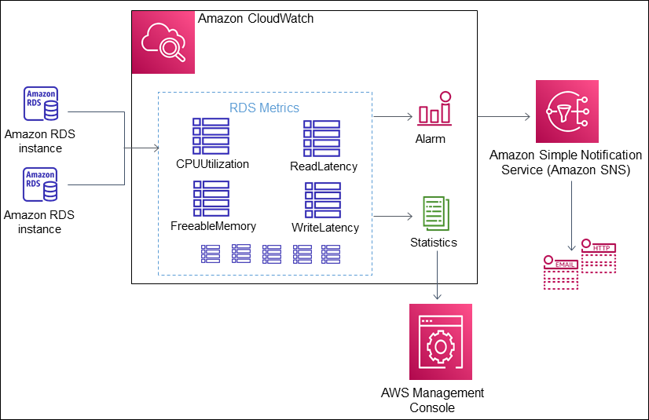

# Monitoring Amazon RDS metrics with Amazon CloudWatch

Amazon CloudWatch is a metrics repository. The repository collects and processes raw data from
Amazon RDS into readable,
near real-time metrics. For a complete list of Amazon RDS metrics
sent to CloudWatch, see
[Metrics reference for Amazon RDS](../../../en_us/AmazonRDS/latest/UserGuide/metrics-reference.md "../../../en_us/AmazonRDS/latest/UserGuide/metrics-reference.md").

To analyze and troubleshoot the performance of your databases at scale, use [CloudWatch Database Insights](USER_DatabaseInsights.md "USER_DatabaseInsights.md").

###### Topics

- [Overview of Amazon RDS and Amazon CloudWatch](#cw-metrics-overview "#cw-metrics-overview")
- [Viewing DB instance metrics in the CloudWatch console and AWS CLI](metrics_dimensions.md "metrics_dimensions.md")
- [Creating CloudWatch alarms to monitor Amazon RDS](creating_alarms.md "creating_alarms.md")
- [Tutorial: Creating an Amazon CloudWatch alarm for Multi-AZ DB cluster replica lag for Amazon RDS](multi-az-db-cluster-cloudwatch-alarm.md "multi-az-db-cluster-cloudwatch-alarm.md")

## Overview of Amazon RDS and Amazon CloudWatch

By default, Amazon RDS automatically sends metric data to
CloudWatch in 1-minute periods. For example, the `CPUUtilization` metric records the percentage of CPU utilization for a DB instance over
time. Data points with a period of 60 seconds (1 minute) are available for 15 days. This means that you can access historical information and
see how your web application or service is performing.

For information about monitoring database load in CloudWatch, see [Monitoring Amazon RDS databases with CloudWatch Database Insights](USER_DatabaseInsights.md "USER_DatabaseInsights.md").

As shown in the following diagram, you can set up alarms for your CloudWatch metrics. For example, you might create an alarm that signals when the
CPU utilization for an instance is over 70%. You can configure Amazon Simple Notification Service to email you when the threshold is passed.

Amazon RDS publishes the following types of metrics to Amazon CloudWatch:

- Metrics for your RDS DB instances

For a table of these metrics, see [Amazon CloudWatch metrics for Amazon RDS](rds-metrics.md "rds-metrics.md").

- Detailed per-query and database counter metrics (exposed through the Performance Insights API)

For a table of these metrics, see [Amazon CloudWatch metrics for Amazon RDS Performance Insights](USER_PerfInsights.Cloudwatch.md "USER_PerfInsights.Cloudwatch.md") and
[Detailed Database Metrics](USER_PerfInsights_Counters.md "USER_PerfInsights_Counters.md").

- Enhanced Monitoring metrics (published to Amazon CloudWatch Logs)

For a table of these metrics, see [OS metrics in Enhanced Monitoring](USER_Monitoring-Available-OS-Metrics.md "USER_Monitoring-Available-OS-Metrics.md").

- Usage metrics for the Amazon RDS service quotas in your AWS account

For a table of these metrics, see [Amazon CloudWatch usage metrics for Amazon RDS](rds-metrics.md#rds-metrics-usage "rds-metrics.md#rds-metrics-usage"). For more information about
Amazon RDS quotas, see [Quotas and constraints for Amazon RDS](CHAP_Limits.md "CHAP_Limits.md").

For more information about CloudWatch, see [What is Amazon CloudWatch?](../../../AmazonCloudWatch/latest/DeveloperGuide/WhatIsCloudWatch.md "../../../AmazonCloudWatch/latest/DeveloperGuide/WhatIsCloudWatch.md") in the
_Amazon CloudWatch User Guide_. For more information about CloudWatch metrics retention, see [Metrics retention](../../../AmazonCloudWatch/latest/DeveloperGuide/cloudwatch_concepts.md#metrics-retention "../../../AmazonCloudWatch/latest/DeveloperGuide/cloudwatch_concepts.md#metrics-retention").
