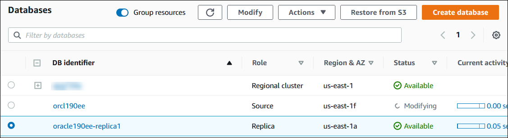
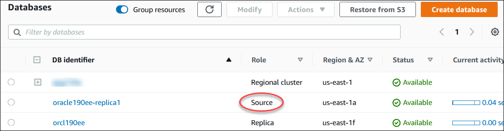

# Initiating the Oracle Data Guard switchover

You can switch over an RDS for Oracle read replica to the primary role, and the former primary DB instance to a replica role.

###### To switch over an Oracle read replica to the primary DB role

1. Sign in to the AWS Management Console and open the Amazon RDS console at
   [https://console.aws.amazon.com/rds/](https://console.aws.amazon.com/rds/ "https://console.aws.amazon.com/rds/").
2. In the Amazon RDS console, choose **Databases**.

The **Databases** pane appears. Each read replica shows
**Replica** in the **Role**
column. 3. Choose the read replica that you want to switch over to the primary role. 4. For **Actions**, choose **Switch over replica**. 5. Choose **I acknowledge**. Then choose **Switch over replica**. 6. On the **Databases** page, monitor the progress of the switchover.



When the switchover completes, the role of the switchover target changes from **Replica** to
**Source**.


To switch over an Oracle replica to the primary DB role, use the AWS CLI [`switchover-read-replica`](../../../cli/latest/reference/rds/switchover-read-replica.md "../../../cli/latest/reference/rds/switchover-read-replica.md") command. The following examples make the Oracle replica named
`replica-to-be-made-primary` into the new primary database.

###### Example

For Linux, macOS, or Unix:

```
aws rds switchover-read-replica \
    --db-instance-identifier `replica-to-be-made-primary`
```

For Windows:

```
aws rds switchover-read-replica ^
    --db-instance-identifier `replica-to-be-made-primary`
```

To switch over an Oracle replica to the primary DB role, call the Amazon RDS API [`SwitchoverReadReplica`](../APIReference/API_SwitchoverReadReplica.md "../APIReference/API_SwitchoverReadReplica.md") operation with the required parameter `DBInstanceIdentifier`. This parameter
specifies the name of the Oracle replica that you want to assume the primary DB role.
