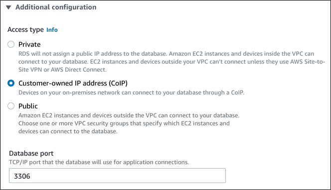

# Customer-owned IP addresses for Amazon RDS on AWS Outposts

Amazon RDS on AWS Outposts uses information that you provide about your on-premises network to create
an address pool. This pool is known as a _customer-owned IP address
pool_ (CoIP pool). _Customer-owned IP
addresses_ (CoIPs) provide local or external connectivity to resources in your
Outpost subnets through your on-premises network. For more information about CoIPs, see

[Customer-owned IP
addresses](../../../outposts/latest/userguide/routing.md#ip-addressing "../../../outposts/latest/userguide/routing.md#ip-addressing") in the _AWS Outposts User Guide_.

Each RDS on Outposts DB instance has a private IP address for traffic inside its virtual
private cloud (VPC). This private IP address isn't publicly accessible. You can use the
**Public** option to set whether the DB instance also has a public IP
address in addition to the private IP address. Using the public IP address for connections
routes them through the internet and can result in high latencies in some cases.

Instead of using these private and public IP addresses, RDS on Outposts supports using
CoIPs for DB instances through their subnets. When you use a CoIP for an RDS on Outposts DB
instance, you connect to the DB instance with the DB instance endpoint. RDS on Outposts then
automatically uses the CoIP for all connections from both inside and outside of the
VPC.

CoIPs can provide the following benefits for RDS on Outposts DB instances:

- Lower connection latency
- Enhanced security

## Using CoIPs

You can turn CoIPs on or off for an RDS on Outposts DB instance using the AWS Management Console, the AWS CLI, or the RDS API:

- With the AWS Management Console, choose the **Customer-owned IP address (CoIP)** setting in **Access
  type** to use CoIPs. Choose one of the other settings to turn them off.

- With the AWS CLI, use the `--enable-customer-owned-ip | --no-enable-customer-owned-ip` option.
- With the RDS API, use the `EnableCustomerOwnedIp` parameter.

You can turn CoIPs on or off when you perform any of the following actions:

- Create a DB instance

For more information, see [Creating DB instances for Amazon RDS on AWS Outposts](rds-on-outposts.md "rds-on-outposts.md").

- Modify a DB instance

For more information, see [Modifying an Amazon RDS DB instance](Overview.DBInstance.md "Overview.DBInstance.md").

- Create a read replica

For more information, see [Creating read replicas for Amazon RDS on AWS Outposts](rds-on-outposts.md "rds-on-outposts.md").

- Restore a DB instance from a snapshot

For more information, see [Restoring to a DB instance](USER_RestoreFromSnapshot.md "USER_RestoreFromSnapshot.md").

- Restore a DB instance to a specified time

For more information, see [Restoring a DB instance to a specified time for Amazon RDS](USER_PIT.md "USER_PIT.md").

###### Note

In some cases, you might turn on CoIPs for a DB instance but Amazon RDS isn't able to
allocate a CoIP for the DB instance. In such cases, the DB instance status is
changed to **incompatible-network**. For more information about the
DB instance status, see [Viewing Amazon RDS DB instance status](accessing-monitoring.md#Overview.DBInstance.Status "accessing-monitoring.md#Overview.DBInstance.Status").

## Limitations

The following limitations apply to CoIP support for RDS on Outposts DB instances:

- When using a CoIP for a DB instance, make sure that public accessibility is turned off for that DB instance.
- Make sure that the inbound rules for your VPC security groups include the CoIP address range (CIDR block). For more
  information about setting up security groups, see [Provide access to your DB instance in your VPC by
  creating a security group](CHAP_SettingUp.md#CHAP_SettingUp.SecurityGroup "CHAP_SettingUp.md#CHAP_SettingUp.SecurityGroup").
- You can't assign a CoIP from a CoIP pool to a DB instance. When you use a CoIP for a DB instance, Amazon RDS
  automatically assigns a CoIP from a CoIP pool to the DB instance.
- You must use the AWS account that owns the Outpost resources (owner) or
  share the following resources with other AWS accounts (consumers) in the same
  organization:

      + The Outpost
      + The local gateway (LGW) route table for the DB instance's VPC
      + The CoIP pool or pools for the LGW route table

  For more information, see [Working
  with shared AWS Outposts resources](../../../outposts/latest/userguide/sharing-outposts.md "../../../outposts/latest/userguide/sharing-outposts.md") in the _AWS Outposts User Guide_.
