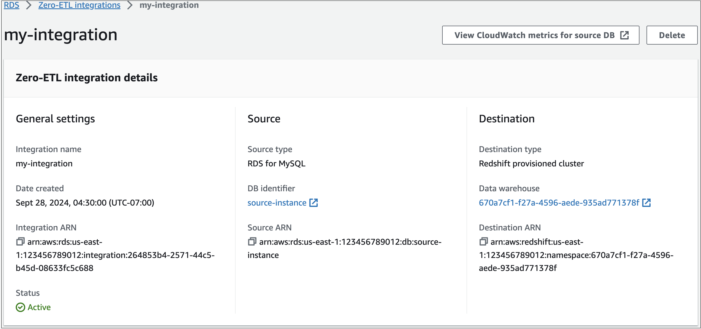

# Viewing and monitoring Amazon RDS

zero-ETL integrations

You can view the details of an Amazon RDS zero-ETL integration to see its configuration
information and current status. You can also monitor the status of your integration by
querying specific system views in Amazon Redshift. In addition, Amazon Redshift publishes certain
integration-related metrics to Amazon CloudWatch, which you can view within the Amazon Redshift console.

###### Topics

- [Viewing integrations](#zero-etl.describing "#zero-etl.describing")
- [Monitoring integrations using system tables for Amazon Redshift](#zero-etl.monitoring "#zero-etl.monitoring")
- [Monitoring integrations with Amazon EventBridge for Amazon Redshift](#zero-etl.eventbridge "#zero-etl.eventbridge")

## Viewing integrations

You can view Amazon RDS zero-ETL integrations using the AWS Management Console, the AWS CLI, or the RDS
API.

###### To view the details of a zero-ETL integration

1. Sign in to the AWS Management Console and open the Amazon RDS console at
   [https://console.aws.amazon.com/rds/](https://console.aws.amazon.com/rds/ "https://console.aws.amazon.com/rds/").
2. From the left navigation pane, choose **Zero-ETL integrations**.
3. Select an integration to view more details about it, such as its source
   database and target data warehouse.


An integration can have the following statuses:

- `Creating` – The integration is being created.
- `Active` – The integration is sending transactional data to the target data
  warehouse.
- `Syncing` – The integration has encountered a recoverable error and is
  reseeding data. Affected tables aren't available for querying until they finish resyncing.
- `Needs attention` – The integration encountered an
  event or error that requires manual intervention to resolve it. To fix
  the issue, follow the instructions in the error message on the integration
  details page.
- `Failed` – The integration encountered an unrecoverable
  event or error that can't be fixed. You must delete and recreate the
  integration.
- `Deleting` – The integration is being deleted.
  To view all zero-ETL integrations in the current account using the AWS CLI, use the
  [describe-integrations](../../../cli/latest/reference/rds/describe-integrations.md "../../../cli/latest/reference/rds/describe-integrations.md") command and specify the
  `--integration-identifier` option.

For Linux, macOS, or Unix:

```
aws rds describe-integrations \
    --integration-identifier `ee605691-6c47-48e8-8622-83f99b1af374`
```

For Windows:

```
aws rds describe-integrations ^
    --integration-identifier `ee605691-6c47-48e8-8622-83f99b1af374`
```

To view zero-ETL integration using the Amazon RDS API, use the [`DescribeIntegrations`](../APIReference/API_DescribeIntegrations.md "../APIReference/API_DescribeIntegrations.md") operation with the
`IntegrationIdentifier` parameter.

## Monitoring integrations using system tables for Amazon Redshift

Amazon Redshift has system tables and views that contain information about how the system is
functioning. You can query these system tables and views the same way that you would
query any other database table. For more information about system tables and views in
Amazon Redshift, see [System tables and views
reference](../../../redshift/latest/dg/cm_chap_system-tables.md "../../../redshift/latest/dg/cm_chap_system-tables.md") in the _Amazon Redshift Database Developer Guide_.

You can query the following system views and tables to get information about your
zero-ETL integrations:

- [SVV_INTEGRATION](../../../redshift/latest/dg/r_SVV_INTEGRATION.md "../../../redshift/latest/dg/r_SVV_INTEGRATION.md") –
  Provides configuration details for your integrations.
- [SVV_INTEGRATION_TABLE_STATE](../../../redshift/latest/dg/r_SVV_INTEGRATION_TABLE_STATE.md "../../../redshift/latest/dg/r_SVV_INTEGRATION_TABLE_STATE.md") – Describes
  the state of each table within an integration.
- [SYS_INTEGRATION_TABLE_STATE_CHANGE](../../../redshift/latest/dg/r_SYS_INTEGRATION_TABLE_STATE_CHANGE.md "../../../redshift/latest/dg/r_SYS_INTEGRATION_TABLE_STATE_CHANGE.md") – Displays table state
  change logs for an integration.
- [SYS_INTEGRATION_ACTIVITY](../../../redshift/latest/dg/r_SYS_INTEGRATION_ACTIVITY.md "../../../redshift/latest/dg/r_SYS_INTEGRATION_ACTIVITY.md") – Provides information about
  completed integration runs.

All integration-related Amazon CloudWatch metrics originate from Amazon Redshift. For more information, see
[Metrics for
zero-ETL integrations](../../../redshift/latest/mgmt/zero-etl-using.md "../../../redshift/latest/mgmt/zero-etl-using.md") in the _Amazon Redshift Management Guide_.
Currently, Amazon RDS doesn't publish any integration metrics to CloudWatch.

## Monitoring integrations with Amazon EventBridge for Amazon Redshift

Amazon Redshift send integration-related events to Amazon EventBridge. For a list of events and their
corresponding event IDs, see [Zero-ETL integration event notifications with Amazon EventBridge](../../../redshift/latest/mgmt/integration-event-notifications.md "../../../redshift/latest/mgmt/integration-event-notifications.md") in the _Amazon Redshift
Management Guide_.
