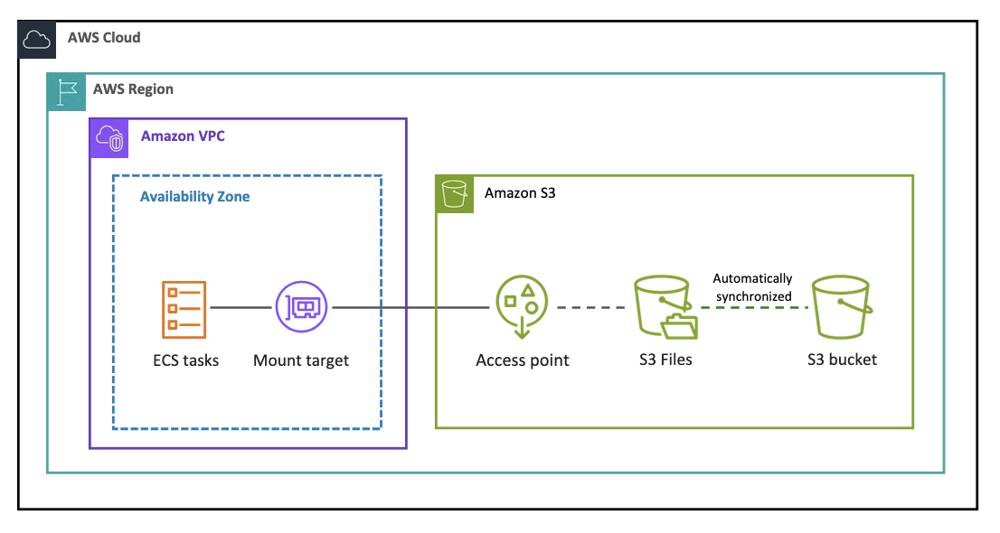

# Mounting S3 file systems on Amazon ECS

You can attach an S3 file system to an Amazon ECS task definition and then deploy the task
to access your S3 data from your containers.

In Amazon ECS, S3 Files volume support is available for AWS Fargate and ECS Managed
Instances at General Availability. S3 Files volumes are not supported on the Amazon EC2
launch type. If you configure an S3 Files volume in a task definition and attempt to run it
on the EC2 launch type, the task will fail.

## Prerequisites

Before you attach an S3 file system to an ECS task, make sure that you have the
following:

- You have an S3 file system with at least one mount target in available
  state.
- The ECS task must be in the same VPC as the mount
  target.
- Add the permissions to your ECS task IAM role to access S3 file systems.
  For details, see [IAM role for attaching your file system to AWS compute resources](s3-files-prereq-policies.md#s3-files-prereq-iam-compute-role "s3-files-prereq-policies.md#s3-files-prereq-iam-compute-role").
- You have configured the required [Security groups](s3-files-prereq-policies.md#s3-files-prereq-security-groups "s3-files-prereq-policies.md#s3-files-prereq-security-groups").

## How to mount your S3 file system on an ECS task

- On the S3 Console, choose **File
  systems** in the left navigation pane.
- Select the file system you want to mount.
- In the **Overview** tab, choose **Attach** under **Attach to an ECS
  task**.
- Select your desired ECS task definition from the drop
  down.
- Specify the local mount path.
- You can optionally specify an access point, a root directory, and a
  transit encryption port.
- Once the file system is attached in the task definition, you can start a task
  using this task definition in following ways:
  - You can deploy the task as a standalone, one-time run. For
    details, see [Running an application as an Amazon ECS task](../../../AmazonECS/latest/developerguide/standalone-task-create.md "../../../AmazonECS/latest/developerguide/standalone-task-create.md") in the
    _Amazon ECS Developer
    Guide_.
  - You can also deploy the task definition as a service. For
    details, see [View
    service history using Amazon ECS service deployments](../../../AmazonECS/latest/developerguide/service-deployment.md "../../../AmazonECS/latest/developerguide/service-deployment.md") in the
    _Amazon ECS Developer
    Guide_.

For details, see [Using S3 file system
storage with Amazon ECS](../../../AmazonECS/latest/developerguide/s3files-volumes.md "../../../AmazonECS/latest/developerguide/s3files-volumes.md").

You can monitor your file system storage, performance, client connections, and
synchronization errors using [Amazon
CloudWatch](s3-files-monitoring-cloudwatch.md "s3-files-monitoring-cloudwatch.md").
