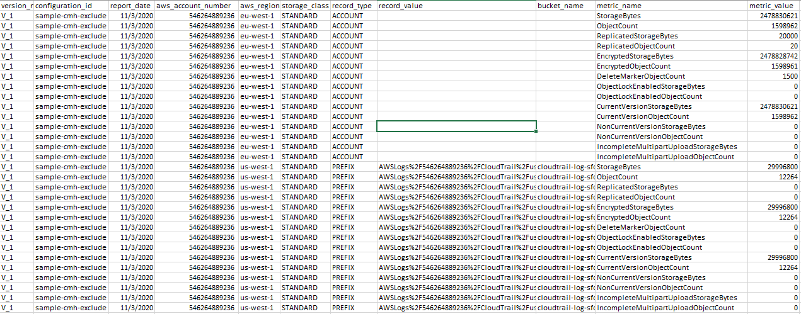
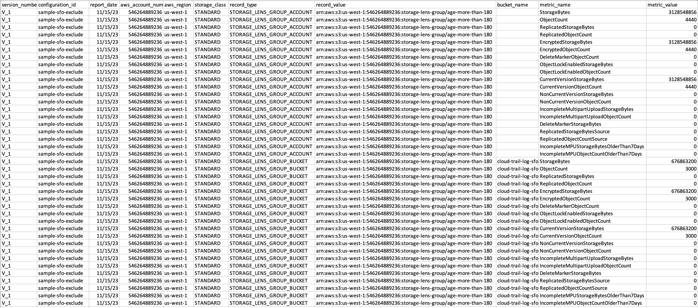

# Understanding the

Amazon S3 Storage Lens export schema

The following table contains the schema of your S3 Storage Lens metrics export.

| Attribute name     | Data type | Column name          | Description                                                                    |
| ------------------ | --------- | -------------------- | ------------------------------------------------------------------------------ | -------------------------------------------------------------------------------------------------------------------------------------------------------------------------------------------------------------------------------------------------------------------------------------------------------------------------------------------------------------------------------------------------------------------------------------------------------------------------------------------------------------------------------------------------------------------------------------------------------------------------------------------------------------------------------------------------------------------------------------------------------------------------------------------------------------------------- |
| `VersionNumber`    | String    | `version_number`     | The version of the S3 Storage Lens metrics being used.                         |
| `ConfigurationId`  | String    | `configuration_id`   | The `configuration_id` of your S3 Storage Lens configuration.                  |
| `ReportDate`       | String    | `report_date`        | The date that the metrics were tracked.                                        |
| `AwsAccountNumber` | String    | `aws_account_number` | Your AWS account number.                                                       |
| `AwsRegion`        | String    | `aws_region`         | The AWS Region for which the metrics are being tracked.                        |
| `StorageClass`     | String    | `storage_class`      | The storage class of the bucket in question.                                   |
| `RecordType`       | ENUM      | `record_type`        | The type of artifact that is being reported (ACCOUNT, BUCKET, or PREFIX).      |
| `RecordValue`      | String    | `record_value`       | The value of the `RecordType` artifact. NoteThe `record_value` is URL-encoded. |
| `BucketName`       | String    | `bucket_name`        | The name of the bucket that is being reported.                                 |
| `MetricName`       | String    | `metric_name`        | The name of the metric that is being reported.                                 |
| `MetricValue`      | Long      | `metric_value`       | The value of the metric that is being reported.                                | ## Example of an S3 Storage Lens metrics export The following is an example of an S3 Storage Lens metrics export based on this schema. ###### Note You can identify metrics for Storage Lens groups by looking for the `STORAGE_LENS_GROUP_BUCKET` or `STORAGE_LENS_GROUP_ACCOUNT` values in the `record_type` column. The `record_value` column will display the Amazon Resource Name (ARN) for the Storage Lens group, for example, `arn:aws:s3:us-east-1:123456789012:storage-lens-group/slg-1`.  The following is an example of an S3 Storage Lens metrics export with Storage Lens groups data.  |
