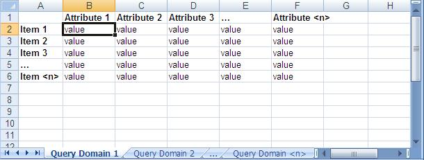

# Data Model

When using Amazon SimpleDB, you organize your structured data in domains within which you can put
data, get data, or run queries.

Domains consist of items which are described by _attribute_ name-value
pairs. Consider the spreadsheet model shown in the following
image.

The components correspond to each part of a spreadsheet:

- Customer Account—Represented by the entire
  spreadsheet, it refers to the Amazon Web Services _account_ to
  which all domains are assigned.
- Domains—Represented by the domain worksheet
  tabs at the bottom of the spreadsheet, domains are similar to tables that contain
  similar data.

You can execute queries against a domain, but cannot execute queries across
different domains.

- Items—Represented by rows, items represent
  individual objects that contain one or more attribute name-value pairs.
- Attributes—Represented by columns,
  attributes represent categories of data that can be assigned to items.
- Values—Represented by cells, values
  represent instances of attributes for items. An attribute can have multiple
  values.
  Unlike a spreadsheet, however, multiple values can be associated with a cell. For example,
  an item can have both the color value _red_ and _blue_.
  Additionally, Amazon SimpleDB does not require the presence of specific attributes. You can create a
  single domain that contains completely different product types. For example, the following
  table contains clothing, automotive parts, and motorcycle parts.

| ID      | Category                   | Subcat.   | Name              | Color              | Size                 | Make   | Model |
| ------- | -------------------------- | --------- | ----------------- | ------------------ | -------------------- | ------ | ----- | ------------------------------------------------------------------------------------------------------------------------ |
| Item_01 | Clothes                    | Sweater   | Cathair Sweater   | Siamese            | Small, Medium, Large |        |       |
| Item_02 | Clothes                    | Pants     | Designer Jeans    | Paisley Acid Wash  | 30x32, 32x32, 32x34  |        |       |
| Item_03 | Clothes                    | Pants     | Sweatpants        | Blue, Yellow, Pink | Large                |        |       |
| Item_04 | Car Parts                  | Engine    | Turbos            |                    |                      | Audi   | S4    |
| Item_05 | Car Parts                  | Emissions | 02 Sensor         |                    |                      | Audi   | S4    |
| Item_06 | Motorcycle Parts           | Bodywork  | Fender Eliminator | Blue               |                      | Yamaha | R1    |
| Item_07 | Motorcycle Parts, Clothing | Clothing  | Leather Pants     | Black              | Small, Medium, Large |        |       | Regardless of how you store your data, Amazon SimpleDB automatically indexes your data for quick and accurate retrieval. |
