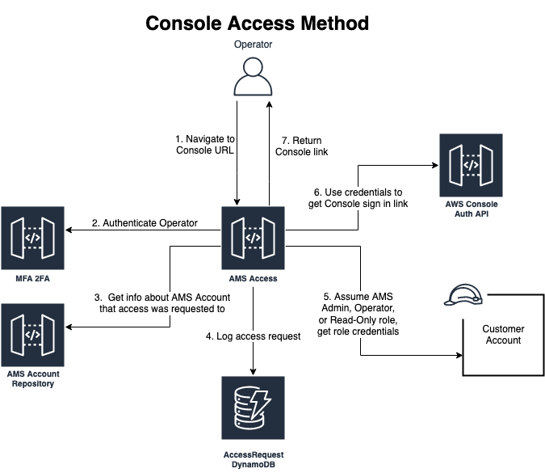

# Access management for EDI

To protect your resources, access management allows only authorized and authenticated access.

ECO operators can access your account console and instances only in certain circumstances. The following graphic shows the authentication process that
ECO operators complete before they can log into the AWS console for an EDI account.

For more information about access management, see
[Access management in AMS Accelerate](../../../managedservices/latest/accelerate-guide/acc-access.md "../../../managedservices/latest/accelerate-guide/acc-access.md")
in the _AMS Accelerate User Guide_.
