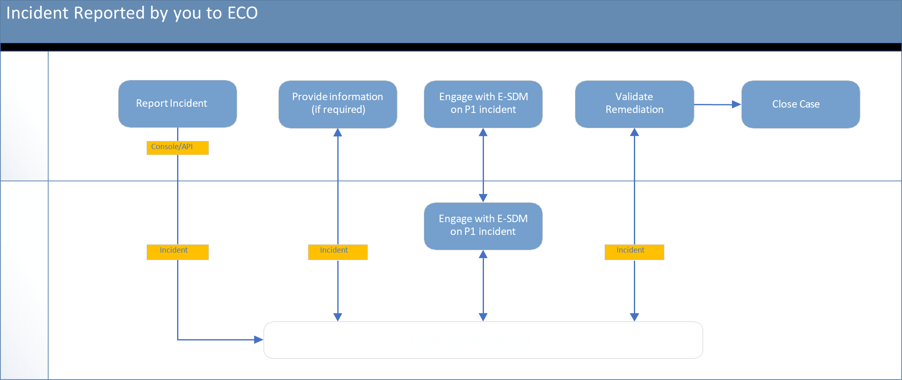
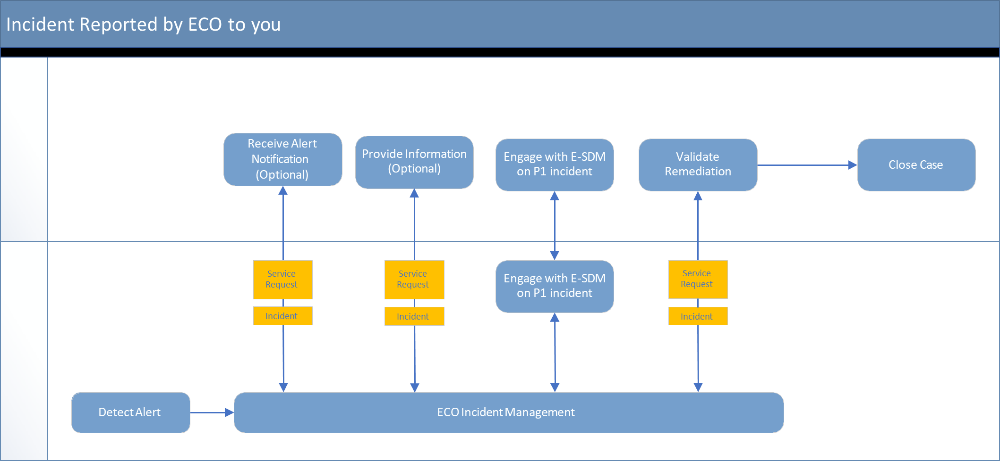
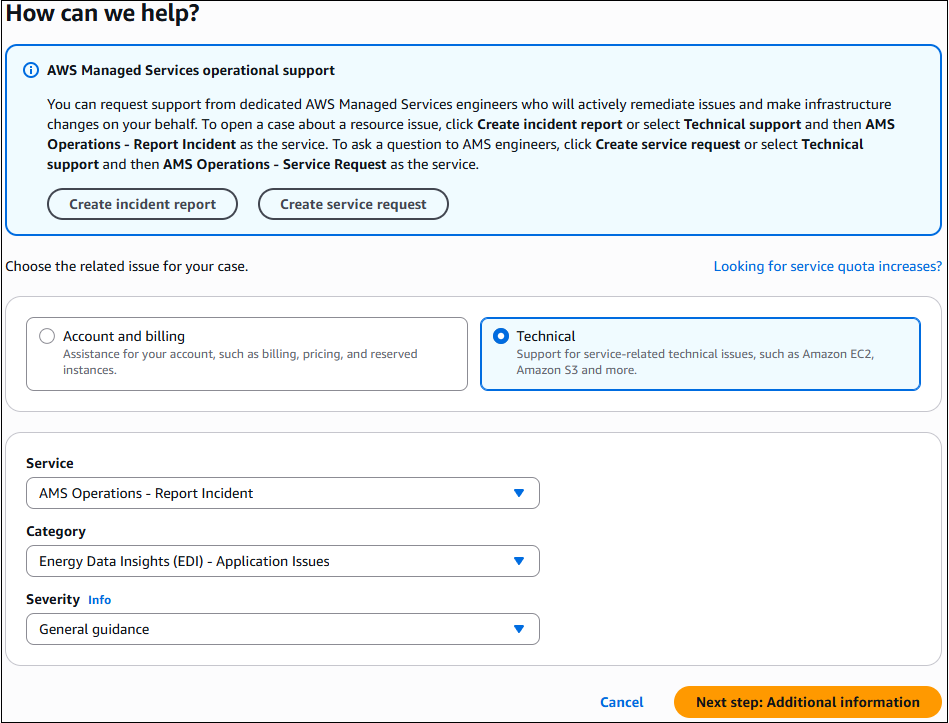

# Incident management in ECO

In ECO, you can use the AWS Support Center Console to create incidents. Incidents are EDI performance issues that affect your managed environment,
as determined by ECO or you. An incident that the ECO team identifies is first received as an "event," which is a change in the system state that monitoring captures.
If a configured threshold is exceeded, then the event initiates an alarm, also called an alert. The ECO team determines if the event is non-impacting,
an incident, or a problem. The ECO team also receives incidents that you programmatically create using the AWS Support API with the
`service-ams-operations-report-incident` service code.

## What is incident management?

Incident management is the process that ECO uses to record, act on, communicate the progress of, and provide notification of active incidents.
The incident management process quickly restores operations for EDI on AWS, minimizes business impact, and keeps concerned parties informed.

The following issues are examples of incidents that ECO manages:

- Loss or degradation of network connectivity
- An unresponsive process or API
- A scheduled task that isn't being performed, such as a failed backup

The following graphic shows the workflow of an incident reported by you to ECO.

The following graphic shows the workflow of an incident reported by ECO to you.

## Incident priority

Incidents that you create in AWS Support Center or AWS Support API have different classifications from incidents that you create in the AMS console.

The following classifications define the priority level for AWS or EDI related services and applications:

- **Low** – Non-critical functions of your business service or application are impacted.
- **Medium** – A business service or application is available but isn't performing according to the applicable
  service description.
- **High** – Your business is significantly impacted. Critical functions of your application or resources are
  unavailable. The **High** priority level is reserved for the most critical outages that affect production systems.

###### Note

The AWS Support Center Console offers five levels of incident priority that we modified to the preceding three levels of priority.

## Incident resolution

ECO uses IT service management (ITSM) incident management best practices to restore service as quickly as possible. We provide all day and night, all week, all year,
follow-the-sun support through operations centers around the world with dedicated operators that actively watch monitoring dashboards and incident queues.

###### Note

For incident response times, see
[Incident management response time](eco-sd.md#incident-response-time "eco-sd.md#incident-response-time")

Our operations engineers use internal incident tracking tools to identify, log, categorize, prioritize, diagnose, resolve, and close incidents. We provide you with
updates on all the activities through the AWS Support Center and the AWS Support API. Our operators are deeply familiar with EDI supported infrastructure and have expert-level
technical skills to address identified issues. If ECO operators need assistance, they contact the AWS Support and AWS service teams.

After the ECO team receives your incident, they validate the priority and classification and work with you if they require clarifications.
For example, if the incident report is better classified as a service request, they reclassify it, the ECO service request team takes over, and you're notified.
ECO operators consult internal documentation to quickly resolve the incident. If an operator can't resolve the incident, they escalate it to other support teams.
After it's resolved, the ECO team documents the incident and resolution for future use.

In cases where critical severity incidents are impacting your crucial workloads, ECO might recommend a restore. The risks of a restore and the impact from the
required service downtime help determine whether the ECO team restores from a known functional backup. If the issue is urgent, then ECO can initiate a restore.
If a restore is too risky, then ECO will help you troubleshoot the issue.

## Working with incidents in the Support Center

You can perform the following tasks in the AWS Support Center:

- Report and update an incident.
- Get a list of and detailed information about your submitted incidents.
- Narrow your search for incidents by status and other filters.
- Add communications and file attachments to your incidents and add email recipients for case correspondence.
- Initiate a live chat or request a callback on your incident.
- Resolve incidents.
- Rate incident communications.

After you submit an incident, the ECO team works with you to resolve the incident according to the incident response time matrix.

## Submitting EDI incidents

To report an incident, follow these steps:

1. Sign in to [Support Center Console](https://console.aws.amazon.com/support/home#/ "https://console.aws.amazon.com/support/home#/").
2. Choose **Create case** and then **Create incident report**. The **Technical** support issue type
   auto-selects.

 3. Choose options from the following menus:

    1. **Service** – AMS Operations – Report Incident is selected by default
    2. For **Category** – select Energy Data Insights (EDI) – Application Issues
    3. **Severity** – as appropriate

Choose **Next step: Additional information**. The **Additional information** page opens. 4. Include information about your incident and then choose **Next step: Solve now or contact us**. The
**Solve now or contact us** page opens to the **Solve now** tab by default. 5. The **Solve now** tab offers AI generated suggestions for your incident. Choose
**Next**. The **Contact us** tab opens. 6. On the **Contact us** tab, ensure that **English** is your preferred language because EDI supports only English
for incident reports. Choose a contact method:

    * **Web**, selected by default – An ECO representative emails your configured contact.
    * **Phone** – An ECO representative calls you back. Enter your AWS Region, phone number, and extension if applicable.
    * **Chat** – Chat online with an ECO representative. This option adds you to the chat queue.

Use the **Additional contacts** option to add email addresses you want copied on your incident report. 7. Choose **Submit**. A case details page opens with information on the incident and a **Correspondence** area that
includes the description of the report that you created. To provide additional details or updates in status, choose **Reply**. For cases that include
a lot of correspondence, choose **Load More** to view all communication. 8. After the incident has been resolved, choose **Resolve Case**. Be sure to rate the service through the 1-5 star rating to
let the ECO team know how we're doing.

###### Note

Make your description as detailed as possible. Include relevant resource information, along with anything else that might help us
understand your issue. For example, to troubleshoot performance, include timestamps and logs. For feature requests or general guidance
questions, include a description of your environment and purpose. In all cases, follow the Description Guidance that appears on your case
submission form. When you provide as much detail as possible, you increase the chances that ECO can quickly resolve your case. You can use
the AWS Support API with the `service-ams-operations-report-incident` service code to report an incident.

For more information about how to use the AWS Support Center Console to report an incident, see
[Creating support cases and case management](../../../awssupport/latest/user/case-management.md "../../../awssupport/latest/user/case-management.md")
in the _AWS Support User Guide_.
