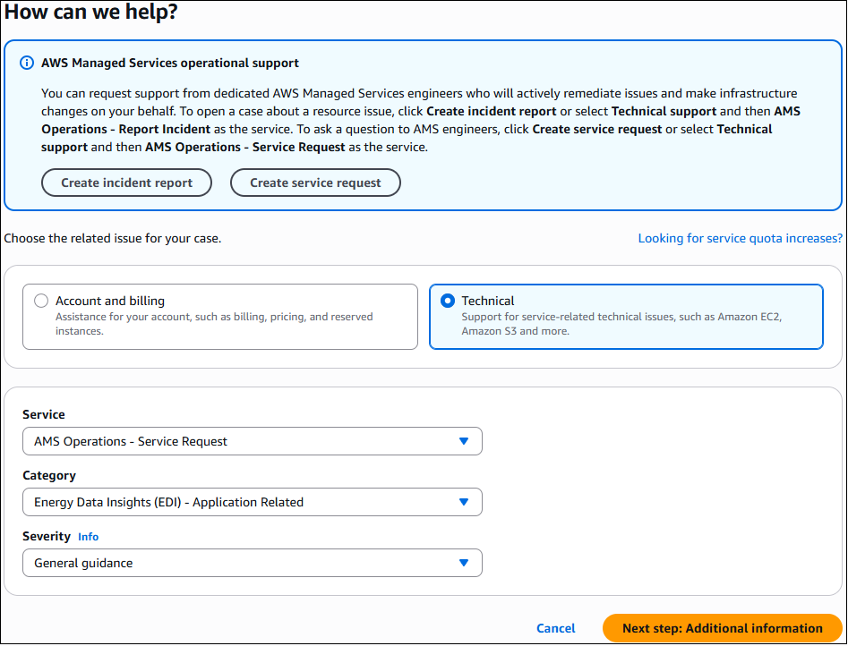

# Service request management in ECO

ECO uses service request management to record, act on, communicate the progress of, and provide notification of active service requests.

## When to submit EDI service requests

The following are examples of when to submit a service request:

- EDI or AWS general guidance
- Questions about the functionality of EDI services
- Billing-related queries

Don't submit a service request for the following:

- Access issues
- Portal issues
- Backup failure

Instead, submit an incident report, see [Working with incidents in the Support Center](incident-mgmt.md#incident-work-with "incident-mgmt.md#incident-work-with").

## How service requests work

The ECO team handles service requests. The ECO team reviews your service request to make sure that it's
appropriately classified as a service request or an incident. If the ECO operator reclassifies the request as an incident, the ECO incident management process begins, and
you're sent a notification. The ECO operator immediately begins to resolve incidents that are within their scope. For example, if the
service request is for architecture advice or other information, the operator answers your question or refers you to the appropriate resources. If the analysis of
your service request identifies a bug or a feature request, then ECO sends you a notification through the service request.
Because there's no estimated times for feature requests or bug fixes, the original service request is closed. Contact your E-SDM to ask follow-up questions that are related
to the original service request

If the service request is out of scope for ECO operations, the operator sends the request to the appropriate AWS team or to your E-SDM. The ECO operator
also sends you an email about the steps that the ECO team is taking. The service request isn't resolved until you've indicated that you're satisfied with the outcome.

## Creating EDI service requests

To create a service request, follow these steps:

1. Sign in to the [Support Center Console](https://console.aws.amazon.com/support/home#/ "https://console.aws.amazon.com/support/home#/").
2. Choose **Create case** and then **Create service request**. The **Technical** support issue type
   auto-selects.

 3. Choose options from the following menus:

    1. **Service** – AMS Operations – Service Request is selected by default
    2. For **Category** – select Energy Data Insights (EDI) – Application Issues
    3. **Severity** – as appropriate

Choose **Next step: Additional information**. The **Additional information** page opens. 4. Include information about your service request and then choose **Next step: Solve now or contact us**. The
**Solve now or contact us** page opens to the **Solve now** tab by default. 5. The **Solve now** tab offers AI generated suggestions for your service request. Choose
**Next**, The **Contact us** tab opens. 6. On the **Contact us** tab, ensure that **English** is your preferred language because EDI supports only English
for service requests. Choose a contact method:

    * **Web**, selected by default – An ECO representative emails your configured contact.
    * **Phone** – An ECO representative calls you back. Enter your AWS Region, phone number, and extension if applicable.
    * **Chat** – Chat online with an ECO representative. This option adds you to the chat queue.

Use the **Additional contacts** option to add email addresses you want copied on your service request. 7. Choose **Submit**. A case details page opens with information on the service request and a **Correspondence** area that
includes the description of the request that you created. To provide additional details or updates in status, choose **Reply**. For cases that include
a lot of correspondence, choose **Load More** to view all communication. 8. After the service request has been resolved, choose **Resolve Case**. Be sure to rate the service through the 1-5 star rating to
let the ECO team know how we're doing.

###### Note

If you're going to test service request functionality, we recommend that you add a no-action flag to your service request's subject,
such as **AMSTestNoOpsActionRequired**. Then, you can test without starting the service request resolution process.

## Monitoring and updating EDI service requests (console)

For detailed information about how to use AWS Support Center to monitor a case, incident, or service request, see
[Monitoring and updating an Accelerate incident](../../../managedservices/latest/accelerate-guide/mon-and-update-an-incident.md "../../../managedservices/latest/accelerate-guide/mon-and-update-an-incident.md")
in the _AMS Accelerate User Guide_.

## Monitoring and updating EDI service requests (API)

You can use the AWS Support API to create service requests and add correspondence throughout investigations of your issues and
interactions with AWS Support. Similar to AWS Support, the ECO team also receives service requests programmatically created by you using the AWS Support API
with the `service-ams-operations-service-request` service code.

For information about how to use the AWS Support API, see
[Managing Accelerate incidents with the support API](../../../managedservices/latest/accelerate-guide/managing-incidents-with-sapi.md "../../../managedservices/latest/accelerate-guide/managing-incidents-with-sapi.md")
in the _AMS Accelerate User Guide_.
