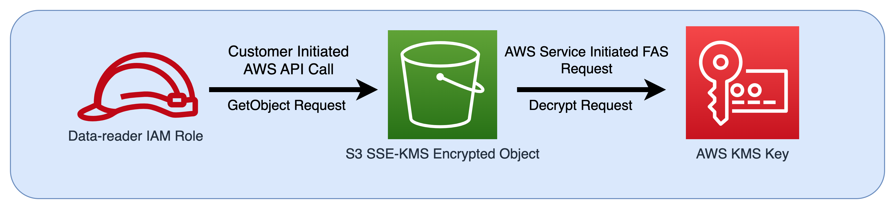
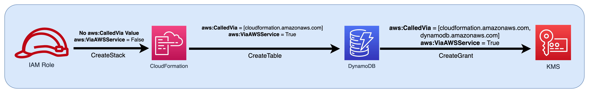

# Forward access sessions

Forward access sessions (FAS) is an IAM technology used by AWS services to pass your
identity, permissions, and session attributes when an AWS service makes a request on your
behalf. FAS uses the permissions of the identity calling an AWS service, combined with an
AWS service’s identity to make requests to downstream services. FAS requests are only made
to AWS services on behalf of an IAM principal after a service has received a request
that requires interactions with other AWS services or resources to complete. When a FAS
request is made:

- The service that receives the initial request from an IAM principal checks the
  permissions of the IAM principal.
- The service that receives a subsequent FAS request also checks the permissions of
  the same IAM principal.
  For example, FAS is used by Amazon S3 to make calls to AWS Key Management Service to decrypt an object when
  [SSE-KMS](../../../AmazonS3/latest/userguide/UsingKMSEncryption.md "../../../AmazonS3/latest/userguide/UsingKMSEncryption.md") was used to encrypt it. When downloading an SSE-KMS encrypted object, a
  role named **data-reader** calls GetObject on the object against Amazon S3, and
  does not call AWS KMS directly. After receiving the GetObject request and authorizing
  data-reader, Amazon S3 then makes a FAS request to AWS KMS in order to decrypt the Amazon S3 object.
  When KMS receives the FAS request it checks the permissions of the role and only authorizes
  the decryption request if data-reader has the correct permissions on the KMS key. The
  requests to both Amazon S3 and AWS KMS are authorized using the role’s permissions and is only
  successful if data-reader has permissions to both the Amazon S3 object and the
  AWS KMS key.



###### Note

Additional FAS requests can be made by services who have received a FAS request. In
such cases, the requesting principal must have permissions for all services called by
FAS.

## FAS Requests and IAM policy

conditions

When FAS requests are made, [aws:CalledVia](reference_policies_condition-keys.md#condition-keys-calledvia "reference_policies_condition-keys.md#condition-keys-calledvia"), [aws:CalledViaFirst](reference_policies_condition-keys.md#condition-keys-calledviafirst "reference_policies_condition-keys.md#condition-keys-calledviafirst"), and [aws:CalledViaLast](reference_policies_condition-keys.md#condition-keys-calledvialast "reference_policies_condition-keys.md#condition-keys-calledvialast") condition keys are populated with the service principal of the service that initiated
the FAS call. The [aws:ViaAWSService](reference_policies_condition-keys.md#condition-keys-viaawsservice "reference_policies_condition-keys.md#condition-keys-viaawsservice") condition key value is set to
`true` whenever a FAS request is made. In the following diagram, the
request to CloudFormation directly does not have any `aws:CalledVia` or
`aws:ViaAWSService` condition keys set. When CloudFormation and DynamoDB make
downstream FAS requests on the behalf of the role, the values for these condition keys
are populated.



To allow a FAS request to be made when it would otherwise be denied by a Deny policy
statement with a condition key testing Source IP addresses or Source VPCs, you must use
condition keys to provide an exception for FAS requests in your Deny policy. This can be
done for all FAS requests by using the `aws:ViaAWSService` condition key. To
allow only specific AWS services to make FAS requests, use
`aws:CalledVia`.

###### Important

When a FAS request is made after an initial request is made through a VPC
endpoint, the condition key values for `aws:SourceVpce`, `aws:SourceVpc`, and `aws:VpcSourceIp` from the initial request
are not used in FAS requests. When writing policies using
`aws:VPCSourceIP` or `aws:SourceVPCE` to conditionally
grant access, you must also use `aws:ViaAWSService` or
`aws:CalledVia` to allow FAS requests. When a FAS request is made
after an initial request is received by a public AWS service endpoint, subsequent
FAS requests will be made with the same `aws:SourceIP` condition key
value.

## Example: Allow Amazon S3 access from a VPC or with

FAS

In the following IAM policy example, Amazon S3 GetObject and Athena requests are only
allowed if they originate from VPC endpoints attached to
`example_vpc`, or if the request is a FAS request made by
Athena.

JSON

```
`{
 "Version":"2012-10-17",
 "Statement": [
 {
 "Sid": "OnlyAllowMyIPs",
 "Effect": "Allow",
 "Action": [
 "s3:GetObject*",
 "athena:StartQueryExecution",
 "athena:GetQueryResults",
 "athena:GetWorkGroup",
 "athena:StopQueryExecution",
 "athena:GetQueryExecution"
 ],
 "Resource": "*",
 "Condition": {
 "StringEquals": {
 "aws:SourceVPC": [
 "`vpc-111bbb22`"
 ]
 }
 }
 },
 {
 "Sid": "OnlyAllowFAS",
 "Effect": "Allow",
 "Action": [
 "s3:GetObject*"
 ],
 "Resource": "*",
 "Condition": {
 "ForAnyValue:StringEquals": {
 "aws:CalledVia": "athena.amazonaws.com"
 }
 }
 }
 ]
}`

```

For additional examples of using condition keys to allow FAS access, see the [data perimeter example
policy repo](https://github.com/aws-samples/data-perimeter-policy-examples "https://github.com/aws-samples/data-perimeter-policy-examples").
