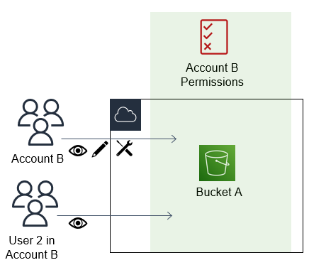

# Cross account resource

access in IAM

For some AWS services, you can grant cross-account access to your resources using IAM.
To do this, you can attach a resource policy directly to the resource that you want to
share, or use a role as a proxy.

To share the resource directly, the resource that you want to share must support [resource-based policies](introduction_access-management.md#intro-access-resource-based-policies "introduction_access-management.md#intro-access-resource-based-policies"). Unlike an identity-based policy for a role, a
resource-based policy specifies who (which principal) can access that resource.

Use a role as a proxy when you want to access resources in another account that do not
support resource-based policies.

For details about the differences between these policy types, see [Identity-based policies and
resource-based policies](access_policies_identity-vs-resource.md "access_policies_identity-vs-resource.md").

###### Note

IAM roles and resource-based policies delegate access across accounts only within a
single partition. For example, you have an account in US West (N. California) in the standard
`aws` partition. You also have an account in China in the
`aws-cn` partition. You can't use a resource-based policy in your account
in China to allow access for users in your standard AWS account.

## Cross-account access using

roles

Not all AWS services support resource-based policies. For these services, you can
use cross-account IAM roles to centralize permission management when providing
cross-account access to multiple services. A cross-account IAM role is an IAM role
that includes a [trust policy](id_roles.md#term_trust-policy "id_roles.md#term_trust-policy") that
allows IAM principals in another AWS account to assume the role. Put simply, you can
create a role in one AWS account that delegates specific permissions to another AWS
account.

For information about attaching a policy to an IAM identity, see [Manage IAM policies](access_policies_manage.md "access_policies_manage.md").

###### Note

When a principal switches to a role to temporarily use the permissions of the
role, they give up their original permissions and take on the permissions assigned
to the role they’ve assumed.

Let’s take a look at the overall process as it applies to APN Partner software that
needs to access a customer account.

1. The customer creates an IAM role in their own account with a policy that
   allows access the Amazon S3 resources that the APN partner requires. In this example,
   the role name is `APNPartner`.

JSON

```
`{
 "Version":"2012-10-17",
 "Statement": [
 {
 "Effect": "Allow",
 "Action": "s3:*",
 "Resource": [
 "arn:aws:s3:::bucket-name"
 ]
 }
 ]
}`

```

2. Then, the customer specifies that the role can be assumed by the partner’s
   AWS account by providing the APN Partner’s AWS account ID in the [trust
   policy](id_roles_create_for-custom.md "id_roles_create_for-custom.md") for the `APNPartner` role.

JSON

```
`{
 "Version":"2012-10-17",
 "Statement": [
 {
 "Effect": "Allow",
 "Principal": {
 "AWS": "arn:aws:iam::`111122223333`:role/`APN-user-name`"
 },
 "Action": "sts:AssumeRole"
 }
 ]
}`

```

3. The customer gives the Amazon Resource Name (ARN) of the role to the APN
   partner. The ARN is the fully qualified name of the role.

```
arn:aws:iam::`Customer-Account-ID`:role/`APNPartner`
```

###### Note

We recommend using an external ID in multi-tenant situations. For details,
see [Access to AWS accounts owned by third
parties](id_roles_common-scenarios_third-party.md "id_roles_common-scenarios_third-party.md"). 4. When the APN Partner’s software needs to access the customer’s account, the
software calls the [AssumeRole](../../../STS/latest/APIReference/API_AssumeRole.md "../../../STS/latest/APIReference/API_AssumeRole.md") API in
the AWS Security Token Service with the ARN of the role in the customer’s account. STS returns a
temporary AWS credential that allows the software to do its work.

For another example of granting cross-account access using roles, see [Access for an IAM user in another
AWS account that you own](id_roles_common-scenarios_aws-accounts.md "id_roles_common-scenarios_aws-accounts.md"). You can also follow the
[IAM tutorial: Delegate access across
AWS accounts using IAM roles](tutorial_cross-account-with-roles.md "tutorial_cross-account-with-roles.md").

## Cross-account access using resource-based policies

When an account accesses a resource through another account using a resource-based
policy, the principal still works in the trusted account and does not have to give up
their permissions to receive the role permissions. In other words, the principal
continues to have access to resources in the trusted account while having access to the
resource in the trusting account. This is useful for tasks such as copying information
to or from the shared resource in the other account.

The principals that you can specify in a resource based policy include accounts, IAM
users, AWS STS federated user principals, SAML federated principals, OIDC federated principals, IAM roles, assumed-role sessions, or AWS services. For more
information, see [Specifying a principal](reference_policies_elements_principal.md#Principal_specifying "reference_policies_elements_principal.md#Principal_specifying").

To learn whether principals in accounts outside of your zone of trust (trusted
organization or account) have access to assume your roles, see [Identifying resources shared with an external entity](what-is-access-analyzer.md#what-is-access-analyzer-resource-identification "what-is-access-analyzer.md#what-is-access-analyzer-resource-identification").

The following list includes some of the AWS services that support resource-based
policies. For a complete list of the growing number of AWS services that support
attaching permission policies to resources instead of principals, see [AWS services that work with
IAM](reference_aws-services-that-work-with-iam.md "reference_aws-services-that-work-with-iam.md") and look for the
services that have **Yes** in the **Resource Based** column.

- **Amazon S3 buckets** — The policy is attached
  to the bucket, but the policy controls access to both the bucket and the objects
  in it. For more information, see [Bucket policies for
  Amazon S3](../../../AmazonS3/latest/userguide/bucket-policies.md "../../../AmazonS3/latest/userguide/bucket-policies.md") in the _Amazon Simple Storage Service User Guide_. In some cases,
  it may be best to use roles for cross-account access to Amazon S3. For more
  information, see the [example walkthroughs](../../../AmazonS3/latest/userguide/example-walkthroughs-managing-access.md "../../../AmazonS3/latest/userguide/example-walkthroughs-managing-access.md") in the _Amazon Simple Storage Service User
  Guide_.
- **Amazon Simple Notification Service (Amazon SNS) topics** — For more
  information, go to [Example cases for
  Amazon SNS access control](../../../sns/latest/dg/sns-access-policy-use-cases.md "../../../sns/latest/dg/sns-access-policy-use-cases.md") in the _Amazon Simple Notification Service Developer
  Guide_.
- **Amazon Simple Queue Service (Amazon SQS) queues** – For more
  information, go to [Appendix: The Access Policy Language](../../../AWSSimpleQueueService/latest/SQSDeveloperGuide/sqs-creating-custom-policies.md "../../../AWSSimpleQueueService/latest/SQSDeveloperGuide/sqs-creating-custom-policies.md") in the
  _Amazon Simple Queue Service Developer Guide_.

## Resource-based policies to delegate AWS permissions

If a resource grants permissions to principals in your account, you can then delegate
those permissions to specific IAM identities. Identities are users, groups of users,
or roles in your account. You delegate permissions by attaching a policy to the
identity. You can grant up to the maximum permissions that are allowed by the
resource-owning account.

###### Important

In cross account access, a principal needs an `Allow` in the identity
policy **and** the resource-based policy.

Assume that a resource-based policy allows all principals in your account full
administrative access to a resource. Then you can delegate full access, read-only
access, or any other partial access to principals in your AWS account. Alternatively,
if the resource-based policy allows only list permissions, then you can delegate only
list access. If you try to delegate more permissions than your account has, your
principals will still have only list access.

For more information about how these decisions are made, see [Determining whether a request is allowed or denied within an
account](reference_policies_evaluation-logic_policy-eval-denyallow.md "reference_policies_evaluation-logic_policy-eval-denyallow.md").

###### Note

IAM roles and resource-based policies delegate access across accounts only
within a single partition. For example, you can't add cross-account access between
an account in the standard `aws` partition and an account in the
`aws-cn` partition.

For example, assume that you manage `AccountA` and `AccountB`.
In AccountA, you have an Amazon S3 bucket named `BucketA`.



1. You attach a resource-based policy to `BucketA` that allows all
   principals in AccountB full access to objects in your bucket. They can create,
   read, or delete any objects in that bucket.

JSON

```
`{
 "Version":"2012-10-17",
 "Statement": [
 {
 "Sid": "PrincipalAccess",
 "Effect": "Allow",
 "Principal": {
 "AWS": "arn:aws:iam::`111122223333`:root"
 },
 "Action": "s3:*",
 "Resource": "arn:aws:s3:::BucketA/*"
 }
 ]
}`

```

AccountA gives AccountB full access to BucketA by naming AccountB as a
principal in the resource-based policy. As a result, AccountB is authorized to
perform any action on BucketA, and the AccountB administrator can delegate
access to its users in AccountB.

The AccountB root user has all of the permissions that are granted to the
account. Therefore, the root user has full access to BucketA. 2. In AccountB, attach a policy to the IAM user named User2. That policy allows
the user read-only access to the objects in BucketA. That means that User2 can
view the objects, but not create, edit, or delete them.

JSON

```
`{
 "Version":"2012-10-17",
 "Statement": [
 {
 "Effect" : "Allow",
 "Action" : [
 "s3:Get*",
 "s3:List*" ],
 "Resource" : "arn:aws:s3:::BucketA/*"
 }
 ]
}`

```

The maximum level of access that AccountB can delegate is the access level
that is granted to the account. In this case, the resource-based policy granted
full access to AccountB, but User2 is granted only read-only access.

The AccountB administrator does not give access to User1. By default, users do
not have any permissions except those that are explicitly granted, so User1 does
not have access to BucketA.

IAM evaluates a principal's permissions at the time the principal makes a request.
If you use wildcards (\*) to give users full access to your resources, principals can
access any resources that your AWS account has access to. This is true even for
resources you add or gain access to after creating the user's policy.

In the preceding example, if AccountB had attached a policy to User2 that allowed full
access to all resources in all accounts, User2 would automatically have access to any
resources that AccountB has access to. This includes the BucketA access and access to
any other resources granted by resource-based policies in AccountA.

For more information about complex uses of roles, such as granting access to
applications and services, see [Common scenarios for IAM roles](id_roles_common-scenarios.md "id_roles_common-scenarios.md").

###### Important

Give access only to entities you trust, and give the minimum level of access
necessary. Whenever the trusted entity is another AWS account, any IAM principal
can be granted access to your resource. The trusted AWS account can delegate
access only to the extent that it has been granted access; it cannot delegate more
access than the account itself has been granted.

For information about permissions, policies, and the permission policy language that
you use to write policies, see [Access management for AWS resources](access.md "access.md").
