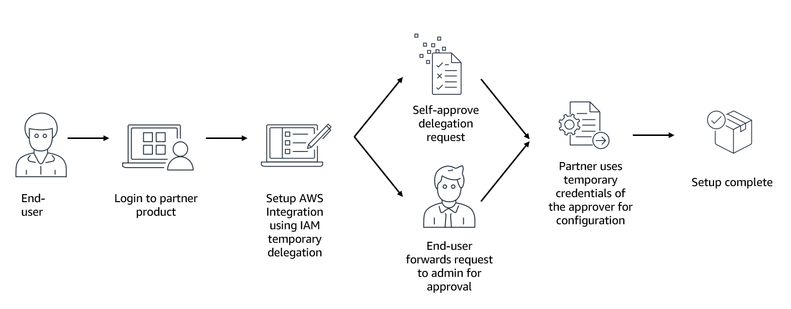

# IAM temporary delegation

## Overview

Temporary delegation accelerates onboarding and simplifies management for products from Amazon and AWS Partners that integrate with your AWS accounts. Instead of manually configuring multiple AWS services, you can delegate temporary, limited permissions that allow the product provider to complete setup tasks on your behalf in minutes through automated deployment workflows. You maintain administrative control with approval requirements and permission boundaries, while product provider permissions automatically expire after the approved duration with no manual cleanup required. If the product requires persistent access for ongoing operations, the provider can use temporary delegation to create an IAM role with a permission boundary that defines the role's maximum permissions. All product provider activity is tracked through AWS CloudTrail for compliance and security monitoring.

###### Note

Temporary delegation requests can only be created by Amazon products and qualified AWS Partners that have completed the feature onboarding process. Customers review and approve these requests but cannot create them directly. If you are an AWS Partner looking to integrate IAM temporary delegation into your product, see the [Partner Integration Guide](access_policies-temporary-delegation-partner-guide.md "access_policies-temporary-delegation-partner-guide.md") for onboarding and integration instructions.

## How temporary delegation works

Temporary delegation enables Amazon and AWS Partners to request temporary, limited access to your account. Upon your approval, they can use delegated permissions to take actions on your behalf. Delegation requests define specific permissions to AWS services and actions that the product provider needs to deploy or configure resources in your AWS account. These permissions are only available for a limited time and automatically expire after the duration specified in the request.

###### Note

The maximum duration for delegated access is 12 hours. However, root users can only approve delegation requests with a duration of 4 hours or less. If a request specifies more than 4 hours, you must use a non-root identity to approve the request. For details, see [Permission simulation beta capability](temporary-delegation-initiate-request.md#temporary-delegation-permission-simulation "temporary-delegation-initiate-request.md#temporary-delegation-permission-simulation").

For ongoing tasks, such as reading from an Amazon S3 bucket, delegation requests can include the creation of an IAM role that allows continued access to resources and actions after the temporary access expires. Product providers must attach a permission boundary to any IAM role created through temporary delegation. Permission boundaries limit a role's maximum permissions but do not grant permissions on their own. You can review the permission boundary as part of the request before approving it. For details, see [Permissions boundaries](access_policies_boundaries.md "access_policies_boundaries.md").

The process works as follows:

1. You log in to an Amazon or AWS Partner product to integrate it with your AWS environment.
2. The product provider initiates a delegation request on your behalf and redirects you to the AWS Management Console.
3. You review the requested permissions and determine whether to approve, deny, or forward the request to your administrator.
4. Once you or your administrator approves the request, the product provider can obtain approver's temporary credentials to perform the required tasks.
5. Product provider access automatically expires after the specified time period. However, any IAM role created through the temporary delegation request persists beyond this period, allowing the product provider to continue accessing resources and actions for ongoing management tasks.

###### Note

You can only delegate permissions to a product provider if you have permissions to the services and actions included in the temporary delegation request. If you don't have access to the requested services and actions, the product provider does not receive these permissions when you approve the request.

If the permission check shows it is likely to succeed, you can approve the temporary delegation request and continue with the workflow.

If the permission check shows that you may not have sufficient permissions, forward the request to your administrator for approval. We recommend notifying your administrator about this request using your preferred method such as an email or a ticket.

Once your administrator approves the request, what happens next depends on the product provider's configuration:

- If the product provider requested immediate access, they automatically receive temporary permissions and the access duration begins.
- If the product provider requested release by the owner (initial recipient), you must return to the request to explicitly share temporary account access before the access duration begins. Product providers typically use this option when they need additional input from you, such as resource selection or configuration details, to complete the required task.

## Managing Permissions for Delegation Requests

Administrators can grant IAM principals permissions to manage delegation requests from product providers. This is useful when you want to delegate approval authority to specific users or teams in your organization, or when you need to control who can perform specific actions on delegation requests.

The following IAM permissions are available for managing delegation requests:

| Permission                     | Description                                                       |
| ------------------------------ | ----------------------------------------------------------------- |
| iam:AssociateDelegationRequest | Associate an unassigned delegation request with your AWS account  |
| iam:GetDelegationRequest       | View details of a delegation request                              |
| iam:UpdateDelegationRequest    | Forward a delegation request to an administrator for approval     |
| iam:AcceptDelegationRequest    | Approve a delegation request                                      |
| iam:SendDelegationToken        | Release the exchange token to the product provider after approval |
| iam:RejectDelegationRequest    | Reject a delegation request                                       |
| iam:ListDelegationRequests     | List delegation requests for your account                         |

###### Note

By default, IAM principals who initiate a delegation request are automatically granted permissions to manage that specific request. They can associate it with their account, view request details, reject a request, forward it to an administrator for approval, release the exchange token to the product provider after admin approval, and list delegation requests that they own.
