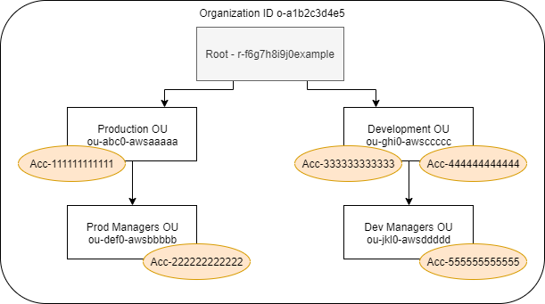

# View last accessed information

for AWS Organizations

You can view service last accessed information for AWS Organizations using the IAM console, AWS CLI,
or AWS API. For important information about the data, permissions required, troubleshooting,
and supported Regions, see [Refine permissions in AWS using last
accessed information](access_policies_last-accessed.md "access_policies_last-accessed.md").

When you sign in to the IAM console using AWS Organizations management account credentials, you can
view information for any entity in your organization. AWS Organizations entities include the organization
root, organizational units (OUs), and accounts. You can also use the IAM console to view
information for any service control policies (SCPs) in your organization. IAM shows a list
of services that are allowed by any SCPs that apply to the entity. For each service, you can
view the most recent account activity information for the chosen AWS Organizations entity or the entity's
children.

When you use the AWS CLI or AWS API with management account credentials, you can generate a
report for any entities or policies in your organization. A programmatic report for an entity
includes a list of services that are allowed by any SCPs that apply to the entity. For each
service, the report includes the most recent activity for accounts in the specified AWS Organizations
entity or the entity's subtree.

When you generate a programmatic report for a policy, you must specify an AWS Organizations entity. This
report includes a list of services that are allowed by the specified SCP. For each service, it
includes the most recent account activity in the entity or entity's children that are granted
permission by that policy. For more information, see [aws iam
generate-organizations-access-report](../../../cli/latest/reference/iam/generate-organizations-access-report.md "../../../cli/latest/reference/iam/generate-organizations-access-report.md") or [GenerateOrganizationsAccessReport](../APIReference/API_GenerateOrganizationsAccessReport.md "../APIReference/API_GenerateOrganizationsAccessReport.md").

Before you view the report, make sure that you understand the management account
requirements and information, reporting period, reported entities, and the evaluated policy
types. For more details, see [Things to know about last accessed
information](access_policies_last-accessed.md#access_policies_last-accessed-know "access_policies_last-accessed.md#access_policies_last-accessed-know").

## Understand the

AWS Organizations entity path

When you use the AWS CLI or AWS API to generate an AWS Organizations access report, you must
specify an entity path. A path is a text representation of the structure of an AWS Organizations
entity.

You can build an entity path using the known structure of your organization. For
example, assume that you have the following organizational structure in AWS Organizations.



The path for the **Dev Managers** OU is built using the IDs of the
organization, root, and all OUs in the path down to and including the OU.

```
o-a1b2c3d4e5/r-f6g7h8i9j0example/ou-ghi0-awsccccc/ou-jkl0-awsddddd/
```

The path for the account in the **Production** OU is built using the
IDs of the organization, root, the OU, and the account number.

```
o-a1b2c3d4e5/r-f6g7h8i9j0example/ou-abc0-awsaaaaa/111111111111/
```

###### Note

Organization IDs are globally unique but OU IDs and root IDs are unique only within
an organization. This means that no two organizations share the same organization ID.
However, another organization might have an OU or root with the same ID as yours. We
recommend that you always include the organization ID when you specify an OU or
root.

## Viewing information for AWS Organizations

(console)

You can use the IAM console to view service last accessed information for your root,
OU, account, or policy.

###### To view information for the root (console)

1. Sign in to the AWS Management Console using AWS Organizations management account credentials, and open the
   IAM console at [https://console.aws.amazon.com/iam/](https://console.aws.amazon.com/iam/ "https://console.aws.amazon.com/iam/").
2. In the navigation pane below the **Access reports** section,
   choose **Organization activity**.
3. On the **Organization activity** page, choose
   **Root**.
4. On the **Details and activity** tab, view the **Service
   access report** section. The information includes a list of services that
   are allowed by the policies that are attached directly to the root. The information
   shows you from which account the service was last accessed and when. For more details
   about which principal accessed the service, sign in as an administrator in that
   account and [view the IAM
   service last accessed information](access_policies_last-accessed-view-data.md "access_policies_last-accessed-view-data.md").
5. Choose the **Attached SCPs** tab to view the list of the service
   control policies (SCPs) that are attached to the root.
   IAM shows you the number of target entities to which each policy
   is attached. You can use this information to decide which SCP to review.
6. Choose the name of an SCP to view all of the services that the policy allows. For
   each service, view from which account the service was last accessed, and when.
7. Choose **Edit in AWS Organizations** to view additional details and edit
   the SCP in the AWS Organizations console. For more information, see [Updating an SCP](../../../organizations/latest/userguide/create-policy.md#update_policy "../../../organizations/latest/userguide/create-policy.md#update_policy") in the
   _AWS Organizations User Guide_.

###### To view information for an OU or account (console)

1. Sign in to the AWS Management Console using AWS Organizations management account credentials, and open the
   IAM console at [https://console.aws.amazon.com/iam/](https://console.aws.amazon.com/iam/ "https://console.aws.amazon.com/iam/").
2. In the navigation pane below the **Access reports** section,
   choose **Organization activity**.
3. On the **Organization activity** page, expand the
   structure of your organization. Then choose the name of the OU or any account that
   you want to view except the management account.
4. On the **Details and activity** tab, view the **Service
   access report** section. The information includes a list of services that
   are allowed by the SCPs attached to the OU or account _and_ all of its parents. The information shows you from which account
   the service was last accessed and when. For more details about which principal
   accessed the service, sign in as an administrator in that account and [view the IAM service last
   accessed information](access_policies_last-accessed-view-data.md "access_policies_last-accessed-view-data.md").
5. Choose the **Attached SCPs** tab to view the list of the service
   control policies (SCPs) that are attached directly to the OU or account.
   IAM shows you the number of target entities to which each policy
   is attached. You can use this information to decide which SCP to review.
6. Choose the name of an SCP to view all of the services that the policy allows. For
   each service, view from which account the service was last accessed, and when.
7. Choose **Edit in AWS Organizations** to view additional details and edit
   the SCP in the AWS Organizations console. For more information, see [Updating an SCP](../../../organizations/latest/userguide/create-policy.md#update_policy "../../../organizations/latest/userguide/create-policy.md#update_policy") in the
   _AWS Organizations User Guide_.

###### To view information for the management account (console)

1. Sign in to the AWS Management Console using AWS Organizations management account credentials, and open the
   IAM console at [https://console.aws.amazon.com/iam/](https://console.aws.amazon.com/iam/ "https://console.aws.amazon.com/iam/").
2. In the navigation pane below the **Access reports** section,
   choose **Organization activity**.
3. On the **Organization activity** page, expand the
   structure of your organization and choose the name your management account.
4. On the **Details and activity** tab, view the **Service
   access report** section. The information includes a list of all AWS
   services. The management account is not limited by SCPs. The information shows you
   whether the account last accessed the service and when. For more details about which
   principal accessed the service, sign in as an administrator in that account and [view the IAM service last
   accessed information](access_policies_last-accessed-view-data.md "access_policies_last-accessed-view-data.md").
5. Choose the **Attached SCPs** tab to confirm that there are no
   attached SCPs because the account is the management account.

###### To view information for a policy (console)

1. Sign in to the AWS Management Console using AWS Organizations management account credentials, and open the
   IAM console at [https://console.aws.amazon.com/iam/](https://console.aws.amazon.com/iam/ "https://console.aws.amazon.com/iam/").
2. In the navigation pane below the **Access reports** section,
   choose **Service control policies (SCPs)**.
3. On the **Service control policies (SCPs)** page, view
   a list of the policies in your organization.
   You can view the number of target entities to which each policy is
   attached.
4. Choose the name of an SCP to view all of the services that the policy allows. For
   each service, view from which account the service was last accessed, and when.
5. Choose **Edit in AWS Organizations** to view additional details and edit
   the SCP in the AWS Organizations console. For more information, see [Updating an SCP](../../../organizations/latest/userguide/create-policy.md#update_policy "../../../organizations/latest/userguide/create-policy.md#update_policy") in the
   _AWS Organizations User Guide_.

## Viewing information for

AWS Organizations (AWS CLI)

You can use the AWS CLI to retrieve service last accessed information for your AWS Organizations root,
OU, account, or policy.

###### To view AWS Organizations service last accessed information (AWS CLI)

1.  Use your AWS Organizations management account credentials with the required IAM and AWS Organizations
    permissions, and confirm that SCPs are enabled for your root. For more information,
    see [Things to know about last accessed
    information](access_policies_last-accessed.md#access_policies_last-accessed-know "access_policies_last-accessed.md#access_policies_last-accessed-know").
2.  Generate a report. The request must include the path of the AWS Organizations entity (root, OU,
    or account) for which you want a report. You can optionally include an
    `organization-policy-id` parameter to view a report for a specific
    policy. The command returns a `job-id` that you can then use in the
    `get-organizations-access-report` command to monitor the
    `job-status` until the job is complete.
    - [aws iam
      generate-organizations-access-report](../../../cli/latest/reference/iam/generate-organizations-access-report.md "../../../cli/latest/reference/iam/generate-organizations-access-report.md")

3.  Retrieve details about the report using the `job-id` parameter from the
    previous step.

        * [aws iam
         get-organizations-access-report](../../../cli/latest/reference/iam/get-organizations-access-report.md "../../../cli/latest/reference/iam/get-organizations-access-report.md")

    This command returns a list of services that entity members can access. For each
    service, the command returns the date and time of an account member's last attempt
    and the entity path of the account. It also returns the total number of services that
    are available to access and the number of services that were not accessed. If you
    specified the optional `organizations-policy-id` parameter, then the
    services that are available to access are those that are allowed by the specified
    policy.

## Viewing information for

AWS Organizations (AWS API)

You can use the AWS API to retrieve service last accessed information for your AWS Organizations
root, OU, account, or policy.

###### To view AWS Organizations service last accessed information (AWS API)

1.  Use your AWS Organizations management account credentials with the required IAM and AWS Organizations
    permissions, and confirm that SCPs are enabled for your root. For more information,
    see [Things to know about last accessed
    information](access_policies_last-accessed.md#access_policies_last-accessed-know "access_policies_last-accessed.md#access_policies_last-accessed-know").
2.  Generate a report. The request must include the path of the AWS Organizations entity (root, OU,
    or account) for which you want a report. You can optionally include an
    `OrganizationsPolicyId` parameter to view a report for a specific
    policy. The operation returns a `JobId` that you can then use in the
    `GetOrganizationsAccessReport` operation to monitor the
    `JobStatus` until the job is complete.
    - [GenerateOrganizationsAccessReport](../APIReference/API_GenerateOrganizationsAccessReport.md "../APIReference/API_GenerateOrganizationsAccessReport.md")

3.  Retrieve details about the report using the `JobId` parameter from the
    previous step.

        * [GetOrganizationsAccessReport](../APIReference/API_GetOrganizationsAccessReport.md "../APIReference/API_GetOrganizationsAccessReport.md")

    This operation returns a list of services that entity members can access. For each
    service, the operation returns the date and time of an account member's last attempt
    and the entity path of the account. It also returns the total number of services that
    are available to access, and the number of services that were not accessed. If you
    specified the optional `OrganizationsPolicyId` parameter, then the
    services that are available to access are those that are allowed by the specified
    policy.
