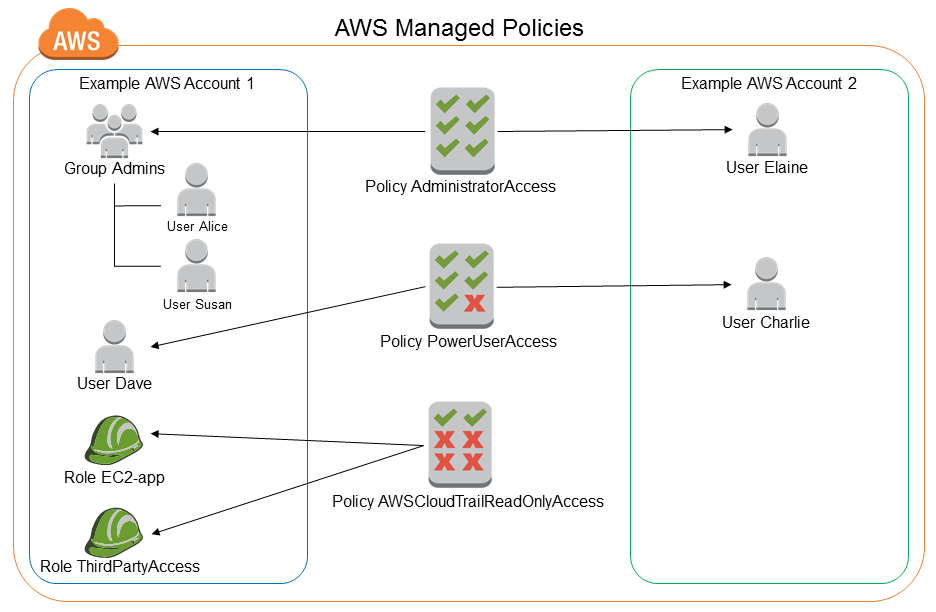
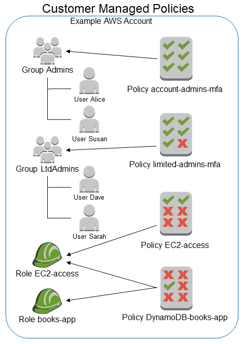
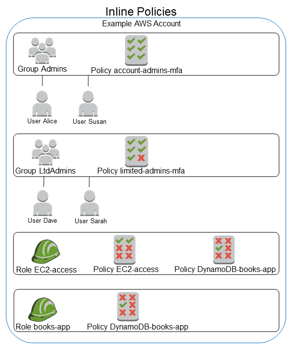

# Managed policies and inline policies

When you set the permissions for an identity in IAM, you must decide whether to use an
AWS managed policy, a customer managed policy, or an inline policy. The following topics
provide more information about each of the types of identity-based policies and when to use
them.

The following table outlines these policies:

| Policy Type                                                                          | Description                                                                                                                                       | Who manages the policy? | Modify permissions? | Number of principals applied to policy? |
| ------------------------------------------------------------------------------------ | ------------------------------------------------------------------------------------------------------------------------------------------------- | ----------------------- | ------------------- | --------------------------------------- | ---------------------------------------------------------------------------------------------------------------------------------------------------------------------------------------------------------------------------------------------------------------------------------------------------------------------------------------------------------------------------------------------------------------------------------------------------------------------------------------------------------------------------------------------------------------------------------------------------------------------------------------------------------------------------------------------------------------------------------------------------------------------------------------------------------------------------------------------------------------------------------------------------------------------------------------------------------------------------------------------------------------------------------------------------------------------------------------------------------------------------------------------------------------------------------------------------------------------------------------------------------------------------------------------------------------------------------------------------------------------------------------------------------------------------------------------------------------------------------------------------------------------------------------------------------------------------------------------------------------------------------------------------------------------------------------------------------------------------------------------------------------------------------------------------------------------------------------------------------------------------------------------------------------------------------------------------------------------------------------------------------------------------------------------------------------------------------------------------------------------------------------------------------------------------------------------------------------------------------------------------------------------------------------------------------------------------------------------------------------------------------------------------------------------------------------------------------------------------------------------------------------------------------------------------------------------------------------------------------------------------------------------------------------------------------------------------------------------------------------------------------------------------------------------------------------------------------------------------------------------------------------------------------------------------------------------------------------------------------------------------------------------------------------------------------------------------------------------------------------------------------------------------------------------------------------------------------------------------------------------------------------------------------------------------------------------------------------------------------------------------------------------------------------------------------------------------------------------------------------------------------------------------------------------------------------------------------------------------------------------------------------------------------------------------------------------------------------------------------------------------------------------------------------------------------------------------------------------------------------------------------------------------------------------------------------------------------------------------------------------------------------------------------------------------------------------------------------------------------------------------------------------------------------------------------------------------------------------------------------------------------------------------------------------------------------------------------------------------------------------------------------------------------------------------------------------------------------------------------------------------------------------------------------------------------------------------------------------------------------------------------------------------------------------------------------------------------------------------------------------------------------------------------------------------------------------------------------------------------------------------------------------------------------------------------------------------------------------------------------------------------------------------------------------------------------------------------------------------------------------------------------------------------------------------------------------------------------------------------------------------------------------------------------------------------------------------------------------------------------------------------------------------------------------------------------------------------------------------------------------------------------------------------------------------------------------------------------------------------------------------------------------------------------------------------------------------------------------------------------------------------------------------------------------------------------------------------------------------------------------------------------------------------------------------------------------------------------------------------------------------------------------------------------------------------------------------------------------------------------------------------------------------------------------------------------------------------------------------------------------------------------------------------------------------------------------------------------------------------------------------------------------------------------------------------------------------------------------------------------------------------------------------------------------------------------------------------------------------------------------------------------------------------------------------------------------------------------------------------------------------------------------------------------------------------------------------------------------------------------------------------------------------------------------------------------------------------------------------------------------------------------------------------------------------------------------------------------------------------------------------------------------------------------------------------------------------------------------------------------------------------------------------------------------------------------------------------------------------------------------------------------------------------------------------------------------------------------------------------------------------------------------------------------------------------------------------------------------------------------------------------------------------------------------------------------------------------------------------------------------------------------------------------------------------------------------------------------------------------------------------------------------------------------------------------------------------------------------------------------------------------------------------------------------------------------------------------------------------------------------------------------------------------------------------------------------------------------- |
| [AWS managed policies](#aws-managed-policies "#aws-managed-policies")                | Standalone policy created and administered by AWS.                                                                                                | AWS                     | No                  | Many                                    |
| [Customer managed policies](#customer-managed-policies "#customer-managed-policies") | Policy you create for specific use cases, and you can change or update them as often as you like.                                                 | You                     | Yes                 | Many                                    |
| [Inline policies](#inline-policies "#inline-policies")                               | Policy created for a single IAM identity (user, group, or role) that maintains a strict one-to-one relationship between a policy and an identity. | You                     | Yes                 | One                                     | ###### Topics  • [AWS managed policies](#aws-managed-policies "#aws-managed-policies")  • [Customer managed policies](#customer-managed-policies "#customer-managed-policies")  • [Inline policies](#inline-policies "#inline-policies")  • [Choose between managed policies and inline policies](access_policies-choosing-managed-or-inline.md "access_policies-choosing-managed-or-inline.md")  • [Convert an inline policy to a managed policy](access_policies-convert-inline-to-managed.md "access_policies-convert-inline-to-managed.md")  • [Deprecated AWS managed policies](access_policies_managed-deprecated.md "access_policies_managed-deprecated.md") ## AWS managed policies An _AWS managed policy_ is a standalone policy that is created and administered by AWS. A _standalone policy_ means that the policy has its own Amazon Resource Name (ARN) that includes the policy name. For example, `arn:aws:iam::aws:policy/IAMReadOnlyAccess` is an AWS managed policy. For more information about ARNs, see [IAM ARNs](reference_identifiers.md#identifiers-arns "reference_identifiers.md#identifiers-arns"). For a list of AWS managed policies for AWS services, see [AWS managed policies](../../../aws-managed-policy/latest/reference/policy-list.md "../../../aws-managed-policy/latest/reference/policy-list.md"). AWS managed policies make it convenient for you to assign appropriate permissions to users, IAM groups, and roles. It is faster than writing the policies yourself, and includes permissions for many common use cases. You cannot change the permissions defined in AWS managed policies. AWS occasionally updates the permissions defined in an AWS managed policy. When AWS does this, the update affects all principal entities (IAM users, IAM groups, and IAM roles) that the policy is attached to. AWS is most likely to update an AWS managed policy when a new AWS service is launched or new API calls become available for existing services. For example, the AWS managed policy called **ReadOnlyAccess** provides read-only access to all AWS services and resources. When AWS launches a new service, AWS updates the **ReadOnlyAccess** policy to add read-only permissions for the new service. The updated permissions are applied to all principal entities that the policy is attached to. _Full access AWS managed policies_: These define permissions for service administrators by granting full access to a service. Examples include:  • [AmazonDynamoDBFullAccess](../../../aws-managed-policy/latest/reference/AmazonDynamoDBFullAccess.md "../../../aws-managed-policy/latest/reference/AmazonDynamoDBFullAccess.md")  • [IAMFullAccess](../../../aws-managed-policy/latest/reference/IAMFullAccess.md "../../../aws-managed-policy/latest/reference/IAMFullAccess.md") _Power-user AWS managed policies_: These provide full access to AWS services and resources, but do not allow managing users and IAM groups. Examples include:  • [AWSCodeCommitPowerUser](../../../aws-managed-policy/latest/reference/AWSCodeCommitPowerUser.md "../../../aws-managed-policy/latest/reference/AWSCodeCommitPowerUser.md")  • [AWSKeyManagementServicePowerUser](../../../aws-managed-policy/latest/reference/AWSKeyManagementServicePowerUser.md "../../../aws-managed-policy/latest/reference/AWSKeyManagementServicePowerUser.md") _Partial-access AWS managed policies_: These provide specific levels of access to AWS services without allowing [permissions management](access_policies_understand-policy-summary-access-level-summaries.md#access_policies_access-level "access_policies_understand-policy-summary-access-level-summaries.md#access_policies_access-level") access level permissions. Examples include:  • [AmazonMobileAnalyticsWriteOnlyAccess](../../../aws-managed-policy/latest/reference/AmazonMobileAnalyticsWriteOnlyAccess.md "../../../aws-managed-policy/latest/reference/AmazonMobileAnalyticsWriteOnlyAccess.md")  • [AmazonEC2ReadOnlyAccess](../../../aws-managed-policy/latest/reference/AmazonEC2ReadOnlyAccess.md "../../../aws-managed-policy/latest/reference/AmazonEC2ReadOnlyAccess.md") _Job function AWS managed policies_: These policies align closely with commonly used job functions in the IT industry and facilitate granting permissions for these job functions. One key advantage of using job function policies is that they are maintained and updated by AWS as new services and API operations are introduced. For example, the [AdministratorAccess](../../../aws-managed-policy/latest/reference/AdministratorAccess.md "../../../aws-managed-policy/latest/reference/AdministratorAccess.md") job function provides full access and permissions delegation to every service and resource in AWS. We recommend that you use this policy only for the account administrator. For power users that require full access to every service except limited access to IAM and AWS Organizations, use the [PowerUserAccess](../../../aws-managed-policy/latest/reference/PowerUserAccess.md "../../../aws-managed-policy/latest/reference/PowerUserAccess.md") job function. For a list and descriptions of the job function policies, see [AWS managed policies for job functions](access_policies_job-functions.md "access_policies_job-functions.md"). The following diagram illustrates AWS managed policies. The diagram shows three AWS managed policies: **AdministratorAccess**, **PowerUserAccess**, and **AWSCloudTrail_ReadOnlyAccess**. Notice that a single AWS managed policy can be attached to principal entities in different AWS accounts, and to different principal entities in a single AWS account.  ## Customer managed policies You can create standalone policies in your own AWS account that you can attach to principal entities (IAM users, IAM groups, and IAM roles). You create these _customer managed policies_ for your specific use cases, and you can change and update them as often as you like. Like AWS managed policies, when you attach a policy to a principal entity, you give the entity the permissions that are defined in the policy. When you update permissions in the policy, the changes are applied to all principal entities that the policy is attached to. A great way to create a customer managed policy is to start by copying an existing AWS managed policy. That way you know that the policy is correct at the beginning and all you need to do is customize it to your environment. The following diagram illustrates customer managed policies. Each policy is an entity in IAM with its own [Amazon Resource Name (ARN)](reference_identifiers.md#identifiers-arns "reference_identifiers.md#identifiers-arns") that includes the policy name. Notice that the same policy can be attached to multiple principal entities—for example, the same **DynamoDB-books-app** policy is attached to two different IAM roles. For more information, see [Define custom IAM permissions with customer managed policies](access_policies_create.md "access_policies_create.md")  ## Inline policies An inline policy is a policy created for a single IAM identity (a user, user group, or role). Inline policies maintain a strict one-to-one relationship between a policy and an identity. They are deleted when you delete the identity. You can create a policy and embed it in an identity, either when you create the identity or later. If a policy could apply to more than one entity, it’s better to use a managed policy. The following diagram illustrates inline policies. Each policy is an inherent part of the user, group, or role. Notice that two roles include the same policy (the **DynamoDB-books-app** policy), but they are not sharing a single policy. Each role has its own copy of the policy.  |
