# Examples of policy summaries

The following examples include JSON policies with their associated [policy summaries](access_policies_understand-policy-summary.md "access_policies_understand-policy-summary.md"), the [service summaries](access_policies_understand-service-summary.md "access_policies_understand-service-summary.md"), and the
[action summaries](access_policies_understand-action-summary.md "access_policies_understand-action-summary.md") to help you
understand the permissions given through a policy.

## Policy 1: DenyCustomerBucket

This policy demonstrates an allow and a deny for the same service.

JSON

```
`{
 "Version":"2012-10-17",
 "Statement": [
 {
 "Sid": "FullAccess",
 "Effect": "Allow",
 "Action": ["s3:*"],
 "Resource": ["*"]
 },
 {
 "Sid": "DenyCustomerBucket",
 "Action": ["s3:*"],
 "Effect": "Deny",
 "Resource": ["arn:aws:s3:::customer", "arn:aws:s3:::customer/*" ]
 }
 ]
}`

```

_**DenyCustomerBucket** Policy
Summary:_

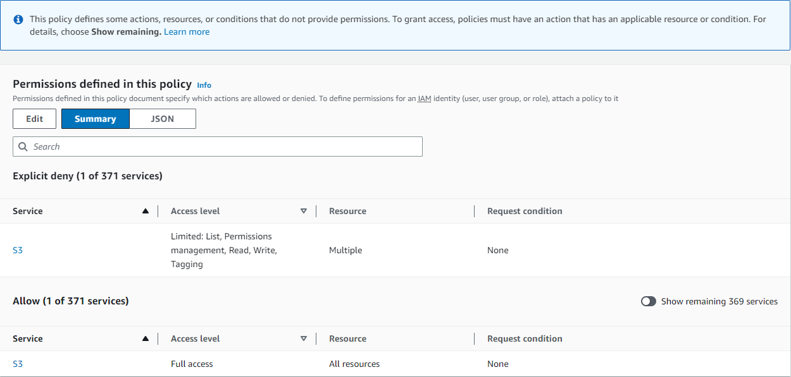

_**DenyCustomerBucket S3 (Explicit deny)** Service
Summary:_

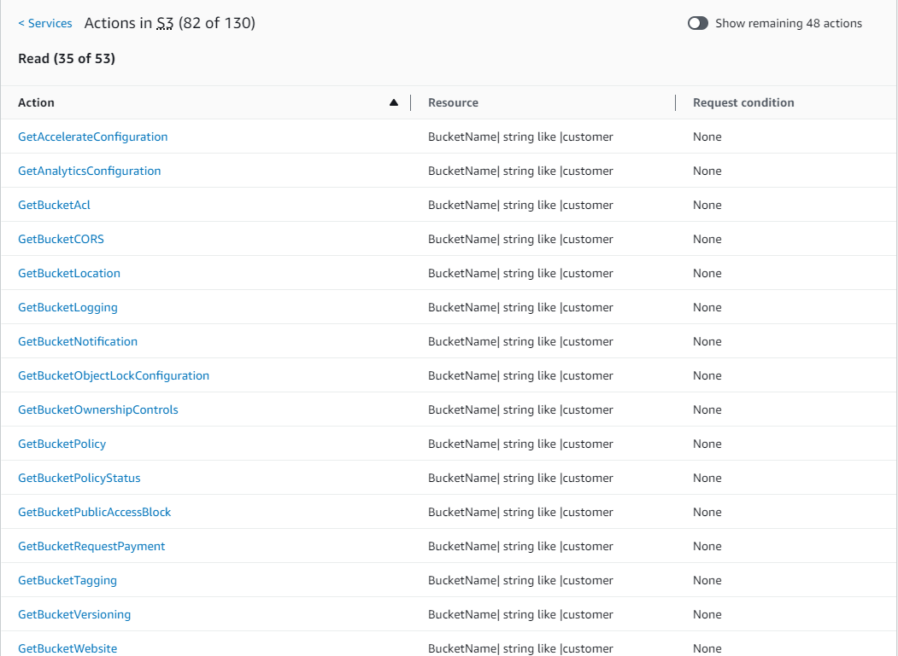

_**GetObject (Read)** Action
Summary:_

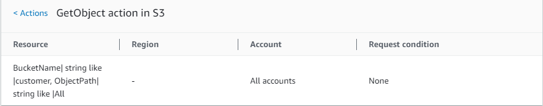

## Policy 2: DynamoDbRowCognitoID

This policy provides row-level access to Amazon DynamoDB based on the user's Amazon Cognito ID.

JSON

```
`{
 "Version":"2012-10-17",
 "Statement": [
 {
 "Effect": "Allow",
 "Action": [
 "dynamodb:DeleteItem",
 "dynamodb:GetItem",
 "dynamodb:PutItem",
 "dynamodb:UpdateItem"
 ],
 "Resource": [
 "arn:aws:dynamodb:us-west-1:123456789012:table/myDynamoTable"
 ],
 "Condition": {
 "ForAllValues:StringEquals": {
 "dynamodb:LeadingKeys": [
 "${cognito-identity.amazonaws.com:sub}"
 ]
 }
 }
 }
 ]
}`

```

_**DynamoDbRowCognitoID** Policy
Summary:_

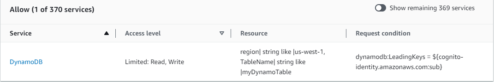

_**DynamoDbRowCognitoID DynamoDB (Allow)** Service
Summary:_

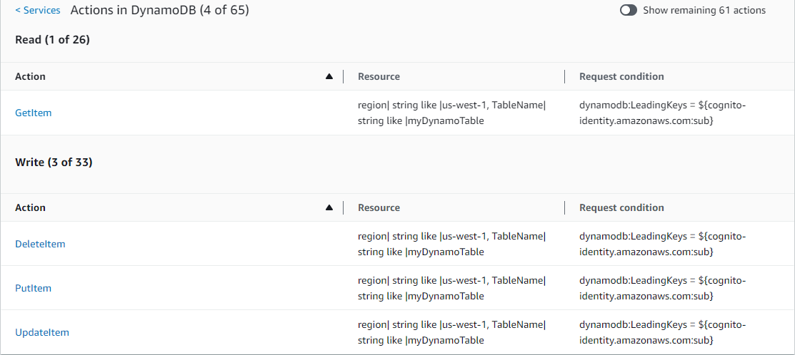

_**GetItem (List)** Action
Summary:_

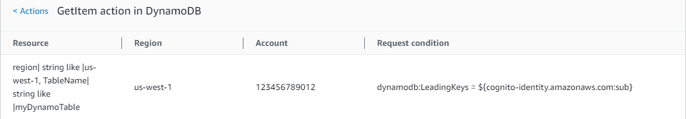

## Policy 3: MultipleResourceCondition

This policy includes multiple resources and conditions.

JSON

```
`{
 "Version":"2012-10-17",
 "Statement": [
 {
 "Effect": "Allow",
 "Action": [
 "s3:PutObject",
 "s3:PutObjectAcl"
 ],
 "Resource": ["arn:aws:s3:::Apple_bucket/*"],
 "Condition": {"StringEquals": {"s3:x-amz-acl": ["public-read"]}}
 },
 {
 "Effect": "Allow",
 "Action": [
 "s3:PutObject",
 "s3:PutObjectAcl"
 ],
 "Resource": ["arn:aws:s3:::Orange_bucket/*"],
 "Condition": {"StringEquals": {
 "s3:x-amz-acl": ["custom"],
 "s3:x-amz-grant-full-control": ["1234"]
 }}
 }
 ]
}`

```

_**MultipleResourceCondition** Policy
Summary:_

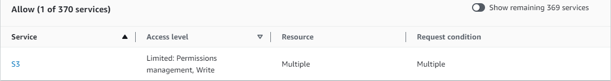

_**MultipleResourceCondition S3 (Allow)** Service
Summary:_

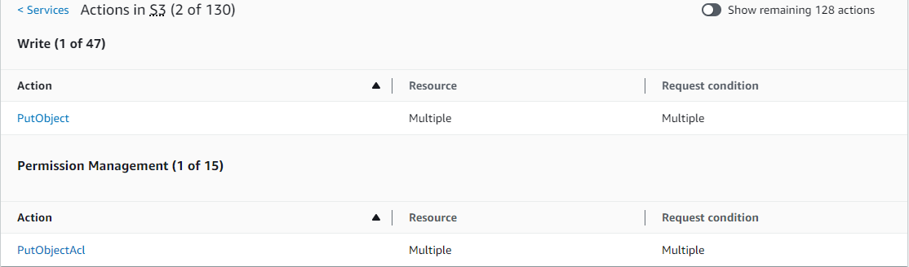

_**PutObject (Write)** Action
Summary:_

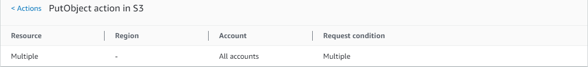

## Policy 4: EC2\_troubleshoot

The following policy allows users to get a screenshot of a running Amazon EC2 instance, which
can help with EC2 troubleshooting. This policy also permits viewing information about the
items in the Amazon S3 developer bucket.

JSON

```
`{
 "Version":"2012-10-17",
 "Statement": [
 {
 "Effect": "Allow",
 "Action": [
 "ec2:GetConsoleScreenshot"
 ],
 "Resource": [
 "*"
 ]
 },
 {
 "Effect": "Allow",
 "Action": [
 "s3:ListBucket"
 ],
 "Resource": [
 "arn:aws:s3:::developer"
 ]
 }
 ]
}`

```

_**EC2\_Troubleshoot** Policy
Summary:_

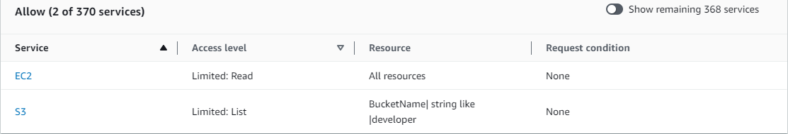

_**EC2\_Troubleshoot S3 (Allow)** Service
Summary:_

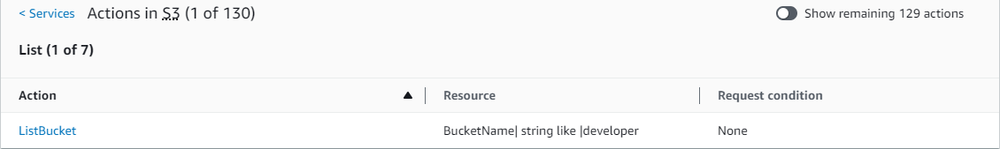

_**ListBucket (List)** Action
Summary:_

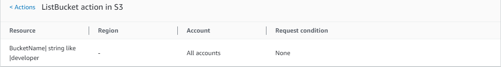

## Policy 5: CodeBuild\_CodeCommit\_CodeDeploy

This policy provides access to specific CodeBuild, CodeCommit, and CodeDeploy resources. Because these
resources are specific to each service, they appear only with the matching service. If you
include a resource that does not match any services in the `Action` element, then
the resource appears in all action summaries.

JSON

```
`{
 "Version":"2012-10-17",
 "Statement": [
 {
 "Sid": "Stmt1487980617000",
 "Effect": "Allow",
 "Action": [
 "codebuild:*",
 "codecommit:*",
 "codedeploy:*"
 ],
 "Resource": [
 "arn:aws:codebuild:us-east-2:123456789012:project/my-demo-project",
 "arn:aws:codecommit:us-east-2:123456789012:MyDemoRepo",
 "arn:aws:codedeploy:us-east-2:123456789012:application:WordPress_App",
 "arn:aws:codedeploy:us-east-2:123456789012:instance/AssetTag*"
 ]
 }
 ]
}`

```

_**CodeBuild\_CodeCommit\_CodeDeploy** Policy
Summary:_

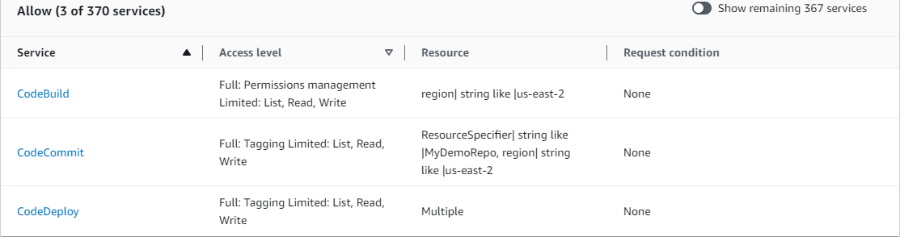

_**CodeBuild\_CodeCommit\_CodeDeploy CodeBuild
(Allow)** Service Summary:_

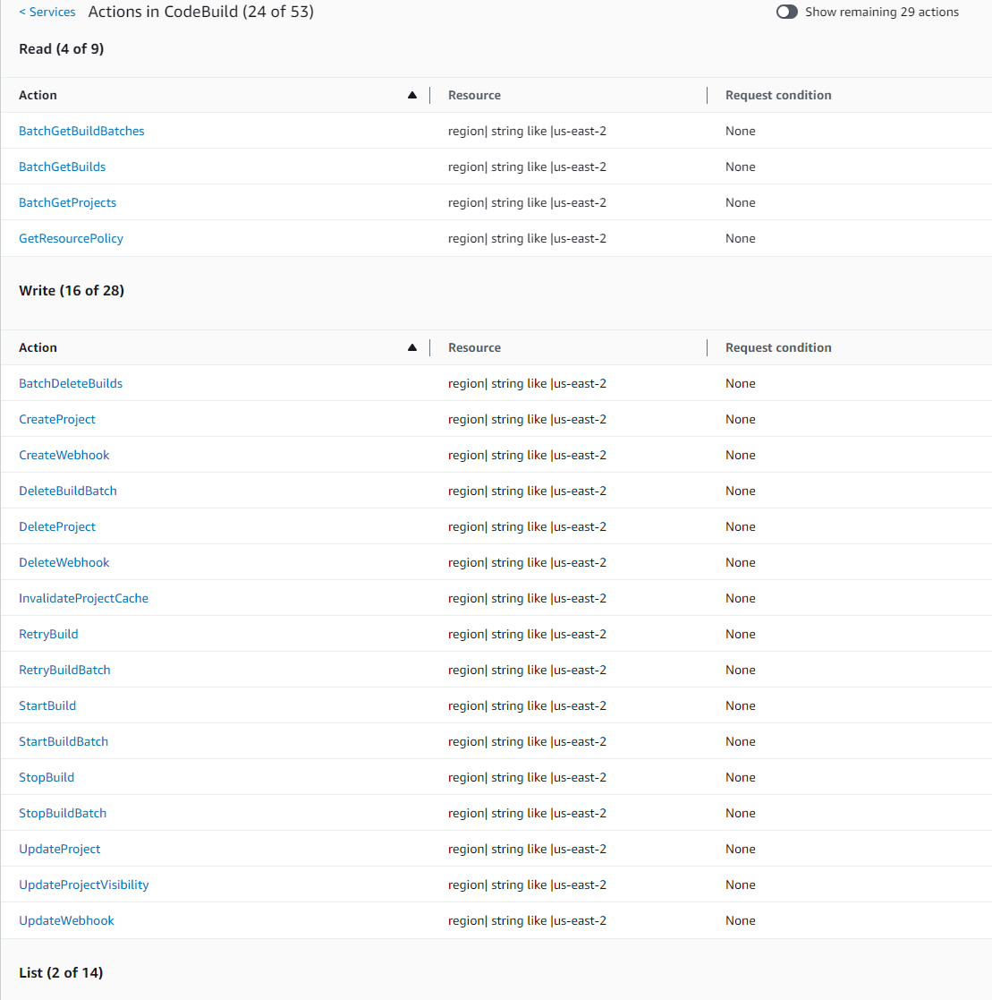

_**CodeBuild\_CodeCommit\_CodeDeploy StartBuild
(Write)** Action Summary:_

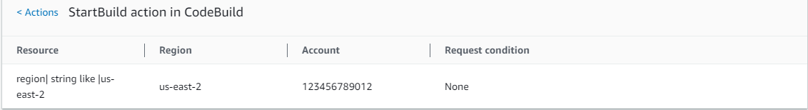
