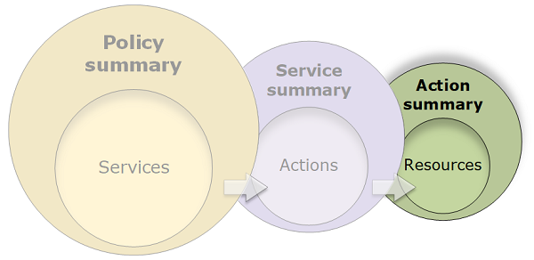
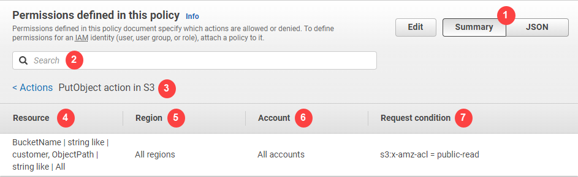

# Action summary (list of

resources)

Policies are summarized in three tables: the [policy summary](access_policies_understand-policy-summary.md "access_policies_understand-policy-summary.md"), the [service summary](access_policies_understand-service-summary.md "access_policies_understand-service-summary.md"), and the
action summary. The _action summary_ table includes a list of resources and
the associated conditions that apply to the chosen action.

To view an action summary for each action that grants permissions, choose the link in the
service summary. The action summary table includes details about the resource, including its
**Region** and **Account**. You can also view the conditions
that apply to each resource. This shows you conditions that apply to some resources but not
others.

## Understanding the elements of an

action summary

The example below is the action summary for the `PutObject` (Write) action from
the Amazon S3 service summary (see [Service summary (list of
actions)](access_policies_understand-service-summary.md "access_policies_understand-service-summary.md")). For this action, the policy
defines multiple conditions on a single resource.

The action summary page includes the following information:

1. Choose **JSON** to see additional details about the policy, such as
   viewing the multiple conditions that are applied to the actions. (If you are viewing the
   action summary for an inline policy that is attached directly to a user, the steps differ.
   To access the JSON policy document in that case, you must close the action summary dialog
   box and return to the policy summary.)
2. To view the summary for a specific resource, type keywords into the
   **Search** box to reduce the list of available resources.
3. Next to the **Actions** back arrow appears the name of the service
   and action in the format `action name action in service` (in this case
   **PutObject action in S3**). The action summary for this service
   includes the list of resources that are defined in the policy.
4. **Resource** – This column lists the resources
   that the policy defines for the chosen service. In this example, the
   **PutObject** action is allowed on all object paths, but on only the
   `developer_bucket` Amazon S3 bucket resource. Depending on the information that
   the service provides to IAM, you might see an ARN such as
   `arn:aws:s3:::developer_bucket/*`, or you might see the defined resource
   type, such as `BucketName = developer_bucket, ObjectPath = All`.
5. **Region** – This column shows the Region in which the
   resource is defined. Resources can be defined for all Regions, or a single Region. They
   cannot exist in more than one specific Region.
   - **All regions** – The actions that are associated with the
     resource apply to all Regions. In this example, the action belongs to a global
     service, Amazon S3. Actions that belong to global services apply to all Regions.
   - Region text – The actions associated with the resource apply to one Region.
     For example, a policy can specify the `us-east-2` Region for
     a resource.

6. **Account** – This column indicates whether the services or
   actions associated with the resource apply to a specific account. Resources can exist in
   all accounts or a single account. They cannot exist in more than one specific
   account.
   - **All accounts** – The actions that are associated with
     the resource apply to all accounts. In this example, the action belongs to a global
     service, Amazon S3. Actions that belong to global services apply to all accounts.
   - **This account** – The actions that are associated with
     the resource apply only in the current account..
   - Account number – The actions that are associated with the resource apply to
     one account (one that you are not currently logged in to). For example, if a policy
     specifies the `123456789012` account for a resource, then the account
     number appears in the policy summary.

7. **Request condition** – This column shows whether
   the actions that are associated with the resource are subject to conditions. This example
   includes the `s3:x-amz-acl = public-read` condition. To learn more about those
   conditions, choose **JSON** to review the JSON policy document.
