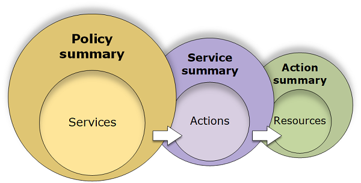

# Policy summaries

The IAM console includes _policy summary_ tables that describe the
access level, resources, and conditions that are allowed or denied for each service in a policy.
Policies are summarized in three tables: the [policy summary](access_policies_understand-policy-summary.md "access_policies_understand-policy-summary.md"), the [service summary](access_policies_understand-service-summary.md "access_policies_understand-service-summary.md"), and the
[action summary](access_policies_understand-action-summary.md "access_policies_understand-action-summary.md"). The
_policy summary_ table includes a list of services. Choose a service there
to see the _service summary_. This summary table includes a list of the
actions and associated permissions for the chosen service. You can choose an action from that
table to view the _action summary_. This table includes a list of resources
and conditions for the chosen action.

You can view policy summaries on the **Users** page or
**Roles** page for all policies (managed and inline) that are attached to
that user. View summaries on the **Policies** page for all managed policies.
Managed policies include AWS managed policies, AWS managed job function policies, and
customer managed policies. You can view summaries for these policies on the
**Policies** page regardless of whether they are attached to a user or other
IAM identity.

You can use the information in the policy summaries to understand the permissions that are
allowed or denied by your policy. Policy summaries can help you [troubleshoot](troubleshoot_policies.md "troubleshoot_policies.md") and
fix policies that are not providing the permissions that you expect.

###### Topics

- [Policy summary (list of
  services)](access_policies_understand-policy-summary.md "access_policies_understand-policy-summary.md")
- [Access levels
  in policy summaries](access_policies_understand-policy-summary-access-level-summaries.md "access_policies_understand-policy-summary-access-level-summaries.md")
- [Service summary (list of
  actions)](access_policies_understand-service-summary.md "access_policies_understand-service-summary.md")
- [Action summary (list of
  resources)](access_policies_understand-action-summary.md "access_policies_understand-action-summary.md")
- [Examples of policy summaries](access_policies_policy-summary-examples.md "access_policies_policy-summary-examples.md")
