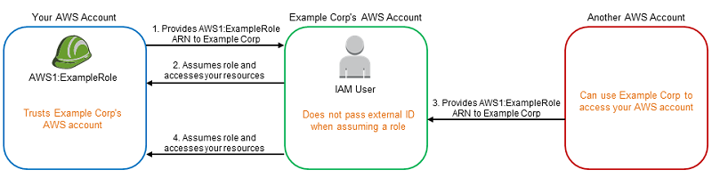
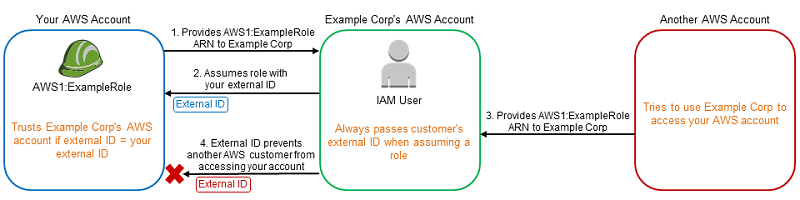
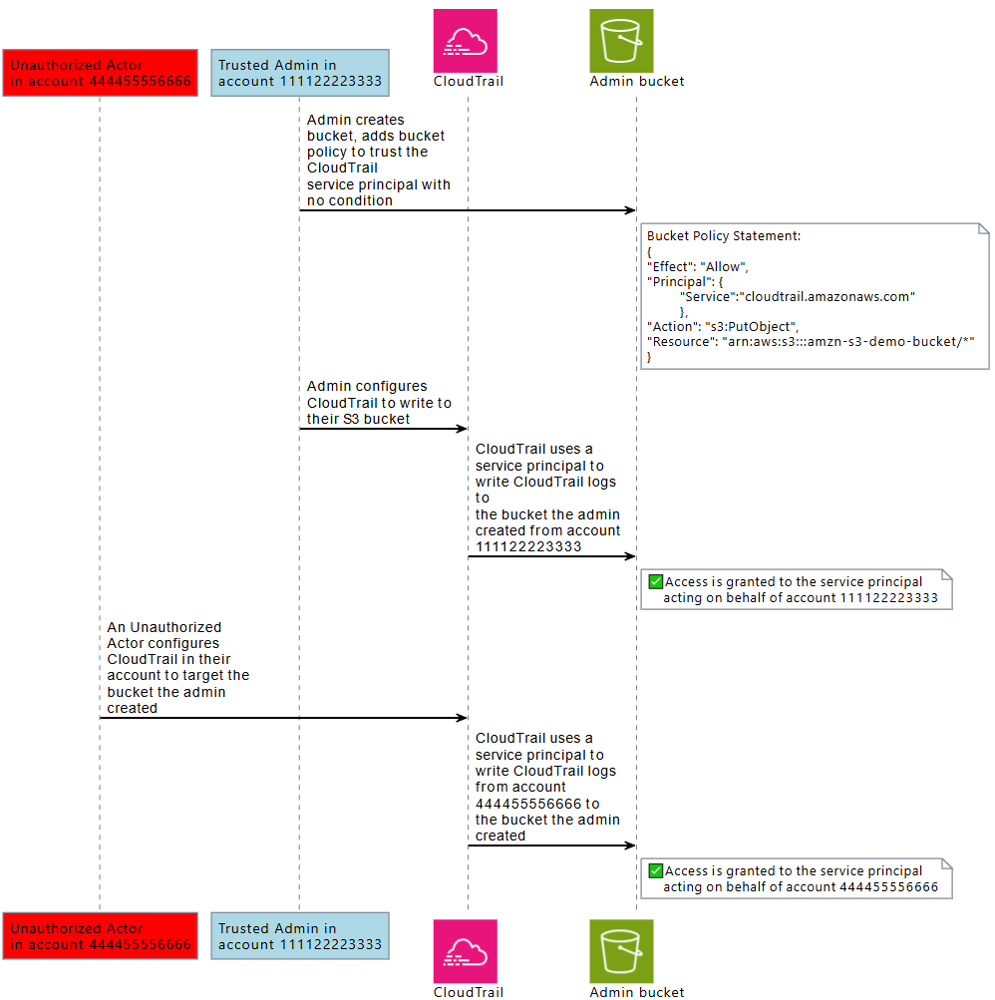
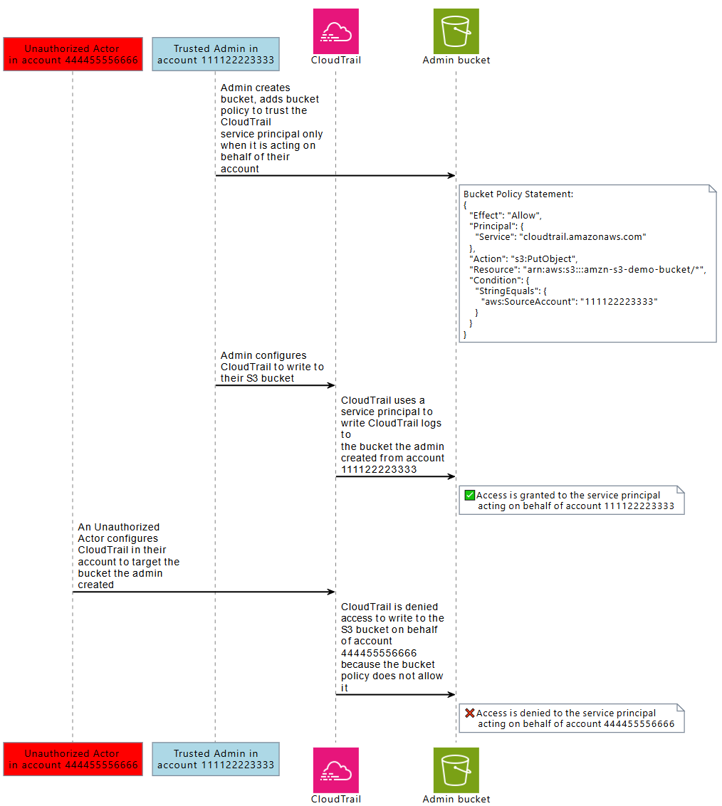

# The confused deputy problem

The confused deputy problem is a security issue where an entity that doesn't have
permission to perform an action can coerce a more-privileged entity to perform the action.
To prevent this, AWS provides tools that help you protect your account if you provide
third parties (known as _cross-account_) or other AWS services (known
as _cross-service_) access to resources in your account.

At times, you might need to give a third party access to your AWS resources (delegate
access). For example, you decide to hire a third-party company called Example Corp to
monitor your AWS account and help optimize costs. In order to track your daily spending,
Example Corp needs to access your AWS resources. Example Corp also monitors many other
AWS accounts for other customers. You can use an IAM role to establish a trusted
relationship between your AWS account and the Example Corp account. One important aspect
of this scenario is the _external ID_, an optional identifier that you
can use in an IAM role trust policy to designate who can assume the role. The primary
function of the external ID is to address and prevent the confused deputy problem.

Some AWS services (calling services) use their AWS service principal to access AWS
resources from other AWS services (called services). In some of these service interactions
you can configure calling services to communicate with the resources from a called service
in a different AWS account. An example of this is configuring AWS CloudTrail to write to a
central Amazon S3 bucket which is located in a different AWS account. The calling service, CloudTrail
is granted access to your S3 bucket using the S3 bucket’s policy by adding an allow
statement for `cloudtrail.amazonaws.com`.

When an AWS service principal from a calling service is accessing a resource from a
called service, the resource policy from the called service is only authorizing the AWS
service principal, and not the actor who configured the calling service. For example, an S3
bucket that trusts the CloudTrail service principal with no conditions could receive CloudTrail logs
from the AWS accounts that a trusted admin configures, but also CloudTrail logs from an
unauthorized actor in their AWS account, if they know the name of the S3 bucket.

The confused deputy problem arises when an actor uses the trust of an AWS service’s
service principal to gain access to resources that they are not intended to have access
to.

## Cross-account confused deputy

prevention

The following diagram illustrates the cross-account confused deputy problem.



This scenario assumes the following:

- **AWS1** is your AWS account.
- **AWS1:ExampleRole** is a role in your account.
  This role's trust policy trusts Example Corp by specifying Example Corp's AWS
  account as the one that can assume the role.

Here's what happens:

1. When you start using Example Corp's service, you provide the ARN of **AWS1:ExampleRole** to Example Corp.
2. Example Corp uses that role ARN to obtain temporary security credentials to
   access resources in your AWS account. In this way, you are trusting Example
   Corp as a "deputy" that can act on your behalf.
3. Another AWS customer also starts using Example Corp's service, and this
   customer also provides the ARN of **AWS1:ExampleRole** for Example Corp to use. Presumably the other
   customer learned or guessed the **AWS1:ExampleRole**, which isn't a secret.
4. When the other customer asks Example Corp to access AWS resources in (what
   it claims to be) its account, Example Corp uses **AWS1:ExampleRole** to access resources in your account.

This is how the other customer could gain unauthorized access to your resources.
Because this other customer was able to trick Example Corp into unwittingly acting on
your resources, Example Corp is now a "confused deputy."

Example Corp can address the confused deputy problem by requiring that you include the
`ExternalId` condition check in the role's trust policy. Example Corp
generates a unique `ExternalId` value for each customer and uses that value
in its request to assume the role. The `ExternalId` value must be unique
among Example Corp's customers and controlled by Example Corp, not its customers. This
is why you get it from Example Corp and you don't come up with it on your own. This
prevents Example Corp from being a confused deputy and granting access to another
account's AWS resources.

In our scenario, imagine Example Corp's unique identifier for you is 12345, and its
identifier for the other customer is 67890. These identifiers are simplified for this
scenario. Generally, these identifiers are GUIDs. Assuming that these identifiers are
unique among Example Corp's customers, they are sensible values to use for the external
ID.

Example Corp gives the external ID value of 12345 to you. You must then add a
`Condition` element to the role's trust policy that requires the [`sts:ExternalId`](reference_policies_iam-condition-keys.md#condition-keys-sts "reference_policies_iam-condition-keys.md#condition-keys-sts") value to be 12345, like this:

JSON

```
`{
 "Version":"2012-10-17",
 "Statement": {
 "Effect": "Allow",
 "Principal": {
 "AWS": "`Example Corp's AWS Account ID`"
 },
 "Action": "sts:AssumeRole",
 "Condition": {
 "StringEquals": {
 "sts:ExternalId": "12345"
 }
 }
 }
}`

```

The Condition element in this policy allows Example Corp to assume the role only when
the AssumeRole API call includes the external ID value of 12345. Example Corp makes sure
that whenever it assumes a role on behalf of a customer, it always includes that
customer's external ID value in the AssumeRole call. Even if another customer supplies
Example Corp with your ARN, it cannot control the external ID that Example Corp includes
in its request to AWS. This helps prevent an unauthorized customer from gaining access
to your resources.

The following diagram illustrates this.



1. As before, when you start using Example Corp's service, you provide the ARN of
   **AWS1:ExampleRole** to Example Corp.
2. When Example Corp uses that role ARN to assume the role **AWS1:ExampleRole**, Example Corp includes your external ID
   (12345) in the AssumeRole API call. The external ID matches the role's trust
   policy, so the AssumeRole API call succeeds and Example Corp obtains temporary
   security credentials to access resources in your AWS account.
3. Another AWS customer also starts using Example Corp's service, and as
   before, this customer also provides the ARN of **AWS1:ExampleRole** for Example Corp to use.
4. But this time, when Example Corp attempts to assume the role **AWS1:ExampleRole**, it provides the external ID
   associated with the other customer (67890). The other customer has no way to
   change this. Example Corp does this because the request to use the role came
   from the other customer, so 67890 indicates the circumstance in which Example
   Corp is acting. Because you added a condition with your own external ID (12345)
   to the trust policy of **AWS1:ExampleRole**, the
   AssumeRole API call fails. The other customer is prevented from gaining
   unauthorized access to resources in your account (indicated by the red "X" in
   the diagram).

The external ID helps prevent any other customer from tricking Example Corp into
unwittingly accessing your resources.

## Cross-service confused deputy

prevention

The following diagram demonstrates the cross-service confused deputy problem using the
CloudTrail and Amazon S3 interaction example, where an unauthorized actor writes CloudTrail logs to an
Amazon S3 bucket they are not authorized to have access to.



To help protect against an unauthorized actor from using the trust of an AWS
principal to gain access to your resources, AWS service principals include information
about the AWS resource, AWS account, and AWS organization they’re acting on behalf
of.

This information is available in global condition key values that can be used in a
resource policy, or resource control policy for requests made by AWS service
principals. We recommend using [aws:SourceArn](reference_policies_condition-keys.md#condition-keys-sourcearn "reference_policies_condition-keys.md#condition-keys-sourcearn"), [aws:SourceAccount](reference_policies_condition-keys.md#condition-keys-sourceaccount "reference_policies_condition-keys.md#condition-keys-sourceaccount"), [aws:SourceOrgID](reference_policies_condition-keys.md#condition-keys-sourceorgid "reference_policies_condition-keys.md#condition-keys-sourceorgid"), or [aws:SourceOrgPaths](reference_policies_condition-keys.md#condition-keys-sourceorgpaths "reference_policies_condition-keys.md#condition-keys-sourceorgpaths") in your resource policies wherever
an AWS service principal is granted permission to access one of your resources. These
condition keys allow you to test in your resource policies, or resource control policies
that AWS service principals accessing your resources are doing so on behalf of AWS
resources, AWS accounts, or AWS Organizations you expect.

- Use `aws:SourceArn` to allow an AWS service principal to access
  your resources on behalf of a specific resource, such as a specific AWS CloudTrail
  trail or AppStream fleet.
- Use `aws:SourceAccount` to allow an AWS service principal to
  access your resources on behalf of a specific AWS account.
- Use `aws:SourceOrgID` to allow an AWS service principal to access
  your resources on behalf of specific AWS Organizations.
- Use `aws:SourceOrgPaths` to allow AWS service principal to access
  your resources on behalf of a specific AWS Organizations path.

The following diagram demonstrates the cross-service confused deputy scenario when a
resource is configured with the `aws:SourceAccount` global condition context
key, and an unauthorized actor from another account tries to access AWS resources they
are not intended to have access to.



Using `aws:SourceArn`, `aws:SourceAccount`,
`aws:SourceOrgID`, and `aws:SourceOrgPaths` global condition
keys in a policy help you ensure service principals are accessing your resources on your
behalf. We recommend using these condition keys whenever access to one of your resources
is granted to an AWS service principal.

###### Note

Some AWS service interactions have additional controls to help protect against
cross-service confused deputy issues that test user access to a resource. For
example, when a KMS key grant is issued to an AWS service, AWS KMS uses the
encryption context associated with the resource, and the key grant to help protect
against cross-service confused deputy issues.

Please see the documentation of the services you use for more information about
service-specific mechanisms that can help avoid cross-service confused deputy risks,
and whether `aws:SourceArn`, `aws:SourceAccount`,
`aws:SourceOrgID`, and `aws:SourceOrgPaths` are
supported.

## Cross-service

confused deputy protection with resource-based policies

The following example policy grants the service principal
`cloudtrail.amazonaws.com` access to the Amazon S3 bucket,
arn:aws:s3:::amzn-s3-demo-bucket1, only when the service principal is acting on
behalf of AWS account 111122223333.

JSON

```
`{
 "Version":"2012-10-17",
 "Statement": [
 {
 "Sid": "CloudTrailAclCheck",
 "Effect": "Allow",
 "Principal": {"Service": "cloudtrail.amazonaws.com"},
 "Action": "s3:GetBucketAcl",
 "Resource": "arn:aws:s3:::`amzn-s3-demo-bucket1`",
 "Condition": {
 "StringEquals": {
 "aws:SourceAccount": "111122223333"
 }
 }
 },
 {
 "Sid": "AWSCloudTrailWrite",
 "Effect": "Allow",
 "Principal": {"Service": "cloudtrail.amazonaws.com"},
 "Action": "s3:PutObject",
 "Resource": "arn:aws:s3:::`amzn-s3-demo-bucket1/[optionalPrefix]/Logs/myAccountID/*`",
 "Condition": {
 "StringEquals": {
 "aws:SourceAccount": "111122223333"
 }
 }
 }
 ]
}`

```

This example bucket policy grants the service principal
`appstream.amazonaws.com` access to the powershell script examplefile.psh
within the s3://amzn-s3-demo-bucket2 only when it is acting on behalf of the specified
Amazon AppStream fleet, by specifying the fleet arn with `aws:SourceArn`.

JSON

```
`{
 "Version":"2012-10-17",
 "Statement": [
 {
 "Effect": "Allow",
 "Principal": {
 "Service": [
 "appstream.amazonaws.com"
 ]
 },
 "Action": "s3:GetObject",
 "Resource": "arn:aws:s3:::`amzn-s3-demo-bucket2/examplefile.psh`",
 "Condition": {
 "ArnEquals": {
 "aws:SourceArn": "arn:aws:appstream:us-east-1:`111122223333`:`fleet/ExampleFleetName`"
 }
 }
 }
 ]
}`

```

## Cross-service confused deputy protection with resource control policies

You can use resource control policies (RCP) to apply cross-service confused deputy
controls to resources of supported AWS services. RCPs allow you to centrally apply
cross-service confused deputy controls on your resources. You can use condition keys
like `aws:SourceOrgId` and `aws:SourceOrgPaths` with RCPs attached
to your AWS Organizations, organization units (OU) or AWS accounts in your organization without
adding statements to specific resource-based policies. For more information about RCPs
and supported services, see [Resource control
policies (RCPs)](../../../organizations/latest/userguide/orgs_manage_policies_rcps.md "../../../organizations/latest/userguide/orgs_manage_policies_rcps.md") in the _AWS Organizations User Guide_.

The following example RCP denies AWS service principals access to Amazon S3 buckets in
your member accounts when `aws:SourceOrgID` is not equal to o-ExampleOrg. A
corresponding allow must be present in the resource-based policy of the S3 bucket to
allow AWS service principals with a `SourceOrgID` equal to
o-ExampleOrg.

This policy applies the control only on requests by service principals (`"Bool":
 {"aws:PrincipalIsAWSService": "true"}`) that have the
`aws:SourceAccount` key present (`"Null": {"aws:SourceAccount":
 "false"}`), so that service integrations that don't require the use of the
condition key and calls by your principals aren't impacted. If the
`aws:SourceAccount` condition key is present in the request context, the
Null condition will evaluate to true, causing `aws:SourceOrgID` to be
enforced. We use `aws:SourceAccount` instead of `aws:SourceOrgID`
in the Null condition operator so that the control still applies if the request
originates from an account that doesn’t belong to an organization.

JSON

```
`{
 "Version":"2012-10-17",
 "Statement": [
 {
 "Sid": "RCPEnforceConfusedDeputyProtectionForS3",
 "Effect": "Deny",
 "Principal": "*",
 "Action": [
 "s3:*"
 ],
 "Resource": "*",
 "Condition": {
 "StringNotEqualsIfExists": {
 "aws:SourceOrgID": "`o-ExampleOrg`"
 },
 "Null": {
 "aws:SourceAccount": "false"
 },
 "Bool": {
 "aws:PrincipalIsAWSService": "true"
 }
 }
 }
 ]
}`

```
