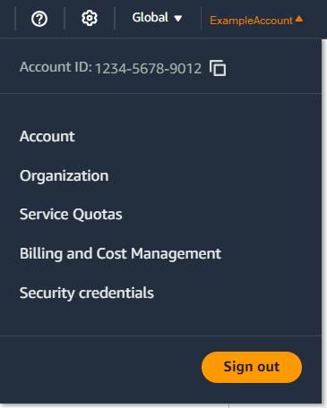

# Enable a passkey or security key for the root user

(console)

You can configure and enable a passkey for your root user from the AWS Management Console only, not from
the AWS CLI or AWS API.

###### To enable a passkey or security key for your root user (console)

1. Open the [AWS Management Console](https://console.aws.amazon.com/ "https://console.aws.amazon.com/") and sign in using your root user credentials.

For instructions, see [Sign in
to the AWS Management Console as the root user](../../../signin/latest/userguide/introduction-to-root-user-sign-in-tutorial.md "../../../signin/latest/userguide/introduction-to-root-user-sign-in-tutorial.md") in the _AWS Sign-In User
Guide_. 2. On the right side of the navigation bar, choose your account name, and then choose
**Security credentials**.

 3. On your root user **My security credentials** page, under
**Multi-factor authentication (MFA)**, choose **Assign MFA
device**. 4. On the **MFA device name** page, enter a **Device
name**, choose **Passkey or Security Key**, and then choose
**Next**. 5. On **Set up device**, set up your passkey. Create a passkey with
biometric data like your face or fingerprint, with a device pin, or by inserting the
FIDO security key into your computer's USB port and tapping it. 6. Follow the instructions on your browser to choose a passkey provider or where you
want to store your passkey to use across your devices. 7. Choose **Continue**.
You have now registered your passkey for use with AWS. The next time you use your
root user credentials to sign in, you must authenticate with your passkey to complete the
sign-in process.

For help troubleshooting issues with your FIDO security key, see [Troubleshoot Passkeys and FIDO Security Keys](troubleshoot_mfa-fido.md "troubleshoot_mfa-fido.md").
