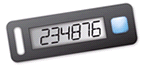

# Assign a hardware TOTP token in the

AWS Management Console

A hardware TOTP token generates a six-digit numeric code based upon a time-based one-time
password (TOTP) algorithm. The user must type a valid code from the device when prompted during
the sign-in process. Each MFA device assigned to a user must be unique; a user cannot type a
code from another user's device to be authenticated. MFA devices cannot be shared across
accounts or users.

Hardware TOTP tokens and [FIDO security
keys](id_credentials_mfa_enable_fido.md "id_credentials_mfa_enable_fido.md") are both physical devices that you purchase. Hardware MFA devices generate TOTP
codes for authentication when you sign in to AWS. They rely on batteries, which may need
replacement and resynchronization with AWS over time. FIDO security keys, which utilize public
key cryptography, do not require batteries and offer a seamless authentication process. We
recommend using FIDO security keys for their phishing resistance, which provides a more secure
alternative to TOTP devices. Additionally, FIDO security keys can support multiple IAM or root
users on the same device, enhancing their utility for account security. For specifications and
purchase information for both device types, see [Multi-Factor Authentication](http://aws.amazon.com/iam/details/mfa/ "http://aws.amazon.com/iam/details/mfa/").

You can enable a hardware TOTP token for an IAM user from the AWS Management Console, the command line,
or the IAM API. To enable an MFA device for your AWS account root user, see [Enable a hardware TOTP token for the root user
(console)](enable-hw-mfa-for-root.md "enable-hw-mfa-for-root.md").

You can register up to **eight** MFA devices of any combination
of the [currently supported MFA
types](https://aws.amazon.com/iam/features/mfa/ "https://aws.amazon.com/iam/features/mfa/") with your AWS account root user and IAM users. With multiple MFA devices, you only need
one MFA device to sign in to the AWS Management Console or create a session through the AWS CLI as that
user.

###### Important

We recommend that you enable multiple MFA devices for your users for continued access to
your account in case of a lost or inaccessible MFA device.

###### Note

If you want to enable the MFA device from the command line, use [`aws iam
 enable-mfa-device`](../../../cli/latest/reference/iam/enable-mfa-device.md "../../../cli/latest/reference/iam/enable-mfa-device.md"). To enable the MFA device with the IAM API, use the
[`EnableMFADevice`](../APIReference/API_EnableMFADevice.md "../APIReference/API_EnableMFADevice.md")
operation.

###### Topics

- [Permissions required](#enable-hw-mfa-for-iam-user-permissions-required "#enable-hw-mfa-for-iam-user-permissions-required")
- [Enable a hardware TOTP token for your own
  IAM user (console)](#enable-hw-mfa-for-own-iam-user "#enable-hw-mfa-for-own-iam-user")
- [Enable a hardware TOTP token for another
  IAM user (console)](#enable-hw-mfa-for-iam-user "#enable-hw-mfa-for-iam-user")
- [Replace a physical MFA device](#replace-phys-mfa "#replace-phys-mfa")

## Permissions required

To manage a hardware TOTP token for your own IAM user while protecting sensitive
MFA-related actions, you must have the permissions from the following policy:

JSON

```
`{
 "Version":"2012-10-17",
 "Statement": [
 {
 "Sid": "AllowManageOwnUserMFA",
 "Effect": "Allow",
 "Action": [
 "iam:DeactivateMFADevice",
 "iam:EnableMFADevice",
 "iam:GetUser",
 "iam:ListMFADevices",
 "iam:ResyncMFADevice"
 ],
 "Resource": "arn:aws:iam::*:user/${aws:username}"
 },
 {
 "Sid": "DenyAllExceptListedIfNoMFA",
 "Effect": "Deny",
 "NotAction": [
 "iam:EnableMFADevice",
 "iam:GetUser",
 "iam:ListMFADevices",
 "iam:ResyncMFADevice"
 ],
 "Resource": "arn:aws:iam::*:user/${aws:username}",
 "Condition": {
 "BoolIfExists": {
 "aws:MultiFactorAuthPresent": "false"
 }
 }
 }
 ]
}`

```

## Enable a hardware TOTP token for your own

IAM user (console)

You can enable your own hardware TOTP token from the AWS Management Console.

###### Note

Before you can enable a hardware TOTP token, you must have physical access to the
device.

###### To enable a hardware TOTP token for your own IAM user (console)

1. Use your AWS account ID or account alias, your IAM user name, and your password to sign in
   to the [IAM console](https://console.aws.amazon.com/iam "https://console.aws.amazon.com/iam").

###### Note

For your convenience, the AWS sign-in page uses a browser cookie to remember your
IAM user name and account information. If you previously signed in as a different user,
choose **Sign in to a different account** near the bottom of the page to
return to the main sign-in page. From there, you can type your AWS account ID or account
alias to be redirected to the IAM user sign-in page for your account.

To get your AWS account ID, contact your administrator. 2. In the navigation bar on the upper right, choose your user name, and then choose
**Security credentials**.

 3. On the **AWS IAM credentials** tab, in the **Multi-factor
authentication (MFA)** section, choose **Assign MFA
device**. 4. In the wizard, type a **Device name**, choose **Hardware TOTP
token**, and then choose **Next**. 5. Type the device serial number. The serial number is usually on the back of the
device. 6. In the **MFA code 1** box, type the six-digit number displayed by the
MFA device. You might need to press the button on the front of the device to display the
number.

 7. Wait 30 seconds while the device refreshes the code, and then type the next six-digit
number into the **MFA code 2** box. You might need to press the button on
the front of the device again to display the second number. 8. Choose **Add MFA**.

###### Important

Submit your request immediately after generating the authentication codes. If you
generate the codes and then wait too long to submit the request, the MFA device
successfully associates with the user but the MFA device becomes out of sync. This
happens because time-based one-time passwords (TOTP) expire after a short period of
time. If this happens, you can [resync the
device](id_credentials_mfa_sync.md "id_credentials_mfa_sync.md").

The device is ready for use with AWS. For information about using MFA with the
AWS Management Console, see [MFA enabled sign-in](console_sign-in-mfa.md "console_sign-in-mfa.md").

## Enable a hardware TOTP token for another

IAM user (console)

You can enable a hardware TOTP token for another IAM user from the AWS Management Console.

###### To enable a hardware TOTP token for another IAM user (console)

1. Sign in to the AWS Management Console and open the IAM console at [https://console.aws.amazon.com/iam/](https://console.aws.amazon.com/iam/ "https://console.aws.amazon.com/iam/").
2. In the navigation pane, choose **Users**.
3. Choose the name of the user for whom you want to enable MFA.
4. Choose the **Security Credentials** tab. Under **Multi-factor
   authentication (MFA)**, choose **Assign MFA device**.
5. In the wizard, type a **Device name**, choose **Hardware TOTP
   token**, and then choose **Next**.
6. Type the device serial number. The serial number is usually on the back of the
   device.
7. In the **MFA code 1** box, type the six-digit number displayed by the
   MFA device. You might need to press the button on the front of the device to display the
   number.

 8. Wait 30 seconds while the device refreshes the code, and then type the next six-digit
number into the **MFA code 2** box. You might need to press the button on
the front of the device again to display the second number. 9. Choose **Add MFA**.

###### Important

Submit your request immediately after generating the authentication codes. If you
generate the codes and then wait too long to submit the request, the MFA device
successfully associates with the user but the MFA device becomes out of sync. This
happens because time-based one-time passwords (TOTP) expire after a short period of
time. If this happens, you can [resync the
device](id_credentials_mfa_sync.md "id_credentials_mfa_sync.md").

The device is ready for use with AWS. For information about using MFA with the
AWS Management Console, see [MFA enabled sign-in](console_sign-in-mfa.md "console_sign-in-mfa.md").

## Replace a physical MFA device

You can have up to eight MFA devices of any combination of the [currently supported MFA types](https://aws.amazon.com/iam/features/mfa/ "https://aws.amazon.com/iam/features/mfa/")
assigned to a user at a time with your AWS account root user and IAM users. If the user loses a device
or needs to replace it for any reason, you must first deactivate the old device. Then you can
add the new device for the user.

- To deactivate the device currently associated with a user, see [Deactivate an MFA device](id_credentials_mfa_disable.md "id_credentials_mfa_disable.md").
- To add a replacement hardware TOTP token for an IAM user, follow the steps in the
  procedure [Enable a hardware TOTP token for another
  IAM user (console)](#enable-hw-mfa-for-iam-user "#enable-hw-mfa-for-iam-user") earlier in this topic.
- To add a replacement hardware TOTP token for the AWS account root user, follow the steps in the
  procedure [Enable a hardware TOTP token for the root user
  (console)](enable-hw-mfa-for-root.md "enable-hw-mfa-for-root.md")
  earlier in this topic.
