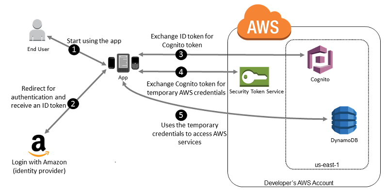

# Common scenarios

###### Note

We recommend that you require your human users to use temporary credentials when accessing AWS. Have you considered using AWS IAM Identity Center? You can use IAM Identity Center to centrally manage access to multiple AWS accounts and provide users with MFA-protected, single sign-on access to all their assigned accounts from one place. With IAM Identity Center, you can create and manage user identities in IAM Identity Center or easily connect to your existing SAML 2.0 compatible identity provider. For more information, see [What is IAM Identity Center?](../../../singlesignon/latest/userguide/what-is.md "../../../singlesignon/latest/userguide/what-is.md") in the _AWS IAM Identity Center User Guide_.

You can use an external identity provider (IdP) to manage user identities outside of
AWS and the external IdP. An external IdP can provide identity information to AWS using
either OpenID Connect (OIDC) or Security Assertion Markup Language (SAML). OIDC is commonly
used when an application that does not run on AWS needs access to AWS resources.

When you want to configure federation with an external IdP, you create an IAM
_identity provider_ to inform AWS about the external IdP and its
configuration. This establishes trust between your AWS account and the external IdP. The
following topics provide common scenarios to use IAM identity providers.

###### Topics

- [Amazon Cognito for mobile apps](#id_roles_providers_oidc_cognito "#id_roles_providers_oidc_cognito")
- [OIDC federation for mobile
  apps](#id_roles_providers_oidc_manual "#id_roles_providers_oidc_manual")

## Amazon Cognito for mobile apps

The preferred way to use OIDC federation is to use [Amazon Cognito](https://aws.amazon.com/cognito/ "https://aws.amazon.com/cognito/"). For example, Adele the developer is building a
game for a mobile device where user data such as scores and profiles is stored in Amazon S3 and
Amazon DynamoDB. Adele could also store this data locally on the device and use Amazon Cognito to keep it
synchronized across devices. She knows that for security and maintenance reasons, long-term
AWS security credentials should not be distributed with the game. She also knows that the game
might have a large number of users. For all of these reasons, she does not want to create new
user identities in IAM for each player. Instead, she builds the game so that users can sign in
using an identity that they've already established with a well-known external identity provider
(IdP), such as **Login with Amazon**, **Facebook**, **Google**, or any **OpenID Connect** (OIDC)-compatible IdP. Her game can take advantage of the
authentication mechanism from one of these providers to validate the user's identity.

To enable the mobile app to access her AWS resources, Adele first registers for a
developer ID with her chosen IdPs. She also configures the application with each of these
providers. In her AWS account that contains the Amazon S3 bucket and DynamoDB table for the game,
Adele uses Amazon Cognito to create IAM roles that precisely define permissions that the game needs. If
she is using an OIDC IdP, she also creates an IAM OIDC identity provider entity to establish
trust between an [Amazon Cognito identity
pool](../../../cognito/latest/developerguide/external-identity-providers.md "../../../cognito/latest/developerguide/external-identity-providers.md") in her AWS account and the IdP.

In the app's code, Adele calls the sign-in interface for the IdP that she configured
previously. The IdP handles all the details of letting the user sign in, and the app gets an
OAuth access token or OIDC ID token from the provider. Adele's app can trade this authentication
information for a set of temporary security credentials that consist of an AWS access key ID,
a secret access key, and a session token. The app can then use these credentials to access web
services offered by AWS. The app is limited to the permissions that are defined in the role
that it assumes.

The following figure shows a simplified flow for how this might work, using Login with
Amazon as the IdP. For Step 2, the app can also use Facebook, Google, or any OIDC-compatible
IdP, but that's not shown here.

1. A customer starts your app on a mobile device. The app asks the user to sign
   in.
2. The app uses Login with Amazon resources to accept the user's credentials.
3. The app uses the Amazon Cognito API operations `GetId` and
   `GetCredentialsForIdentity` to exchange the Login with Amazon ID token for an
   Amazon Cognito token. Amazon Cognito, which has been configured to trust your Login with Amazon project,
   generates a token that it exchanges for temporary session credentials with AWS STS.
4. The app receives temporary security credentials from Amazon Cognito. Your app can also use the
   Basic (Classic) workflow in Amazon Cognito to retrieve tokens from AWS STS using
   `AssumeRoleWithWebIdentity`. For more information, see [Identity pools (federated identities)
   authentication flow](../../../cognito/latest/developerguide/authentication-flow.md "../../../cognito/latest/developerguide/authentication-flow.md") in the Amazon Cognito Developer Guide.
5. The temporary security credentials can be used by the app to access any AWS
   resources required by the app to operate. The role associated with the temporary security
   credentials and the assigned policies determines what can be accessed.

Use the following process to configure your app to use Amazon Cognito to authenticate users and give
your app access to AWS resources. For specific steps to accomplish this scenario, consult the
documentation for Amazon Cognito.

1. (Optional) Sign up as a developer with Login with Amazon, Facebook, Google, or any other
   OpenID Connect (OIDC)–compatible IdP and configure one or more apps with the
   provider. This step is optional because Amazon Cognito also supports unauthenticated (guest) access
   for your users.
2. Go to [Amazon Cognito in the AWS Management Console](https://console.aws.amazon.com/cognito/home "https://console.aws.amazon.com/cognito/home"). Use
   the Amazon Cognito wizard to create an identity pool, which is a container that Amazon Cognito uses to keep
   end user identities organized for your apps. You can share identity pools between apps. When
   you set up an identity pool, Amazon Cognito creates one or two IAM roles (one for authenticated
   identities, and one for unauthenticated "guest" identities) that define permissions for
   Amazon Cognito users.
3. Integrate
   [AWS](https://docs.amplify.aws "https://docs.amplify.aws")Amplify with your app, and import the files
   required to use Amazon Cognito.
4. Create an instance of the Amazon Cognito credentials provider, passing the identity pool ID, your
   AWS account number, and the Amazon Resource Name (ARN) of the roles that you associated
   with the identity pool. The Amazon Cognito wizard in the AWS Management Console provides sample code to help you
   get started.
5. When your app accesses an AWS resource, pass the credentials provider instance to the
   client object, which passes temporary security credentials to the client. The permissions
   for the credentials are based on the role or roles that you defined earlier.

For more information, see the following:

- [Sign in
  (Android)](https://docs.amplify.aws/lib/auth/signin/q/platform/android/ "https://docs.amplify.aws/lib/auth/signin/q/platform/android/") in the AWS Amplify Framework Documentation.
- [Sign in (iOS)](https://docs.amplify.aws/lib/auth/signin/q/platform/ios/ "https://docs.amplify.aws/lib/auth/signin/q/platform/ios/") in
  the AWS Amplify Framework Documentation.

## OIDC federation for mobile

apps

For best results, use Amazon Cognito as your identity broker for almost all OIDC federation
scenarios. Amazon Cognito is easy to use and provides additional capabilities like anonymous
(unauthenticated) access, and synchronizing user data across devices and providers. However, if
you have already created an app that uses OIDC federation by manually calling the
`AssumeRoleWithWebIdentity` API, you can continue to use it and your apps will
still work fine.

The process for using OIDC federation **_without_** Amazon Cognito follows this general outline:

1. Sign up as a developer with the external identity provider (IdP) and configure your app
   with the IdP, who gives you a unique ID for your app. (Different IdPs use different
   terminology for this process. This outline uses the term _configure_ for the process of identifying your app with the IdP.) Each IdP
   gives you an app ID that's unique to that IdP, so if you configure the same app with
   multiple IdPs, your app will have multiple app IDs. You can configure multiple apps with
   each provider.

The following external links provide information about using some of the commonly used
identity providers (IdPs):

    * [Login with Amazon Developer Center](https://login.amazon.com/ "https://login.amazon.com/")
    * [Add Facebook
     Login to Your App or Website](https://developers.facebook.com/docs/facebook-login/v2.1 "https://developers.facebook.com/docs/facebook-login/v2.1") on the Facebook developers site.
    * [Using OAuth 2.0
     for Login (OpenID Connect)](https://developers.google.com/accounts/docs/OAuth2Login "https://developers.google.com/accounts/docs/OAuth2Login") on the Google developers site.

###### Important

If you use an OIDC identity provider from Google, Facebook, or Amazon Cognito, do not create a
separate IAM identity provider in the AWS Management Console. AWS has these OIDC identity providers
built-in and available for your use. Skip the following step and move directly to creating
new roles using your identity provider. 2. If you use an IdP other than Google, Facebook or Amazon Cognito compatible with OIDC, then create
an IAM identity provider entity for it. 3. In IAM, [create one or more roles](id_roles_create_for-idp.md "id_roles_create_for-idp.md"). For
each role, define who can assume the role (the trust policy) and what permissions the app's
users have (the permissions policy). Typically, you create one role for each IdP that an app
supports. For example, you might create a role assumed by an app if the user signs in
through Login with Amazon, a second role for the same app if the user signs in through
Facebook, and a third role for the app if the user signs in through Google. For the trust
relationship, specify the IdP (like Amazon.com) as the `Principal` (the trusted
entity), and include a `Condition` that matches the IdP assigned app ID. Examples
of roles for different providers are described in [Create a role for a third-party identity provider](id_roles_create_for-idp.md "id_roles_create_for-idp.md") . 4. In your application, authenticate your users with the IdP. The specifics of how to do
this vary both according to which IdP you use (Login with Amazon, Facebook, or Google) and
on which platform your app runs. For example, an Android app's method of authentication can
differ from that of an iOS app or a JavaScript-based web app.

Typically, if the user is not already signed in, the IdP takes care of displaying a
sign-in page. After the IdP authenticates the user, the IdP returns an authentication token
with information about the user to your app. The information included depends on what the
IdP exposes and what information the user is willing to share. You can use this information
in your app. 5. In your app, make an _unsigned_ call to the
`AssumeRoleWithWebIdentity` action to request temporary security credentials.
In the request, you pass the IdP's authentication token and specify the Amazon Resource Name
(ARN) for the IAM role that you created for that IdP. AWS verifies that the token is
trusted and valid and if so, returns temporary security credentials to your app that have
the permissions for the role that you name in the request. The response also includes
metadata about the user from the IdP, such as the unique user ID that the IdP associates
with the user. 6. Using the temporary security credentials from the `AssumeRoleWithWebIdentity`
response, your app makes signed requests to AWS API operations. The user ID information
from the IdP can distinguish users in your app. For example, you can put objects into Amazon S3
folders that include the user ID as prefixes or suffixes. This lets you create access
control policies that lock the folder so only the user with that ID can access it. For more
information, see [AWS STS federated user principals](reference_policies_elements_principal.md#sts-session-principals "reference_policies_elements_principal.md#sts-session-principals"). 7. Your app should cache the temporary security credentials so that you do not have to get
new ones each time the app needs to make a request to AWS. By default, the credentials are
good for one hour. When the credentials expire (or before then), you make another call to
`AssumeRoleWithWebIdentity` to obtain a new set of temporary security
credentials. Depending on the IdP and how they manage their tokens, you might have to
refresh the IdP's token before you make a new call to
`AssumeRoleWithWebIdentity`, since the IdP's tokens also usually expire after a
fixed time. If you use the AWS SDK for iOS or the AWS SDK for Android, you can use the
[AmazonSTSCredentialsProvider](https://aws.amazon.com/blogs/mobile/using-the-amazoncredentialsprovider-protocol-in-the-aws-sdk-for-ios "https://aws.amazon.com/blogs/mobile/using-the-amazoncredentialsprovider-protocol-in-the-aws-sdk-for-ios") action, which manages the IAM temporary
credentials, including refreshing them as required.
