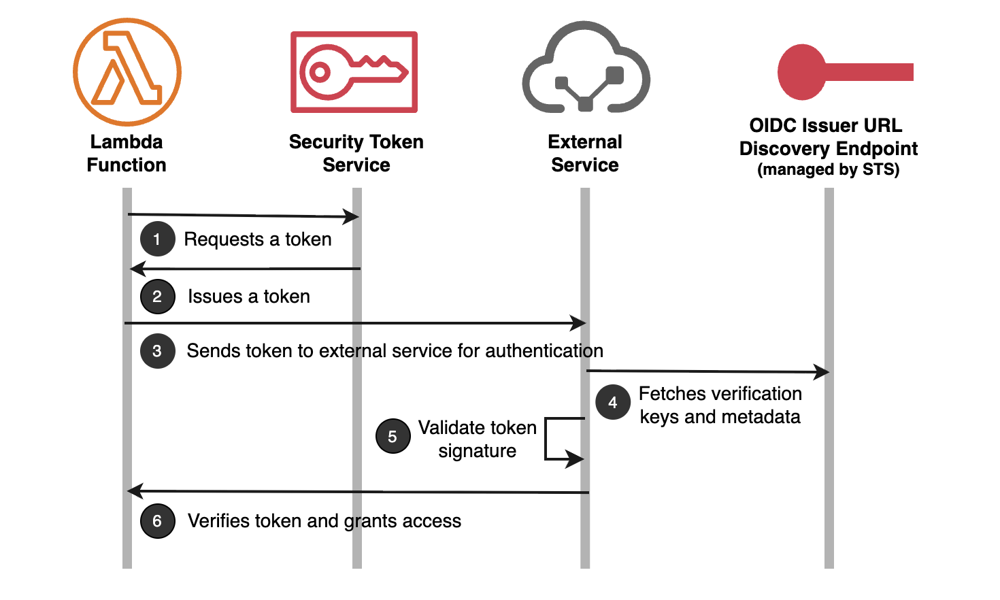

# Federating AWS Identities to external services

IAM outbound identity federation enables your AWS workloads to securely access external services without storing long-term credentials. Your AWS workloads can request short-lived JSON Web Tokens (JWTs) from AWS Security Token Service (AWS STS) by calling the [GetWebIdentityToken](../../../STS/latest/APIReference/API_GetWebIdentityToken.md "../../../STS/latest/APIReference/API_GetWebIdentityToken.md") API. These tokens are cryptographically signed, publicly verifiable and contain a comprehensive set of claims that assert your AWS workload's identity to external services. You can use these tokens with a wide range of third-party cloud providers, SaaS platforms, and self-hosted applications. External services verify the token's authenticity using AWS's verification keys published at well-known endpoints and use the information in the tokens to make authentication and authorization decisions.

Outbound identity federation eliminates the need to store long-term credentials such as API keys or passwords in your application code or environment variables, improving your security posture. You can control access to token generation and enforce token properties such as signing algorithms, permitted audiences and duration using IAM policies. All token requests are logged in AWS , providing complete audit trails for security monitoring and compliance reporting. You can also customize tokens with tags that appear as custom claims, enabling external services to implement fine-grained, attribute-based access control.

## Common use cases

Using outbound identity federation, your AWS workloads can securely:

- Access resources and services in external cloud providers. For example, a Lambda function processing data can write results to an external cloud provider's storage service or query their database.
- Integrate with external software-as-a-service (SaaS) providers for analytics, data processing, monitoring etc. For example, your Lambda functions can send metrics to observability platforms.
- Authenticate with your own applications hosted on AWS, external cloud providers or on-premises data centers, enabling secure hybrid and multi-cloud architectures. For example, your AWS workloads can interact with containerized applications running in your on-premises Kubernetes cluster.

## How It Works

1. The Lambda function calls the [GetWebIdentityToken](../../../STS/latest/APIReference/API_GetWebIdentityToken.md "../../../STS/latest/APIReference/API_GetWebIdentityToken.md") API to request a JSON Web Token (JWT) from AWS Security Token Service (AWS STS).
2. AWS STS validates the request and returns a signed JWT to the Lambda function.
3. The Lambda function sends the JWT to the external service.
4. The external service extracts the issuer URL from the token, verifies it matches a known trusted issuer, and fetches AWS's verification keys and metadata from the OIDC discovery endpoint.
5. The external service uses the verification keys to verify the token's signature and validates claims such as expiration time, subject and audience.
6. After successful validation, the external service grants access to the Lambda function.
