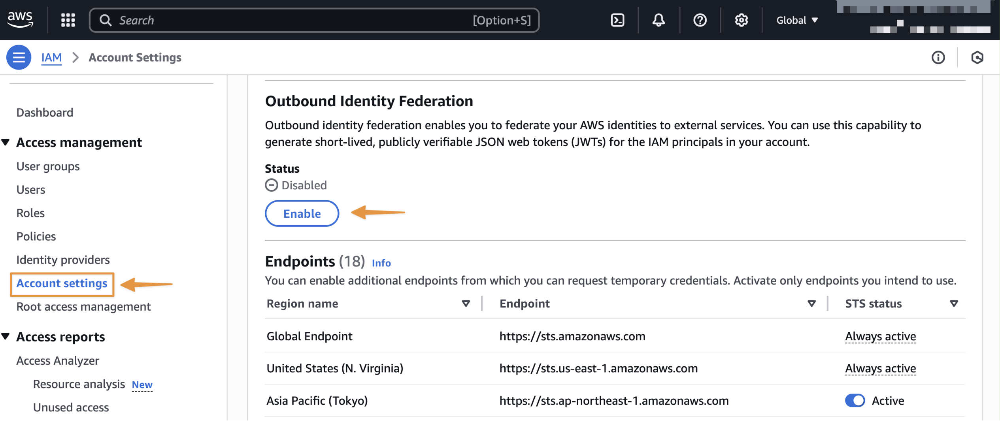
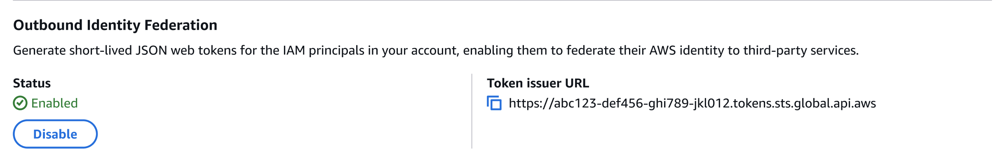

# Getting started with outbound identity federation

This guide shows you how to enable outbound identity federation for your AWS account and obtain your first JSON Web Token (JWT) (using the [GetWebIdentityToken](../../../STS/latest/APIReference/API_GetWebIdentityToken.md "../../../STS/latest/APIReference/API_GetWebIdentityToken.md") API). You will enable the feature, establish a trust relationship with an external service, configure IAM permissions, and request a token using either AWS CLI or AWS SDK for Python (Boto3).

## Prerequisites

Before you begin, ensure you have:

- Latest version of the AWS CLI or Python 3.8 (or later) and Boto3 installed (for AWS SDK examples)
- An external service account where you can configure trust relationships (such as an external cloud provider, SaaS provider, or a test application)

###### Note

- The `GetWebIdentityToken` API is not available on the STS Global endpoint.
- The JSON Web Tokens (JWTs) generated by the `GetWebIdentityToken` API cannot be used for OpenID Connect (OIDC) federation into AWS (via the [AssumeRoleWithWebIdentity](../../../STS/latest/APIReference/API_AssumeRoleWithWebIdentity.md "../../../STS/latest/APIReference/API_AssumeRoleWithWebIdentity.md") API).

## Enable outbound identity federation for your account

You must enable outbound identity federation before you can request tokens. You can enable the feature using the AWS Management Console or programmatically using the [EnableOutboundWebIdentityFederation](../APIReference/API_EnableOutboundWebIdentityFederation.md "../APIReference/API_EnableOutboundWebIdentityFederation.md") API.

### Using the AWS CLI

```
aws iam enable-outbound-web-identity-federation
```

### Using AWS SDK for Python

```
import boto3

# Create IAM client
iam_client = boto3.client('iam')

# Enable outbound identity federation
response = iam_client.enable_outbound_web_identity_federation()
print(f"Feature enabled. Issuer URL: {response['IssuerUrl']}")
print(f"Status: {response['Status']}")
```

### Using the AWS Console

Navigate to IAM and select **Account Settings** under the **Access Management** section of the left-hand navigation menu



Once you enable the feature, make note of your account-specific issuer URL. You will use this URL when configuring trust relationships in external services. You can also retrieve this issuer URL as needed using the [GetOutboundWebIdentityFederationInfo](../APIReference/API_GetOutboundWebIdentityFederationInfo.md "../APIReference/API_GetOutboundWebIdentityFederationInfo.md") API.



## Establish trust relationship in external service

Configure the external service to trust and accept tokens issued by your AWS account. The specific steps vary by service, but generally involve:

- Registering your AWS account issuer URL as a trusted identity provider
- Configuring which claims to validate (audience, subject patterns)
- Mapping token claims to permissions in the external service

Refer to the external service documentation for detailed configuration instructions.

## Configure IAM permissions

Create an IAM policy that grants permission to call the [GetWebIdentityToken](../../../STS/latest/APIReference/API_GetWebIdentityToken.md "../../../STS/latest/APIReference/API_GetWebIdentityToken.md") API and attach the policy to an IAM role that needs to generate tokens.

This example policy grants access to token generation with specific restrictions. It allows requesting tokens only for "https://api.example.com" as the audience and enforces a maximum token lifetime of 5 minutes (300 seconds). Refer to [IAM and AWS STS condition context
keys](reference_policies_iam-condition-keys.md "reference_policies_iam-condition-keys.md") for a list of condition keys you can use to enforce token properties.

### Example IAM policy

```
{
    "Version": "2012-10-17",
    "Statement": [
        {
            "Effect": "Allow",
            "Action": "sts:GetWebIdentityToken",
            "Resource": "*",
            "Condition": {
                "ForAnyValue:StringEquals": {
                    "sts:IdentityTokenAudience": "https://api.example.com"
                },
                "NumericLessThanEquals": {
                    "sts:DurationSeconds": 300
                }
            }
        }
    ]
}
```

## Request your first JSON Web Token (JWT)

You can request a JSON Web Token using the [GetWebIdentityToken](../../../STS/latest/APIReference/API_GetWebIdentityToken.md "../../../STS/latest/APIReference/API_GetWebIdentityToken.md") API. You can specify the following parameters when calling the API:

- **Audience (required):** The intended recipient of the token. This value populates the "aud" claim in the JWT. External services validate this claim to ensure the token was intended for them.
- **SigningAlgorithm (required):** The cryptographic algorithm used to sign the token. Valid values are ES384 and RS256. Use ES384 for optimal security and performance, or RS256 for broader compatibility with systems that do not support ECDSA.
- **DurationSeconds (optional):** The token lifetime in seconds. Valid values range from 60 to 3600. The default is 300 (5 minutes). We recommend shorter token lifetimes for increased security.
- **Tags (optional):** A list of key-value pairs to include as custom claims in the token. External services can use these claims for fine-grained authorization.

The API returns the following fields:

- **IdentityToken:** The signed JWT as a base64url-encoded string. Include this token in requests to external services.
- **Expiration:** The UTC timestamp for when the token expires.

### Using the AWS CLI

```
aws sts get-web-identity-token \
    --audience "https://api.example.com" \
    --signing-algorithm ES384 \
    --duration-seconds 300 \
    --tags Key=team,Value=data-engineering \
           Key=environment,Value=production \
           Key=cost-center,Value=analytics
```

### Using AWS SDK for Python

```
import boto3

sts_client = boto3.client('sts')

response = sts_client.get_web_identity_token(
    Audience=['https://api.example.com'],
    DurationSeconds=300,
    SigningAlgorithm='RS256',
    Tags=[
        {'Key': 'team', 'Value': 'data-engineering'},
        {'Key': 'environment', 'Value': 'production'},
        {'Key': 'cost-center', 'Value': 'analytics'}
    ]
)

token = response['WebIdentityToken']
```

You can also decode the JWT to inspect its contents using standard JWT libraries like PyJWT, Python-jose for Python, Nimbus JOSE+JWT for Java or debuggers like jwt.io. Refer to [Understanding token claims](id_roles_providers_outbound_token_claims.md "id_roles_providers_outbound_token_claims.md") for more information on claims included in the token.

## Use the token with an external service

After receiving the token, include it in requests to the external service. The method varies by service, but most services accept tokens in the Authorization header. The external service should implement token validation logic that fetches the JWKS keys from your issuer's well-known endpoint, verifies the token's signature, and validates essential claims before granting access to your AWS workloads.

## Fetch verification keys and metadata from the OpenID Connect (OIDC) endpoints

The unique issuer URL for your AWS account hosts the OpenID Connect (OIDC) discovery endpoints that contain verification keys and metadata necessary for token verification.

The OIDC discovery endpoint URL contains metadata some providers use to verify tokens. It is available at:

```
{issuer_url}/.well-known/openid-configuration
```

The JWKS (JSON Web Key Set) endpoint contains keys used to verify token signatures. It is available at:

```
{issuer_url}/.well-known/jwks.json
```

### Fetch JWKS using curl

```
curl https://{issuer_url}/.well-known/jwks.json
```

Response:

```
{
  "keys": [
    {
      "kty": "EC",
      "use": "sig",
      "kid": "key-id-1",
      "alg": "ES384",
      "crv": "P-384",
      "x": "base64-encoded-x-coordinate",
      "y": "base64-encoded-y-coordinate"
    },
    {
      "kty": "RSA",
      "use": "sig",
      "kid": "key-id-2",
      "n": "base64-encoded-modulus",
      "e": "AQAB"
    }
  ]
}
```

### Using AWS SDK for Python

```
import requests

# Fetch Openid Configuration
open_id_config_response = requests.get("https://{issuer_url}/.well-known/openid-configuration")
open_id_config = open_id_config_response.json()

# Fetch JWKS
jwks_response = requests.get("https://{issuer_url}/.well-known/jwks.json")
jwks = jwks_response.json()
```

We recommend caching these keys to avoid fetching them for every token verification.

### Essential claim validations

- **Subject (sub):** Verify the subject claim contains the expected IAM principal ARN pattern.
- **Expiration (exp):** Ensure the token has not expired. JWT libraries typically handle this automatically.
- **Audience (aud):** Verify the audience matches your expected value. This prevents tokens intended for other services from being used with yours.
- **Issuer (iss):** Verify the issuer matches the AWS account(s) you trust. Maintain a list of trusted issuer URLs.

Whenever possible, you should validate additional AWS-specific claims to implement fine-grained access control in your external service. For example, validate the org_id claim to restrict access to IAM principals in your AWS Organization, check principal_tags to enforce attribute-based access control (such as allowing only production environments or specific teams), or verify session context claims like lambda_source_function_arn or ec2_instance_source_vpc to restrict access based on the compute resource.
Refer to [Understanding token claims](id_roles_providers_outbound_token_claims.md "id_roles_providers_outbound_token_claims.md") for a full list of claims included in the token.
