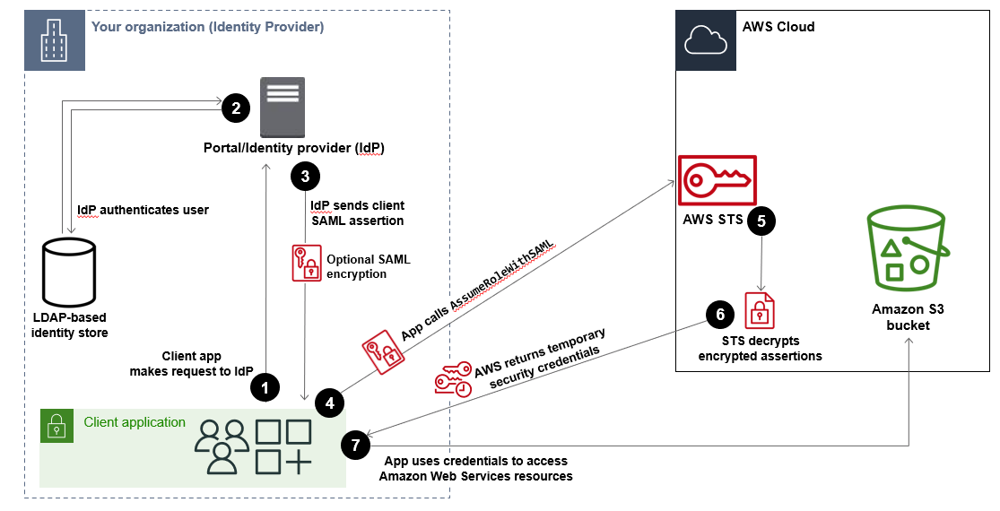

# SAML 2.0 federation

AWS supports identity federation with [SAML 2.0 (Security Assertion Markup Language 2.0)](https://wiki.oasis-open.org/security "https://wiki.oasis-open.org/security"), an open standard that many
identity providers (IdPs) use. This feature enables federated single sign-on (SSO), so users can
log into the AWS Management Console or call AWS API operations without you having to create an IAM user
for everyone in your organization. By using SAML, you can simplify the process of configuring
federation with AWS, because you can use the IdP's service instead of [writing custom identity proxy code](../../../STS/latest/UsingSTS/CreatingFedTokens.md "../../../STS/latest/UsingSTS/CreatingFedTokens.md").

###### Note

IAM SAML identity federation supports encrypted SAML responses from SAML-based federated
identity providers (IdPs). IAM Identity Center and Amazon Cognito do not support encrypted SAML assertions from IAM
SAML identity providers.

You can indirectly add support for encrypted SAML assertions to Amazon Cognito identity pool
federation with Amazon Cognito user pools. User pools have SAML federation that's independent of IAM
SAML federation and supports [SAML
signing and encryption](../../../cognito/latest/developerguide/cognito-user-pools-SAML-signing-encryption.md "../../../cognito/latest/developerguide/cognito-user-pools-SAML-signing-encryption.md"). Although this feature doesn't extend directly to identity
pools, user pools can be IdPs to identity pools. To use SAML encryption with identity pools,
add a SAML provider with encryption to a user pool that is an IdP to an identity pool.

Your SAML provider must be able to encrypt SAML assertions with a key that your user pool
provides. User pools won't accept assertions encrypted with a certificate that IAM has
provided.

IAM federation supports these use cases:

- [Federated access to allow
  a user or application in your organization to call AWS API
  operations](#CreatingSAML-configuring "#CreatingSAML-configuring"). This use case is discussed in the following section. You use
  a SAML assertion (as part of the authentication response) that is generated in your
  organization to get temporary security credentials. This scenario is similar to other
  federation scenarios that IAM supports, like those described in [Request temporary security credentials](id_credentials_temp_request.md "id_credentials_temp_request.md") and
  [OIDC federation](id_roles_providers_oidc.md "id_roles_providers_oidc.md").
  However, SAML 2.0–based IdPs in your organization handle many of the details at run
  time for performing authentication and authorization checking.
- [Web-based
  single sign-on (SSO) to the AWS Management Console from your organization](id_roles_providers_enable-console-saml.md "id_roles_providers_enable-console-saml.md"). Users
  can sign in to a portal in your organization hosted by a SAML 2.0–compatible IdP,
  select an option to go to AWS, and be redirected to the console without having to provide
  additional sign-in information. You can use a third-party SAML IdP to establish SSO access
  to the console or you can create a custom IdP to enable console access for your external
  users. For more information about building a custom IdP, see [Enable custom identity broker
  access to the AWS console](id_roles_providers_enable-console-custom-url.md "id_roles_providers_enable-console-custom-url.md").

###### Topics

- [Using SAML-based federation for API access to
  AWS](#CreatingSAML-configuring "#CreatingSAML-configuring")
- [Overview of configuring SAML 2.0-based
  federation](#CreatingSAML-configuring-IdP "#CreatingSAML-configuring-IdP")
- [Overview of the role to allow SAML-federated
  access to your AWS resources](#CreatingSAML-configuring-role "#CreatingSAML-configuring-role")
- [Uniquely identifying users in SAML-based
  federation](#CreatingSAML-userid "#CreatingSAML-userid")
- [Create a SAML identity provider in
  IAM](id_roles_providers_create_saml.md "id_roles_providers_create_saml.md")
- [Configure your SAML 2.0 IdP with
  relying party trust and adding claims](id_roles_providers_create_saml_relying-party.md "id_roles_providers_create_saml_relying-party.md")
- [Integrate third-party SAML solution
  providers with AWS](id_roles_providers_saml_3rd-party.md "id_roles_providers_saml_3rd-party.md")
- [Configure SAML assertions for the
  authentication response](id_roles_providers_create_saml_assertions.md "id_roles_providers_create_saml_assertions.md")
- [Enabling SAML 2.0 federated principals
  to access the AWS Management Console](id_roles_providers_enable-console-saml.md "id_roles_providers_enable-console-saml.md")
- [View a SAML response in your
  browser](troubleshoot_saml_view-saml-response.md "troubleshoot_saml_view-saml-response.md")

## Using SAML-based federation for API access to

AWS

Assume that you want to provide a way for employees to copy data from their computers to a
backup folder. You build an application that users can run on their computers. On the back
end, the application reads and writes objects in an Amazon S3 bucket. Users don't have direct
access to AWS. Instead, the following process is used:



1. A user in your organization uses a client app to request authentication from your
   organization's IdP.
2. The IdP authenticates the user against your organization's identity store.
3. The IdP constructs a SAML assertion with information about the user and sends the
   assertion to the client app. When you enable SAML
   encryption for your IAM SAML IdP, this assertion is encrypted by your external
   IdP.
4. The client app calls the AWS STS [`AssumeRoleWithSAML`](../../../STS/latest/APIReference/API_AssumeRoleWithSAML.md "../../../STS/latest/APIReference/API_AssumeRoleWithSAML.md") API, passing the ARN of the SAML provider,
   the ARN of the role to assume, and the SAML assertion from IdP. If encryption is enabled, the assertion passed through the
   client app remains encrypted in transit.
5. (Optional) AWS STS uses the private key you uploaded from your external IdP to decrypt
   the encrypted SAML assertion.
6. The API response to the client app includes temporary security credentials.
7. The client app uses the temporary security credentials to call Amazon S3 API operations.

## Overview of configuring SAML 2.0-based

federation

Before you can use SAML 2.0-based federation as described in the preceding scenario and
diagram, you must configure your organization's IdP and your AWS account to trust each
other. The general process for configuring this trust is described in the following steps.
Inside your organization, you must have an [IdP that supports SAML 2.0](id_roles_providers_saml_3rd-party.md "id_roles_providers_saml_3rd-party.md"), like Microsoft Active Directory Federation Service (AD
FS, part of Windows Server), Shibboleth, or another compatible SAML 2.0 provider.

###### Note

To improve federation resiliency, we recommend that you configure your IdP and AWS
federation to support multiple SAML sign-in endpoints. For details, see the AWS Security
Blog article [How to use regional SAML
endpoints for failover](https://aws.amazon.com/blogs//security/how-to-use-regional-saml-endpoints-for-failover "https://aws.amazon.com/blogs//security/how-to-use-regional-saml-endpoints-for-failover").

###### Configure your organization's IdP and AWS to trust each other

1. Register AWS as a service provider (SP) with the IdP of your organization. Use the
   SAML metadata document from `https://`region-code`.signin.aws.amazon.com/static/saml-metadata.xml`

For a list of possible `region-code` values, see the
**Region** column in [AWS Sign-In
endpoints](../../../general/latest/gr/signin-service.md "../../../general/latest/gr/signin-service.md").

You can optionally use the SAML metadata document from `https://signin.aws.amazon.com/static/saml-metadata.xml`
. 2. Using your organization's IdP, you generate an equivalent SAML metadata XML file that
can describe your IdP as an IAM identity provider in AWS. It must include the issuer
name, a creation date, an expiration date, and keys that AWS can use to validate
authentication responses (assertions) from your organization.

If you allow encrypted SAML assertions to be sent from your
external IdP, you must generate a private key file using your organization's IdP, and
upload this file to your IAM SAML configuration in .pem file format. AWS STS needs this
private key to decrypt SAML responses that correspond to the public key uploaded to your
IdP.

###### Note

As defined by the [SAML
V2.0 Metadata Interoperability Profile Version 1.0](https://docs.oasis-open.org/security/saml/Post2.0/sstc-metadata-iop-os.html "https://docs.oasis-open.org/security/saml/Post2.0/sstc-metadata-iop-os.html"), IAM does not evaluate or
take action on the expiration of X.509 certificates in SAML metadata documents. If you are
concerned about expired X.509 certificates, we recommend monitoring certificate expiration
dates and rotating certificates according to your organization’s governance and security
policies. 3. In the IAM console, you create a SAML identity provider. As part of this process,
you upload the SAML metadata document and private
decryption key that was produced by the IdP in your organization in [Step 2](#createxml "#createxml"). For more information, see [Create a SAML identity provider in
IAM](id_roles_providers_create_saml.md "id_roles_providers_create_saml.md"). 4. In IAM, you create one or more IAM roles. In the role's trust policy, you set the
SAML provider as the principal, which establishes a trust relationship between your
organization and AWS. The role's permission policy establishes what users from your
organization are allowed to do in AWS. For more information, see [Create a role for a third-party identity provider](id_roles_create_for-idp.md "id_roles_create_for-idp.md") .

###### Note

SAML IDPs used in a role trust policy must be in the same account that the role is
in. 5. In your organization's IdP, you define assertions that map users or groups in your
organization to the IAM roles. Note that different users and groups in your organization
might map to different IAM roles. The exact steps for performing the mapping depend on
what IdP you're using. In the [earlier scenario](#CreatingSAML-configuring "#CreatingSAML-configuring") of an Amazon S3 folder for
users, it's possible that all users will map to the same role that provides Amazon S3
permissions. For more information, see [Configure SAML assertions for the
authentication response](id_roles_providers_create_saml_assertions.md "id_roles_providers_create_saml_assertions.md").

If your IdP enables SSO to the AWS console, then you can configure the maximum
duration of the console sessions. For more information, see [Enabling SAML 2.0 federated principals
to access the AWS Management Console](id_roles_providers_enable-console-saml.md "id_roles_providers_enable-console-saml.md"). 6. In the application that you're creating, you call the AWS Security Token Service
`AssumeRoleWithSAML` API, passing it the ARN of the SAML provider you created
in [Step 3](#samlovrcreateentity "#samlovrcreateentity"), the ARN of the
role to assume that you created in [Step 4](#samlovrcreaterole "#samlovrcreaterole"), and the SAML assertion about the current user that you
get from your IdP. AWS makes sure that the request to assume the role comes from the IdP
referenced in the SAML provider.

For more information, see [AssumeRoleWithSAML](../../../STS/latest/APIReference/API_AssumeRoleWithSAML.md "../../../STS/latest/APIReference/API_AssumeRoleWithSAML.md") in the _AWS Security Token Service API Reference_. 7. If the request is successful, the API returns a set of temporary security credentials,
which your application can use to make signed requests to AWS. Your application has
information about the current user and can access user-specific folders in Amazon S3, as
described in the previous scenario.

## Overview of the role to allow SAML-federated

access to your AWS resources

The roles that you create in IAM define what SAML federated principals from your organization are
allowed to do in AWS. When you create the trust policy for the role, you specify the SAML
provider that you created earlier as the `Principal`. You can additionally scope
the trust policy with a `Condition` to allow only users that match certain SAML
attributes to access the role. For example, you can specify that only users whose SAML
affiliation is `staff` (as asserted by https://openidp.feide.no) are allowed to
access the role, as illustrated by the following sample policy:

JSON

```
`{
 "Version":"2012-10-17",
 "Statement": [{
 "Effect": "Allow",
 "Principal": {"Federated": "arn:aws:iam::`111122223333`:saml-provider/ExampleOrgSSOProvider"},
 "Action": "sts:AssumeRoleWithSAML",
 "Condition": {
 "StringEquals": {
 "saml:aud": "https://`us-east-1`.signin.aws.amazon.com/saml",
 "saml:iss": "https://openidp.feide.no"
 },
 "ForAllValues:StringLike": {"saml:edupersonaffiliation": ["staff"]}
 }
 }]
}`

```

JSON

```
`{
 "Version":"2012-10-17",
 "Statement": [
 {
 "Effect": "Allow",
 "Principal": {
 "Federated": "arn:aws-cn:iam::`111122223333`:saml-provider/ExampleOrgSSOProvider"
 },
 "Action": "sts:AssumeRoleWithSAML",
 "Condition": {
 "StringEquals": {
 "saml:aud": "https://`ap-east-1`.signin.amazonaws.cn/saml",
 "saml:iss": "https://openidp.feide.no"
 },
 "ForAllValues:StringLike": {
 "saml:edupersonaffiliation": [
 "staff"
 ]
 }
 }
 }
 ]
}`

```

###### Note

SAML IDPs used in a role trust policy must be in the same account that the role is
in.

The `saml:aud` context key in the policy specifies the URL your browser
displays when signing into the console. This sign-in endpoint URL must match your identity
provider's recipient attribute. You can include sign-in URLs within particular regions. AWS
recommends using Regional endpoints instead of the global endpoint to improve federation
resiliency. If you have only one endpoint configured, you won’t be able to federate into AWS
in the unlikely event that the endpoint becomes unavailable. For a list of
possible `region-code` values, see the **Region**
column in [AWS
Sign-In endpoints](../../../general/latest/gr/signin-service.md "../../../general/latest/gr/signin-service.md").

The following example shows the sign-in URL format with the optional
`region-code`.

`https://`region-code`.signin.aws.amazon.com/saml`

If SAML encryption is required, the sign-in URL must include the unique identifier AWS
assigns to your SAML provider, which you can find on the Identity provider detail page. In the
following example, the sign-in URL includes the IdP unique identifier, which requires /acs/ be
appended to the sign-in path.

`https://`region-code`.signin.aws.amazon.com/saml/acs/`IdP-ID``

For the permission policy in the role, you specify permissions as you would for any role.
For example, if users from your organization are allowed to administer Amazon Elastic Compute Cloud instances,
you must explicitly allow Amazon EC2 actions in the permissions policy, such as those in the
**AmazonEC2FullAccess** managed policy.

For more information about the SAML keys that you can check in a policy, see [Available keys for SAML-based AWS STS
federation](reference_policies_iam-condition-keys.md#condition-keys-saml "reference_policies_iam-condition-keys.md#condition-keys-saml").

## Uniquely identifying users in SAML-based

federation

When you create access policies in IAM, it's often useful to be able to specify
permissions based on the identity of users. For example, for users who have been federated
using SAML, an application might want to keep information in Amazon S3 using a structure like this:

```
amzn-s3-demo-bucket/app1/`user1`
amzn-s3-demo-bucket/app1/`user2`
amzn-s3-demo-bucket/app1/`user3`
```

You can create the bucket (`amzn-s3-demo-bucket`) and folder
(`app1`) through the Amazon S3 console or the AWS CLI, since those are static values.
However, the user-specific folders (`user1`,
`user2`, `user3`, etc.) have to be created
at run time using code, since the value that identifies the user isn't known until the first
time the user signs in through the federation process.

To write policies that reference user-specific details as part of a resource name, the
user identity has to be available in SAML keys that can be used in policy conditions. The
following keys are available for SAML 2.0–based federation for use in IAM policies.
You can use the values returned by the following keys to create unique user identifiers for
resources like Amazon S3 folders.

- `saml:namequalifier`. A hash value based on the concatenation of the
  `Issuer` response value (`saml:iss`) and a string with the
  `AWS` account ID and the friendly name (the last part of the ARN) of the SAML
  provider in IAM. The concatenation of the account ID and friendly name of the SAML
  provider is available to IAM policies as the key `saml:doc`. The account ID
  and provider name must be separated by a '/' as in "123456789012/provider_name".
  For more information, see the `saml:doc` key at [Available keys for SAML-based AWS STS
  federation](reference_policies_iam-condition-keys.md#condition-keys-saml "reference_policies_iam-condition-keys.md#condition-keys-saml").

The combination of `NameQualifier` and `Subject` can be used to
uniquely identify a SAML federated principal. The following pseudocode shows how this value is
calculated. In this pseudocode `+` indicates concatenation, `SHA1`
represents a function that produces a message digest using SHA-1, and `Base64`
represents a function that produces Base-64 encoded version of the hash output.

`Base64 ( SHA1 ( "https://example.com/saml" + "123456789012" + "/MySAMLIdP"
 ) )`

For more information about the policy keys that are available for SAML-based
federation, see [Available keys for SAML-based AWS STS
federation](reference_policies_iam-condition-keys.md#condition-keys-saml "reference_policies_iam-condition-keys.md#condition-keys-saml").

- `saml:sub` (string). This is the subject of the claim, which includes a
  value that uniquely identifies an individual user within an organization (for example,
  `_cbb88bf52c2510eabe00c1642d4643f41430fe25e3`).
- `saml:sub_type` (string). This key can be `persistent`,
  `transient`, or the full `Format` URI from the
  `Subject` and `NameID` elements used in your SAML assertion. A
  value of `persistent` indicates that the value in `saml:sub` is the
  same for a user across all sessions. If the value is `transient`, the user has
  a different `saml:sub` value for each session. For information about the
  `NameID` element's `Format` attribute, see [Configure SAML assertions for the
  authentication response](id_roles_providers_create_saml_assertions.md "id_roles_providers_create_saml_assertions.md").

The following example shows a permission policy that uses the preceding keys to grant
permissions to a user-specific folder in Amazon S3. The policy assumes that the Amazon S3 objects are
identified using a prefix that includes both `saml:namequalifier` and
`saml:sub`. Notice that the `Condition` element includes a test to be
sure that `saml:sub_type` is set to `persistent`. If it is set to
`transient`, the `saml:sub` value for the user can be different for
each session, and the combination of values should not be used to identify user-specific
folders.

JSON

```
`{
 "Version":"2012-10-17",
 "Statement": {
 "Effect": "Allow",
 "Action": [
 "s3:GetObject",
 "s3:PutObject",
 "s3:DeleteObject"
 ],
 "Resource": [
 "arn:aws:s3:::amzn-s3-demo-bucket-org-data/backup/${saml:namequalifier}/${saml:sub}",
 "arn:aws:s3:::amzn-s3-demo-bucket-org-data/backup/${saml:namequalifier}/${saml:sub}/*"
 ],
 "Condition": {"StringEquals": {"saml:sub_type": "persistent"}}
 }
}`

```

JSON

```
`{
 "Version":"2012-10-17",
 "Statement": {
 "Effect": "Allow",
 "Action": [
 "s3:GetObject",
 "s3:PutObject",
 "s3:DeleteObject"
 ],
 "Resource": [
 "arn:aws-cn:s3:::amzn-s3-demo-bucket-org-data/backup/${saml:namequalifier}/${saml:sub}",
 "arn:aws-cn:s3:::amzn-s3-demo-bucket-org-data/backup/${saml:namequalifier}/${saml:sub}/*"
 ],
 "Condition": {"StringEquals": {"saml:sub_type": "persistent"}}
 }
}`

```

For more information about mapping assertions from the IdP to policy keys, see [Configure SAML assertions for the
authentication response](id_roles_providers_create_saml_assertions.md "id_roles_providers_create_saml_assertions.md").
