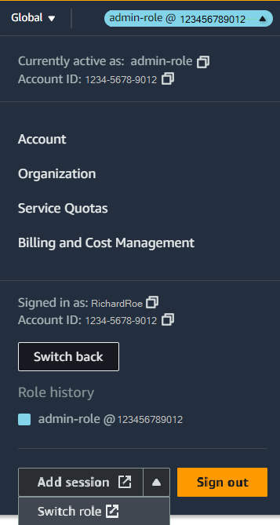

# Switch from a user to an IAM role

(console)

You can switch roles when you sign in as an IAM user, a user in IAM Identity Center, a SAML-federated
role, or a web-identity federated role. A _role_ specifies a set of
permissions that you can use to access AWS resources that you need. However, you don't sign in
to a role, but once signed in as an IAM user you can switch to an IAM role. This temporarily
sets aside your original user permissions and instead gives you the permissions assigned to the
role. The role can be in your own account or any other AWS account. For more information about
roles, their benefits, and how to create them, see [IAM roles](id_roles.md "id_roles.md"), and [IAM role creation](id_roles_create.md "id_roles_create.md").

The permissions of your user and any roles that you switch to aren't cumulative. Only one
set of permissions is active at a time. When you switch to a role, you temporarily give up your
user permissions and work with the permissions that are assigned to the role. When you exit the
role, your user permissions are automatically restored.

When you switch roles in the AWS Management Console, the console always uses your original credentials to
authorize the switch. For example, if you switch to RoleA, IAM uses your original credentials
to determine whether you are allowed to assume RoleA. If you then switch to RoleB _while you are using RoleA_, AWS still uses your **original** credentials to authorize the switch, not the credentials for
RoleA.

###### Note

When you sign in as a user in IAM Identity Center, as a SAML-federated role, or as a web-identity
federated role you assume an IAM role when you start your session. For example, when a
user in IAM Identity Center signs in to the AWS access portal they must choose a permission set that correlates to
a role before they can access AWS resources.

## Role sessions

When you switch roles, your AWS Management Console session lasts for 1 hour by default. IAM user
sessions are 12 hours by default, other users might have different session durations defined.
When you switch roles in the console, you are granted the role maximum session duration, or
the remaining time in your user session, whichever is less. You can't extend your session
duration by assuming a role.

For example, assume that a maximum session duration of 10 hours is set for a role. You
have been signed in to the console for 8 hours when you decide to switch to the role. There
are 4 hours remaining in your user session, so the allowed role session duration is 4 hours,
not the maximum session duration of 10 hours. The following table shows how to determine the
session duration for an IAM user when switching roles in the console.

| IAM user session time remaining is…        | Role session duration is…                    |
| ------------------------------------------ | -------------------------------------------- |
| Less than role maximum session duration    | Time remaining in user session               |
| Greater than role maximum session duration | Maximum session duration value               |
| Equal to role maximum session duration     | Maximum session duration value (approximate) |

Using the credentials from one role to assume a different role is called [role chaining](id_roles.md#iam-term-role-chaining "id_roles.md#iam-term-role-chaining"). When you use role chaining, the
session duration is limited to one hour, regardless of the maximum session duration setting
configured for individual roles. This applies to AWS Management Console role switching, AWS CLI, and API
operations.

###### Note

Some AWS service consoles can autorenew your role session when it expires without you
taking any action. Some might prompt you to reload your browser page to reauthenticate your
session.

## Considerations

- You can't switch roles if you sign in as the AWS account root user.
- Users must be granted permission to switch roles by policy. For instructions, see
  [Grant a user permissions to switch
  roles](id_roles_use_permissions-to-switch.md "id_roles_use_permissions-to-switch.md").
- You can't switch roles in the AWS Management Console to a role that requires an [ExternalId](id_roles_common-scenarios_third-party.md#id_roles_third-party_external-id "id_roles_common-scenarios_third-party.md#id_roles_third-party_external-id") value. You can switch to
  such a role only by calling the [`AssumeRole`](../../../STS/latest/APIReference/API_AssumeRole.md "../../../STS/latest/APIReference/API_AssumeRole.md") API that supports the `ExternalId`
  parameter.

## To switch to a role

1. Follow the sign-in procedure appropriate to you user type as described in [Sign in to the
   AWS Management Console](../../../signin/latest/userguide/how-to-sign-in.md "../../../signin/latest/userguide/how-to-sign-in.md") in the _AWS Sign-In User Guide_.
2. In the AWS Management Console, choose your user name on the navigation bar in the upper right. It
   typically looks like this:
   **`username`@`account_ID_number_or_alias`**.
3. Select one of the following methods to switch roles:
   - Choose **Switch role**.
   - If you have opted in to multi-session support, choose **Add
     session** and select **Switch role**.

   ###### Note

   You can sign in to up to five different identities simultaneously in a single
   web browser in the AWS Management Console. For details, see [Signing in to multiple
   accounts](../../../awsconsolehelpdocs/latest/gsg/multisession.md "../../../awsconsolehelpdocs/latest/gsg/multisession.md") in the _AWS Management Console Getting Started
   Guide_.

4. On the **Switch Role** page, type the account ID number or the
   account alias and the name of the role that was provided by your administrator.

###### Note

If your administrator created the role with a path, such as
`division_abc/subdivision_efg/roleToDoX`, then you must type that complete
path and name in the **Role** box. If you type only the role name, or
if the combined `Path` and `RoleName` exceed 64 characters, the
role switch fails. This is a limit of the browser cookies that store the role name. If
this happens, contact your administrator and ask them to reduce the size of the path and
role name. 5. (Optional)You can enter a display name and select a display color that will highlight
the role in the console navigation bar.

    * For **Display name**, type text that you want to appear on the
     navigation bar in place of your user name when this role is active. A name is
     suggested, based on the account and role information, but you can change it to
     whatever has meaning for you.
    * For **Display color**, select a color to highlight the display
     name.

The name and color can help remind you when this role is active, which changes your
permissions. For example, for a role that gives you access to the test environment, you
might specify a **Display name** of `Test` and
select the green **Color**. For the role that gives you access to
production, you might specify a **Display name** of
`Production` and select red as the
**Color**. 6. Choose **Switch Role**. The display name and color replace your user
name on the navigation bar, and you can start using the permissions that the role grants
you. 7. After you have completed the tasks that require the IAM role you can switch back to
your original session. This will remove the additional permissions provided by the role
and return you to your standard permissions.

    1. In the IAM console, choose your role's **Display name** on the
     navigation bar in the upper right.
    2. Choose **Switch back**.

    For example, assume you are signed in to account number
     `123456789012` using the user name `Richard`. After
     you use the `admin-role` role, you want to stop using the role and return
     to your original permissions. To stop using the role, you choose **admin-role
     @ 123456789012**, and then choose **Switch
     back**.

    

###### Tip

The last several roles that you used appear on the menu. The next time you want to
switch to one of those roles, you can simply choose the role you want. You are only required
to type the account and role information manually if the role isn't displayed on the
menu.

## Additional

resources

- [Grant a user permissions to switch
  roles](id_roles_use_permissions-to-switch.md "id_roles_use_permissions-to-switch.md")
- [Grant a user permissions to pass a role to an AWS
  service](id_roles_use_passrole.md "id_roles_use_passrole.md")
- [Create a role to give permissions to an IAM
  user](id_roles_create_for-user.md "id_roles_create_for-user.md")
- [Create a role to delegate permissions to an
  AWS service](id_roles_create_for-service.md "id_roles_create_for-service.md")
- [Troubleshoot IAM roles](troubleshoot_roles.md "troubleshoot_roles.md")
