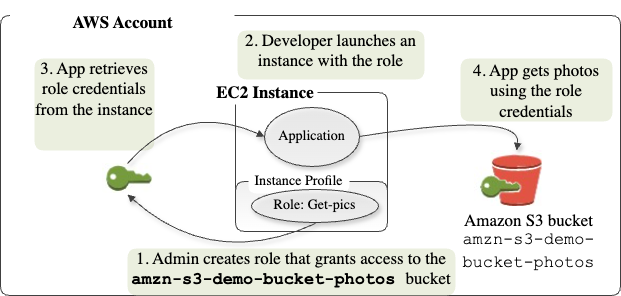
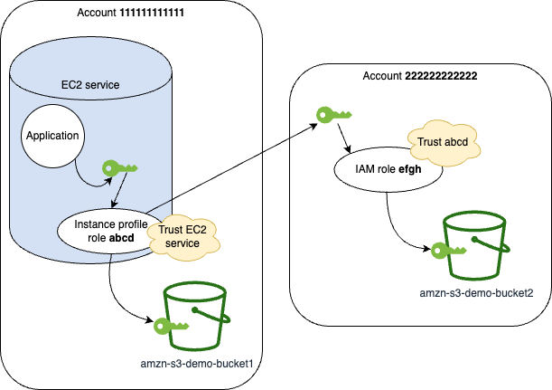

# Use an IAM role to grant permissions to

applications running on Amazon EC2 instances

Applications that run on an Amazon EC2 instance must include AWS credentials in the AWS API
requests. You could have your developers store AWS credentials directly within the Amazon EC2
instance and allow applications in that instance to use those credentials. But developers would
then have to manage the credentials and ensure that they securely pass the credentials to each
instance and update each Amazon EC2 instance when it's time to update the credentials. That's a lot
of additional work.

Instead, you can and should use an IAM role to manage _temporary_ credentials for applications that run on an Amazon EC2 instance. When you use
a role, you don't have to distribute long-term credentials (such as sign-in credentials or
access keys) to an Amazon EC2 instance. Instead, the role supplies temporary permissions that
applications can use when they make calls to other AWS resources. When you launch an Amazon EC2
instance, you specify an IAM role to associate with the instance. Applications that run on the
instance can then use the role-supplied temporary credentials to sign API requests.

Using roles to grant permissions to applications that run on Amazon EC2 instances requires a bit
of extra configuration. An application running on an Amazon EC2 instance is abstracted from AWS by
the virtualized operating system. Because of this extra separation, you need an additional step
to assign an AWS role and its associated permissions to an Amazon EC2 instance and make them
available to its applications. This extra step is the creation of an _[instance
profile](id_roles_use_switch-role-ec2_instance-profiles.md "id_roles_use_switch-role-ec2_instance-profiles.md")_ attached to the instance. The instance profile contains the role
and can provide the role's temporary credentials to an application that runs on the instance.
Those temporary credentials can then be used in the application's API calls to access resources
and to limit access to only those resources that the role specifies.

###### Note

Only one role can be assigned to an Amazon EC2 instance at a time, and all applications on the
instance share the same role and permissions. When you leverage Amazon ECS to manage your Amazon EC2
instances, you can assign roles to Amazon ECS tasks that can be distinguished from the role of the
Amazon EC2 instance that it's running on. Assigning each task a role aligns with the principle of
least privileged access and allows for greater granular control over actions and
resources.

For more information, see [Using IAM roles with
Amazon ECS tasks](../../../AmazonECS/latest/bestpracticesguide/security-iam-roles.md "../../../AmazonECS/latest/bestpracticesguide/security-iam-roles.md") in the _Amazon Elastic Container Service Best Practices Guide_.

Using roles in this way has several benefits. Because role credentials are temporary and
updated automatically, you don't have to manage credentials, and you don't have to worry about
long-term security risks. In addition, if you use a single role for multiple instances, you can
make a change to that one role and the change propagates automatically to all the instances.

###### Note

Although a role is usually assigned to an Amazon EC2 instance when you launch it, a role can
also be attached to an Amazon EC2 instance currently running. To learn how to attach a role to a
running instance, see [IAM Roles for Amazon EC2](../../../AWSEC2/latest/UserGuide/iam-roles-for-amazon-ec2.md#attach-iam-role "../../../AWSEC2/latest/UserGuide/iam-roles-for-amazon-ec2.md#attach-iam-role").

###### Topics

- [How do roles for Amazon EC2 instances
  work?](#roles-usingrole-ec2instance-roles "#roles-usingrole-ec2instance-roles")
- [Permissions required for using roles
  with Amazon EC2](#roles-usingrole-ec2instance-permissions "#roles-usingrole-ec2instance-permissions")
- [How do I get started?](#roles-usingrole-ec2instance-get-started "#roles-usingrole-ec2instance-get-started")
- [Related information](#roles-usingrole-ec2instance-related-info "#roles-usingrole-ec2instance-related-info")

## How do roles for Amazon EC2 instances

work?

In the following figure, a developer runs an application on an Amazon EC2 instance that
requires access to the S3 bucket named `amzn-s3-demo-bucket-photos`. An
administrator creates the `Get-pics` service role and attaches the role to the
Amazon EC2 instance. The role includes a permissions policy that grants read-only access to the
specified S3 bucket. It also includes a trust policy that allows the Amazon EC2 instance to assume
the role and retrieve the temporary credentials. When the application runs on the instance, it
can use the role's temporary credentials to access the photos bucket. The administrator
doesn't have to grant the developer permission to access the photos bucket, and the developer
never has to share or manage credentials.



1. The administrator uses IAM to create the `Get-pics` role. In
   the role's trust policy, the administrator specifies that only Amazon EC2 instances can assume
   the role. In the role's permission policy, the administrator specifies read-only
   permissions for the `amzn-s3-demo-bucket-photos` bucket.
2. A developer launches an Amazon EC2 instance and assigns the `Get-pics` role to
   that instance.

###### Note

If you use the IAM console, the instance profile is managed for you and is mostly
transparent to you. However, if you use the AWS CLI or API to create and manage the role
and Amazon EC2 instance, then you must create the instance profile and assign the role to it
as separate steps. Then, when you launch the instance, you must specify the instance
profile name instead of the role name. 3. When the application runs, it obtains temporary security credentials from Amazon EC2 [instance metadata](../../../AWSEC2/latest/UserGuide/ec2-instance-metadata.md "../../../AWSEC2/latest/UserGuide/ec2-instance-metadata.md"), as described
in [Retrieving Security Credentials from Instance Metadata](../../../AWSEC2/latest/UserGuide/iam-roles-for-amazon-ec2.md#instance-metadata-security-credentials "../../../AWSEC2/latest/UserGuide/iam-roles-for-amazon-ec2.md#instance-metadata-security-credentials"). These are [temporary security credentials](id_credentials_temp.md "id_credentials_temp.md") that represent the
role and are valid for a limited period of time.

With some [AWS SDKs](https://aws.amazon.com/tools/ "https://aws.amazon.com/tools/"), the developer can
use a provider that manages the temporary security credentials transparently. (The
documentation for individual AWS SDKs describes the features supported by that SDK for
managing credentials.)

Alternatively, the application can get the temporary credentials directly from the
instance metadata of the Amazon EC2 instance. Credentials and related values are available from
the `iam/security-credentials/`role-name``category
 (in this case,`iam/security-credentials/Get-pics`) of the metadata. If the
 application gets the credentials from the instance metadata, it can cache the
 credentials.
4. Using the retrieved temporary credentials, the application accesses the photo bucket.
 Because of the policy attached to the `Get-pics` role, the
application has read-only permissions.

The temporary security credentials available on the instance automatically update
before they expire so that a valid set is always available. The application just needs to
make sure that it gets a new set of credentials from the instance metadata before the
current ones expire. It is possible to use the AWS SDK to manage credentials so the
application does not need to include additional logic to refresh the credentials. For
example, instantiating clients with Instance Profile Credential Providers. However, if the
application gets temporary security credentials from the instance metadata and has cached
them, it should get a refreshed set of credentials every hour, or at least 15 minutes
before the current set expires. The expiration time is included in the information
returned in the `iam/security-credentials/`role-name``
category.

## Permissions required for using roles

with Amazon EC2

To launch an instance with a role, the developer must have permission to launch Amazon EC2
instances and permission to pass IAM roles.

The following sample policy allows users to use the AWS Management Console to launch an instance with a
role. The policy includes wildcards (`*`) to allow a user to pass any role and to
perform the listed Amazon EC2 actions. The `ListInstanceProfiles` action allows users to
view all of the roles available in the AWS account.

###### Example policy that grants a user permission to use the Amazon EC2 console to launch an instance with any role

JSON

```
`{
 "Version":"2012-10-17",
 "Statement": [
 {
 "Sid": "IamPassRole",
 "Effect": "Allow",
 "Action": "iam:PassRole",
 "Resource": "*",
 "Condition": {
 "StringEquals": {
 "iam:PassedToService": "ec2.amazonaws.com"
 }
 }
 },
 {
 "Sid": "ListEc2AndListInstanceProfiles",
 "Effect": "Allow",
 "Action": [
 "iam:ListInstanceProfiles",
 "ec2:Describe*",
 "ec2:Search*",
 "ec2:Get*"
 ],
 "Resource": "*"
 }
 ]
}`

```

### Restricting which roles can be passed

to Amazon EC2 instances (using PassRole)

You can use the `PassRole` permission to restrict which role a user can pass
to an Amazon EC2 instance when the user launches the instance. This helps prevent the user from
running applications that have more permissions than the user has been granted—that
is, from being able to obtain elevated privileges. For example, imagine that user Alice has
permissions only to launch Amazon EC2 instances and to work with Amazon S3 buckets, but the role she
passes to an Amazon EC2 instance has permissions to work with IAM and Amazon DynamoDB. In that case,
Alice might be able to launch the instance, log into it, get temporary security credentials,
and then perform IAM or DynamoDB actions that she's not authorized for.

To restrict which roles a user can pass to an Amazon EC2 instance, you create a policy that
allows the `PassRole` action. You then attach the policy to the user (or to an
IAM group that the user belongs to) who will launch Amazon EC2 instances. In the
`Resource` element of the policy, you list the role or roles that the user is
allowed to pass to Amazon EC2 instances. When the user launches an instance and associates a role
with it, Amazon EC2 checks whether the user is allowed to pass that role. Of course, you should
also ensure that the role that the user can pass does not include more permissions than the
user is supposed to have.

###### Note

`PassRole` is not an API action in the same way that
`RunInstances` or `ListInstanceProfiles` is. Instead, it's a
permission that AWS checks whenever a role ARN is passed as a parameter to an API (or
the console does this on the user's behalf). It helps an administrator to control which
roles can be passed by which users. In this case, it ensures that the user is allowed to
attach a specific role to an Amazon EC2 instance.

###### Example policy that grants a user permission to launch an Amazon EC2 instance with a specific role

The following sample policy allows users to use the Amazon EC2 API to launch an instance
with a role. The `Resource` element specifies the Amazon Resource Name (ARN) of
a role. By specifying the ARN, the policy grants the user the permission to pass only the
`Get-pics` role. If the user tries to specify a different role when launching
an instance, the action fails. The user does have permissions to run any instance,
regardless of whether they pass a role.

JSON

```
`{
 "Version":"2012-10-17",
 "Statement": [
 {
 "Effect": "Allow",
 "Action": "ec2:RunInstances",
 "Resource": "*"
 },
 {
 "Effect": "Allow",
 "Action": "iam:PassRole",
 "Resource": "arn:aws:iam::`111122223333`:role/Get-pics"
 }
 ]
}`

```

### Allowing an instance profile role to

switch to a role in another account

You can allow an application running on an Amazon EC2 instance to run commands in another
account. To do this, you must allow the Amazon EC2 instance role in the first account to switch
to a role in the second account.

Imagine that you are using two AWS accounts and you want to allow an application
running on an Amazon EC2 instance to run [AWS CLI](https://aws.amazon.com/cli/ "https://aws.amazon.com/cli/")
commands in both accounts. Assume that the Amazon EC2 instance exists in account
`111111111111`. That instance includes the `abcd` instance
profile role that allows the application to perform read-only Amazon S3 tasks on the
`amzn-s3-demo-bucket1` bucket within the same
`111111111111` account. However, the application must also be allowed
to assume the `efgh` cross-account role to access the
`amzn-s3-demo-bucket2` Amazon S3 bucket in account
`222222222222`.



The `abcd` Amazon EC2 instance profile role must have the following permissions
policy to allow the application to access the `amzn-s3-demo-bucket1` Amazon S3
bucket:

**_Account 111111111111
`abcd` Role Permissions Policy_**

JSON

```
`{
 "Version":"2012-10-17",
 "Statement": [
 {
 "Sid": "AllowAccountLevelS3Actions",
 "Effect": "Allow",
 "Action": [
 "s3:GetBucketLocation",
 "s3:GetAccountPublicAccessBlock",
 "s3:ListAccessPoints",
 "s3:ListAllMyBuckets"
 ],
 "Resource": "arn:aws:s3:::*"
 },
 {
 "Sid": "AllowListAndReadS3ActionOnMyBucket",
 "Effect": "Allow",
 "Action": [
 "s3:Get*",
 "s3:List*"
 ],
 "Resource": [
 "arn:aws:s3:::`amzn-s3-demo-bucket1`/*",
 "arn:aws:s3:::`amzn-s3-demo-bucket1`"
 ]
 },
 {
 "Sid": "AllowIPToAssumeCrossAccountRole",
 "Effect": "Allow",
 "Action": "sts:AssumeRole",
 "Resource": "arn:aws:iam::222222222222:role/efgh"
 }
 ]
}`

```

The `abcd` role must trust the Amazon EC2 service to assume the role. To do this,
the `abcd` role must have the following trust policy:

**_Account 111111111111
`abcd` Role Trust Policy_**

JSON

```
`{
 "Version":"2012-10-17",
 "Statement": [
 {
 "Sid": "abcdTrustPolicy",
 "Effect": "Allow",
 "Action": "sts:AssumeRole",
 "Principal": {"Service": "ec2.amazonaws.com"}
 }
 ]
}`

```

Assume that the `efgh` cross-account role allows read-only Amazon S3 tasks on the
`amzn-s3-demo-bucket2` bucket within the same
`222222222222` account. To do this, the `efgh`
cross-account role must have the following permissions policy:

**_Account 222222222222
`efgh` Role Permissions Policy_**

JSON

```
`{
 "Version":"2012-10-17",
 "Statement": [
 {
 "Sid": "AllowAccountLevelS3Actions",
 "Effect": "Allow",
 "Action": [
 "s3:GetBucketLocation",
 "s3:GetAccountPublicAccessBlock",
 "s3:ListAccessPoints",
 "s3:ListAllMyBuckets"
 ],
 "Resource": "arn:aws:s3:::*"
 },
 {
 "Sid": "AllowListAndReadS3ActionOnMyBucket",
 "Effect": "Allow",
 "Action": [
 "s3:Get*",
 "s3:List*"
 ],
 "Resource": [
 "arn:aws:s3:::`amzn-s3-demo-bucket2`/*",
 "arn:aws:s3:::`amzn-s3-demo-bucket2`"
 ]
 }
 ]
}`

```

The `efgh` role must trust the `abcd` instance profile role to
assume it. To do this, the `efgh` role must have the following trust
policy:

**_Account 222222222222
`efgh` Role Trust Policy_**

JSON

```
`{
 "Version":"2012-10-17",
 "Statement": [
 {
 "Sid": "efghTrustPolicy",
 "Effect": "Allow",
 "Action": "sts:AssumeRole",
 "Principal": {"AWS": "arn:aws:iam::111111111111:role/abcd"}
 }
 ]
}`

```

## How do I get started?

To understand how roles work with Amazon EC2 instances, you need to use the IAM console to
create a role, launch an Amazon EC2 instance that uses that role, and then examine the running
instance. You can examine the [instance metadata](../../../AWSEC2/latest/UserGuide/ec2-instance-metadata.md "../../../AWSEC2/latest/UserGuide/ec2-instance-metadata.md") to see
how the role's temporary credentials are made available to an instance. You can also see how
an application that runs on an instance can use the role. Use the following resources to learn
more.

- [IAM Roles
  on Amazon EC2 Instances Tutorial](https://www.youtube.com/watch?v=TlCuOjviOhk "https://www.youtube.com/watch?v=TlCuOjviOhk"). The linked video shows how to use an IAM role with
  an Amazon EC2 instance to control what an application can do when it runs on the instance. The
  video shows how the application (written in the AWS SDK) can get temporary security
  credentials through the role.
- SDK walkthroughs. The AWS SDK documentation includes walkthroughs that show an
  application running on an Amazon EC2 instance that uses temporary credentials for roles to read
  an Amazon S3 bucket. Each of the following walkthroughs presents similar steps with a different
  programming language:
  - [Configure IAM Roles for Amazon EC2 with
    the SDK for Java](../../../sdk-for-java/latest/developer-guide/java-dg-roles.md "../../../sdk-for-java/latest/developer-guide/java-dg-roles.md") in the _AWS SDK for Java Developer Guide_
  - [Launch an Amazon EC2 Instance using the SDK
    for .NET](../../../sdk-for-net/latest/developer-guide/run-instance.md "../../../sdk-for-net/latest/developer-guide/run-instance.md") in the _AWS SDK for .NET Developer Guide_
  - [Creating an Amazon EC2
    Instance with the SDK for Ruby](../../../sdk-for-ruby/latest/developer-guide/ec2-example-create-instance.md "../../../sdk-for-ruby/latest/developer-guide/ec2-example-create-instance.md") in the
    _AWS SDK for Ruby Developer Guide_

## Related information

For more information about creating roles or roles for Amazon EC2 instances, see the following
information:

- For more information about [using IAM roles with Amazon EC2 instances](../../../AWSEC2/latest/UserGuide/iam-roles-for-amazon-ec2.md "../../../AWSEC2/latest/UserGuide/iam-roles-for-amazon-ec2.md"), go to the
  _Amazon EC2 User Guide_.
- To create a role, see [IAM role creation](id_roles_create.md "id_roles_create.md")
- For more information about using temporary security credentials, see [Temporary security credentials in IAM](id_credentials_temp.md "id_credentials_temp.md").
- If you work with the IAM API or CLI, you must create and manage IAM instance
  profiles. For more information about instance profiles, see [Use instance profiles](id_roles_use_switch-role-ec2_instance-profiles.md "id_roles_use_switch-role-ec2_instance-profiles.md").
- For more information about temporary security credentials for roles in the instance
  metadata, see [Retrieving Security Credentials from Instance Metadata](../../../AWSEC2/latest/UserGuide/iam-roles-for-amazon-ec2.md#instance-metadata-security-credentials "../../../AWSEC2/latest/UserGuide/iam-roles-for-amazon-ec2.md#instance-metadata-security-credentials") in the _Amazon EC2 User Guide_.
