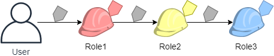
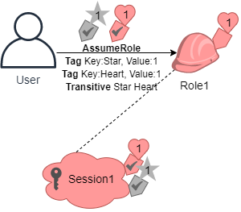
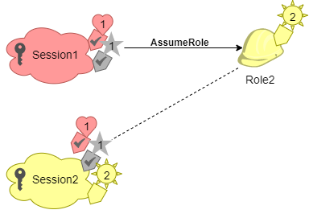
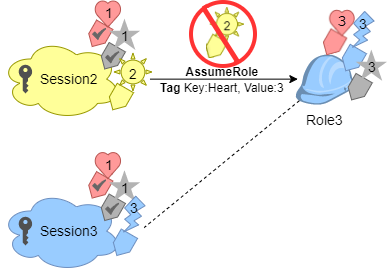

# Pass session tags in AWS STS

Session tags are key-value pair attributes that you pass when you assume an IAM role or
federate a user in AWS STS. You do this by making an AWS CLI or AWS API request through AWS STS or
through your identity provider (IdP). When you use AWS STS to request temporary security
credentials, you generate a session. Sessions expire and have [credentials](../../../STS/latest/APIReference/API_Credentials.md "../../../STS/latest/APIReference/API_Credentials.md"), such as an access key pair and a
session token. When you use the session credentials to make a subsequent request, the [request context](reference_policies_elements_condition.md#AccessPolicyLanguage_RequestContext "reference_policies_elements_condition.md#AccessPolicyLanguage_RequestContext") includes the `aws:PrincipalTag` context key. You can
use the `aws:PrincipalTag` key in the `Condition` element of your policies
to allow or deny access based on those tags.

When you use temporary credentials to make a request, your principal might include a set of
tags. These tags come from the following sources:

1. **Session tags** – The tags passed when you assume
   the role or federate the user using the AWS CLI or AWS API. For more information about these
   operations, see [Session tagging operations](#id_session-tags_operations "#id_session-tags_operations").
2. **Incoming transitive session tags** – The tags
   inherited from a previous session in a role chain. For more information, see [Chaining roles with session tags](#id_session-tags_role-chaining "#id_session-tags_role-chaining")
   later in this topic.
3. **IAM tags** – The tags attached to your IAM
   assumed role.

###### Topics

- [Session tagging operations](#id_session-tags_operations "#id_session-tags_operations")
- [Things to know about session tags](#id_session-tags_know "#id_session-tags_know")
- [Permissions required to add session
  tags](#id_session-tags_permissions-required "#id_session-tags_permissions-required")
- [Passing session tags using
  AssumeRole](#id_session-tags_adding-assume-role "#id_session-tags_adding-assume-role")
- [Passing session tags using
  AssumeRoleWithSAML](#id_session-tags_adding-assume-role-saml "#id_session-tags_adding-assume-role-saml")
- [Passing session tags using
  AssumeRoleWithWebIdentity](#id_session-tags_adding-assume-role-idp "#id_session-tags_adding-assume-role-idp")
- [Passing session tags using
  GetFederationToken](#id_session-tags_adding-getfederationtoken "#id_session-tags_adding-getfederationtoken")
- [Chaining roles with session tags](#id_session-tags_role-chaining "#id_session-tags_role-chaining")
- [Using session tags for ABAC](#id_session-tags_using-abac "#id_session-tags_using-abac")
- [Viewing session tags in CloudTrail](#id_session-tags_ctlogs "#id_session-tags_ctlogs")

## Session tagging operations

You can pass session tags using the following AWS CLI or AWS API operations in AWS STS.
_The AWS Management Console **[Switch Role](id_roles_use_switch-role-console.md "id_roles_use_switch-role-console.md")** feature does
not allow you to pass session tags._

You can also set the session tags as transitive. Transitive tags persist during role
chaining. For more information, see [Chaining roles with session tags](#id_session-tags_role-chaining "#id_session-tags_role-chaining").

The following table compares methods for passing session tags.

| Operation                                                                                                                                                                                                                                                                                                                                                            | **Who can assume the role**                           | **Method to pass tags**                     | **Method to set transitive tags**                                       |
| -------------------------------------------------------------------------------------------------------------------------------------------------------------------------------------------------------------------------------------------------------------------------------------------------------------------------------------------------------------------- | ----------------------------------------------------- | ------------------------------------------- | ----------------------------------------------------------------------- | ---------------------------------------------------------------------------------------------------------------------------------------------------------------------------------------------------------------------------------------------------------------------------------------------------------------------------------------------------------------------------------------------------------------------------------------------------------------------------------------------------------------------------------------------------------------------------------------------------------------------------------------------------------------------------------------------------------------------------------------------------------------------------------------------------------------------------------------------------------------------------------------------------------------------------------------------------------------------------------------------------------------------------------------------------------------------------------------------------------------------------------------------------------------------------------------------------------------------------------------------------------------------------------------------------------------------------------------------------------------------------------------------------------------------------------------------------------------------------------------------------------------------------------------------------------------------------------------------------------------------------------------------------------------------------------------------------------------------------------------------------------------------------------------------------------------------------------------------------------------------------------------------------------------------------------------------------------------------------------------------------------------------------------------------------------------------------------------------------------------------------------------------------------------------------------------------------------------------------------------------------------------------------------------------------------------------------------------------------------------------------------------------------------------------------------------------------------------------------------------------------------------------------------------------------------------------------------------------------------------------------------------------------------------------------------------------------------------------------------------------------------------------------------------------------------------------------------------------------------------------------------------------------------------------------------------------------------------------------------------------------------------------------------------------------------------------------------------------------------------------------------------------------------------------------------------------------------------------------------------------------------------------------------------------------------------------------------------------------------------------------------------------------------------------------------------------------------------------------------------------------------------------------------------------------------------------------------------------------------------------------------------------------------------------------------------------------------------------------------------------------------------------------------------------------------------------------------------------------------------------------------------------------------------------------------------------------------------------------------------------------------------------------------------------------------------------------------------------------------------------------------------------------------------------------------------------------------------------------------------------------------------------------------------------------------------------------------------------------------------------------------------------------------------------------------------------------------------------------------------------------------------------------------------------------------------------------------------------------------------------------------------------------------------------------------------------------------------------------------------------------------------------------------------------------------------------------------------------------------------------------------------------------------------------------------------------------------------------------------------------------------------------------------------------------------------------------------------------------------------------------------------------------------------------------------------------------------------------------------------------------------------------------------------------------------------------------------------------------------------------------------------------------------------------------------------------------------------------------------------------------------------------------------------------------------------------------------------------------------------------------------------------------------------------------------------------------------------------------------------------------------------------------------------------------------------------------------------------------------------------------------------------------------------------------------------------------------------------------------------------------------------------------------------------------------------------------------------------------------------------------------------------------------------------------------------------------------------------------------------------------------------------------------------------------------------------------------------------------------------------------------------------------------------------------------------------------------------------------------------------------------------------------------------------------------------------------------------------------------------------------------------------------------------------------------------------------------------------------------------------------------------------------------------------------------------------------------------------------------------------------------------------------------------------------------------------------------------------------------------------------------------------------------------------------------------------------------------------------------------------------------------------------------------------------------------------------------------------------------------------------------------------------------------------------------------------------------------------------------------------------------------------------------------------------------------------------------------------------------------------------------------------------------------------------------------------------------------------------------------------------------------------------------------------------------------------------------------------------------------------------------------------------------------------------------------------------------------------------------------------------------------------------------------------------------------------------------------------------------------------------------------------------------------------------------------------------------------------------------------------------------------------------------------------------------------------------------------------------------------------------------------------------------------------------------------------------------------------------------------------------------------------------------------------------------------------------------------------------------------------------------------------------------------------------------------------------------------------------------------------------------------------------------------------------------------------------------------------------------------------------------------------------------------------------------------------------------------------------------------------------------------------------------------------------------------------------------------------------------------------------------------------------------------------------------------------------------------------------------------------------------------------------------------------------------------------------------------------------------------------------------------------------------------------------------------------------------------------------------------------------------------------------------------------------------------------------------------------------------------------------------------------------------------------------------------------------------------------------------------------------------------------------------------------------------------------------------------------------------------------------------------------------------------------------------------------------------------------------------------------------------------------------------------------------------------------------------------------------------------------------------------------------------------------------------------------------------------------------------------------------------------------------------------------------------------------------------------------------------------------------------------------------------------------------------------------------------------------------------------------------------------------------------------------------------------------------------------------------------------------------------------------------------------------------------------------------------------------------------------------------------------------------------------------------------------------------------------------------------------------------------------------------------------------------------------------------------------------------------------------------------------------------------------------------------------------------------------------------------------------------------------------------------------------------------------------------------------------------------------------------------------------------------------------------------------------------------------------------------------------------------------------------------------------------------------------------------------------------------------------------------------------------------------------------------------------------------------------------------------------------------------------------------------------------------------------------------------------------------------------------------------------------------------------------------------------------------------------------------------------------------------------------------------------------------------------------------------------------------------------------------------------------------------------------------------------------------------------------------------------------------------------------------------------------------------------------------------------------------------------------------------------------------------------------------------------------------------------------------------------------------------------------------------------------------------------------------------------------------------------------------------------------------------------------------------------------------------------------------------------------------------------------------------------------------------------------------------------------------------------------------------------------------------------------------------------------------------------------------------------------------------------------------------------------------------------------------------------------------------------------------------------------------------------------------------------------------------------------------------------------------------------------------------------------------------------------------------------------------------------------------------------------------------------------------------------------------------------------------------------------------------------------------------------------------------------------------------------------------------------------------------------------------------------------------------------------------------------------------------------------------------------------------------------------------------------------------------------------------------------------------------------------------------------------------------------------------------------------------------------------------------------------------------------------------------------------------------------------------------------------------------------------------------------------------------------------------------------------------------------------------------------------------------------------------------------------------------------------------------------------------------------------------------------------------------------------------------------------------------------------------------------------------------------------------------------------------------------------------------------------------------------------------------------------------------------------------------------------------------------------------------------------------------------------------------------------------------------------------------------------------------------------------------------------------------------------------------------------------------------------------------------------------------------------------------------------------------------------------------------------------------------------------------------------------------------------------------------------------------------------------------------------------------------------------------------------------------------------------------------------------------------------------------------------------------------------------------------------------------------------------------------------------------------------------------------------------------------------------------------------------------------------------------------------------------------------------------------------------------------------------------------------------------------------------------------------------------------------------------------------------------------------------------------------------------------------------------------------------------------------------------------------------------------------------------------------------------------------------------------------------------------------------------------------------------------------------------------------------------------------------------------------------------------------------------------------------------------------------------------------------------------------------------------------------------------------------------------------------------------------------------------------------------------------------------------------------------------------------------------------------------------------------------------------------------------------------------------------------------------------------------------------------------------------------------------------------------------------------------------------------------------------------------------------------------------------------------------------------------------------------------------------------------------------------------------------------------------------------------------------------------------------------------------------------------------------------------------------------------------------------------------------------------------------------------------------------------------------------------------------------------------------------------------------------------------------------------------------------------------------------------------------------------------------------------------------------------------------------------------------------------------------------------------------------------------------------------------------------------------------------------------------------------------------------------------------------------------------------------------------------------------------------------------------------------------------------------------------------------------------------------------------------------------------------------------------------------------------------------------------------------------------------------------------------------------------------------------------------------------------------------------------------------------------------------------------------------------------------------------------------------------------------------------------------------------------------------------------------------------------------------------------------------------------------------------------------------------------------------------------------------------------------------------------------------------------------------------------------------------------------------------------------------------------------------------------------------------------------------------------------------------------------------------------------------------------------------------------------------------------------------------------------------------------------------------------------------------------------------------------------------------------------------------------------------------------------------------------------------------------------------------------------------------------------------------------------------------------------------------------------------------------------------------------------------------------------------------------------------------------------------------------------------------------------------------------------------------------------------------------------------------------------------------------------------------------------------------------------------------------------------------------------------------------------------------------------------------------------------------------------------------------------------------------------------------------------------------------------------------------------------------------------------------------------------------------------------------------------------------------------------------------------------------------------------------------------------------------------------------------------------------------------------------------------------------------------------------------------------------------------------------------------------------------------------------------------------------------------------------------------------------------------------------------------------------------------------------------------------------------------------------------------------------------------------------------------------------------------------------------------------------------------------------------------------------------------------------------------------------------------------------------------------------------------------------------------------------------------------------------------------------------------------------------------------------------------------------------------------------------------------------------------------------------------------------------------------------------------------------------------------------------------------------------------------------------------------------------------------------------------------------------------------------------------------------------------------------------------------------------------------------------------------------------------------------------------------------------------------------------------------------------------------------------------------------------------------------------------------------------------------------------------------------------------------------------------------------------------------------------------------------------------------------------------------------------------------------------------------------------------------------------------------------------------------------------------------------------------------------------------------------------------------------------------------------------------------------------------------------------------------------------------------------------------------------------------------------------------------------------------------------------------------------------------------------------------------------------------------------------------------------------------------------------------------------------------------------------------------------------------------------------------------------------------------------------------------------------------------------------------------------------------------------------------------------------------------------------------------------------------------------------------------------------------------------------------------------------------------------------------------------------------------------------------------------------------------------------------------------------------------------------------------------------------------------------------------------------------------------------------------------------------------------------------------------------------------------------------------------------------------------------------------------------------------------------------------------------------------------------------------------------------------------------------------------------------------------------------------------------------------------------------------------------------------------------------------------------------------------------------------------------------------------------------------------------------------------------------------------------------------------------------------------------------------------------------------------------------------------------------------------------------------------------------------------------------------------------------------------------------------------------------------------------------------------------------------------------------------------------------------------------------------------------------------------------------------------------------------------------------------------------------------------------------------------------------------------------------------------------------------------------------------------------------------------------------------------------------------------------------------------------------------------------------------------------------------------------------------------------------------------------------------------------------------------------------------------------------------------------------------------------------------------------------------------------------------------------------------------------------------------------------------------------------------------------------------------------------------------------------------------------------------------------------------------------------------------------------------------------------------------------------------------------------------------------------------------------------------------------------------------------------------------------------------------------------------------------------------------------------------------------------------------------------------------------------------------------------------------------------------------------------------------------------------------------------------------------------------------------------------------------------------------------------------------------------------------------------------------------------------------------------------------------------------------------------------------------------------------------------------------------------------------------------------------------------------------------------------------------------------------------------------------------------------------------------------------------------------------------------------------------------------------------------------------------------------------------------------------------------------------------------------------------------------------------------------------------------------------------------------------------------------------------------------------------------------------------------------------------------------------------------------------------------------------------------------------------------------------------------------------------------------------------------------------------------------------------------------------------------------------------------------------------------------------------------------------------------------------------------------------------------------------------------------------------------------------------------------------------------------------------------------------------------------------------------------------------------------------------------------------------------------------------------------------------------------------------------------------------------------------------------------------------------------------------------------------------------------------------------------------------------------------------------------------------------------------------------------------------------------------------------------------------------------------------------------------------------------------------------------------------------------------------------------------------------------------------------------------------------------------------------- |
| [`assume-role`](../../../cli/latest/reference/sts/assume-role.md "../../../cli/latest/reference/sts/assume-role.md") CLI or [`AssumeRole`](../../../STS/latest/APIReference/API_AssumeRole.md "../../../STS/latest/APIReference/API_AssumeRole.md") API operation                                                                                                    | IAM user or a session                                 | `Tags` API parameter or `--tags` CLI option | `TransitiveTagKeys` API parameter or `--transitive-tag-keys` CLI option |
| [`assume-role-with-saml`](../../../cli/latest/reference/sts/assume-role-with-saml.md "../../../cli/latest/reference/sts/assume-role-with-saml.md") CLI or [`AssumeRoleWithSAML`](../../../STS/latest/APIReference/API_AssumeRoleWithSAML.md "../../../STS/latest/APIReference/API_AssumeRoleWithSAML.md") API operation                                              | Any user authenticated using a SAML identity provider | `PrincipalTag` SAML attribute               | `TransitiveTagKeys` SAML Attribute                                      |
| [`assume-role-with-web-identity`](../../../cli/latest/reference/sts/assume-role-with-web-identity.md "../../../cli/latest/reference/sts/assume-role-with-web-identity.md") CLI or [`AssumeRoleWithWebIdentity`](../../../STS/latest/APIReference/API_AssumeRoleWithWebIdentity.md "../../../STS/latest/APIReference/API_AssumeRoleWithWebIdentity.md") API operation | Any user authenticated using an OIDC provider         | `PrincipalTag` OIDC token                   | `TransitiveTagKeys` OIDC token                                          |
| [`get-federation-token`](../../../cli/latest/reference/sts/get-federation-token.md "../../../cli/latest/reference/sts/get-federation-token.md") CLI or [`GetFederationToken`](../../../STS/latest/APIReference/API_GetFederationToken.md "../../../STS/latest/APIReference/API_GetFederationToken.md") API operation                                                 | IAM user or root user                                 | `Tags` API parameter or `--tags` CLI option | Not supported                                                           | Operations that support session tagging can fail under the following conditions: <br>• You pass more than 50 session tags. <br>• The plaintext of your session tag keys exceeds 128 characters. <br>• The plaintext of your session tag values exceeds 256 characters. <br>• The total size of the plaintext of session policies exceeds 2048 characters. <br>• The total packed size of the combined session policies and tags is too large. If the operation fails, the error message shows how close the policies and tags combined come to the upper size limit, by percentage. ## Things to know about session tags Before you use session tags, review the following details about sessions and tags. <br>• When using session tags, trust policies for all roles connected to the identity provider (IdP) passing tags must have the [sts:TagSession](#id_session-tags_permissions-required "#id_session-tags_permissions-required") permission. For roles without this permission in the trust policy, the `AssumeRole` operation fails. <br>• When you request a session, you can specify principal tags as the session tags. The tags apply to requests that you make using the session's credentials. <br>• Session tags use key-value pairs. For example, to add contact information to a session, you can add the session tag key `email` and the tag value `johndoe@example.com`. <br>• Session tags must follow the [rules for naming tags in IAM and AWS STS](id_tags.md#id_tags_rules_creating "id_tags.md#id_tags_rules_creating"). This topic includes information about case sensitivity and restricted prefixes that apply to your session tags. <br>• New session tags override existing assumed role or federated user session tags with the same tag key, regardless of character case. <br>• You cannot pass session tags using the AWS Management Console. <br>• Session tags are valid only for the current session. <br>• Session tags support [role chaining](id_roles.md#iam-term-role-chaining "id_roles.md#iam-term-role-chaining"). By default, AWS STS does not pass tags to subsequent role sessions. However, you can set session tags as transitive. Transitive tags persist during role chaining and replace matching `ResourceTag` values after the evaluation of the role trust policy. For more information, see [Chaining roles with session tags](#id_session-tags_role-chaining "#id_session-tags_role-chaining"). <br>• You can use session tags to control access to resources or to control what tags can be passed into a subsequent session. For more information, see [IAM tutorial: Use SAML session tags for ABAC](tutorial_abac-saml.md "tutorial_abac-saml.md"). <br>• You can view the principal tags for your session, including the session tags, in the AWS CloudTrail logs. For more information, see [Viewing session tags in CloudTrail](#id_session-tags_ctlogs "#id_session-tags_ctlogs"). <br>• You must pass a single value for each session tag. AWS STS does not support multi-valued session tags. <br>• You can pass a maximum of 50 session tags. The number and size of IAM resources in an AWS account are limited. For more information, see [IAM and AWS STS quotas](reference_iam-quotas.md "reference_iam-quotas.md"). <br>• An AWS conversion compresses the passed session policies and session tags combined into a packed binary format with a separate limit. If you exceed this limit, the AWS CLI or AWS API error message shows how close the policies and tags combined come to the upper size limit, by percentage. ## Permissions required to add session tags In addition to the action that matches the API operation, you must have the following permissions-only action in your policy: `` `sts:TagSession` `` ###### Important When using session tags, the role trust policies for all roles connected to an identity provider (IdP) must have the `sts:TagSession` permission. The `AssumeRole` operation fails for any role connected to an IdP passing session tags without this permission. If you don't want to update the role trust policy for each role, you can use a separate IdP instance for passing session tags. Then, add the `sts:TagSession` permission to only the roles connected to the separate IdP. You can use the `sts:TagSession` action with the following condition keys. <br>• `aws:PrincipalTag` – Compares the tag attached to the principal making the request with the tag you specified in the policy. For example, you can allow a principal to pass session tags only if the principal making the request has the specified tags. <br>• `aws:RequestTag` – Compares the tag key-value pair passed in the request with the tag pair you specified in the policy. For example, you can allow the principal to pass the specified session tags, but only with the specified values. <br>• `aws:ResourceTag` – Compares the tag key-value pair you specified in the policy with the key-value pair attached to the resource. For example, you can allow the principal to pass session tags only if the role they assume includes the specified tags. <br>• `aws:TagKeys` – Compares the tag keys in a request with the keys you specified in the policy. For example, you can allow the principal to pass only session tags with the specified tag keys. This condition key limits the maximum set of session tags that can be passed. <br>• `sts:TransitiveTagKeys` - Compares the transitive session tag keys in the request with those specified in the policy. For example, you can write a policy to allow a principal to set only specific tags as transitive. Transitive tags persist during role chaining. For more information, see [Chaining roles with session tags](#id_session-tags_role-chaining "#id_session-tags_role-chaining"). For example, the following [role trust policy](id_roles.md#term_trust-policy "id_roles.md#term_trust-policy") allows the `test-session-tags` user to assume the role with the attached policy. When that user assumes the role, they must use the AWS CLI or AWS API to pass the three required session tags and the required [external ID](id_roles_common-scenarios_third-party.md#id_roles_third-party_external-id "id_roles_common-scenarios_third-party.md#id_roles_third-party_external-id"). Additionally, the user can choose to set the `Project` and `Department` tags as transitive. ###### Example role trust policy for session tags JSON `` `{ "Version":"2012-10-17", "Statement": [ { "Sid": "AllowIamUserAssumeRole", "Effect": "Allow", "Action": "sts:AssumeRole", "Principal": {"AWS": "arn:aws:iam::`123456789012`:user/`test-session-tags`"}, "Condition": { "StringLike": { "aws:RequestTag/`Project`": "*", "aws:RequestTag/`CostCenter`": "*", "aws:RequestTag/`Department`": "*" }, "StringEquals": {"sts:ExternalId": "`Example987`"} } }, { "Sid": "AllowPassSessionTagsAndTransitive", "Effect": "Allow", "Action": "sts:TagSession", "Principal": {"AWS": "arn:aws:iam::`123456789012`:user/`test-session-tags`"}, "Condition": { "StringLike": { "aws:RequestTag/`Project`": "*", "aws:RequestTag/`CostCenter`": "*" }, "StringEquals": { "aws:RequestTag/`Department`": [ "`Engineering`", "`Marketing`" ] }, "ForAllValues:StringEquals": { "sts:TransitiveTagKeys": [ "`Project`", "`Department`" ] } } } ] }` `` **What does this policy do?** <br>• The `AllowIamUserAssumeRole` statement allows the `test-session-tags` user to assume the role with the attached policy. When that user assumes the role, they must pass the required session tags and [external ID](id_roles_common-scenarios_third-party.md#id_roles_third-party_external-id "id_roles_common-scenarios_third-party.md#id_roles_third-party_external-id"). + The first condition block of this statement requires the user to pass the `Project`, `CostCenter`, and `Department` session tags. The tag values do not matter in this statement, so you can use wildcards (\*) for the tag values. This block ensures that user passes at least these three session tags. Otherwise, the operation fails. The user can pass additional tags. + The second condition block requires the user to pass an [external ID](id_roles_common-scenarios_third-party.md#id_roles_third-party_external-id "id_roles_common-scenarios_third-party.md#id_roles_third-party_external-id") with the value `Example987`. <br>• The `AllowPassSessionTagsAndTransitive` statement allows the `sts:TagSession` permissions-only action. This action must be allowed before the user can pass session tags. If your policy includes the first statement without the second statement, the user can't assume the role. + The first condition block of this statement allows the user to pass any value for the `CostCenter` and `Project` session tags. You do this by using wildcards (\*) for the tag value in the policy, which requires that you use the [StringLike](reference_policies_elements_condition_operators.md#Conditions_String "reference_policies_elements_condition_operators.md#Conditions_String") condition operator. + The second condition block allows the user to pass only the `Engineering` or `Marketing` value for the `Department` session tag. + The third condition block lists the maximum set of tags you can set as transitive. The user can choose to set a subset or no tags as transitive. They cannot set additional tags as transitive. You can require that they set at least one of the tags as transitive by adding another condition block that includes `"Null":{"sts:TransitiveTagKeys":"false"}`. ## Passing session tags using AssumeRole The `AssumeRole` operation returns a set of temporary credentials you can use to access AWS resources. You can use IAM user or role credentials to call `AssumeRole`. To pass session tags while assuming a role, use the `--tags` AWS CLI option or the `Tags` AWS API parameter. To set tags as transitive, use the `--transitive-tag-keys` AWS CLI option or the `TransitiveTagKeys` AWS API parameter. Transitive tags persist during role chaining. For more information, see [Chaining roles with session tags](#id_session-tags_role-chaining "#id_session-tags_role-chaining"). The following example shows a sample request that uses `AssumeRole`. In this example, when you assume the `my-role-example` role, you create a session named `my-session`. You add the session tag key-value pairs `Project` = `Automation`, `CostCenter` = `12345`, and `Department` = `Engineering`. You also set the `Project` and `Department` tags as transitive by specifying their keys. You must pass a single value for each session tag. AWS STS does not support multi-valued session tags. ###### Example AssumeRole CLI request `aws sts assume-role \ --role-arn arn:aws:iam::123456789012:role/my-role-example \ --role-session-name my-session \ --tags Key=Project,Value=Automation Key=CostCenter,Value=12345 Key=Department,Value=Engineering \ --transitive-tag-keys Project Department \ --external-id Example987` ## Passing session tags using AssumeRoleWithSAML The `AssumeRoleWithSAML` operation authenticates with SAML-based federation. This operation returns a set of temporary credentials you can use to access AWS resources. For more information about using SAML-based federation for AWS Management Console access, see [Enabling SAML 2.0 federated principals to access the AWS Management Console](id_roles_providers_enable-console-saml.md "id_roles_providers_enable-console-saml.md"). For details about AWS CLI or AWS API access, see [SAML 2.0 federation](id_roles_providers_saml.md "id_roles_providers_saml.md"). For a tutorial on configuring SAML federation for your Active Directory users, see [AWS Federated Authentication with Active Directory Federation Services (ADFS)](https://aws.amazon.com/blogs/security/aws-federated-authentication-with-active-directory-federation-services-ad-fs/ "https://aws.amazon.com/blogs/security/aws-federated-authentication-with-active-directory-federation-services-ad-fs/") in the AWS Security Blog. As an administrator, you can allow members of your company directory to federate into AWS using the AWS STS `AssumeRoleWithSAML` operation. To do this, you must complete the following tasks: 1. [Configure your network as a SAML provider for AWS](id_roles_providers_saml_3rd-party.md "id_roles_providers_saml_3rd-party.md"). 2. [Create a SAML provider in IAM](id_roles_providers_create_saml.md "id_roles_providers_create_saml.md") 3. [Create a role for SAML 2.0 federation (console)](id_roles_create_for-idp_saml.md "id_roles_create_for-idp_saml.md") 4. [Finish configuring the SAML IdP and create assertions for the SAML authentication response](id_roles_providers_create_saml_assertions.md "id_roles_providers_create_saml_assertions.md") AWS includes identity providers with certified end-to-end experience for session tags with their identity solutions. To learn how to use these identity providers to configure session tags, see [Integrate third-party SAML solution providers with AWS](id_roles_providers_saml_3rd-party.md "id_roles_providers_saml_3rd-party.md"). To pass SAML attributes as session tags, include the `Attribute` element with the `Name` attribute set to `https://aws.amazon.com/SAML/Attributes/PrincipalTag:`{TagKey}``. Use the `AttributeValue`element to specify the value of the tag. Include a separate`Attribute`element for each session tag. For example, assume that you want to pass the following identity attributes as session tags: <br>•`Project:Automation`<br>•`CostCenter:12345`<br>•`Department:Engineering`To pass these attributes, include the following elements in your SAML assertion. ###### Example snippet of a SAML assertion ``` <Attribute Name="https://aws.amazon.com/SAML/Attributes/PrincipalTag:Project"> <AttributeValue>Automation</AttributeValue> </Attribute> <Attribute Name="https://aws.amazon.com/SAML/Attributes/PrincipalTag:CostCenter"> <AttributeValue>12345</AttributeValue> </Attribute> <Attribute Name="https://aws.amazon.com/SAML/Attributes/PrincipalTag:Department"> <AttributeValue>Engineering</AttributeValue> </Attribute> ``` To set the preceding tags as transitive, include another`Attribute`element with the`Name`attribute set to`https://aws.amazon.com/SAML/Attributes/TransitiveTagKeys`. Transitive tags persist during role chaining. For more information, see [Chaining roles with session tags](#id_session-tags_role-chaining "#id_session-tags_role-chaining"). To set the `Project` and `Department` tags as transitive, use the following multi-valued attribute: ###### Example snippet of a SAML assertion `<Attribute Name="https://aws.amazon.com/SAML/Attributes/TransitiveTagKeys"> <AttributeValue>Project</AttributeValue> <AttributeValue>Department</AttributeValue> </Attribute>` ## Passing session tags using AssumeRoleWithWebIdentity Use OpenID Connect (OIDC)-compliant federation to authenticate the `AssumeRoleWithWebIdentity` operation. This operation returns a set of temporary credentials you can use to access AWS resources. For more information about using web identity federation for AWS Management Console access, see [OIDC federation](id_roles_providers_oidc.md "id_roles_providers_oidc.md"). To pass session tags from OpenID Connect (OIDC), you must include the session tags in the JSON Web Token (JWT) when you submit the `AssumeRoleWithWebIdentity` request. To learn more about OIDC tokens and claims, see [Using Tokens with User Pools](../../../cognito/latest/developerguide/amazon-cognito-user-pools-using-tokens-with-identity-providers.md "../../../cognito/latest/developerguide/amazon-cognito-user-pools-using-tokens-with-identity-providers.md") in the _Amazon Cognito Developer Guide_. AWS supports two claim formats for including session tags in the JWT: <br>• Nested claim format <br>• Flattened claim format ### Nested claim format The nested claim format uses a structure within the `https://aws.amazon.com/tags` namespace in the JWT. In this format: <br>• Principal tags are represented as a nested object under the `principal_tags` key. <br>• Each principal tag is a single string value. <br>• Transitive tag keys are represented in an array under the `transitive_tag_keys` key. <br>• Both `principal_tags` and `transitive_tag_keys` are nested under the `https://aws.amazon.com/tags` namespace. The following example demonstrates a decoded JWT using the nested object format: ###### Example decoded JSON Web Token using the nested claim format `{ "sub": "johndoe", "aud": "ac_oic_client", "jti": "ZYUCeRMQVtqHypVPWAN3VB", "iss": "https://xyz.com", "iat": 1566583294, "exp": 1566583354, "auth_time": 1566583292, "https://aws.amazon.com/tags": { "principal_tags": { "Project": ["Automation"], "CostCenter": ["987654"], "Department": ["Engineering"] }, "transitive_tag_keys": [ "Project", "CostCenter" ] } }` ### Flattened claim format The flattened claim format is compatible with identity providers that don't support nested objects in JWT claims, such as Microsoft Entra ID. In this format: <br>• Principal tags are represented as separate claims with the prefix `https://aws.amazon.com/tags/principal_tags/`. <br>• Each principal tag is a single string value. <br>• Transitive tag keys are represented in a single claim as an array of strings with the prefix `https://aws.amazon.com/tags/transitive_tag_keys`. Now, let's look at how the same information is represented using the flattened claim format: ###### Example decoded JSON Web Token using the flattened claim format `{ "sub": "johndoe", "aud": "ac_oic_client", "jti": "ZYUCeRMQVtqHypVPWAN3VB", "iss": "https://xyz.com", "iat": 1566583294, "exp": 1566583354, "auth_time": 1566583292, "https://aws.amazon.com/tags/principal_tags/Project": "Automation", "https://aws.amazon.com/tags/principal_tags/CostCenter": "987654", "https://aws.amazon.com/tags/principal_tags/Department": "Engineering", "https://aws.amazon.com/tags/transitive_tag_keys": [ "Project", "CostCenter" ] }` Both decoded JWT examples show a call to `AssumeRoleWithWebIdentity` with the `Project`, `CostCenter`, and `Department` session tags. Both tokens set the `Project` and `CostCenter` tags as transitive. Transitive tags persist during role chaining. For more information, see [Chaining roles with session tags](#id_session-tags_role-chaining "#id_session-tags_role-chaining"). The flattened claim format achieves the same result as the nested claim format but uses a flattened structure for tags. It allows you to include session tags in environments where nested JSON objects are not supported in JWT claims. When using either format, ensure that your identity provider is configured to issue tokens with the appropriate claim structures. AWS supports both claim formats, so you can choose the one that best fits your identity provider's specific requirements. ## Passing session tags using GetFederationToken The `GetFederationToken` allows you to federate your user. This operation returns a set of temporary credentials you can use to access AWS resources. To add tags to your federated user session, use the `--tags` AWS CLI option or the `Tags` AWS API parameter. You can't set session tags as transitive when you use `GetFederationToken`, because you can't use the temporary credentials to assume a role. You cannot use role chaining in this case. The following example shows a sample request using `GetFederationToken`. In this example, when you request the token, you create a session named `my-fed-user`. You add the session tag key-value pairs `Project` = `Automation` and `Department` = `Engineering`. ###### Example GetFederationToken CLI request `aws sts get-federation-token \ --name my-fed-user \ --tags key=Project,value=Automation key=Department,value=Engineering` When you use the temporary credentials returned by the `GetFederationToken` operation, the session principal tags include the user tags and the passed session tags. ## Chaining roles with session tags You can assume one role and then use the temporary credentials to assume another role. You can continue from session to session. This is called [role chaining](id_roles.md#iam-term-role-chaining "id_roles.md#iam-term-role-chaining"). When you pass session tags while assuming a role, you can set the keys as transitive. This ensures that those session tags pass to subsequent sessions in a role chain. You cannot set role tags as transitive. To pass these tags to subsequent sessions, specify them as session tags. ###### Note Transitive tags persist during role chaining and replace matching `ResourceTag` values after the evaluation of the role trust policy. The following example shows how AWS STS passes session tags, transitive tags, and role tags into subsequent sessions in a role chain. In this example role chaining scenario, you use an IAM user access key in the AWS CLI to assume a role named `Role1`. You then use the resulting session credentials to assume a second role named `Role2`. You can then use the second session credentials to assume a third role named `Role3`. These requests occur as three separate operations. Each role is already tagged in IAM. And during each request, you pass additional session tags.  When you chain roles, you can ensure that tags from an earlier session persist to the later sessions. To do this using the `assume-role` CLI command, you must pass the tag as a session tag and set the tag as transitive. You pass the tag `Star` = `1` as a session tag. The command also attaches the tag `Heart` = `1` to the role and applies as a principal tag when you use the session. However, you also want the `Heart` = `1` tag to automatically pass to the second or third session. To do that, you manually include it as a session tag. The resulting session principal tags include both of these tags, and sets them as transitive.  You perform this request using the following AWS CLI command: ###### Example AssumeRole CLI request `aws sts assume-role \ --role-arn arn:aws:iam::123456789012:role/Role1 \ --role-session-name Session1 \ --tags Key=Star,Value=1 Key=Heart,Value=1 \ --transitive-tag-keys Star Heart` You then use the credentials for that session to assume `Role2`. The command attaches the tag `Sun` = `2` to the second role and applies as a principal tag when you use the second session. The `Heart` and `Star` tags inherits the transitive session tags in the first session. The second session resulting principal tags are `Heart` = `1`, `Star` = `1`, and `Sun` = `2`. `Heart` and `Star` continue to be transitive. The `Sun` tag attached to `Role2` is not marked as transitive because it is not a session tag. Future sessions do not inherit this tag.  You perform this second request using the following AWS CLI command: ###### Example AssumeRole CLI request `aws sts assume-role \ --role-arn arn:aws:iam::123456789012:role/Role2 \ --role-session-name Session2` You then use the second session credentials to assume `Role3`. The principal tags for the third session come from any new session tags, the inherited transitive session tags, and the role tags. The `Heart` = `1` and `Star` = `1` tags on the second session are inherited from the transitive session tag in the first session. If you try to pass the `Sun` = `2` session tag, the operation fails. The inherited `Star` = 1 session tag overrides the role `Star` = `3` tag. In role chaining, the value of a transitive tag overrides the role matching the `ResourceTag` value after the evaluation of the role trust policy. In this example, if `Role3` uses `Star` as a `ResourceTag` in the role trust policy, and sets `ResourceTag` value to the transitive tag value from the calling role session. The role `Lightning` tag also applies to the third session, and not set as transitive.  You perform the third request using the following AWS CLI command: ###### Example AssumeRole CLI request `aws sts assume-role \ --role-arn arn:aws:iam::123456789012:role/Role3 \ --role-session-name Session3` ## Using session tags for ABAC Attribute-based access control (ABAC) uses an authorization strategy that defines permissions based on tag attributes. If your company uses an OIDC or SAML-based identity provider (IdP) to manage user identities, you can configure your assertion to pass session tags to AWS. For example, with corporate user identities, when your employees federate into AWS, AWS applies their attributes to their resulting principal. You can then use ABAC to allow or deny permissions based on those attributes. For details, see [IAM tutorial: Use SAML session tags for ABAC](tutorial_abac-saml.md "tutorial_abac-saml.md"). For more information about using IAM Identity Center with ABAC, see [Attributes for access control](../../../singlesignon/latest/userguide/attributesforaccesscontrol.md "../../../singlesignon/latest/userguide/attributesforaccesscontrol.md") in the _AWS IAM Identity Center User Guide_. ## Viewing session tags in CloudTrail You can use AWS CloudTrail to view the requests used to assume roles or federate users. The CloudTrail log file includes information about the principal tags for the assumed-role or federated user session. For more information, see [Logging IAM and AWS STS API calls with AWS CloudTrail](cloudtrail-integration.md "cloudtrail-integration.md"). For example, assume that you make an AWS STS `AssumeRoleWithSAML` request, pass session tags, and set those tags as transitive. You can find the following information in your CloudTrail log. ###### Example AssumeRoleWithSAML CloudTrail log `"requestParameters": { "sAMLAssertionID": "_c0046cEXAMPLEb9d4b8eEXAMPLE2619aEXAMPLE", "roleSessionName": "MyRoleSessionName", "principalTags": { "CostCenter": "987654", "Project": "Unicorn" }, "transitiveTagKeys": [ "CostCenter", "Project" ], "durationSeconds": 3600, "roleArn": "arn:aws:iam::123456789012:role/SAMLTestRoleShibboleth", "principalArn": "arn:aws:iam::123456789012:saml-provider/Shibboleth" },` You can view the following example CloudTrail logs to view events that use session tags. <br>• [Example AWS STS role chaining API event in CloudTrail log file](cloudtrail-integration.md#stscloudtrailexample-assumerole "cloudtrail-integration.md#stscloudtrailexample-assumerole") <br>• [Example SAML AWS STS API event in CloudTrail log file](cloudtrail-integration.md#stscloudtrailexample_saml "cloudtrail-integration.md#stscloudtrailexample_saml") <br>• [Example OIDC AWS STS API event in CloudTrail log file](cloudtrail-integration.md#stscloudtrailexample_web-identity "cloudtrail-integration.md#stscloudtrailexample_web-identity") |
