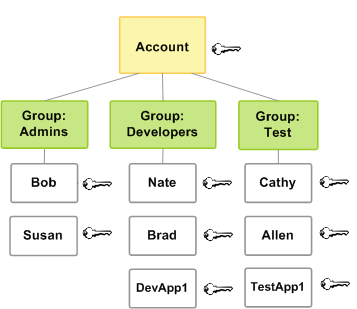

# How permissions and

policies provide access management

The access management portion of AWS Identity and Access Management (IAM) helps you define what a principal entity
can do in an account. A principal entity is a person or application authenticated using an IAM
entity (IAM user or IAM role). Access management is often referred to as
_authorization_. You manage access in AWS by creating policies and
attaching them to IAM identities (IAM users, IAM groups, or IAM roles) or AWS
resources. A policy is an object in AWS that, when associated with an identity or resource,
defines their permissions. AWS evaluates these policies when a principal uses an IAM entity
(IAM user or IAM role) to make a request. Permissions in the policies determine whether the
request is allowed or denied. Most policies are stored in AWS as JSON documents. For more
information about policy types and uses, see [Policies and permissions in AWS Identity and Access Management](access_policies.md "access_policies.md").

## Policies and accounts

If you manage a single account in AWS, then you define the permissions within that
account using policies. If you manage permissions across multiple accounts, it's more
difficult to manage permissions for your IAM users. You can use IAM roles, resource-based
policies, or access control lists (ACLs) for cross-account permissions. However, if you own
multiple accounts, we instead recommend using the AWS Organizations service to help you manage those
permissions. For more information, see [What
is AWS Organizations?](../../../organizations/latest/userguide/orgs_introduction.md "../../../organizations/latest/userguide/orgs_introduction.md") in the _AWS Organizations User Guide_.

## Policies and users

IAM users are identities in the AWS account. When you create an IAM user, they can't
access anything in your account until you give them permission. You give permissions to an
IAM user by creating an identity-based policy, which is a policy attached to the IAM user
or an IAM group to which the IAM user belongs. The following example shows a JSON policy
that permits the IAM user to perform all Amazon DynamoDB actions (`dynamodb:*`) on the
`Books` table in the `123456789012` account within the
`us-east-2` Region.

JSON

```
`{
 "Version":"2012-10-17",
 "Statement": {
 "Effect": "Allow",
 "Action": "dynamodb:*",
 "Resource": "arn:aws:dynamodb:us-east-2:123456789012:table/Books"
 }
}`

```

After you attach this policy to your IAM user, the user has permission to perform all
actions in the `Books` table of your DynamoDB instance. Most IAM users have multiple
policies that combine to represent their total granted permissions.

Actions or resources that aren't explicitly allowed by a policy are denied by default. For
example, if the preceding policy is the single policy attached to a user, then that user can
perform DynamoDB actions on the `Books` table, but can't perform actions on other
tables. Similarly, the user isn't allowed to perform any actions in Amazon EC2, Amazon S3, or in any
other AWS service because permissions to work with those services aren't included in the
policy.

## Policies and IAM groups

You can organize IAM users into _IAM groups_ and attach a policy to
the IAM group. In that case, individual IAM users still have their own credentials, but
all the IAM users in the IAM group have the permissions attached to the IAM group. Use
IAM groups for easier permissions management.



IAM users or IAM groups can have multiple policies attached to them that grant
different permissions. In that case, the combination of policies determines the effective
permissions for the principal. If the principal doesn't have explicit `Allow`
permission for both an action and a resource, the principal doesn't have those permissions, .

## Federated user sessions and roles

Federated principals don't have permanent identities in your AWS account the way that IAM
users do. To assign permissions to federated principals, you can create an entity referred to as a
_role_ and define permissions for the role. When a SAMl or OIDC federated principal signs
in to AWS, the user is associated with the role and is granted the permissions that are
defined in the role. For more information, see [Create a role for a third-party identity provider](id_roles_create_for-idp.md "id_roles_create_for-idp.md") .

## Identity-based and resource-based

policies

Identity-based policies are permissions policies that you attach to an IAM identity,
such as an IAM user, group, or role. Resource-based policies are permissions policies that
you attach to a resource such as an Amazon S3 bucket or an IAM role trust policy.

**_Identity-based
policies_** control what actions the identity can perform, on which
resources, and under what conditions. Identity-based policies can be further
categorized:

- **Managed policies** – Standalone identity-based
  policies that you can attach to multiple users, groups, and roles in your AWS account.
  You can use two types of managed policies:
  - **AWS managed policies** – Managed policies
    that are created and managed by AWS. If you are new to using policies, we recommend
    that you start by using AWS managed policies.
  - **Customer managed policies** – Managed
    policies that you create and manage in your AWS account. Customer managed policies
    provide more precise control over your policies than AWS managed policies. You can
    create, edit, and validate an IAM policy in the visual editor or by creating the
    JSON policy document directly. For more information, see [Define custom IAM permissions with customer managed
    policies](access_policies_create.md "access_policies_create.md") and [Edit IAM policies](access_policies_manage-edit.md "access_policies_manage-edit.md").

- **Inline policies** – Policies that you create and
  manage and that are embedded directly into a single user, group, or role. In most cases,
  we don't recommend using inline policies.

**_Resource-based
policies_** control what actions a specified principal can perform on
that resource and under what conditions. Resource-based policies are inline policies, and
there are no managed resource-based policies. To enable cross-account access, you can specify
an entire account or IAM entities in another account as the principal in a resource-based
policy.

The IAM service supports one type of resource-based policy called a role _trust policy_, which you attach to an IAM role. Because an IAM
role is both an identity and a resource that supports resource-based policies, you have to
attach both a trust policy and an identity-based policy to an IAM role. Trust policies
define which principal entities (accounts, users, roles, and AWS STS federated user principals) can assume the
role. To learn how IAM roles are different from other resource-based policies, see [Cross account resource
access in IAM](access_policies-cross-account-resource-access.md "access_policies-cross-account-resource-access.md").

To see which services support resource-based policies, see [AWS services that work with
IAM](reference_aws-services-that-work-with-iam.md "reference_aws-services-that-work-with-iam.md"). To learn more about
resource-based policies, see [Identity-based policies and
resource-based policies](access_policies_identity-vs-resource.md "access_policies_identity-vs-resource.md").
