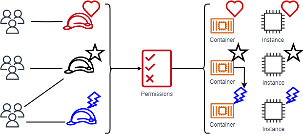
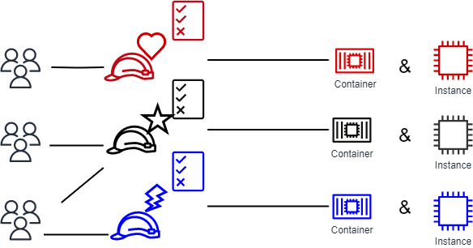

# Define permissions based on

attributes with ABAC authorization

Attribute-based access control (ABAC) is an authorization strategy that defines permissions
based on attributes. AWS calls these attributes _tags_. You
can attach tags to IAM resources, including IAM entities (IAM users or IAM roles) and
to AWS resources. You can create a single ABAC policy or small set of policies for your
IAM principals. You can design ABAC policies that allow operations when the principal's
tag matches the resource tag. ABAC's attribute system that provides both high user context and
granular access control. Because ABAC is attribute-based, it can perform dynamic authorization
for data or applications that grants or revokes access in real time. ABAC is helpful in
environments that are scaling and in situations where identity or resource policy management
has become complex.

For example, you can create three IAM roles with the `access-project` tag key.
Set the tag value of the first IAM role to `Heart`, the second to
`Star`, and the third to `Lightning`. You can then use a single
policy that allows access when the IAM role and the AWS resource have the tag value
`access-project`. For a detailed tutorial that demonstrates how to use ABAC in
AWS, see [IAM tutorial: Define permissions to
access AWS resources based on tags](tutorial_attribute-based-access-control.md "tutorial_attribute-based-access-control.md"). To learn about services that
support ABAC, see [AWS services that work with
IAM](reference_aws-services-that-work-with-iam.md "reference_aws-services-that-work-with-iam.md").

## Comparison of

ABAC to the traditional RBAC model

The traditional authorization model used in IAM is role-based access control (RBAC).
RBAC defines permissions based on a person's job function, or _role_, which is distinct from an IAM role. IAM does include [managed policies for job functions](access_policies_job-functions.md "access_policies_job-functions.md") that
align permissions to a job function in an RBAC model.

In IAM, you implement RBAC by creating different policies for different job functions.
You then attach the policies to identities (IAM users, IAM groups, or IAM roles). As
a [best practice](best-practices.md "best-practices.md"), you grant the minimum permissions
necessary for the job function. This results in [least
privilege](best-practices.md#grant-least-privilege "best-practices.md#grant-least-privilege") access. Each job function policy lists the specific resources that
identities assigned that policy can access. The disadvantage to using the traditional RBAC
model is that when you or your users add new resources to your environment, you have to
update the policies to allow access to those resources.

For example, assume that you have three projects, named `Heart`,
`Star`, and `Lightning`, on which your employees work. You create
an IAM role for each project. You then attach policies to each IAM role to define the
resources that anyone allowed to assume the IAM role can access. If an employee changes
jobs within your company, you assign them to a different IAM role. You can assign people
or programs to more than one IAM role. However, the `Star` project might
require additional resources, such as a new Amazon EC2 container. In that case, you have to
update the policy attached to the `Star` IAM role to specify the new container
resource. Otherwise, `Star` project members aren't allowed to access the new
container.

###### ABAC provides the following advantages over the traditional RBAC model:

- **ABAC permissions scale with innovation.** It's no
  longer necessary for an administrator to update existing policies to allow access to
  new resources. For example, assume that you designed your ABAC strategy with the
  `access-project` tag. A developer uses the IAM role with the
  `access-project` = `Heart` tag. When people on the
  `Heart` project need additional Amazon EC2 resources, the developer can
  create new Amazon EC2 instances with the `access-project` = `Heart`
  tag. Then anyone on the `Heart` project can start and stop those instances
  because their tag values match.
- **ABAC requires fewer policies.** Because you don't
  have to create different policies for different job functions, you create fewer
  policies. Those policies are easier to manage.
- **Using ABAC, teams can dynamically respond to change and
  growth.** Because permissions for new resources are automatically granted
  based on attributes you don't have to manually assign policies to identities. For
  example, if your company already supports the `Heart` and
  `Star` projects using ABAC, it's easy to add a new
  `Lightning` project. An IAM administrator creates a new IAM role
  with the `access-project` = `Lightning` tag. It's not necessary
  to change the policy to support a new project. Anyone that has permissions to assume
  the IAM role can create and view instances tagged with `access-project`
  = `Lightning`. Another scenario is when a team member moves from the
  `Heart` project to the `Lightning` project. To provide team
  member access to the `Lightning` project , the IAM administrator assigns
  them to a different IAM role. It's not necessary to change the permissions
  policies.
- **Granular permissions are possible using ABAC.**
  When you create policies, it's a best practice to [grant least privilege](best-practices.md#grant-least-privilege "best-practices.md#grant-least-privilege"). Using traditional
  RBAC, you write a policy that allows access to specific resources. However, when you
  use ABAC, you can allow actions on all resources if the resource's tag matches the
  principal's tag.
- **Use employee attributes from your corporate directory with
  ABAC.** You can configure your SAML or OIDC provider to pass session tags
  to IAM. When your employees federate into AWS, IAM applies their attributes to
  their resulting principal. You can then use ABAC to allow or deny permissions based
  on those attributes.

For a detailed tutorial that demonstrates how to use ABAC in AWS, see [IAM tutorial: Define permissions to
access AWS resources based on tags](tutorial_attribute-based-access-control.md "tutorial_attribute-based-access-control.md").
