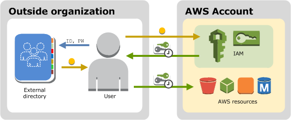

# Compare IAM identities and

credentials

The identities managed in AWS Identity and Access Management are IAM users, IAM roles, and IAM groups. These
identities are in addition to your root user that AWS created along with your
AWS account.

We strongly recommend that you do not use the root user for your everyday tasks, even the administrative ones. Instead, provision additional users and grant them the permissions required to perform the necessary tasks.
You can add users either by adding people to your IAM Identity Center directory, federating an external identity provider with either IAM Identity Center or IAM or creating least privilege IAM users.

For additional security, we recommend centralizing root access to help you centrally
secure the root user credentials of your AWS accounts managed using AWS Organizations. [Centrally manage root access for member
accounts](id_root-user.md#id_root-user-access-management "id_root-user.md#id_root-user-access-management") lets
you centrally remove and prevent long-term root user credential recovery, preventing unintended
root access at scale. After you enable centralized root access, you can assume a privileged session
to perform actions on member accounts.

After you have set up your users, you can give access to your AWS account to specific
people and provide them permissions to access resources.

As a [best practice](best-practices.md "best-practices.md"), AWS recommends that you require
human users to assume an IAM role to access AWS so that they're using temporary credentials.
If you are managing identities in the IAM Identity Center directory or using federation with an identity
provider you are following best practices.

## Terms

These terms are commonly used when working with IAM identities:

**IAM Resource**

The IAM service stores these resources. You can add, edit, and remove them from
the Console.

- IAM user
- IAM group
- IAM role
- Permission policy
- Identity-provider object

**IAM Entity**

IAM resources that AWS uses for authentication. Specify the entity as a
Principal in a resource-based policy.

- IAM user
- IAM role

**IAM Identity**

The IAM resource that's authorized in policies to perform actions and to access
resources. Identities include IAM users, IAM groups, and IAM roles.

**Principals**

An AWS account root user, IAM user or an IAM role that can make a request for an action or
operation on an AWS resource. Principals include human users, workloads, federated
principals, and assumed roles. After authentication, IAM grants the principal either
permanent or temporary credentials to make requests to AWS, depending on the principal
type.

_Human users_ are also known as _human
identities_, such as the people, administrators, developers, operators, and
consumers of your applications.

_Workloads_ are a collection of resources and code
that delivers business value, such as an application, process, operational tools, and
other components.

_Federated princiapls_ are users whose identity and
credentials are managed by another identity provider, such as Active Directory, Okta, or
Microsoft Entra.

_IAM roles_ are an IAM identity that you can
create in your account that has specific permissions that determine what the identity
can and can't do. However, instead of being uniquely associated with one person, a role
is intended to be assumable by anyone who needs it.

IAM grants IAM users and the root user long-term credentials and IAM roles
temporary credentials. users in AWS IAM Identity Center, OIDC and SAML federated principals assume IAM roles when
they sign-in to AWS, which grants them temporary credentials. As a [best practice](best-practices.md "best-practices.md"), we recommend that you require human
users and workloads to access AWS resources using temporary credentials.

## Difference between IAM users and

users in IAM Identity Center

**IAM users** aren't separate accounts; they're individual
users within your account. Each user has their own password for access to the AWS Management Console. You
can also create an individual access key for each user so that the user can make programmatic
requests to work with resources in your account.

IAM users and their access keys have long-term credentials to your AWS resources. The
primary use for IAM users is to give workloads that can't use IAM roles the ability to
make programmatic requests to AWS services using the API or CLI.

###### Note

For scenarios in which you need IAM users with programmatic access and long-term
credentials, we recommend that you update access keys when needed. For more information, see
[Update access keys](id-credentials-access-keys-update.md "id-credentials-access-keys-update.md").

Workforce identities (people) are **users in AWS IAM Identity Center** that
have different permission needs depending on the role they're performing and can work in
various AWS accounts across an organization. If you have use cases that require access keys,
you can support those use cases with users in AWS IAM Identity Center. People who sign-in through the
AWS access portal can obtain access keys with short-term credentials to your AWS resources. For
centralized access management, we recommend that you use [AWS IAM Identity Center (IAM Identity Center)](../../../singlesignon/latest/userguide/getting-started.md "../../../singlesignon/latest/userguide/getting-started.md") to manage access to your
accounts and permissions within those accounts. IAM Identity Center is automatically configured with an
Identity Center directory as your default identity source where you can add people and groups,
and assign their level of access to your AWS resources. For more information, see [What is
AWS IAM Identity Center](../../../singlesignon/latest/userguide/what-is.md "../../../singlesignon/latest/userguide/what-is.md") in the _AWS IAM Identity Center User Guide_.

The main difference between these two types of users is that users in IAM Identity Center automatically
assume an IAM role when they sign-in to AWS before they access the management console or
AWS resources. IAM roles grant temporary credentials each time the user signs-in to AWS.
For IAM users to sign in using an IAM role they must have permission to assume and switch
roles and they must explicitly choose to switch to the role they want to assume after
accessing the AWS account.

## Federate users from an existing identity

source

If the users in your organization are already authenticated when they sign in to your
corporate network, you don't have to create separate IAM users or users in IAM Identity Center for them.
Instead, you can _federate_ those user identities into AWS using either
IAM or AWS IAM Identity Center. OIDC and SAML federated principals assume an IAM role that gives them permissions to access
specific resources. For more information about roles, see [Roles terms and concepts](id_roles.md#id_roles_terms-and-concepts "id_roles.md#id_roles_terms-and-concepts").

Federation is useful in these cases:

- **Your users already exist in a corporate directory.**

If your corporate directory is compatible with Security Assertion Markup Language 2.0
(SAML 2.0), you can configure your corporate directory to provide single-sign on (SSO)
access to the AWS Management Console for your users. For more information, see [Common scenarios for temporary credentials](id_credentials_temp.md#sts-introduction "id_credentials_temp.md#sts-introduction").

If your corporate directory isn't compatible with SAML 2.0, you can create an identity
broker application to provide single-sign on (SSO) access to the AWS Management Console for your users.
For more information, see [Enable custom identity broker
access to the AWS console](id_roles_providers_enable-console-custom-url.md "id_roles_providers_enable-console-custom-url.md").

If your corporate directory is Microsoft Active Directory, you can use AWS IAM Identity Center to
connect a self-managed directory in Active Directory or a directory in [AWS Directory Service](https://aws.amazon.com/directoryservice/ "https://aws.amazon.com/directoryservice/") to establish trust between
your corporate directory and your AWS account.

If you are using an external identity provider (IdP) such as Okta or Microsoft Entra
to manage users, you can use AWS IAM Identity Center to establish trust between your IdP and your
AWS account. For more information, see [Connect to an
external identity provider](../../../singlesignon/latest/userguide/manage-your-identity-source-idp.md "../../../singlesignon/latest/userguide/manage-your-identity-source-idp.md") in the _AWS IAM Identity Center User Guide_.

- **Your users already have Internet identities.**

If you are creating a mobile app or web-based app that can let users identify
themselves through an Internet identity provider like Login with Amazon, Facebook, Google,
or any OpenID Connect (OIDC) compatible identity provider, the app can use federation to
access AWS. For more information, see [OIDC federation](id_roles_providers_oidc.md "id_roles_providers_oidc.md").

###### Tip

To use identity federation with Internet identity providers, we recommend you use
[Amazon Cognito](../../../cognito/latest/developerguide/what-is-amazon-cognito.md "../../../cognito/latest/developerguide/what-is-amazon-cognito.md").

## Different methods to provide user access

Here are the ways you can provide access to your AWS resources.

| Type of user access                                                                                                    | When is it used?                                                                                                                                                                                                                                                                                                                                                                                                                                                                                                                                                                                                                                                                                                                                                                                                                                                                                                                                                                           | Where is more information?                                                                                                                                                                                                                                                                                                                                                                                                                                                                                                                                                                                                                                                                                  |
| ---------------------------------------------------------------------------------------------------------------------- | ------------------------------------------------------------------------------------------------------------------------------------------------------------------------------------------------------------------------------------------------------------------------------------------------------------------------------------------------------------------------------------------------------------------------------------------------------------------------------------------------------------------------------------------------------------------------------------------------------------------------------------------------------------------------------------------------------------------------------------------------------------------------------------------------------------------------------------------------------------------------------------------------------------------------------------------------------------------------------------------ | ----------------------------------------------------------------------------------------------------------------------------------------------------------------------------------------------------------------------------------------------------------------------------------------------------------------------------------------------------------------------------------------------------------------------------------------------------------------------------------------------------------------------------------------------------------------------------------------------------------------------------------------------------------------------------------------------------------- |
| Single sign-on access for people, such as your workforce users, to AWS resources using IAM Identity Center          | IAM Identity Center provides a central place that brings together administration of users and their access to AWS accounts and cloud applications. You can set up an identity store within IAM Identity Center or you can configure federation with an existing identity provider (IdP). Security best practices recommend granting your human users limited credentials to AWS resources. People have an easier sign-in experience and you maintain control over their access to resources from a single system. IAM Identity Center supports multi-factor authentication (MFA) for additional account security.                                                                                                                                                                                                                                                                                                                                                     | For more information about setting up IAM Identity Center, see [Getting Started](../../../singlesignon/latest/userguide/getting-started.md "../../../singlesignon/latest/userguide/getting-started.md") in the _AWS IAM Identity Center User Guide_ For more information about using MFA in IAM Identity Center, see [Multi-factor authentication](../../../singlesignon/latest/userguide/enable-mfa.md "../../../singlesignon/latest/userguide/enable-mfa.md") in the _AWS IAM Identity Center User Guide_                                                                                                                                                                                        |
| Federated access for human users, such as your workforce users, to AWS services using IAM identity providers (IdPs) | IAM supports IdPs that are compatible with OpenID Connect (OIDC) or SAML 2.0 (Security Assertion Markup Language 2.0). After you create an IAM identity provider, create one or more IAM roles that can be dynamically assigned to a federated principal.                                                                                                                                                                                                                                                                                                                                                                                                                                                                                                                                                                                                                                                                                                                         | For more information about IAM identity providers and federation, see [Identity providers and federation](id_roles_providers.md "id_roles_providers.md").                                                                                                                                                                                                                                                                                                                                                                                                                                                                                                                                                |
| Cross-account access between AWS accounts                                                                              | You want to share access to certain AWS resources with users in other AWS accounts. Roles are the primary way to grant cross-account access. However, some AWS services support resource-based policies that allow you to attach a policy directly to a resource (instead of using a role as a proxy).                                                                                                                                                                                                                                                                                                                                                                                                                                                                                                                                                                                                                                                                         | For more information about IAM roles, see [IAM roles](id_roles.md "id_roles.md"). For more information about service-linked roles, see [Create a service-linked role](id_roles_create-service-linked-role.md "id_roles_create-service-linked-role.md"). For information about which services support using service-linked roles, see [AWS services that work with IAM](reference_aws-services-that-work-with-iam.md "reference_aws-services-that-work-with-iam.md"). Find the services that have **Yes\* • in the **Service-Linked Role* • column. To view the service-linked role documentation for that service select the link associated with the \*\*Yes* • in that column. |
| Long-term credentials for designated IAM users in your AWS account                                                     | You might have specific use cases that require long-term credentials with IAM users in AWS. You can use IAM to create these IAM users in your AWS account, and use IAM to manage their permissions. Some use cases include the following: • Workloads that can't use IAM roles • Third-party AWS clients that require programmatic access through access keys • Service-specific credentials for AWS CodeCommit or Amazon Keyspaces • AWS IAM Identity Center isn't available for your account and you have no other identity provider As a [best practice](best-practices.md "best-practices.md") in scenarios in which you need IAM users with [programmatic access and long-term credentials](id_credentials_access-keys.md "id_credentials_access-keys.md"), we recommend that you update access keys when needed. For more information, see [Update access keys](id-credentials-access-keys-update.md "id-credentials-access-keys-update.md"). | For more information about setting up an IAM user, see [Create an IAM user in your AWS account](id_users_create.md "id_users_create.md"). For more information about IAM user access keys, see [Manage access keys for IAM users](id_credentials_access-keys.md "id_credentials_access-keys.md"). For more information about service-specific credentials for AWS CodeCommit or Amazon Keyspaces, see [IAM credentials for CodeCommit: Git credentials, SSH keys, and AWS access keys](id_credentials_ssh-keys.md "id_credentials_ssh-keys.md") and [Use IAM with Amazon Keyspaces (for Apache Cassandra)](id_credentials_keyspaces.md "id_credentials_keyspaces.md").                          |

## Support programmatic user access

Users need programmatic access if they want to interact with AWS outside of the
AWS Management Console. The way to grant programmatic access depends on the type of user that's
accessing AWS:

- If you manage identities in IAM Identity Center, the AWS APIs require a profile, and the AWS Command Line Interface
  requires a profile or an environment variable.
- If you have IAM users, the AWS APIs and the AWS Command Line Interface require access keys.
  Whenever possible, create temporary credentials that consist of an access key ID, a secret
  access key, and a security token that indicates when the credentials expire.

To grant users programmatic access, choose one of the following options.

| Which user needs programmatic access?                                     | Option                                                                                                                                           | More information                                                                                                                                                                                                                                                                                                                                                                                                                                                                                              |
| ------------------------------------------------------------------------- | ------------------------------------------------------------------------------------------------------------------------------------------------ | ------------------------------------------------------------------------------------------------------------------------------------------------------------------------------------------------------------------------------------------------------------------------------------------------------------------------------------------------------------------------------------------------------------------------------------------------------------------------------------------------------------- |
| Workforce identities (People and users managed in IAM Identity Center) | Use short-term credentials to sign programmatic requests to the AWS CLI or AWS APIs (directly or by using the AWS SDKs).                      | For the AWS CLI, follow the instructions in [Getting IAM role credentials for CLI access](../../../singlesignon/latest/userguide/howtogetcredentials.md "../../../singlesignon/latest/userguide/howtogetcredentials.md") in the _AWS IAM Identity Center User Guide_. For the AWS APIs, follow the instructions in [SSO credentials](../../../sdkref/latest/guide/feature-sso-credentials.md "../../../sdkref/latest/guide/feature-sso-credentials.md") in the _AWS SDKs and Tools Reference Guide_. |
| IAM users                                                                 | Use short-term credentials to sign programmatic requests to the AWS CLI or AWS APIs (directly or by using the AWS SDKs).                      | Follow the instructions in [Using temporary credentials with AWS resources](id_credentials_temp_use-resources.md "id_credentials_temp_use-resources.md").                                                                                                                                                                                                                                                                                                                                                  |
| IAM users                                                                 | Use long-term credentials to sign programmatic requests to the AWS CLI or AWS APIs (directly or by using the AWS SDKs).(Not recommended)      | Follow the instructions in [Managing access keys for IAM users](id_credentials_access-keys.md "id_credentials_access-keys.md").                                                                                                                                                                                                                                                                                                                                                                            |
| Federated principals                                                      | Use an AWS STS API operation to create a new session with temporary security credentials that include an access key pair and a session token. | For explanations of the API operations, see [Request temporary security credentials](id_credentials_temp_request.md "id_credentials_temp_request.md")                                                                                                                                                                                                                                                                                                                                                         |
