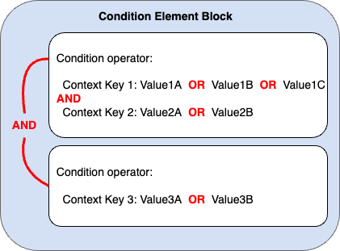
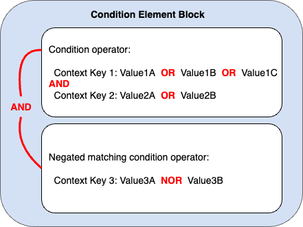

# Conditions

with multiple context keys or values

You can use the `Condition` element of a policy to test multiple context keys or
multiple values for a single context key in a request. When you make a request to AWS, either
programmatically or through the AWS Management Console, your request includes information about your
principal, operation, tags, and more. You can use context keys to test the values of the
matching context keys in the request, with the context keys specified in the policy condition.
To learn about information and data included in a request, see [The request context](reference_policies_elements_condition.md#AccessPolicyLanguage_RequestContext "reference_policies_elements_condition.md#AccessPolicyLanguage_RequestContext").

###### Topics

- [Evaluation logic for multiple
  context keys or values](#reference_policies_multiple-conditions-eval "#reference_policies_multiple-conditions-eval")
- [Evaluation
  logic for negated matching condition operators](#reference_policies_multiple-conditions-negated-matching-eval "#reference_policies_multiple-conditions-negated-matching-eval")

## Evaluation logic for multiple

context keys or values

A `Condition` element can contain multiple condition operators, and each
condition operator can contain multiple context key-value pairs. Most context keys support
using multiple values, unless otherwise specified.

- If your policy statement has multiple [condition operators](reference_policies_elements_condition_operators.md "reference_policies_elements_condition_operators.md"),
  the condition operators are evaluated using a logical `AND`.
- If your policy statement has multiple context keys attached to a single condition
  operator, the context keys are evaluated using a logical `AND`.
- If a single condition operator includes multiple values for a context key, those
  values are evaluated using a logical `OR`.
- If a single negated matching condition operator includes multiple values for a context
  key, those values are evaluated using a logical `NOR`.

All context keys in a condition element block must resolve to true to invoke the desired
`Allow` or `Deny` effect. The following figure illustrates the
evaluation logic for a condition with multiple condition operators and context key-value
pairs.



For example, the following S3 bucket policy illustrates how the previous figure is
represented in a policy. The condition block includes condition operators
`StringEquals` and `ArnLike`, and context keys
`aws:PrincipalTag` and `aws:PrincipalArn`. To invoke the desired
`Allow` or `Deny` effect, all context keys in the condition block must
resolve to true. The user making the request must have both principal tag keys,
_department_ and _role_, that include one of the tag
key values specified in the policy. Also, the principal ARN of the user making the request
must match one of the `aws:PrincipalArn` values specified in the policy to be
evaluated as true.

JSON

```
`{
 "Version":"2012-10-17",
 "Statement": [
 {
 "Sid": "ExamplePolicy",
 "Effect": "Allow",
 "Principal": {
 "AWS": "arn:aws:iam::222222222222:root"
 },
 "Action": "s3:ListBucket",
 "Resource": "arn:aws:s3:::amzn-s3-demo-bucket",
 "Condition": {
 "StringEquals": {
 "aws:PrincipalTag/department": [
 "finance",
 "hr",
 "legal"
 ],
 "aws:PrincipalTag/role": [
 "audit",
 "security"
 ]
 },
 "ArnLike": {
 "aws:PrincipalArn": [
 "arn:aws:iam::222222222222:user/Ana",
 "arn:aws:iam::222222222222:user/Mary"
 ]
 }
 }
 }
 ]
}`

```

The following table shows how AWS evaluates this policy based on the condition key
values in your request.

| Policy Condition                                                                                                                                                                                                                                                                                                | Request Context                                                                                                                                             | Result       |
| --------------------------------------------------------------------------------------------------------------------------------------------------------------------------------------------------------------------------------------------------------------------------------------------------------------- | ----------------------------------------------------------------------------------------------------------------------------------------------------------- | ------------ |
| `<br>"StringEquals": {<br>"aws:PrincipalTag/department": [<br>"finance",<br>"hr",<br>"legal"<br>],<br>"aws:PrincipalTag/role": [<br>"audit",<br>"security"<br>]<br>},<br>"ArnLike": {<br>"aws:PrincipalArn": [<br>"arn:aws:iam::222222222222:user/Ana",<br>"arn:aws:iam::222222222222:user/Mary"<br>]<br>}<br>` | `<br>aws:PrincipalTag/department: legal<br>aws:PrincipalTag/role: audit<br>aws:PrincipalArn:<br>arn:aws:iam::222222222222:user/Mary<br>`                    | **Match**    |
| `<br>"StringEquals": {<br>"aws:PrincipalTag/department": [<br>"finance",<br>"hr",<br>"legal"<br>],<br>"aws:PrincipalTag/role": [<br>"audit",<br>"security"<br>]<br>},<br>"ArnLike": {<br>"aws:PrincipalArn": [<br>"arn:aws:iam::222222222222:user/Ana",<br>"arn:aws:iam::222222222222:user/Mary"<br>]<br>}<br>` | ``<br>aws:PrincipalTag/department: hr<br>aws:PrincipalTag/role: audit<br>aws:PrincipalArn:<br>arn:aws:iam::222222222222:user/`Nikki`<br>``                  | **No match** |
| `<br>"StringEquals": {<br>"aws:PrincipalTag/department": [<br>"finance",<br>"hr",<br>"legal"<br>],<br>"aws:PrincipalTag/role": [<br>"audit",<br>"security"<br>]<br>},<br>"ArnLike": {<br>"aws:PrincipalArn": [<br>"arn:aws:iam::222222222222:user/Ana",<br>"arn:aws:iam::222222222222:user/Mary"<br>]<br>}<br>` | ``<br>aws:PrincipalTag/department: hr<br>aws:PrincipalTag/role: `payroll`<br>aws:PrincipalArn:<br>arn:aws:iam::222222222222:user/Mary<br>``                 | **No match** |
| `<br>"StringEquals": {<br>"aws:PrincipalTag/department": [<br>"finance",<br>"hr",<br>"legal"<br>],<br>"aws:PrincipalTag/role": [<br>"audit",<br>"security"<br>]<br>},<br>"ArnLike": {<br>"aws:PrincipalArn": [<br>"arn:aws:iam::222222222222:user/Ana",<br>"arn:aws:iam::222222222222:user/Mary"<br>]<br>}<br>` | No `aws:PrincipalTag/role` in the request context.<br>`<br>aws:PrincipalTag/department: hr<br>aws:PrincipalArn:<br>arn:aws:iam::222222222222:user/Mary<br>` | **No match** |
| `<br>"StringEquals": {<br>"aws:PrincipalTag/department": [<br>"finance",<br>"hr",<br>"legal"<br>],<br>"aws:PrincipalTag/role": [<br>"audit",<br>"security"<br>]<br>},<br>"ArnLike": {<br>"aws:PrincipalArn": [<br>"arn:aws:iam::222222222222:user/Ana",<br>"arn:aws:iam::222222222222:user/Mary"<br>]<br>}<br>` | No `aws:PrincipalTag` in the request context.<br>`<br>aws:PrincipalArn:<br>arn:aws:iam::222222222222:user/Mary<br>`                                         | **No match** |

## Evaluation

logic for negated matching condition operators

Some [condition
operators,](reference_policies_elements_condition_operators.md "reference_policies_elements_condition_operators.md") such as `StringNotEquals` or `ArnNotLike`, use
negated matching to compare the context key-value pairs in your policy against the context
key-value pairs in a request. When multiple values are specified for a single context key in a
policy with negated matching condition operators, the effective permissions work like a
logical `NOR`. In negated matching, a logical `NOR` or `NOT
 OR` returns true only if all values evaluate to false.

The following figure illustrates the evaluation logic for a condition with multiple
condition operators and context key-value pairs. The figure includes a negated matching
condition operator for context key 3.



For example, the following S3 bucket policy illustrates how the previous figure is
represented in a policy. The condition block includes condition operators
`StringEquals` and `ArnNotLike`, and context keys
`aws:PrincipalTag` and `aws:PrincipalArn`. To invoke the desired
`Allow` or `Deny` effect, all context keys in the condition block must
resolve to true. The user making the request must have both principal tag keys,
_department_ and _role_, that include one of the tag
key values specified in the policy. Since the `ArnNotLike` condition operator uses
negated matching, the principal ARN of the user making the request must not match any of the
`aws:PrincipalArn` values specified in the policy to be evaluated as true.

JSON

```
`{
 "Version":"2012-10-17",
 "Statement": [
 {
 "Sid": "ExamplePolicy",
 "Effect": "Allow",
 "Principal": {
 "AWS": "arn:aws:iam::222222222222:root"
 },
 "Action": "s3:ListBucket",
 "Resource": "arn:aws:s3:::amzn-s3-demo-bucket",
 "Condition": {
 "StringEquals": {
 "aws:PrincipalTag/department": [
 "finance",
 "hr",
 "legal"
 ],
 "aws:PrincipalTag/role": [
 "audit",
 "security"
 ]
 },
 "ArnNotLike": {
 "aws:PrincipalArn": [
 "arn:aws:iam::222222222222:user/Ana",
 "arn:aws:iam::222222222222:user/Mary"
 ]
 }
 }
 }
 ]
}`

```

The following table shows how AWS evaluates this policy based on the condition key
values in your request.

| Policy Condition                                                                                                                                                                                                                                                                                                   | Request Context                                                                                                                                               | Result       |
| ------------------------------------------------------------------------------------------------------------------------------------------------------------------------------------------------------------------------------------------------------------------------------------------------------------------ | ------------------------------------------------------------------------------------------------------------------------------------------------------------- | ------------ |
| `<br>"StringEquals": {<br>"aws:PrincipalTag/department": [<br>"finance",<br>"hr",<br>"legal"<br>],<br>"aws:PrincipalTag/role": [<br>"audit",<br>"security"<br>]<br>},<br>"ArnNotLike": {<br>"aws:PrincipalArn": [<br>"arn:aws:iam::222222222222:user/Ana",<br>"arn:aws:iam::222222222222:user/Mary"<br>]<br>}<br>` | `<br>aws:PrincipalTag/department: legal<br>aws:PrincipalTag/role: audit<br>aws:PrincipalArn:<br>arn:aws:iam::222222222222:user/Nikki<br>`                     | **Match**    |
| `<br>"StringEquals": {<br>"aws:PrincipalTag/department": [<br>"finance",<br>"hr",<br>"legal"<br>],<br>"aws:PrincipalTag/role": [<br>"audit",<br>"security"<br>]<br>},<br>"ArnNotLike": {<br>"aws:PrincipalArn": [<br>"arn:aws:iam::222222222222:user/Ana",<br>"arn:aws:iam::222222222222:user/Mary"<br>]<br>}<br>` | ``<br>aws:PrincipalTag/department: hr<br>aws:PrincipalTag/role: audit<br>aws:PrincipalArn:<br>arn:aws:iam::222222222222:user/`Mary`<br>``                     | **No match** |
| `<br>"StringEquals": {<br>"aws:PrincipalTag/department": [<br>"finance",<br>"hr",<br>"legal"<br>],<br>"aws:PrincipalTag/role": [<br>"audit",<br>"security"<br>]<br>},<br>"ArnNotLike": {<br>"aws:PrincipalArn": [<br>"arn:aws:iam::222222222222:user/Ana",<br>"arn:aws:iam::222222222222:user/Mary"<br>]<br>}<br>` | ``<br>aws:PrincipalTag/department: hr<br>aws:PrincipalTag/role: `payroll`<br>aws:PrincipalArn:<br>arn:aws:iam::222222222222:user/Nikki<br>``                  | **No match** |
| `<br>"StringEquals": {<br>"aws:PrincipalTag/department": [<br>"finance",<br>"hr",<br>"legal"<br>],<br>"aws:PrincipalTag/role": [<br>"audit",<br>"security"<br>]<br>},<br>"ArnNotLike": {<br>"aws:PrincipalArn": [<br>"arn:aws:iam::222222222222:user/Ana",<br>"arn:aws:iam::222222222222:user/Mary"<br>]<br>}<br>` | >No `aws:PrincipalTag/role` in the request context.<br>`<br>aws:PrincipalTag/department: hr<br>aws:PrincipalArn:<br>arn:aws:iam::222222222222:user/Nikki<br>` | **No match** |
| `<br>"StringEquals": {<br>"aws:PrincipalTag/department": [<br>"finance",<br>"hr",<br>"legal"<br>],<br>"aws:PrincipalTag/role": [<br>"audit",<br>"security"<br>]<br>},<br>"ArnNotLike": {<br>"aws:PrincipalArn": [<br>"arn:aws:iam::222222222222:user/Ana",<br>"arn:aws:iam::222222222222:user/Mary"<br>]<br>}<br>` | No `aws:PrincipalTag` in the request context.<br>`<br>aws:PrincipalArn:<br>arn:aws:iam::222222222222:user/Nikki<br>`                                          | **No match** |
