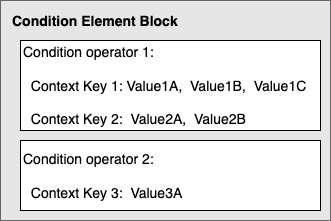

# IAM JSON policy elements:

Condition

The `Condition` element (or `Condition`
_block_) lets you specify conditions for when a policy is in
effect. The `Condition` element is optional. In the `Condition` element,
you build expressions in which you use [condition operators](reference_policies_elements_condition_operators.md "reference_policies_elements_condition_operators.md") (equal,
less than, and others) to match the context keys and values in the policy against keys and
values in the request context. To learn more about the request context, see [Components of a request](intro-structure.md#intro-structure-request "intro-structure.md#intro-structure-request").

```
"Condition" : { "`{condition-operator}`" : { "`{condition-key}`" : "`{condition-value}`" }}
```

The context key that you specify in a policy condition can be a [global condition context key](reference_policies_condition-keys.md "reference_policies_condition-keys.md") or a
service-specific context key. Global condition context keys have the `aws:` prefix.
Service-specific context keys have the service's prefix. For example, Amazon EC2 lets you write a
condition using the `ec2:InstanceType` context key, which is unique to that service.
To view service-specific IAM context keys with the `iam:` prefix, see [IAM and AWS STS condition context
keys](reference_policies_iam-condition-keys.md "reference_policies_iam-condition-keys.md").

Context key _names_ are not case-sensitive. For example, including the
`aws:SourceIP` context key is equivalent to testing for `AWS:SourceIp`.
Case-sensitivity of context key _values_ depends on the [condition operator](reference_policies_elements_condition_operators.md "reference_policies_elements_condition_operators.md") that you
use. For example, the following condition includes the `StringEquals` operator to
make sure that only requests made by `john` match. Users named `John` are
denied access.

```
"Condition" : { "StringEquals" : { "aws:username" : "john" }}
```

The following condition uses the [StringEqualsIgnoreCase](reference_policies_elements_condition_operators.md#Conditions_String "reference_policies_elements_condition_operators.md#Conditions_String") operator to match users named `john`
or `John`.

```
"Condition" : { "StringEqualsIgnoreCase" : { "aws:username" : "john" }}
```

Some context keys support key–value pairs that allow you to specify part of the key
name. Examples include the [aws:RequestTag/tag-key](reference_policies_condition-keys.md#condition-keys-requesttag "reference_policies_condition-keys.md#condition-keys-requesttag") context key, the
AWS KMS [`kms:EncryptionContext:`encryption_context_key``](../../../kms/latest/developerguide/policy-conditions.md#conditions-kms-encryption-context "../../../kms/latest/developerguide/policy-conditions.md#conditions-kms-encryption-context"),
and the [ResourceTag/tag-key](reference_policies_condition-keys.md#condition-keys-resourcetag "reference_policies_condition-keys.md#condition-keys-resourcetag") context key supported
by multiple services.

- If you use the `ResourceTag/`tag-key``context key
for a service such as [Amazon EC2](../../../AWSEC2/latest/UserGuide/iam-policy-structure.md#amazon-ec2-keys "../../../AWSEC2/latest/UserGuide/iam-policy-structure.md#amazon-ec2-keys"), then you must specify a key name for the`tag-key`.
- **Key names are not case-sensitive.** This means that if
  you specify `"aws:ResourceTag/TagKey1": "Value1"` in the condition element of
  your policy, then the condition matches a resource tag key named either `TagKey1`
  or `tagkey1`, but not both.
- AWS services that support these attributes might allow you to create multiple key
  names that differ only by case. For example, you might tag an Amazon EC2 instance with
  `ec2=test1` and `EC2=test2`. When you use a condition such as
  `"aws:ResourceTag/EC2": "test1"` to allow access to that resource, the key name
  matches both tags, but only one value matches. This can result in unexpected condition
  failures.

###### Important

As a best practice, make sure that members of your account follow a consistent naming
convention when naming key–value pair attributes. Examples include tags or AWS KMS
encryption contexts. You can enforce this using the [aws:TagKeys](reference_policies_condition-keys.md#condition-keys-tagkeys "reference_policies_condition-keys.md#condition-keys-tagkeys") context key for tagging, or the [`kms:EncryptionContextKeys`](../../../kms/latest/developerguide/policy-conditions.md#conditions-kms-encryption-context-keys "../../../kms/latest/developerguide/policy-conditions.md#conditions-kms-encryption-context-keys") for the AWS KMS encryption context.

- For a list of all of the condition operators and a description of how they work, see
  [Condition
  operators](reference_policies_elements_condition_operators.md "reference_policies_elements_condition_operators.md").
- Unless otherwise specified, all context keys can have multiple values. For a description
  of how to handle context keys that have multiple values, see [Set operators
  for multivalued context keys](reference_policies_condition-single-vs-multi-valued-context-keys.md#reference_policies_condition-multi-valued-context-keys "reference_policies_condition-single-vs-multi-valued-context-keys.md#reference_policies_condition-multi-valued-context-keys").
- For a list of all of the globally available context keys, see [AWS global condition context
  keys](reference_policies_condition-keys.md "reference_policies_condition-keys.md").
- For condition context keys that are defined by each service, see [Actions, Resources, and
  Condition Keys for AWS Services](reference_policies_actions-resources-contextkeys.md "reference_policies_actions-resources-contextkeys.md").

## The request context

When a [principal](../../../glossary/latest/reference/glos-chap.md#principal "../../../glossary/latest/reference/glos-chap.md#principal") makes a [request](intro-structure.md#intro-structure-request "intro-structure.md#intro-structure-request") to AWS,
AWS gathers the request information into a request context. The request context includes
information about the principal, resources, actions, and other environmental properties.
Policy evaluation matches the properties in the policy against the properties sent in the
request to evaluate and authorize actions you can perform in AWS.

You can use the `Condition` element of a JSON policy to test specific context
keys against the request context. For example, you can create a policy that uses the [aws:CurrentTime](reference_policies_condition-keys.md#condition-keys-currenttime "reference_policies_condition-keys.md#condition-keys-currenttime") context key to [allow a user to perform actions within only
a specific range of dates](reference_policies_examples_aws-dates.md "reference_policies_examples_aws-dates.md").

The following example shows a representation of the request context when Martha Rivera
sends a request to deactivate her MFA device.

```
Principal: AROA123456789EXAMPLE
Action: **iam:DeactivateMFADevice**
Resource: **arn:aws:iam::user/martha**
Context:
  – aws:UserId=AROA123456789EXAMPLE:martha
  – aws:PrincipalAccount=1123456789012
  – aws:PrincipalOrgId=o-example
  – aws:PrincipalARN=arn:aws:iam::1123456789012:assumed-role/TestAR
  – aws:MultiFactorAuthPresent=true
  – **aws:MultiFactorAuthAge=`2800`**
  – aws:CurrentTime=...
  – aws:EpochTime=...
  – aws:SourceIp=...
```

The request context is matched against a policy that allows users to remove their own
multi-factor authentication (MFA) device, but only if they have signed in using MFA in the
last hour (3,600 seconds).

JSON

```
`{
 "Version":"2012-10-17",
 "Statement": {
 "Sid": "AllowRemoveMfaOnlyIfRecentMfa",
 "Effect": "Allow",
 "Action": [
 "iam:DeactivateMFADevice"
 ],
 "Resource": "arn:aws:iam::*:user/${aws:username}",
 "Condition": {
 "NumericLessThanEquals": {"aws:MultiFactorAuthAge": "`3600`"}
 }
 }
}`

```

In this example, the policy matches the request context: the action is the same, the
resource matches the “\*” wildcard, and the value for `aws:MultiFactorAuthAge` is
2800, which is less than 3600, so the policy allows this authorization request.

AWS evaluates each context key in the policy and returns a value of _true_ or _false_. A context key
that is not present in the request is considered a mismatch.

The request context can return the following values:

- **True** – If the requester signed in using MFA in
  the last one hour or less, then the condition returns _true_.
- **False** – If the requester signed in using MFA
  more than one hour ago, then the condition returns _false_.
  - **Not present** – If the requester made a
    request using their IAM user access keys in the AWS CLI or AWS API, the key is not
    present. In this case, the key is not present, and it won't match.

###### Note

In some cases, when the condition key value is not present, the condition can still
return true. For example, if you add the `ForAllValues` qualifier, the request returns true if the context key is not
in the request. To prevent missing context keys or context keys with empty values from
evaluating to true, you can include the [Null condition
operator](reference_policies_elements_condition_operators.md#Conditions_Null "reference_policies_elements_condition_operators.md#Conditions_Null") in your policy with a `false` value to check if the context key
exists and its value is not null.

## The condition block

The following example shows the basic format of a `Condition` element:

```
"Condition": {"StringLike": {"s3:prefix": ["jane/*"]}}
```

A value from the request is represented by a context key, in this case
`s3:prefix`. The context key value is compared to a value that you specify as a
literal value, such as `jane/*`. The type of comparison to make is specified by the
[condition operator](reference_policies_elements_condition_operators.md "reference_policies_elements_condition_operators.md")
(here, `StringLike`). You can create conditions that compare strings, dates,
numbers, and more using typical Boolean comparisons such as equals, greater than, and less
than. When you use [string operators](reference_policies_elements_condition_operators.md#Conditions_String "reference_policies_elements_condition_operators.md#Conditions_String") or [ARN operators](reference_policies_elements_condition_operators.md#Conditions_ARN "reference_policies_elements_condition_operators.md#Conditions_ARN"), you can also use a [policy variable](reference_policies_variables.md "reference_policies_variables.md") in the context key value. The
following example includes the `aws:username` variable.

```
"Condition": {"StringLike": {"s3:prefix": ["${aws:username}/*"]}}
```

Under some circumstances, context keys can contain multiple values. For example, a request
to Amazon DynamoDB might ask to return or update multiple attributes from a table. A policy for
access to DynamoDB tables can include the `dynamodb:Attributes` context key, which
contains all the attributes listed in the request. You can test the multiple attributes in the
request against a list of allowed attributes in a policy by using set operators in the
`Condition` element. For more information, see [Set operators
for multivalued context keys](reference_policies_condition-single-vs-multi-valued-context-keys.md#reference_policies_condition-multi-valued-context-keys "reference_policies_condition-single-vs-multi-valued-context-keys.md#reference_policies_condition-multi-valued-context-keys").

When the policy is evaluated during a request, AWS replaces the key with the
corresponding value from the request. (In this example, AWS would use the date and time of
the request.) The condition is evaluated to return true or false, which is then factored into
whether the policy as a whole allows or denies the request.

### Multiple values in a condition

A `Condition` element can contain multiple condition operators, and each
condition operator can contain multiple context key-value pairs. The following figure
illustrates this.



For more information, see [Set operators
for multivalued context keys](reference_policies_condition-single-vs-multi-valued-context-keys.md#reference_policies_condition-multi-valued-context-keys "reference_policies_condition-single-vs-multi-valued-context-keys.md#reference_policies_condition-multi-valued-context-keys").
