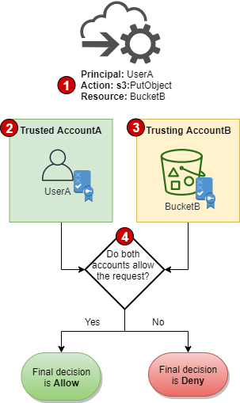
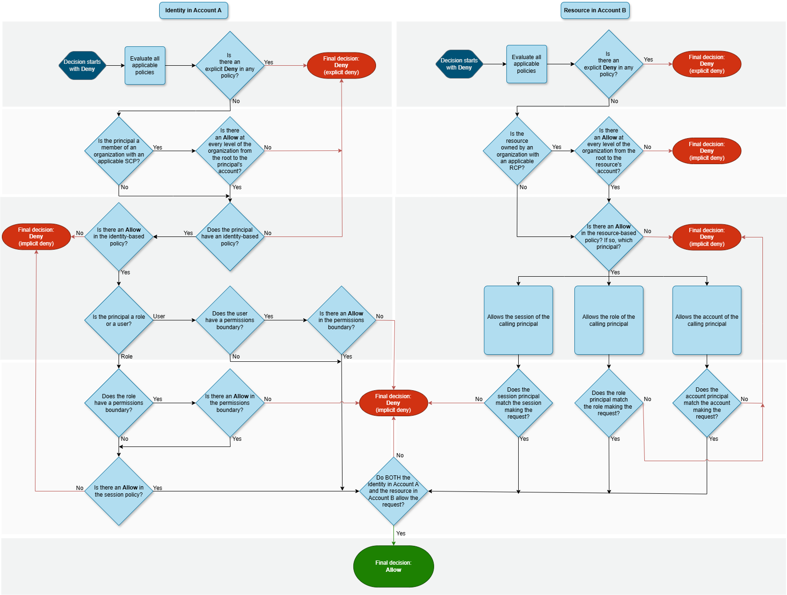
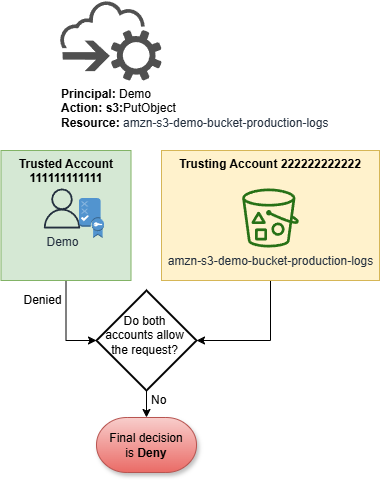
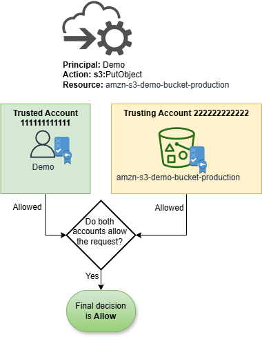

# Cross-account policy

evaluation logic

You can allow a principal in one account to access resources in a second account. This is
called cross-account access. When you allow cross-account access, the account where the
principal exists is called the _trusted_ account. The account
where the resource exists is the _trusting_ account.

To allow cross-account access, you attach a resource-based policy to the resource that you
want to share. You must also attach an identity-based policy to the identity that acts as the
principal in the request. The resource-based policy in the trusting account must specify the
principal of the trusted account that will have access to the resource. You can specify the
entire account or its IAM users, AWS STS federated user principals, IAM roles, or assumed-role sessions. You
can also specify an AWS service as a principal. For more information, see [How to specify a principal](reference_policies_elements_principal.md#Principal_specifying "reference_policies_elements_principal.md#Principal_specifying").

The principal's identity-based policy must allow the requested access to the resource in the
trusting service. You can do this by specifying the ARN of the resource.

In IAM, you can attach a resource-based policy to an IAM role to allow principals in
other accounts to assume that role. The role's resource-based policy is called a role trust
policy. After assuming that role, the allowed principals can use the resulting temporary
credentials to access multiple resources in your account. This access is defined in the role's
identity-based permissions policy. To learn how allowing cross-account access using roles is
different from allowing cross-account access using other resource-based policies, see [Cross account resource
access in IAM](access_policies-cross-account-resource-access.md "access_policies-cross-account-resource-access.md").

###### Important

Other services can affect the policy evaluation logic. For example, AWS Organizations supports
[service control
policies](../../../organizations/latest/userguide/orgs_manage_policies_scps.md "../../../organizations/latest/userguide/orgs_manage_policies_scps.md") and [resource control
policies](../../../organizations/latest/userguide/orgs_manage_policies_rcps.md "../../../organizations/latest/userguide/orgs_manage_policies_rcps.md") that can be applied to principals and resources in one or more accounts.
AWS Resource Access Manager supports [policy fragments](../../../ram/latest/userguide/permissions.md "../../../ram/latest/userguide/permissions.md") that
control which actions that principals are allowed to perform on resources that are shared with
them.

## Determining whether a cross-account request is

allowed

For cross-account requests, the requester in the trusted `AccountA` must have
an identity-based policy. That policy must allow them to make a request to the resource in the
trusting `AccountB`. Additionally, the resource-based policy in
`AccountB` must allow the requester in `AccountA` to access the
resource.

When you make a cross-account request, AWS performs two evaluations. AWS evaluates the
request in the trusting account and the trusted account. For more information about how a
request is evaluated within a single account, see [How AWS
enforcement code logic evaluates requests to allow or deny access](reference_policies_evaluation-logic_policy-eval-denyallow.md "reference_policies_evaluation-logic_policy-eval-denyallow.md"). The request is
allowed only if both evaluations return a decision of `Allow`.



1. When a principal in one account makes a request to access a resource in another
   account, this is a cross-account request.
2. The requesting principal exists in the trusted account (`AccountA`). When
   AWS evaluates this account, it checks the identity-based policy and any policies that
   can limit an identity-based policy. For more information, see [Evaluating identity-based policies with
   permissions boundaries](reference_policies_evaluation-logic.md#policy-eval-basics-id-bound "reference_policies_evaluation-logic.md#policy-eval-basics-id-bound").
3. The requested resource exists in the trusting account (`AccountB`). When
   AWS evaluates this account, it checks the resource-based policy that is attached to the
   requested resource and any policies that can limit a resource-based policy. For more
   information, see [Evaluating identity-based policies with
   resource-based policies](reference_policies_evaluation-logic.md#policy-eval-basics-id-rdp "reference_policies_evaluation-logic.md#policy-eval-basics-id-rdp").
4. AWS allows the request only if both account policy evaluations allow the
   request.

The following flow chart provides a more detailed illustration of how a policy evaluation
decision is made for a cross-account request. Again, AWS allows the request only if both
account policy evaluations allow the request.



## Example cross-account policy

evaluation

The following example demonstrates a scenario where a role in one account is granted
permissions by a resource-based policy in a second account.

Assume that Carlos is a developer with an IAM role named `Demo` in account 111111111111. He wants to save a file to the
`amzn-s3-demo-bucket-production-logs` Amazon S3 bucket in account 222222222222.

Also assume that the following policy is attached to the `Demo` IAM
role.

JSON

```
`{
 "Version":"2012-10-17",
 "Statement": [
 {
 "Sid": "AllowS3ListRead",
 "Effect": "Allow",
 "Action": "s3:ListAllMyBuckets",
 "Resource": "*"
 },
 {
 "Sid": "AllowS3ProductionObjectActions",
 "Effect": "Allow",
 "Action": "s3:*Object*",
 "Resource": "arn:aws:s3:::amzn-s3-demo-bucket-production/*"
 },
 {
 "Sid": "DenyS3Logs",
 "Effect": "Deny",
 "Action": "s3:*",
 "Resource": [
 "arn:aws:s3:::*log*",
 "arn:aws:s3:::*log*/*"
 ]
 }
 ]
}`

```

The `AllowS3ListRead` statement in this policy allows Carlos to view a list of
all of the buckets in Amazon S3. The `AllowS3ProductionObjectActions` statement allows
Carlos full access to objects in the `amzn-s3-demo-bucket-production`
bucket.

Additionally, the following resource-based policy (called a bucket policy) is attached to
the `amzn-s3-demo-bucket-production` bucket in account 222222222222.

JSON

```
`{
 "Version":"2012-10-17",
 "Statement": [
 {
 "Effect": "Allow",
 "Action": [
 "s3:GetObject*",
 "s3:PutObject*",
 "s3:ReplicateObject",
 "s3:RestoreObject"
 ],
 "Principal": { "AWS": "arn:aws:iam::111111111111:role/Demo" },
 "Resource": "arn:aws:s3:::amzn-s3-demo-bucket-production/*"
 }
 ]
}`

```

This policy allows the `Demo` role to access objects in the
`amzn-s3-demo-bucket-production` bucket. The role can create and edit, but not
delete the objects in the bucket. The role can't manage the bucket itself.

When Carlos makes his request to save a file to the
`amzn-s3-demo-bucket-production-logs` bucket, AWS determines what policies
apply to the request. In this case, the identity-based policy attached to the
`Demo` role is the only policy that applies in account
`111111111111`. In account `222222222222`, there
is no resource-based policy attached to the `amzn-s3-demo-bucket-production-logs`
bucket. When AWS evaluates account `111111111111`, it returns a
decision of `Deny`. This is because the `DenyS3Logs` statement in the
identity-based policy explicitly denies access to any log buckets. For more information about
how a request is evaluated within a single account, see [How AWS
enforcement code logic evaluates requests to allow or deny access](reference_policies_evaluation-logic_policy-eval-denyallow.md "reference_policies_evaluation-logic_policy-eval-denyallow.md").

Because the request is explicitly denied within one of the accounts, the final decision is
to deny the request.



Assume that Carlos then realizes his mistake and tries to save the file to the
`Production` bucket. AWS first checks account
`111111111111` to determine if the request is allowed. Only the
identity-based policy applies, and it allows the request. AWS then checks account
`222222222222`. Only the resource-based policy attached to the
`Production` bucket applies, and it allows the request. Because both accounts
allow the request, the final decision is to allow the request.


