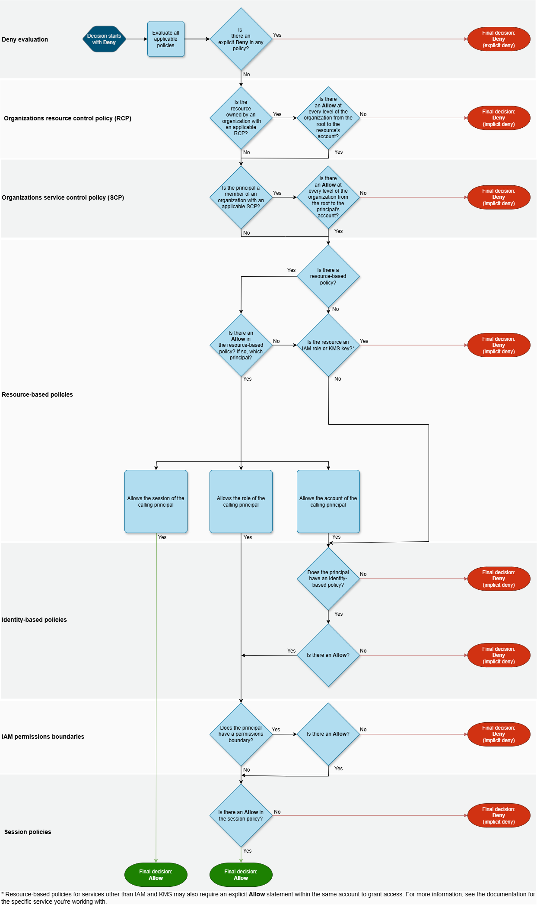
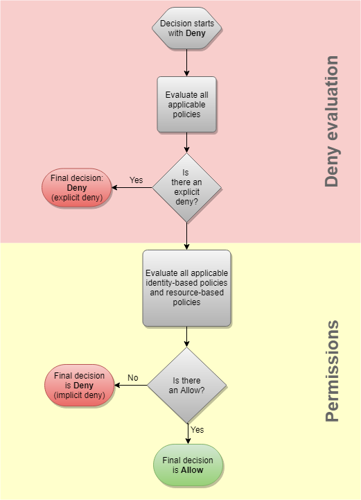

# Policy evaluation

for requests within a single account

## Policy evaluation for an IAM

role

The following flow chart provides details about how a policy evaluation decision is
made for an IAM role within a single account.



## Policy evaluation for an

IAM user

The following flow chart provides details about how a policy evaluation decision is
made for an IAM user within a single account.


## Example identity-based and resource-based policy evaluation

The most common types of policies are identity-based policies and resource-based
policies. When access to a resource is requested, AWS evaluates all the permissions
granted by the policies for **at least one Allow** within
the same account. An explicit deny in any of the policies overrides the allow.

###### Important

If either the identity-based policy or the resource-based policy within the same
account allows the request and the other doesn't, the request is still
allowed.

Assume that Carlos has the user name `carlossalazar` and he tries to save a
file to the `amzn-s3-demo-bucket-carlossalazar-logs` Amazon S3 bucket.

Also assume that the following policy is attached to the `carlossalazar`
IAM user.

JSON

```
`{
 "Version":"2012-10-17",
 "Statement": [
 {
 "Sid": "AllowS3ListRead",
 "Effect": "Allow",
 "Action": [
 "s3:GetBucketLocation",
 "s3:GetAccountPublicAccessBlock",
 "s3:ListAccessPoints",
 "s3:ListAllMyBuckets"
 ],
 "Resource": "arn:aws:s3:::*"
 },
 {
 "Sid": "AllowS3Self",
 "Effect": "Allow",
 "Action": "s3:*",
 "Resource": [
 "arn:aws:s3:::amzn-s3-demo-bucket-carlossalazar/*",
 "arn:aws:s3:::amzn-s3-demo-bucket-carlossalazar"
 ]
 },
 {
 "Sid": "DenyS3Logs",
 "Effect": "Deny",
 "Action": "s3:*",
 "Resource": "arn:aws:s3:::*log*"
 }
 ]
}`

```

The `AllowS3ListRead` statement in this policy allows Carlos to view a list
of all of the buckets in the account. The `AllowS3Self` statement allows
Carlos full access to the bucket with the same name as his user name. The
`DenyS3Logs` statement denies Carlos access to any S3 bucket with
`log` in its name.

Additionally, the following resource-based policy (called a bucket policy) is attached
to the `amzn-s3-demo-bucket-carlossalazar` bucket.

JSON

```
`{
 "Version":"2012-10-17",
 "Statement": [
 {
 "Effect": "Allow",
 "Principal": {
 "AWS": "arn:aws:iam::`123456789012`:user/carlossalazar"
 },
 "Action": "s3:*",
 "Resource": [
 "arn:aws:s3:::amzn-s3-demo-bucket-carlossalazar/*",
 "arn:aws:s3:::amzn-s3-demo-bucket-carlossalazar"
 ]
 }
 ]
}`

```

This policy specifies that only the `carlossalazar` user can access the
`amzn-s3-demo-bucket-carlossalazar` bucket.

When Carlos makes his request to save a file to the
`amzn-s3-demo-bucket-carlossalazar-logs` bucket, AWS determines what
policies apply to the request. In this case, only the identity-based policy and the
resource-based policy apply. These are both permissions policies. Because no permissions
boundaries apply, the evaluation logic is reduced to the following logic.



AWS first checks for a `Deny` statement that applies to the context of
the request. It finds one, because the identity-based policy explicitly denies Carlos
access to any S3 buckets used for logging. Carlos is denied access.

Assume that he then realizes his mistake and tries to save the file to the
`amzn-s3-demo-bucket-carlossalazar` bucket. AWS checks for a
`Deny` statement and does not find one. It then checks the permissions
policies. Both the identity-based policy and the resource-based policy allow the
request. Therefore, AWS allows the request. If either of them explicitly denied the
statement, the request would have been denied. If one of the policy types allows the
request and the other doesn't, the request is still allowed.
