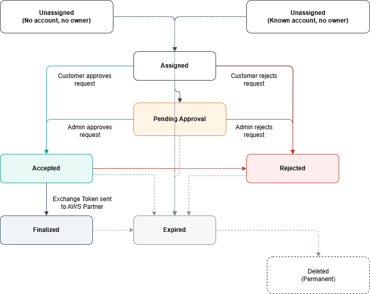

# Building your integration

## Understanding the Request Lifecycle

Before building your integration, it's important to understand how delegation requests progress from creation to completion.

### Request States

A delegation request progresses through the following states:

| State            | Description                                                                                                                                                                                                                       |
| ---------------- | --------------------------------------------------------------------------------------------------------------------------------------------------------------------------------------------------------------------------------- |
| Unassigned       | Request created but not yet associated with a customer account and an IAM principal. The request may have been created without specifying a target account, or with a target account ID but not yet claimed by the account owner. |
| Assigned         | Request associated with a customer account and awaiting review                                                                                                                                                                    |
| Pending Approval | Customer has forwarded the request to an administrator for approval                                                                                                                                                               |
| Accepted         | Request approved by customer but exchange token not yet released                                                                                                                                                                  |
| Finalized        | Exchange token released to product provider. The delegation period (exchange token validity) begins when the request reaches Finalized state                                                                                      |
| Rejected         | Request rejected by customer                                                                                                                                                                                                      |
| Expired          | Request expired due to inactivity or timeout                                                                                                                                                                                      |

### State Transitions

_Normal Flow (Approval Path)_

- Unassigned → Assigned: Customer associates the request with their account
- Assigned → Accepted OR Assigned → Pending Approval: Customer approves the request directly OR forwards to administrator for review
- Pending Approval → Accepted: Administrator approves the request
- Accepted → Finalized: Customer releases the exchange token

_Rejection Path_

- Assigned → Rejected: Customer rejects the request
- Pending Approval → Rejected: Administrator rejects the request
- Accepted → Rejected: Customer revokes approval before releasing token

_Expiration Path_

Requests automatically expire if no action is taken within the specified timeframe:

- Unassigned → Expired (1 day)
- Assigned → Expired (7 days)
- Pending Approval → Expired (7 days)
- Accepted → Expired (7 days)
- Rejected → Expired (7 days)
- Finalized → Expired (7 days)

_Terminal States_

The following states are terminal (no further transitions):

- Finalized: Exchange Token sent
- Rejected: Request was denied
- Expired: Request timed out or delegation period ended

Expired requests are eventually deleted from the system after the retention period.

### Managing delegation request states in your application

As a partner, you must track delegation request states in your system and surface them to your customers. When you receive SNS notifications about state changes, store these updates in your backend and reflect them in your customer-facing UI. Pay special attention to the Pending Approval state—when a customer forwards a request to an administrator for review, AWS sends a Pending Approval notification to you. Requests can remain in this state for up to 7 days while waiting for administrator action. During this time, show customers that their request is pending administrator approval in your application. Consider providing a deep link to the AWS Console where customers can check the request status or follow up with their administrator. Properly handling the state machine in your backend and surfacing the correct state information to customers at each stage is important for a good integration experience.



## Configuring Notifications

IAM uses Amazon Simple Notification Service (SNS) to communicate delegation request state changes to you. When you create a delegation request, you must provide an SNS topic ARN from your registered AWS account. IAM will publish messages to this topic for important events, including when customers approve or reject requests and when the exchange token is ready.

###### Note

SNS topics cannot be in opt-in AWS Regions. Your SNS topic must be in an AWS Region that is enabled by default. For a list of opt-in Regions, see Managing AWS Regions in the AWS Account Management guide.

### SNS Topic Configuration

To receive delegation request notifications, you must configure your SNS topic to grant IAM permissions to publish messages to it. Add the following policy statement to your SNS topic policy:

```
{
    "Version": "2012-10-17",
    "Statement": [
        {
            "Sid": "AllowIAMServiceToPublish",
            "Effect": "Allow",
            "Principal": {
                "Service": "iam.amazonaws.com"
            },
            "Action": "SNS:Publish",
            "Resource": "arn:aws:sns:REGION:ACCOUNT-ID:TOPIC-NAME"
        }
    ]
}
```

###### Important

The SNS topic must be in one of your registered AWS accounts. IAM will not accept SNS topics from other accounts. If the topic policy is not correctly configured, you will not receive state change notifications or the exchange token.

### Notification Types

IAM sends two types of notifications:

_StateChange Notifications_

Sent when a delegation request transitions to a new state (Assigned, Pending Approval, Accepted, Finalized, Rejected, Expired).

_ExchangeToken Notifications_

Sent when a customer releases the delegation token (state Finalized). This notification includes the exchange token you need to obtain credentials.

### Notification States

You will receive notifications for the following delegation request states:

| State            | Notification Type | Description                                                         |
| ---------------- | ----------------- | ------------------------------------------------------------------- |
| ASSIGNED         | StateChange       | Request has been associated with a customer account                 |
| PENDING APPROVAL | StateChange       | Customer has forwarded the request to an administrator for approval |
| ACCEPTED         | StateChange       | Customer has approved the request but not yet released the token    |
| FINALIZED        | StateChange       | Customer has released the exchange token                            |
| FINALIZED        | ExchangeToken     | This notification contains the Exchange Token                       |
| REJECTED         | StateChange       | Customer has rejected the request                                   |
| EXPIRED          | StateChange       | Request expired before completion                                   |

### Notification Message Format

IAM publishes standard SNS notifications. The delegation request information is contained in the Message field as a JSON string.

_Common Fields (All Notifications)_

| Field               | Type   | Description                                            |
| ------------------- | ------ | ------------------------------------------------------ |
| Type                | String | Either "StateChange" or "ExchangeToken"                |
| RequestId           | String | The IAM delegation request ID                          |
| RequestorWorkflowId | String | The workflow ID you provided when creating the request |
| State               | String | Current state of the request                           |
| OwnerAccountId      | String | Customer's AWS account ID                              |
| UpdatedAt           | String | Timestamp when the state changed (ISO 8601 format)     |

_Additional Fields (ExchangeToken Notifications Only)_

| Field         | Type   | Description                                                                     |
| ------------- | ------ | ------------------------------------------------------------------------------- |
| ExchangeToken | String | The token to exchange for credentials using AWS STS GetDelegatedAccessToken API |
| ExpiresAt     | String | When the delegated access expires (ISO 8601 format)                             |

### Example Notifications

_StateChange Notification_

```
{
  "Type": "Notification",
  "MessageId": "61ee8ad4-6eec-56b5-8f3d-eba57556aa13",
  "TopicArn": "arn:aws:sns:us-east-1:123456789012:partner-notifications",
  "Message": "{\"RequestorWorkflowId\":\"workflow-12345\",\"Type\":\"StateChange\",\"RequestId\":\"dr-abc123\",\"State\":\"ACCEPTED\",\"OwnerAccountId\":\"111122223333\",\"UpdatedAt\":\"2025-01-15T10:30:00.123Z\"}",
  "Timestamp": "2025-01-15T10:30:00.456Z",
  "SignatureVersion": "1",
  "Signature": "...",
  "SigningCertURL": "...",
  "UnsubscribeURL": "..."
}
```

_ExchangeToken Notification_

```
{
  "Type": "Notification",
  "MessageId": "e44e5435-c72c-5333-aba3-354406782f5b",
  "TopicArn": "arn:aws:sns:us-east-1:123456789012:partner-notifications",
  "Message": "{\"RequestId\":\"dr-abc123\",\"RequestorWorkflowId\":\"workflow-12345\",\"State\":\"FINALIZED\",\"OwnerAccountId\":\"111122223333\",\"ExchangeToken\":\"eyJhbGciOiJIUzI1NiIsInR5cCI6IkpXVCJ9...\",\"ExpiresAt\":\"2025-01-15T18:30:00.123Z\",\"UpdatedAt\":\"2025-01-15T10:30:00.456Z\",\"Type\":\"ExchangeToken\"}",
  "Timestamp": "2025-01-15T10:30:00.789Z",
  "SignatureVersion": "1",
  "Signature": "...",
  "SigningCertURL": "...",
  "UnsubscribeURL": "..."
}
```

## Exchange Tokens

An exchange token or a trade in token is issued by IAM when a customer accepts and finalizes a delegation request. The product provider uses this exchange or trade in token to call the AWS AWS STS GetDelegatedAccessToken API to obtain temporary AWS credentials with the permissions customers approved. The exchange token itself does not grant access to your AWS resources; it must be exchanged for actual credentials through AWS STS.

The exchange token can only be redeemed by the product provider account that created the delegation request. The requesting account is embedded in the token, ensuring that only the authorized product provider can obtain credentials to access customer account.

### Access Duration

The delegation period starts when customer releases the exchange token, not when the product provider redeems it. Once customer releases the token:

- The product provider receives the token via SNS notification
- They can immediately exchange it for credentials
- Credentials expire at: release time + approved duration
- The product provider can exchange the token multiple times before expiration to obtain fresh credentials if needed

### Multiple Redemptions

Product providers can exchange the token multiple times during the validity period to obtain fresh credentials. However, all credentials obtained from the same exchange token expire at the same time, based on when you released the token.

Example: If you approve a 2-hour delegation request and release the token at 10:00 AM:

| Token Release Time | Token Exchange Time | Credential Expiry      | Usable Time       |
| ------------------ | ------------------- | ---------------------- | ----------------- |
| 10:00 am           | 10:00 am            | 12:00 pm               | 2 hours           |
| 10:00 am           | 10:20 am            | 12:00 pm               | 1 hour 40 minutes |
| 10:00 am           | 11:40 am            | 12:00 pm               | 20 minutes        |
| 10:00 am           | 12:10 pm            | Failed (token expired) | 0 minutes         |

As shown in the table, exchanging the token later in the validity period results in less usable time for the product provider.
