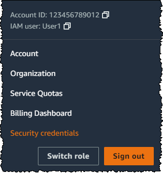

# IAM tutorial: Permit users to manage

their credentials and MFA settings

You can permit your users to manage their own multi-factor authentication (MFA) devices and
credentials on the **Security credentials** page. You can use the AWS Management Console to
configure credentials (access keys, passwords, signing certificates, and SSH public keys),
delete or deactivate credentials that are not needed, and enable MFA devices for your users.
This is useful for a small number of users, but that task could quickly become time consuming as
the number of users grows. This tutorial shows you how to enable these best practices without
burdening your administrators.

This tutorial shows how to allow users to access AWS services, but **only** when they sign in with MFA. If they are not signed in with an MFA device,
then users cannot access other services.

This workflow has three basic steps.

**[Step 1: Create a policy to enforce MFA sign-in](#tutorial_mfa_step1 "#tutorial_mfa_step1")**

Create a customer managed policy that prohibits all actions **_except_** the few IAM actions. These
exceptions allow a user to change their own credentials and manage their MFA devices on
the **Security credentials** page. For more information about accessing
that page, see [How IAM users change their own password
(console)](id_credentials_passwords_user-change-own.md#ManagingUserPwdSelf-Console "id_credentials_passwords_user-change-own.md#ManagingUserPwdSelf-Console").

**[Step 2: Attach policies to your test user group](#tutorial_mfa_step2 "#tutorial_mfa_step2")**

Create a user group whose members have full access to all Amazon EC2 actions if they sign
in with MFA. To create such a user group, you attach both the AWS managed policy called
`AmazonEC2FullAccess` and the customer managed policy you created in the
first step.

**[Step 3: Test your user's access](#tutorial_mfa_step3 "#tutorial_mfa_step3")**

Sign in as the test user to verify that access to Amazon EC2 is blocked _until_ the user creates an MFA device. The user can then sign in
using that device.

## Prerequisites

To perform the steps in this tutorial, you must already have the following:

- An AWS account that you can sign in to as an IAM user with administrative
  permissions.
- Your account ID number, which you type into the policy in Step 1.

To find your account ID number, on the navigation bar at the top of the page, choose
**Support** and then choose **Support Center**. You
can find your account ID under this page's **Support** menu.

- A [virtual (software-based) MFA
  device](id_credentials_mfa_enable_virtual.md "id_credentials_mfa_enable_virtual.md"), [FIDO security key](id_credentials_mfa_enable_fido.md "id_credentials_mfa_enable_fido.md"),
  or [hardware-based MFA
  device](id_credentials_mfa_enable_physical.md "id_credentials_mfa_enable_physical.md").
- A test IAM user who is a member of a user group as follows:

| User name | User name instructions                                                                          | User group name | Add user as a member | User group instructions                                                          |
| --------- | ----------------------------------------------------------------------------------------------- | --------------- | -------------------- | -------------------------------------------------------------------------------- |
| MFAUser   | Choose only the option for **Enable console access – _optional_**, and assign a password. | EC2MFA          | MFAUser              | Do NOT attach any policies or otherwise grant permissions to this user group. |

## Step 1: Create a policy to enforce MFA sign-in

You begin by creating an IAM customer managed policy that denies all permissions except
those required for IAM users to manage their own credentials and MFA devices.

1. Sign in to the AWS Management Console as a user with administrator credentials. To
   adhere to IAM best practices, don't sign in with your AWS account root user credentials.

###### Important

IAM [best
practices](best-practices.md "best-practices.md") recommend that you require
human users to use federation with an identity provider to access AWS using temporary
credentials instead of using IAM users with long-term credentials. We recommend that you only use IAM users
for [specific use cases](gs-identities-iam-users.md "gs-identities-iam-users.md") not supported by federated users. 2. Open the IAM console at [https://console.aws.amazon.com/iam/](https://console.aws.amazon.com/iam/ "https://console.aws.amazon.com/iam/"). 3. In the navigation pane, choose **Policies**, and then choose
**Create policy**. 4. Choose the **JSON** tab and copy the text from the following JSON
policy document: [AWS: Allows
MFA-authenticated IAM users to manage their own credentials on the Security
credentials page](reference_policies_examples_aws_my-sec-creds-self-manage.md "reference_policies_examples_aws_my-sec-creds-self-manage.md"). 5. Paste the policy text into the **JSON** text box. Resolve any
security warnings, errors, or general warnings generated during policy validation, and
then choose **Next**.

###### Note

You can switch between the **Visual editor** and
**JSON** options anytime. However, the policy above includes the
`NotAction` element, which is not supported in the visual editor. For this
policy, you will see a notification on the **Visual editor** tab.
Return to **JSON** to continue working with this policy.

This example policy does not allow users to reset a password while signing in to the
AWS Management Console for the first time. We recommend that you do not grant permissions to new
users until after they sign in and reset their password. 6. On the **Review and create** page, type
`Force_MFA` for the policy name. For the policy description, type
`This policy allows users to manage their own passwords and MFA devices but
 nothing else unless they authenticate with MFA.` In the
**Tags** area, you can optionally add tag key-value pairs to the
customer managed policy. Review the permissions granted by your policy, and then choose
**Create policy** to save your work.

The new policy appears in the list of managed policies and is ready to attach.

## Step 2: Attach policies to your test user group

Next you attach two policies to the test IAM user group, which will be used to grant the
MFA-protected permissions.

1. In the navigation pane, choose **User groups**.
2. In the search box, type **`EC2MFA`**, and then
   choose the group name (not the checkbox) in the list.
3. Choose the **Permissions** tab, choose **Add
   permissions**, and then choose **Attach policies**.
4. On the **Attach permission policies to EC2MFA group** page, in the
   search box, type `EC2Full`. Then select the checkbox next to
   **AmazonEC2FullAccess** in the list. Don't save your changes
   yet.
5. In the search box, type `Force`, and then select the checkbox
   next to **Force_MFA** in the list.
6. Choose **Attach policies**.

## Step 3: Test your user's access

In this part of the tutorial, you sign in as the test user and verify that the policy
works as intended.

1. Sign in to your AWS account as `MFAUser` with the password you
   assigned in the previous section. Use the URL: `https://`<alias or
   account ID number>`.signin.aws.amazon.com/console`
2. Choose **EC2** to open the Amazon EC2 console and verify that the user has
   no permissions to do anything.
3. In the navigation bar on the upper right, choose the `MFAUser` user name,
   and then choose **Security credentials**.

 4. Now add an MFA device. In the **Multi-factor Authentication (MFA)**
section, choose **Assign MFA device**.

###### Note

You might receive an error that you are not authorized to perform
`iam:DeleteVirtualMFADevice`. This could happen if someone previously began
assigning a virtual MFA device to this user and cancelled the process. To continue, you
or another administrator must delete the user's existing unassigned virtual MFA device.
For more information, see [I am not authorized to
perform: iam:DeleteVirtualMFADevice](troubleshoot.md#troubleshoot_general_access-denied-delete-mfa "troubleshoot.md#troubleshoot_general_access-denied-delete-mfa"). 5. For this tutorial, we use a virtual (software-based) MFA device, such as the Google
Authenticator app on a mobile phone. Choose **Authenticator app**, and
then click **Next**.

IAM generates and displays configuration information for the virtual MFA device,
including a QR code graphic. The graphic is a representation of the secret configuration
key that is available for manual entry on devices that do not support QR codes. 6. Open your virtual MFA app. (For a list of apps that you can use for hosting virtual
MFA devices, see [Virtual MFA Applications](https://aws.amazon.com/iam/details/mfa/#Virtual_MFA_Applications "https://aws.amazon.com/iam/details/mfa/#Virtual_MFA_Applications").) If the virtual MFA app supports multiple accounts
(multiple virtual MFA devices), choose the option to create a new account (a new virtual
MFA device). 7. Determine whether the MFA app supports QR codes, and then do one of the
following:

    * From the wizard, choose **Show QR code**. Then use the app to
     scan the QR code. For example, you might choose the camera icon or choose an option
     similar to **Scan code**, and then use the device's camera to scan
     the code.
    * In the **Set up device** wizard, choose **Show secret
     key**, and then type the secret key into your MFA app.

When you are finished, the virtual MFA device starts generating one-time passwords. 8. In the **Set up device** wizard, in the **Enter the code from
your authenticator app.** box, type the one-time password that currently
appears in the virtual MFA device. Choose **Register MFA**.

###### Important

Submit your request immediately after generating the code. If you generate the codes
and then wait too long to submit the request, the MFA device is successfully associated
with the user. However, the MFA device is out of sync. This happens because time-based
one-time passwords (TOTP) expire after a short period of time. If this happens, you can
[resync the device](id_credentials_mfa_sync.md "id_credentials_mfa_sync.md").

The virtual MFA device is now ready to use with AWS. 9. Sign out of the console and then sign in as `MFAUser` again. This
time AWS prompts you for an MFA code from your phone. When you get it, type the code in
the box and then choose **Submit**. 10. Choose **EC2** to open the Amazon EC2 console again. Note that this time
you can see all the information and perform any actions you want. If you go to any other
console as this user, you see access denied messages. The reason is that the policies in
this tutorial grant access only to Amazon EC2.

## Related resources

For additional information, see the following topics:

- [AWS Multi-factor authentication in IAM](id_credentials_mfa.md "id_credentials_mfa.md")
- [MFA enabled sign-in](console_sign-in-mfa.md "console_sign-in-mfa.md")
