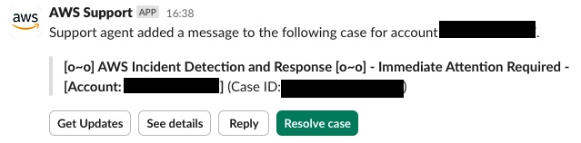
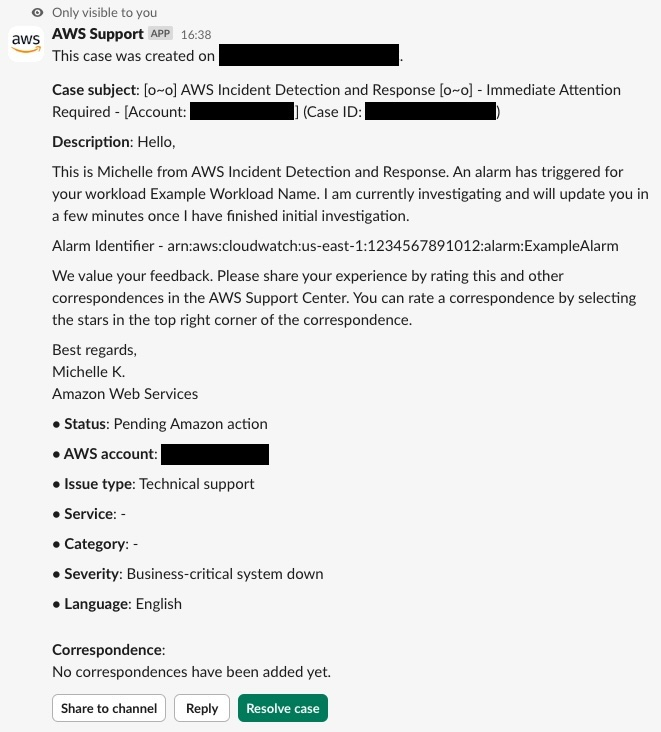
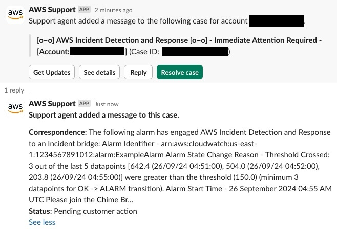
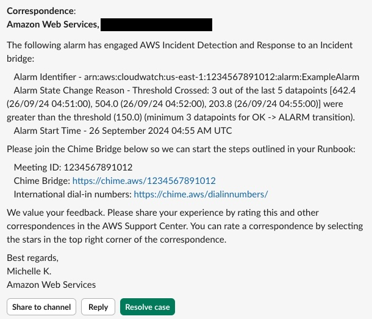

# Manage Incident Detection and Response support cases with the AWS Support App in Slack

With the [AWS Support App in Slack](../../../awssupport/latest/user/aws-support-app-for-slack.md "../../../awssupport/latest/user/aws-support-app-for-slack.md"), you can manage your
Support cases in Slack, receive notifications about new [alarm initiated incidents](incidents-idr.md "incidents-idr.md") on your AWS Incident Detection and Response workload, and create [Incident Response Requests](inbound-incident-idr.md "inbound-incident-idr.md").

To configure the AWS Support App in Slack, follow the instructions provided in the [_Support
User Guide_](../../../awssupport/latest/user/aws-support-app-for-slack.md "../../../awssupport/latest/user/aws-support-app-for-slack.md").

###### Important

- To receive notifications in Slack for all alarm initiated incidents on

your workload, you must configure the AWS Support App in Slack for all your workload’s accounts that are
onboarded to AWS Incident Detection and Response. Support cases are created in the account
that the workload alarm originated in.

- Multiple high-severity support cases can be opened on your behalf during an incident to
  engage Support resolvers. You receive notifications in Slack for all support cases that are
  opened during an incident that match your [notification configuration for the
  Slack channel](../../../awssupport/latest/user/add-your-slack-channel.md "../../../awssupport/latest/user/add-your-slack-channel.md").
- Notifications that you receive through the AWS Support App in Slack don't replace your workload’s
  initial and escalation contacts that are engaged via email or phone call by AWS Incident
  Detection and Response during an incident.

###### Topics

- [Alarm-initiated incident notifications in Slack](#aws-support-app-slack-alarm-initiated "#aws-support-app-slack-alarm-initiated")
- [Create an Incident Response Request in Slack](#aws-support-app-slack-create-ir "#aws-support-app-slack-create-ir")

## Alarm-initiated incident notifications in Slack

After you configure the AWS Support App in Slack in your Slack channel, you receive notifications
about alarm initiated incidents on your AWS Incident Detection and Response monitored workload.

The following example shows how notifications for alarm initiated incidents appear in
Slack.

**Example notification**

When your alarm initiated incident is acknowledged by AWS Incident Detection and Response, a
notification similar to the following generates in Slack:

To view the full correspondence added by AWS Incident Detection and Response,
choose **See details**.

Further updates from AWS Incident Detection and Response appear in the case’s thread.

Choose **See details** to view the full correspondence added by
AWS Incident Detection and Response.

## Create an Incident Response Request in Slack

For instructions on how to create an Incident Response Request through the AWS Support App in Slack, see [Request an Incident Response](inbound-incident-idr.md "inbound-incident-idr.md").
