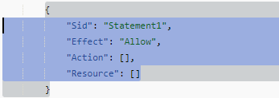
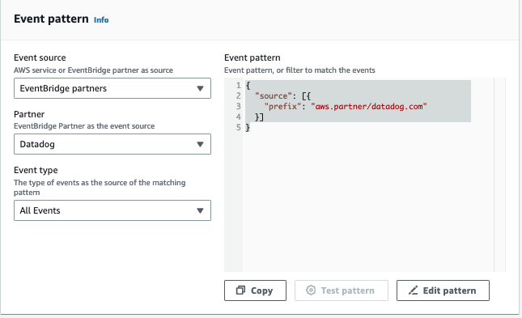
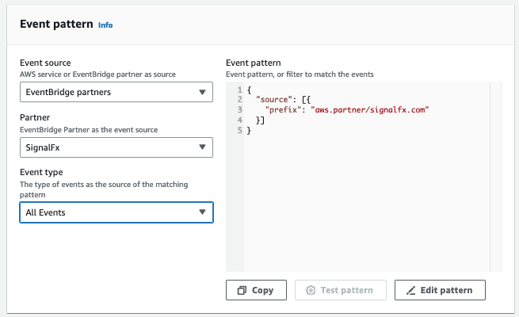

# Example: Integrate notifications

from Datadog and Splunk

This example provides detailed steps for integrating notifications from
Datadog and Splunk to AWS Incident Detection and Response.

###### Topics

- [Step 1: Set up
  your APM as an event source in Amazon EventBridge](#example_integrating_notifications_step1 "#example_integrating_notifications_step1")
- [Step 2: Create a custom event bus](#example_integrating_notifications_step2 "#example_integrating_notifications_step2")
- [Step 3: Create an AWS Lambda function for transformation](#example_integrating_notifications_step3 "#example_integrating_notifications_step3")
- [Step 4: Create a custom Amazon EventBridge rule](#example_integrating_notifications_step4 "#example_integrating_notifications_step4")

## Step 1: Set up

your APM as an event source in Amazon EventBridge

Set up each of your APMs as an event source in Amazon EventBridge in your AWS account.
For instructions on setting up your APM as an event source, see the [event source set up instructions for your tool in
Amazon EventBridge partners](https://console.aws.amazon.com/events/home#/partners "https://console.aws.amazon.com/events/home#/partners").

By setting up your APM as an event source, you can ingest notifications from
your APM to an event bus in your AWS account. After setup, AWS Incident Detection and Response can start
the incident management process when the event bus receives an event. This
process adds Amazon EventBridge as a destination in your APM.

## Step 2: Create a custom event bus

It's a best practice to use a custom event bus. AWS Incident Detection and Response uses the custom event bus to ingest transformed events. An AWS Lambda function transforms the partner event bus event and sends it to the custom event bus. AWS Incident Detection and Response installs a managed rule to ingest events from the custom event bus.

You can use the default event bus instead of a custom event bus. AWS Incident Detection and Response modifies the managed rule to ingest from the default event bus instead of a custom one.

###### Create a custom event bus in your AWS account:

1. Open the Amazon EventBridge console at [https://console.aws.amazon.com/events/](https://console.aws.amazon.com/events/ "https://console.aws.amazon.com/events/")
2. Choose **Buses**, **Event bus**.
3. Under **Custom event bus**, choose **Create**.
4. Provide a name for your event bus under **Name**. The recommended format is **APMName-AWSIncidentDetectionResponse-EventBus**.

As an example, use one of the following if you use Datadog or Splunk:

    * **Datadog**: Datadog-AWSIncidentDetectionResponse-EventBus
    * **Splunk**: Splunk-AWSIncidentDetectionResponse-EventBus

## Step 3: Create an AWS Lambda function for transformation

The Lambda function transforms events between the partner event bus in Step 1 and the custom (or default) event bus from Step 2. The Lambda function transformation matches the AWS Incident Detection and Response managed rule.

###### Create an AWS Lambda function in your AWS account

1. Open the [Functions page](https://console.aws.amazon.com/lambda/home#/functions "https://console.aws.amazon.com/lambda/home#/functions") on the AWS Lambda console.
2. Choose **Create function**.
3. Choose the **Author from scratch** tab.
4. For **Function name**, enter a name using the format `APMName-AWSIncidentDetectionResponse-LambdaFunction`.

The following are examples for Datadog and Splunk:

    * **Datadog**: Datadog-AWSIncidentDetectionResponse-LambdaFunction
    * **Splunk**: Splunk-AWSIncidentDetectionResponse-LambdaFunction

5. For **Runtime**, enter **Python 3.10**.
6. Leave the remaining fields at the default values. Choose **Create function**.
7. On the **Code edit** page, replace the default Lambda function content with the function in the following code examples.

Note the comments starting with # in the following code examples. These comments indicate which values to change.

**Datadog transformation code template**:

```
import logging
import json
import boto3

logger = logging.getLogger()
logger.setLevel(logging.INFO)

# Change the EventBusName to the custom event bus name you created previously or use your default event bus which is called 'default'.
# Example 'Datadog-AWSIncidentDetectionResponse-EventBus'
EventBusName = "Datadog-AWSIncidentDetectionResponse-EventBus"

def lambda_handler(event, context):
    # Set the event["detail"]["incident-detection-response-identifier"] value to the name of your alert that is coming from your APM. Each APM is different and each unique alert will have a different name.
    # Replace the dictionary path, event["detail"]["meta"]["monitor"]["name"], with the path to your alert name based on your APM payload.
    # This example is for finding the alert name for Datadog.
    event["detail"]["incident-detection-response-identifier"] = event["detail"]["meta"]["monitor"]["name"]
    logger.info(f"We got: {json.dumps(event, indent=2)}")

    client = boto3.client('events')
    response = client.put_events(
     Entries=[
              {
               'Detail': json.dumps(event["detail"], indent=2),
               'DetailType': 'ams.monitoring/generic-apm', # Do not modify. This DetailType value is required.
               'Source': 'GenericAPMEvent', # Do not modify. This Source value is required.
               'EventBusName': EventBusName # Do not modify. This variable is set at the top of this code as a global variable. Change the variable value for your eventbus name at the top of this code.
             }
     ]
    )
    print(response['Entries'])
```

**Splunk transformation code template**:

```
import logging
import json
import boto3

logger = logging.getLogger()
logger.setLevel(logging.INFO)

# Change the EventBusName to the custom event bus name you created previously or use your default event bus which is called 'default'.
# Example Splunk-AWSIncidentDetectionResponse-EventBus
EventBusName = "Splunk-AWSIncidentDetectionResponse-EventBus"

def lambda_handler(event, context):
    # Set the event["detail"]["incident-detection-response-identifier"] value to the name of your alert that is coming from your APM. Each APM is different and each unique alert will have a different name.
    # replace the dictionary path event["detail"]["ruleName"] with the path to your alert name based on your APM payload.
    # This example is for finding the alert name in Splunk.
    event["detail"]["incident-detection-response-identifier"] = event["detail"]["ruleName"]
    logger.info(f"We got: {json.dumps(event, indent=2)}")

    client = boto3.client('events')
    response = client.put_events(
    Entries=[
             {
              'Detail': json.dumps(event["detail"], indent=2),
              'DetailType': 'ams.monitoring/generic-apm', # Do not modify. This DetailType value is required.
              'Source': 'GenericAPMEvent', # Do not modify. This Source value is required.
              'EventBusName': EventBusName # Do not modify. This variable is set at the top of this code as a global variable. Change the variable value for your eventbus name at the top of this code.
            }
        ]
    )
    print(response['Entries'])
```

8. Choose **Deploy**.
9. Add **PutEvents** permission to the Lambda execution role for the event bus that you're sending the transformed data to:
   1. Open the [Functions page](https://console.aws.amazon.com/lambda/home#/functions "https://console.aws.amazon.com/lambda/home#/functions") on the AWS Lambda console.
   2. Select the function, and then choose **Permissions** on the
      **Configuration** tab.
   3. Under **Execution role**, select the **Role name** to open the execution role in the AWS Identity and Access Management console.
   4. Under **Permissions policies**, select the existing policy name to open the policy.
   5. Under **Permissions defined in this policy**, choose **Edit**.
   6. On the **Policy editor** page, select **Add new statement**:
   7. The **Policy editor** adds a new blank statement similar to the following

    8. Replace the new auto-generated statement with the following:

   ```

   {
     "Sid": "AWSIncidentDetectionResponseEventBus0",
     "Effect": "Allow",
     "Action": "events:PutEvents",
     "Resource": "arn:aws:events:{region}:{accountId}:event-bus/{custom-eventbus-name}"
   }
   ```

   9. The **Resource** is the ARN of the custom event bus that you created in [Step 2: Create a custom event bus](#example_integrating_notifications_step2 "#example_integrating_notifications_step2") or the ARN of your default event bus if you are using the default event bus in your Lambda code.

10. Review and confirm that the required permission are added to the role.
11. Choose **Set this new version as the default**, and then choose **Save changes**.

**What's required from a payload transformation?**

The following JSON key:value pairs are required in event bus events ingested by AWS Incident Detection and Response.

```
{
    "detail-type": "ams.monitoring/generic-apm",
    "source": "GenericAPMEvent"
    "detail" : {
        "incident-detection-response-identifier": "Your alarm name from your APM",
    }
}
```

The following examples show an event from a partner event bus before and after it is transformed.

```
{
    "version": "0",
    "id": "a6150a80-601d-be41-1a1f-2c5527a99199",
    "detail-type": "Datadog Alert Notification",
    "source": "aws.partner/datadog.com/Datadog-aaa111bbbc",
    "account": "123456789012",
    "time": "2023-10-25T14:42:25Z",
    "region": "us-east-1",
    "resources": [],
    "detail": {
      "alert_type": "error",
      "event_type": "query_alert_monitor",
      "meta": {
        "monitor": {
          "id": 222222,
          "org_id": 3333333333,
          "type": "query alert",
          "name": "UnHealthyHostCount",
          "message": "@awseventbridge-Datadog-aaa111bbbc",
          "query": "max(last_5m):avg:aws.applicationelb.un_healthy_host_count{aws_account:123456789012} \u003c\u003d 1",
          "created_at": 1686884769000,
          "modified": 1698244915000,
          "options": {
            "thresholds": {
              "critical": 1.0
            }
          },
        },
        "result": {
          "result_id": 7281010972796602670,
          "result_ts": 1698244878,
          "evaluation_ts": 1698244868,
          "scheduled_ts": 1698244938,
          "metadata": {
            "monitor_id": 222222,
            "metric": "aws.applicationelb.un_healthy_host_count"
          }
        },
        "transition": {
          "trans_name": "Triggered",
          "trans_type": "alert"
        },
        "states": {
          "source_state": "OK",
          "dest_state": "Alert"
        },
        "duration": 0
      },
      "priority": "normal",
      "source_type_name": "Monitor Alert",
      "tags": [
        "aws_account:123456789012",
        "monitor"
      ]
    }
}
```

Note that before the event is transformed, `detail-type` indicates the APM that the alert came from, the source is from a partner APM, and the `incident-detection-response-identifier` key is not present.

The Lambda function transforms the above event and puts it in to the target custom or default event bus. The transformed payload now includes the required key:value pairs.

```
{
    "version": "0",
    "id": "7f5e0fc1-e917-2b5d-a299-50f4735f1283",
    "detail-type": "ams.monitoring/generic-apm",
    "source": "GenericAPMEvent",
    "account": "123456789012",
    "time": "2023-10-25T14:42:25Z",
    "region": "us-east-1",
    "resources": [],
    "detail": {
      "incident-detection-response-identifier": "UnHealthyHostCount",
      "alert_type": "error",
      "event_type": "query_alert_monitor",
      "meta": {
        "monitor": {
          "id": 222222,
          "org_id": 3333333333,
          "type": "query alert",
          "name": "UnHealthyHostCount",
          "message": "@awseventbridge-Datadog-aaa111bbbc",
          "query": "max(last_5m):avg:aws.applicationelb.un_healthy_host_count{aws_account:123456789012} \u003c\u003d 1",
          "created_at": 1686884769000,
          "modified": 1698244915000,
          "options": {
            "thresholds": {
              "critical": 1.0
            }
          },
        },
        "result": {
          "result_id": 7281010972796602670,
          "result_ts": 1698244878,
          "evaluation_ts": 1698244868,
          "scheduled_ts": 1698244938,
          "metadata": {
            "monitor_id": 222222,
            "metric": "aws.applicationelb.un_healthy_host_count"
          }
        },
        "transition": {
          "trans_name": "Triggered",
          "trans_type": "alert"
        },
        "states": {
          "source_state": "OK",
          "dest_state": "Alert"
        },
        "duration": 0
      },
      "priority": "normal",
      "source_type_name": "Monitor Alert",
      "tags": [
        "aws_account:123456789012",
        "monitor"
      ]
    }
}
```

Note that `detail-type` is now `ams.monitoring/generic-apm`, source is now `GenericAPMEvent`, and under detail there is new key:value pair: `incident-detection-response-identifier`.

In the preceding example, the `incident-detection-response-identifier` value is taken from the alert name under the path `$.detail.meta.monitor.name`. APM alert name paths are different from one APM to another. The Lambda function must be modified to take the alarm name from the correct partner event JSON path and use it for the `incident-detection-response-identifier` value.

Each unique name that is set on the `incident-detection-response-identifier` is provided to the AWS Incident Detection and Response team during on-boarding. Events that have an unknown name for the `incident-detection-response-identifier` aren't processed.

## Step 4: Create a custom Amazon EventBridge rule

The partner event bus created in Step 1 requires an EventBridge rule that you create. The rule sends the desired events from the partner event bus to the Lambda function created in Step 3.

For guidelines on defining your EventBridge rule, see [Amazon EventBridge rules](../../../eventbridge/latest/userguide/eb-rules.md "../../../eventbridge/latest/userguide/eb-rules.md").

1. Open the Amazon EventBridge console at [https://console.aws.amazon.com/events/](https://console.aws.amazon.com/events/ "https://console.aws.amazon.com/events/")
2. Choose **Rules**, and then select the partner event bus associated with your APM. The following are exmaples of partner event busses:
   - **Datadog:** aws.partner/datadog.com/eventbus-name
   - **Splunk:** aws.partner/signalfx.com/RandomString

3. Choose **Create rule** to create a new EventBridge rule.
4. For rule name, enter a name in the following format `APMName-AWS Incident Detection and Response-EventBridgeRule`, and then choose **Next**. The following are example names:
   - **Datadog:** Datadog-AWSIncidentDetectionResponse-EventBridgeRule
   - **Splunk:** Splunk-AWSIncidentDetectionResponse-EventBridgeRule

5. For **Event source**, select **AWS events or EventBridge partner events**.
6. Leave **Sample event** and **Creation method** as the default values.
7. For **Event pattern**, choose the following:
   1. **Event source:** EventBridge partners.
   2. **Partner:** Select your APM Partner.
   3. **Event Type:** All events.The following are example event patterns:

**Example Datadog event pattern**



**Example Splunk event pattern**

 8. For **Targets**, choose the following:

    1. **Target types:** AWS service
    2. **Select a target:** Choose Lambda function.
    3. **Function:** The name of the Lambda function that you created in Step 2.

9. Choose **Next**, **Save rule**.
