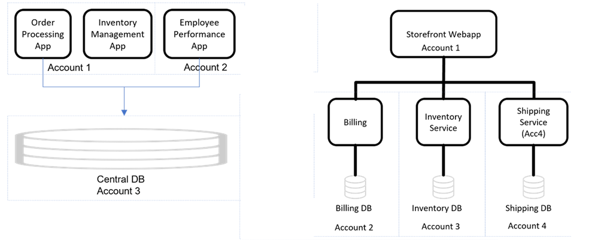

# Get started in Incident Detection and Response

Workloads and alarms are central to AWS Incident Detection and Response. AWS works closely with you to define and monitor specific workloads that are critical to your
business. AWS helps you set up alarms that quickly notify your team of significant
performance issues or customer impact. Properly configured alarms are essential for
proactive monitoring and rapid incident response within Incident Detection and Response.

## Workloads

You can select specific workloads for monitoring and critical incident management using AWS Incident Detection and Response.
A workload is a collection of resources and code that work together to deliver business value. A workload might be all the resources
and code that make up your banking payment portal or a customer relationship management (CRM) system.
You can host a workload in a single AWS account or multiple AWS accounts.

For example, you might have a monolithic application hosted in a single account
(for example, Employee Performance App in the following diagram). Or, you might have an application (for example, Storefront Webapp in the diagram) broken into microservices that stretch across
different accounts. A workload might share resources, such as a database, with other applications or workloads, as shown in the diagram.

To get started with workload onboarding, see [Workload onboarding](idr-gs-onboard-workload.md#workload-onboarding "idr-gs-onboard-workload.md#workload-onboarding") and [Workload onboarding questionnaire](idr-gs-questionnaire.md "idr-gs-questionnaire.md").

## Alarms

Alarms are a key part of Incident Detection and Response, as they provide
visibility into the performance of your applications and underlying AWS
infrastructure. AWS works with you to define appropriate metrics and alarm
thresholds that will only trigger when there is critical impact to your
monitored workloads. The goal is for alarms to engage your specified resolvers,
who can then collaborate with the incident management team to quickly mitigate
any issues. Alarms should be configured to only enter the Alarm state when
there is a significant degradation in performance or customer experience that
requires immediate attention. Some key types of alarms include those that
indicate business impact, Amazon CloudWatch canaries, and aggregate alarms that
monitor dependencies.

To get started with alarm ingestion, see [Alarm ingestion](idr-gs-onboard-workload.md#alarm-ingestion "idr-gs-onboard-workload.md#alarm-ingestion") and [Alarm ingestion questionnaire](idr-gs-questionnaire.md "idr-gs-questionnaire.md").

###### Note

To make changes to your runbooks, workload information, or the alarms monitored on AWS Incident Detection and Response, see [Request changes to an onboarded workload in Incident Detection and Response](idr-workloads-change-request.md "idr-workloads-change-request.md").
